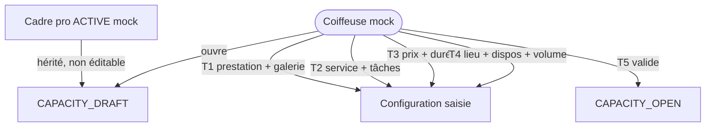

# Domain Storytelling MVP — Étape 0 : Ouvrir une capacité professionnelle

> **Document compagnon** du Domain Storytelling complet  
> Source complète : `domain-storytelling-etape-0.md`  
> Objectif de ce fichier : décrire **uniquement** la version démontrable (happy path), implémentable sans backend, sans auth, sans paiement.

---

## 0. Intention produit

On ne veut pas expliquer théoriquement le futur produit.  
On veut qu’une **coiffeuse** puisse, en quelques minutes, **ouvrir une capacité** et **voir le résultat** : « ma prestation est maintenant disponible ».

Valeur à montrer :

* elle choisit **quoi** elle vend (prestation + variante) ;
* elle montre **comment** ça se présente (galerie) ;
* elle dit **qui fait quoi** (service complet / assisté) ;
* elle fixe **prix + durée** ;
* elle dit **où / quand / combien** ;
* elle **active** explicitement.

Tout le reste (contrôles lourds, exceptions, reconfirmation, opérateur, règles de droits) est hors MVP.

---

## 1. Principes MVP

| Principe | Application |
| -------- | ----------- |
| Happy path only | Un seul scénario nominal jusqu’à `CAPACITY_OPEN` |
| Pas de règles d’autorisation | Pas de « qui a le droit » ; l’actrice est la coiffeuse mockée |
| Pas de backend | Mock + `localStorage` |
| Pas d’auth / paiement | Identité et cadre pro préchargés |
| Cycles de vie respectés | On garde les statuts utiles ; on ignore les branches |
| Moins de règles, max de valeur | Chaque écran doit servir la démo utilisateur |
| Écrans manquants | Signalés pour Stitch, sans bloquer le récit |

---

## 2. Précondition mockée

Le Domain Storytelling complet exige :

```text
PROFESSIONAL_FRAMEWORK_ACTIVE
        ↓
  CAPACITY_DRAFT
        ↓
  CAPACITY_OPEN
```

**MVP :** le cadre professionnel est **déjà actif** (données mock).  
La coiffeuse ne le configure pas dans cette étape.  
On affiche seulement un bandeau informatif : « Cadre professionnel actif — hérité ».

Pas de branche « cadre manquant ».  
Pas de `RECONFIRMATION_REQUIRED` lié au cadre.  
Pas d’exceptions au cadre.

> Le MVP du bloc `_0-definir-cadre-pro` pourra venir ensuite. Pour l’étape 0, le cadre est un **fait acquis**.

---

## 3. Périmètre du récit MVP

### Déclencheur

La coiffeuse veut rendre une prestation disponible pour recevoir des demandes.

### Début

`CAPACITY_DRAFT`

### Fin nominale

`CAPACITY_OPEN`

### Acteur

**Coiffeuse** uniquement (profil mock).

### Acteurs absents du MVP

* cliente ;
* opérateur pilote ;
* administrateur ;
* plateforme en tant que contrôleur bloquant.

La « plateforme » se comporte comme un **assistant de saisie + persistance locale**, pas comme un gatekeeper.

---

## 4. Objets métier conservés (light)

| Objet | MVP |
| ----- | --- |
| Cadre professionnel actif | Mock figé, référencé |
| Prestation | Choix dans un catalogue mock (ex. knotless braids, vanilles, retwist…) |
| Variante | 1 variante principale simple (taille / longueur / finition optionnels) |
| Galerie de prestation | 1–N photos mock ou upload local (preview) |
| Niveau de preuve | Affiché simplement : `DECLARED_REALIZATION` ou `REFERENCE_INSPIRATION` |
| Niveau de service | `COMPLET` ou `ASSISTÉ` |
| Répartition des tâches | Liste courte préremplie ; responsable styliste / cliente |
| Prix de base | Nombre |
| Suppléments | 0–2 règles simples (libellé + montant) |
| Durée | Minutes |
| Contexte / lieu | 1 choix : chez moi / salon / déplacement |
| Disponibilités | Créneaux hebdo simplifiés ou période + jours |
| Capacité max | Nombre (ex. RDV / jour ou / semaine) |
| Volume souhaité | Nombre de demandes souhaitées |
| Capacité professionnelle | Objet central persisté |

### Objets volontairement exclus

* rapport de vérification bloquant ;
* exceptions au cadre ;
* conséquences avancées d’une tâche non réalisée (garder 1 texte simple optionnel) ;
* multi-lieux incohérents ;
* stock / fournitures détaillées ;
* marge opérationnelle / revenu net cible ;
* cycle de revue galerie (`IN_REVIEW`, `REJECTED`…) ;
* suspension / reconfirmation / fermeture avancée ;
* versionnement juridique du cadre.

---

## 5. Cycle de vie MVP

### Capacité

```text
CAPACITY_DRAFT
      ↓  (validation explicite coiffeuse)
CAPACITY_OPEN
```

États **non implémentés** dans le MVP (présents dans la version complète) :

* `CAPACITY_IN_REVIEW`
* `SUSPENDED`
* `RECONFIRMATION_REQUIRED`
* `CAPACITY_CLOSED`

Option UX minimale après démo : bouton « Fermer la capacité » → `CAPACITY_CLOSED` (sans workflow).

### Galerie

```text
GALLERY_ITEM_DRAFT  →  GALLERY_ITEM_PUBLISHED
```

Dès l’ajout, l’élément est publié dans le brouillon de capacité.  
Pas de modération.

---

## 6. Happy path — récit nominal (6 temps)

### T0 — Accueil étape (orientation)

La coiffeuse comprend en une phrase :

> « Tu vas rendre une prestation réellement disponible : quoi, comment, où, quand, à quel prix. »

CTA : **Ouvrir une capacité**.

### T1 — Prestation + variante + galerie

1. Choisir une prestation du catalogue mock.  
2. Préciser une variante simple (ou garder la variante par défaut).  
3. Ajouter / sélectionner des photos de **cette** prestation.  
4. Marquer chaque photo : réalisation déclarée **ou** inspiration.

**Sortie :** prestation identifiable + galerie non trompeuse (au moins 1 image).

### T2 — Niveau de service + tâches

1. Choisir **Service complet** ou **Service assisté**.  
2. Pour 3–5 tâches préremplies (ex. achat mèches, lavage, pose, finition) : responsable = styliste ou cliente.  
3. (Optionnel light) une consigne courte si responsable = cliente.

**Sortie :** modèle de service clair, compréhensible pour une cliente plus tard.

### T3 — Prix + durée + suppléments

1. Prix de base.  
2. Durée estimée.  
3. 0–2 suppléments (libellé + montant).

**Sortie :** un devis client prévisualisable (aperçu simple).

### T4 — Lieu + disponibilités + volume

1. Un contexte d’exécution.  
2. Disponibilités simplifiées (jours / créneaux mock).  
3. Capacité max + volume de demandes souhaité.

**Sortie :** la capacité est opérationnellement situable dans le temps et l’espace.

### T5 — Récapitulatif + activation

1. Synthèse lisible de T1→T4 + mention du cadre hérité.  
2. Confirmation explicite de la coiffeuse.  
3. Passage à `CAPACITY_OPEN` + toast / écran de succès.  
4. Persistance `localStorage`.

**Sortie démontrable :**

> « Knotless braids — Medium — 180 € — Chez moi — Capacité ouverte »

---

## 7. Vue d’ensemble MVP



---

## 8. Conditions minimales de `CAPACITY_OPEN` (MVP)

Ouvrir si **tous** les champs suivants sont renseignés :

* prestation choisie ;
* ≥ 1 image en galerie ;
* niveau de service choisi ;
* chaque tâche de la liste a un responsable ;
* prix de base > 0 ;
* durée > 0 ;
* 1 lieu / contexte ;
* ≥ 1 disponibilité ;
* capacité max ≥ 1 ;
* volume souhaité ≥ 1 ;
* confirmation explicite.

Pas de score, pas d’opérateur, pas de blocage « incohérence prix-durée ».  
Un simple check de champs vides suffit.

---

## 9. Données mock / localStorage

### Clés proposées

| Clé | Contenu |
| --- | ------- |
| `as.mvp.professionalFramework` | Cadre actif mock (lecture seule) |
| `as.mvp.catalog.services` | Catalogue prestations |
| `as.mvp.capacities` | Liste des capacités (`DRAFT` / `OPEN` / éventuellement `CLOSED`) |
| `as.mvp.currentCapacityId` | Brouillon en cours |

### Exemple de capacité (schéma indicatif)

```json
{
  "id": "cap_001",
  "status": "CAPACITY_OPEN",
  "frameworkVersionId": "fw_mock_v1",
  "prestation": {
    "id": "knotless_braids",
    "label": "Knotless braids",
    "variante": { "taille": "Medium", "longueur": "Waist" }
  },
  "gallery": [
    {
      "id": "g1",
      "src": "/mocks/knotless-1.jpg",
      "proofLevel": "DECLARED_REALIZATION",
      "status": "GALLERY_ITEM_PUBLISHED"
    }
  ],
  "serviceLevel": "ASSISTED",
  "tasks": [
    { "id": "buy_hair", "label": "Achat des mèches", "owner": "CLIENT" },
    { "id": "wash", "label": "Lavage", "owner": "STYLIST" },
    { "id": "install", "label": "Pose", "owner": "STYLIST" }
  ],
  "pricing": {
    "basePrice": 180,
    "currency": "EUR",
    "durationMinutes": 240,
    "supplements": [{ "label": "Densité supplémentaire", "amount": 25 }]
  },
  "location": { "context": "AT_STYLIST", "label": "Chez la coiffeuse" },
  "availability": {
    "days": ["thu", "fri", "sat"],
    "slots": ["09:00-13:00", "14:00-18:00"]
  },
  "capacityMax": 2,
  "desiredDemandVolume": 6,
  "openedAt": "2026-08-01T10:00:00.000Z"
}
```

---

## 10. Écrans — mapping Stitch MVP

Source prompts : `prompts-stitch-mvp.md` (S01–S09).

| # | Dossier | Prompt | Rôle MVP |
| - | ------- | ------ | -------- |
| E0 | `accueil_explicatif_capacit_professionnelle/` | S01 | Accueil / orientation (`CAPACITY_DRAFT`) |
| E1 | `prestation_variante/` | S02 | Choix prestation + variante |
| E2 | `galerie_de_la_prestation_capacit_professionnelle/` | S03 | Galerie de la prestation |
| E3 | `niveau_de_service_t_ches_atelier_synergy/` | S04 | Niveau de service + tâches |
| E4 | `prix_dur_e_suppl_ments/` | S05 | Prix + durée + suppléments |
| E5 | `lieu_disponibilit_s_volume_capacit_professionnelle/` | S06 | Lieu + disponibilités + volume |
| E6 | `r_capitulatif_activation_atelier_synergy/` | S07 | Récapitulatif + Activer |
| E7 | `succ_s_capacit_ouverte/` | S08 | Succès — `CAPACITY_OPEN` |
| E8 | `liste_de_mes_capacit_s_atelier_synergy/` | S09 | Liste de mes capacités (bonus démo) |

Design system : `atelier_synergy/DESIGN.md`. Assets photo Stitch conservés à côté des écrans.

---

## 11. Parcours écran MVP (ordre d’implémentation)

```text
E0 Accueil
  → E1 Prestation + variante
  → E2 Galerie
  → E3 Niveau de service + tâches
  → E4 Prix + durée + suppléments
  → E5 Lieu + disponibilités + volume
  → E6 Récapitulatif + Activer
  → E7 Succès (CAPACITY_OPEN)
  → (E8 Liste des capacités)
```

Persistance : sauvegarde brouillon à chaque étape ; activation uniquement en E6.

---

## 12. Ce qu’on coupe volontairement (vs version complète)

| Zone complète | Décision MVP | Motif |
| ------------- | ------------ | ----- |
| Vérif cadre + branches cadre manquant | Mock ACTIVE | Évite de bloquer la démo |
| Héritage éditable / exceptions | Affichage lecture seule | Pas de règles de droits |
| Revue plateforme / opérateur | Supprimé | Pas de gatekeeping |
| Galerie `IN_REVIEW` / preuves vérifiées | Publish immédiat + label preuve | Valeur visuelle sans process |
| Conséquences détaillées non-respect tâches | Optionnel 1 ligne | Complexité > valeur démo |
| Fournitures / matériel détaillés | Reporté | Pas critique pour « ouvrir » |
| Impact modification cadre | Reporté | Pas de lifecycle cadre dans MVP |
| Volumes invitations vs propositions vs engagements | 1 seul « volume souhaité » | Simplification |
| Reconfirmation dispos anciennes | Reporté | Happy path only |

---

## 13. Critère de succès démo (coiffeuse)

Une coiffeuse non technique doit pouvoir :

1. comprendre ce qu’elle configure en < 30 s (E0) ;  
2. ouvrir une capacité en < 5–8 min ;  
3. voir clairement le statut `CAPACITY_OPEN` ;  
4. expliquer elle-même :  
   > « J’ai mis mes knotless braids en ligne, avec mes photos, mon prix, et mes dispos. »

Si elle ne peut pas dire ça, le MVP rate son objectif — même si le modèle métier complet est « juste ».

---

## 14. Frontières avec les autres étapes (MVP)

| Étape | Lien MVP |
| ----- | -------- |
| `_0` Cadre pro | Mock hérité ; MVP cadre = chantier séparé |
| Étape 1 (cliente) | N’utilise pas encore la capacité |
| Étape 2 (matching) | Consommera les `CAPACITY_OPEN` du `localStorage` |
| Étapes 3+ | Hors scope de ce document |

---

## 15. Résultat fonctionnel MVP

À la fin, le produit local doit pouvoir répondre :

* Quelle prestation est ouverte ?  
* Quelle variante ?  
* Quelles photos la présentent ?  
* Service complet ou assisté ? Qui fait quoi ?  
* Quel prix / durée ?  
* Où et quand ?  
* Combien de demandes / de RDV souhaite-t-elle ?  
* Statut = `CAPACITY_OPEN` ?

Formule MVP :

> **Une capacité MVP est une configuration de service que la coiffeuse active explicitement, avec galerie, prix, lieu et disponibilités, persistée localement, sans contrôle métier lourd.**

---

## 16. Prochaine action proposée

1. Valider ce périmètre MVP étape 0.  
2. Produire les écrans manquants E0 / E1 / E2 / E7 (Stitch).  
3. Implémenter le parcours dans `atelier-synergy` (Vue, mock, `localStorage`).  
4. Enchaîner ensuite sur le MVP de `_0-definir-cadre-pro` **ou** de l’étape 1, selon la priorité de démo (coiffeuse d’abord vs cliente d’abord).
