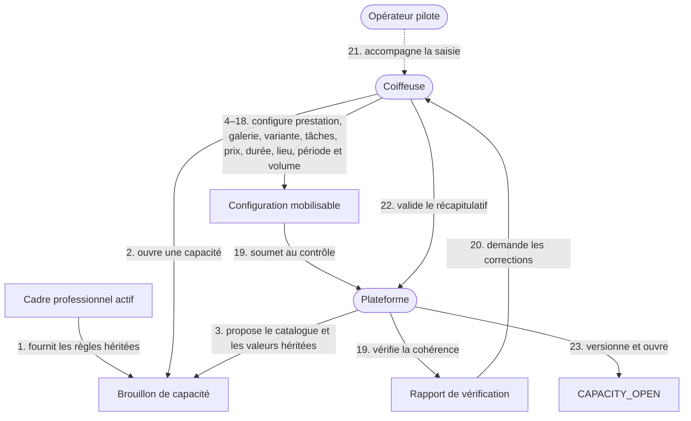
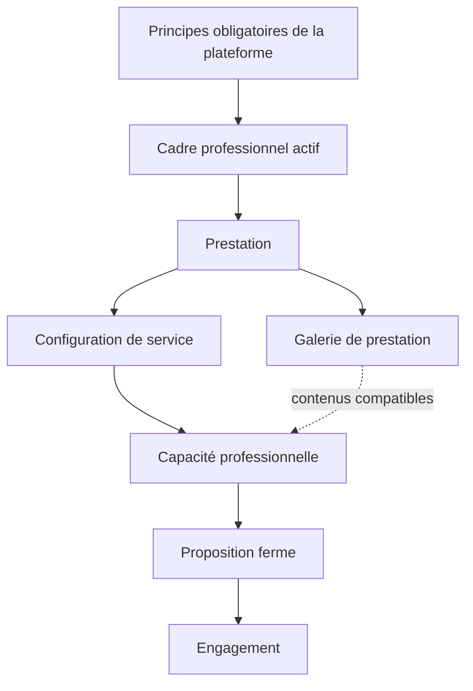

L’étape 0 révisée ci-dessous suppose désormais l’existence d’un `PROFESSIONAL_FRAMEWORK_ACTIVE`. Elle ne redéfinit plus la manière générale de travailler de la coiffeuse : elle transforme une prestation en **capacité réellement mobilisable**.

# Domain Storytelling — Étape 0 : Ouvrir une capacité professionnelle

## Version révisée après introduction du cadre professionnel

Le point central reste le suivant :

> **La coiffeuse ne publie pas simplement une prestation. Elle déclare une configuration de service qu’elle est réellement disposée à mobiliser, dans un contexte, une période et un volume déterminés.**

Cependant, l’étape 0 ne doit plus contenir toutes les règles générales de fonctionnement de la coiffeuse.

Ces règles sont désormais définies dans le `PROFESSIONAL_FRAMEWORK_ACTIVE` :

* organisation générale ;
* communication ;
* règles d’accès et d’accueil ;
* moyens de paiement acceptés ;
* règles relationnelles ;
* règles générales de sécurité ;
* politiques générales de modification et d’incident ;
* confidentialité et consentements.

L’étape 0 hérite de ce cadre et ne décrit que ce qui dépend :

* de la prestation ;
* de sa configuration ;
* du lieu concret dans lequel elle est ouverte ;
* de la période ;
* du volume disponible ;
* des contraintes techniques propres au service.

Le document initial définissait déjà l’étape 0 comme la déclaration de ce que la coiffeuse souhaite réellement vendre, où, quand et dans quel volume. La révision conserve cette finalité tout en retirant les règles générales désormais portées par le cadre professionnel.

Elle intègre également la **galerie de présentation et de réalisations** rattachée à chaque prestation. Une cliente consultant une prestation de knotless braids doit voir directement les réalisations relatives aux knotless braids, et non devoir parcourir des perruques, vanilles, tissages, soins ou d’autres prestations sans rapport avec sa demande. 

---

# 1. Positionnement dans le processus métier

Le flux professionnel devient :

```text
Cadre professionnel
        ↓
Prestation
   ├── description
   ├── variantes
   ├── galerie de présentation et de réalisations
   └── configurations de service
            ↓
Capacités professionnelles ouvertes
            ↓
Appariement et distribution
            ↓
Propositions fermes
            ↓
Engagements
```

L’étape 0 ne peut commencer que si la coiffeuse possède un cadre professionnel actif.

## Dépendance obligatoire

```text
PROFESSIONAL_FRAMEWORK_ACTIVE
                ↓
          CAPACITY_DRAFT
                ↓
          CAPACITY_OPEN
```

Sans cadre professionnel actif :

* aucune nouvelle capacité ne peut être ouverte ;
* la coiffeuse peut préparer un brouillon ;
* le brouillon ne peut pas devenir éligible au matching ;
* la plateforme doit indiquer les éléments du cadre restant à définir.

---

# 2. Objets métier à distinguer

| Objet                          | Question traitée                                                                                          |
| ------------------------------ | --------------------------------------------------------------------------------------------------------- |
| **Cadre professionnel**        | Comment la coiffeuse exerce-t-elle généralement ?                                                         |
| **Prestation**                 | Quel résultat ou service sait-elle proposer ?                                                             |
| **Variante**                   | Quelles déclinaisons maîtrisées de cette prestation sont proposées ?                                      |
| **Galerie de prestation**      | Comment cette prestation est-elle présentée et avec quel niveau de preuve visuelle ?                      |
| **Élément de galerie**         | Quelle photo ou vidéo illustre un résultat, une variante ou une inspiration ?                             |
| **Type de contenu**            | S’agit-il d’une réalisation vérifiée, déclarée ou d’une inspiration ?                                     |
| **Preuve de réalisation**      | Quel niveau de preuve visuelle soutient le résultat annoncé ?                                             |
| **Consentement de publication**| La cliente a-t-elle autorisé la publication de ce contenu ?                                               |
| **Configuration de service**   | Sous quelles modalités cette prestation peut-elle être réalisée ?                                         |
| **Capacité professionnelle**   | Où, quand, pendant combien de temps et dans quel volume cette configuration est-elle réellement ouverte ? |
| **Proposition ferme**          | Cette capacité peut-elle satisfaire une demande cliente exacte ?                                          |
| **Engagement**                 | Quelles conditions exactes les deux parties acceptent-elles pour ce rendez-vous ?                         |

L’objet métier central de l’étape reste la **capacité professionnelle**.

La **galerie** appartient à la prestation (`SERVICE_GALLERY`). Elle reste normalement stable entre plusieurs capacités et ne doit jamais être une galerie générale mélangeant toutes les compétences de la coiffeuse.

Positionnement métier :

```text
Coiffeuse
   └── Prestations
         ├── Knotless braids
         │     ├── description
         │     ├── variantes
         │     ├── galerie de présentation et de réalisations
         │     └── configurations de service
         │
         ├── Vanilles
         │     ├── description
         │     ├── variantes
         │     ├── galerie de présentation et de réalisations
         │     └── configurations de service
         │
         └── Pose de perruque
               ├── description
               ├── variantes
               ├── galerie de présentation et de réalisations
               └── configurations de service
```

Le Domain Storytelling initial distinguait déjà la prestation, la configuration de service et la capacité professionnelle. Cette distinction est conservée et enrichie par la galerie propre à chaque prestation. 

---

# 3. Définition d’une capacité professionnelle

Une capacité professionnelle est :

> **la disponibilité temporaire d’une configuration de service déterminée, proposée par une coiffeuse, dans un lieu ou une zone, avec une durée, un prix calculable, une capacité opérationnelle et un volume de demandes souhaité.**

Une capacité ne correspond donc pas simplement à :

> « Je fais des knotless braids. »

Elle correspond par exemple à :

> « Je souhaite recevoir jusqu’à trois demandes cette semaine pour des knotless braids moyennes, longueur mi-dos, en service complet, réalisées chez moi à Bobigny, au prix estimé de 110 à 125 €, pour une durée de cinq heures, avec deux créneaux réellement disponibles. »

---

# 4. Périmètre du récit

## Déclencheur

La coiffeuse décide de rendre une configuration de service disponible pour de nouvelles demandes.

## Précondition

La coiffeuse possède un :

`PROFESSIONAL_FRAMEWORK_ACTIVE`

## Début

Elle ouvre un brouillon de capacité :

`CAPACITY_DRAFT`

## Fin nominale

Une capacité complète, cohérente, datée et explicitement validée obtient le statut :

`CAPACITY_OPEN`

## Acteur décisionnaire

La **coiffeuse**.

## Acteurs d’assistance

* la **plateforme** ;
* l’**opérateur pilote**.

## Acteur absent

La cliente n’intervient pas encore.

Son besoin qualifié sera traité à l’étape 1 et comparé aux capacités ouvertes à l’étape 2.

---

# 5. Acteurs et responsabilités

| Acteur               | Responsabilité                                                                                                    |
| -------------------- | ----------------------------------------------------------------------------------------------------------------- |
| **Coiffeuse**        | Décide quelle configuration elle souhaite réellement vendre et dans quelle capacité                               |
| **Plateforme**       | Hérite du cadre professionnel, structure la capacité, contrôle sa cohérence et la rend utilisable par le matching |
| **Opérateur pilote** | Accompagne la saisie, vérifie les informations et signale les incohérences                                        |
| **Cliente**          | N’intervient pas encore dans le récit                                                                             |
| **Administrateur**   | Intervient seulement si une capacité tente de contourner une règle du cadre professionnel ou de la plateforme     |

L’opérateur peut renseigner une capacité pour le compte de la coiffeuse, mais seule la coiffeuse peut demander son activation.

---

# 6. Objets métier manipulés

Le récit manipule les objets suivants :

* cadre professionnel actif ;
* version du cadre professionnel ;
* catalogue métier ;
* prestation ;
* variante ;
* galerie de prestation ;
* élément de galerie ;
* type de contenu ;
* preuve de réalisation ;
* consentement de publication ;
* configuration de service ;
* niveau de service ;
* répartition des tâches ;
* consigne de préparation ;
* conséquence d’une tâche non réalisée ;
* fourniture ;
* matériel ;
* paramètre tarifaire ;
* supplément ;
* paramètre de durée ;
* marge opérationnelle ;
* contexte d’exécution ;
* lieu ;
* zone couverte ;
* déplacement ;
* disponibilité ;
* créneau ;
* capacité opérationnelle ;
* volume de demandes souhaité ;
* conditions techniques ;
* exception ;
* limite technique ;
* information à confirmer ;
* rapport de vérification ;
* capacité professionnelle.

## Objet central

`PROFESSIONAL_CAPACITY`

## Référence héritée

Chaque capacité conserve une référence vers :

* la coiffeuse ;
* la version du cadre professionnel utilisée ;
* la configuration de service ;
* sa propre version ;
* sa période de validité.

---

# 7. Vue d’ensemble du Domain Story



---

# 8. Récit métier nominal détaillé

## 1 — Vérifier l’existence du cadre professionnel

La **plateforme** vérifie que la coiffeuse possède un cadre professionnel actif.

Elle contrôle :

* l’existence du cadre ;
* son statut ;
* sa version ;
* son éventuelle date de reconfirmation ;
* l’absence de suspension bloquante.

### Cas nominal

Le cadre est actif.

La plateforme autorise la création d’une capacité.

### Cas alternatif

Le cadre est incomplet, suspendu ou doit être mis à jour.

La coiffeuse peut préparer un brouillon, mais ne peut pas l’activer.

**Événement métier :**

`PROFESSIONAL_FRAMEWORK_VERIFIED`

---

## 2 — Ouvrir un brouillon de capacité

La **coiffeuse** choisit :

* une prestation existante ;
* une configuration de service existante ;
* ou la création d’une nouvelle configuration.

Elle indique également :

* la période générale visée ;
* si elle souhaite reprendre une ancienne capacité ;
* si elle souhaite dupliquer une capacité précédente.

La **plateforme** crée :

`CAPACITY_DRAFT`

Le brouillon conserve la référence vers la version active du cadre professionnel.

---

## 3 — Charger les règles héritées

La **plateforme** applique automatiquement au brouillon les règles générales du cadre professionnel.

Exemples :

* contextes d’exercice autorisés ;
* moyens de paiement acceptés ;
* règles générales d’accès ;
* politiques de communication ;
* règles relationnelles ;
* confidentialité générale de l’adresse ;
* politiques générales de modification ;
* conditions générales de sécurité.

Ces informations ne sont pas redemandées à la coiffeuse.

Elles sont affichées comme :

* héritées ;
* non modifiables dans l’étape 0 ;
* remplaçables uniquement lorsqu’une exception explicite est autorisée.

**Objet produit :**

`INHERITED_PROFESSIONAL_RULESET`

---

## 4 — Sélectionner la prestation

La **coiffeuse** sélectionne la prestation qu’elle souhaite rendre disponible.

Exemples :

* knotless braids ;
* vanilles ;
* pose de perruque ;
* tissage ;
* nattes collées ;
* départ de locks ;
* retwist ;
* soin capillaire.

La **plateforme** propose une structure métier adaptée à la famille de prestation.

Pour des knotless braids, elle peut proposer :

* taille ;
* longueur ;
* finition ;
* type de mèches ;
* niveau de préparation ;
* durée habituelle ;
* options courantes.

Le catalogue aide à structurer la prestation, mais ne décide jamais à la place de la coiffeuse.

Lors de la sélection ou de la création d’une prestation, la coiffeuse doit également configurer sa galerie.

---

## 5 — Définir la galerie de présentation de la prestation

La **coiffeuse** sélectionne les contenus visuels utilisés pour présenter la prestation.

Chaque prestation possède sa propre **galerie de présentation et de réalisations**. La galerie ne doit pas être une galerie générale mélangeant toutes les compétences de la coiffeuse.

Elle permet de montrer concrètement :

* le type de résultat obtenu ;
* les variantes maîtrisées ;
* les longueurs, tailles, couleurs et finitions possibles ;
* le niveau de qualité attendu ;
* les réalisations réellement effectuées par la coiffeuse ;
* les limites visuelles de la prestation.

### Séquence métier

Après avoir sélectionné la prestation, la coiffeuse :

1. consulte la galerie déjà associée à cette prestation ;
2. ajoute de nouvelles réalisations ;
3. classe chaque contenu selon sa provenance ;
4. associe les réalisations aux variantes concernées ;
5. renseigne les principales caractéristiques visibles ;
6. confirme qu’elle dispose des droits nécessaires pour publier ;
7. choisit les contenus représentatifs à mettre en avant ;
8. soumet la galerie au contrôle de la plateforme.

### Pour chaque contenu, elle précise

* s’il s’agit de son propre travail ;
* si la réalisation est vérifiable sur la plateforme ;
* s’il s’agit uniquement d’une inspiration ;
* la variante de prestation représentée ;
* les principales caractéristiques du résultat ;
* si le consentement de publication a été obtenu ;
* si le contenu peut être affiché publiquement.

### Types de contenus

| Type | Code | Niveau de preuve |
| ---- | ---- | ---------------- |
| Réalisation vérifiée | `VERIFIED_REALIZATION` | Preuve la plus forte ; idéalement rattachée à un rendez-vous confirmé |
| Réalisation déclarée | `DECLARED_REALIZATION` | Travail présenté comme propre, sans rendez-vous vérifiable |
| Inspiration ou exemple | `REFERENCE_INSPIRATION` | Style illustratif ; jamais présenté comme une réalisation personnelle |

Ces codes désignent le **type de contenu**, distinct du **cycle de vie** de l’élément (`DRAFT`, `IN_REVIEW`, `PUBLISHED`, etc.).

La plateforme doit afficher clairement la nature de chaque contenu, par exemple :

* « Réalisé par cette coiffeuse » ;
* « Prestation réalisée via la plateforme » ;
* « Exemple de style » ;
* « Inspiration fournie à titre indicatif ».

### Contrôles de la plateforme

La **plateforme** vérifie :

* que le contenu est rattaché à la bonne prestation ;
* qu’une inspiration n’est pas présentée comme une réalisation ;
* que le consentement nécessaire existe ;
* qu’aucune information privée n’est exposée ;
* que le contenu ne produit pas une promesse trompeuse ;
* que les variantes affichées correspondent à ce que la coiffeuse propose réellement.

### Organisation de la galerie

La galerie peut être consultée à trois niveaux :

1. **Galerie de la prestation** — toutes les réalisations rattachées à cette prestation ;
2. **Filtrage par variante** — taille, longueur, finition, couleur, densité, style ;
3. **Réalisation exacte** — configuration précise ayant produit le résultat.

Exemple de réalisation exacte :

```text
Prestation : Knotless braids
Taille : moyenne
Longueur : milieu du dos
Couleur : 1B
Finition : boucles
Durée réalisée : 5 h
Configuration : service complet
```

### Objet produit

`SERVICE_GALLERY`

avec des éléments `GALLERY_ITEM` éventuellement associés à une variante et, le cas échéant, à une réalisation issue d’un rendez-vous confirmé.

### Conditions d’ouverture liées à la galerie

Il faut distinguer deux niveaux.

**Prestation publiable** — pour être publiquement présentée, elle devrait disposer au minimum :

* d’un titre ;
* d’une description ;
* d’une image de présentation ;
* d’une galerie minimale ;
* d’au moins un contenu correctement attribué.

**Capacité ouvrable** — la capacité peut techniquement être ouverte même si la galerie n’est pas très riche, à condition que :

* la prestation soit clairement décrite ;
* les informations nécessaires au matching soient complètes ;
* la galerie ne contienne aucune présentation trompeuse.

Pendant le pilote, il est préférable de ne pas imposer un grand nombre de photos. La plateforme peut afficher :

> Galerie encore limitée.

plutôt que d’exclure automatiquement la coiffeuse.

---

## 6 — Définir la variante proposée

La **coiffeuse** précise la variante qu’elle souhaite ouvrir.

Elle définit notamment :

* taille ;
* longueur ;
* style ;
* finition ;
* technique ;
* options compatibles ;
* caractéristiques non proposées ;
* situations techniques acceptées ;
* éventuelles adaptations possibles.

Une variation doit devenir une configuration distincte lorsqu’elle modifie significativement :

* la durée ;
* le prix ;
* les tâches ;
* le matériel ;
* la responsabilité ;
* la capacité opérationnelle.

## Exemple

Les deux offres suivantes doivent être séparées si leurs paramètres diffèrent fortement :

* knotless braids moyennes, longueur épaules ;
* knotless braids fines, longueur hanches.

---

## 7 — Choisir le niveau de service

La **coiffeuse** choisit la configuration de service applicable.

Exemples :

* **essentiel** ;
* **complet** ;
* **assisté** ;
* **premium**.

Le niveau de service ne doit pas être un simple label commercial.

Il doit être traduit en responsabilités concrètes.

### Exemple de service complet

| Tâche                  | Responsable |
| ---------------------- | ----------- |
| Fourniture des mèches  | Coiffeuse   |
| Lavage                 | Coiffeuse   |
| Démêlage               | Coiffeuse   |
| Préparation des mèches | Coiffeuse   |
| Réalisation            | Coiffeuse   |

### Exemple de service assisté

| Tâche                  | Responsable |
| ---------------------- | ----------- |
| Achat des mèches       | Cliente     |
| Lavage                 | Cliente     |
| Démêlage               | Cliente     |
| Préparation des mèches | Coiffeuse   |
| Réalisation            | Coiffeuse   |

La participation de la cliente doit être décrite tâche par tâche. Elle ne peut pas être découverte ou imposée le jour du rendez-vous. Le document de refonte établit précisément que la répartition des tâches doit être annoncée, consentie et associée à des effets explicites sur le prix, la durée, le résultat ou la responsabilité. 

---

## 8 — Définir les effets de la répartition des tâches

Pour chaque tâche éventuellement confiée à la cliente, la coiffeuse précise :

* ce qui est demandé ;
* quand la tâche doit être réalisée ;
* quel niveau de réalisation est attendu ;
* quels produits ou outils sont nécessaires ;
* quel effort est demandé ;
* l’effet attendu sur la durée ;
* l’effet attendu sur le prix ;
* l’effet éventuel sur le résultat ;
* la responsabilité associée.

La plateforme ne présume pas qu’une tâche confiée à la cliente entraîne automatiquement :

* un rabais ;
* un gain de temps ;
* ou les deux.

Chaque effet doit être déclaré séparément.

---

## 9 — Définir les conséquences d’une tâche non réalisée

La **coiffeuse** précise ce qu’il se passe si une tâche nécessaire n’est pas réalisée ou est insuffisamment réalisée.

Les conséquences possibles sont notamment :

* réalisation de la tâche par la coiffeuse ;
* supplément calculable ;
* augmentation de la durée ;
* adaptation du résultat ;
* changement de configuration ;
* demande de report ;
* impossibilité technique de réaliser la prestation.

Une conséquence ne doit pas être une sanction arbitraire.

Elle doit correspondre à un effet opérationnel identifiable.

## Exemple

Tâche attendue :

> La cliente doit arriver avec les cheveux lavés et démêlés.

Conséquences possibles :

* démêlage réalisé par la coiffeuse avec un supplément défini ;
* durée augmentée de trente minutes ;
* report si le temps restant ne permet plus de réaliser correctement la prestation.

La décision exacte applicable à une cliente sera confirmée dans la proposition ferme de l’étape 3.

---

## 10 — Configurer les fournitures, produits et matériel

La **coiffeuse** indique :

* ce qu’elle fournit ;
* ce que la cliente doit fournir ;
* ce qui est inclus dans le prix ;
* ce qui est facturé séparément ;
* les marques ou références obligatoires ;
* les quantités nécessaires ;
* les substitutions acceptées ;
* les produits refusés pour cette prestation ;
* le matériel spécifique nécessaire.

Les règles générales d’usage des produits peuvent provenir du cadre professionnel.

L’étape 0 ne précise que ce qui est propre à la prestation ou à sa configuration.

## Exemple

### Cadre professionnel

> La coiffeuse refuse d’utiliser un produit non identifié ou dont la composition ne peut pas être vérifiée.

### Configuration de service

> Pour cette prestation, prévoir trois paquets Xpression Pre-Stretched, couleur 1B.

---

## 11 — Définir le prix calculable

La **coiffeuse** renseigne :

* le prix de base ;
* les éléments inclus ;
* les options tarifaires ;
* les suppléments ;
* la condition de déclenchement de chaque supplément ;
* les frais liés à cette configuration ;
* les frais de déplacement éventuels ;
* son revenu net cible.

La **plateforme** distingue :

* prix visible par la cliente ;
* coûts additionnels ;
* montant destiné à la coiffeuse ;
* éventuels frais de plateforme ;
* revenu net cible interne.

Le prix de l’étape 0 peut être :

* fixe ;
* calculable ;
* ou présenté sous forme de fourchette.

Il ne devient ferme qu’après validation de la demande exacte à l’étape 3.

## Règle

Tout supplément doit posséder :

* un montant ;
* ou une méthode de calcul ;
* une condition de déclenchement observable.

## Exemple valide

> Supplément de 15 € si la cliente demande une longueur bas du dos.

## Exemple invalide

> Des frais supplémentaires peuvent s’appliquer selon la situation.

---

## 12 — Définir la durée et la marge opérationnelle

La **coiffeuse** précise :

* la durée estimée ;
* le temps de préparation ;
* les facteurs qui peuvent modifier la durée ;
* la marge nécessaire avant le rendez-vous suivant ;
* le temps de déplacement éventuel ;
* le nombre maximal de prestations réalisables par jour ;
* le nombre maximal de prestations réalisables pendant la période.

La **plateforme** vérifie qu’une capacité ne peut pas être placée dans un créneau insuffisant.

## Exemple

```text
Durée de prestation : 5 h
Marge après prestation : 30 min
Temps total immobilisé : 5 h 30
```

Le matching doit utiliser le temps total immobilisé, pas uniquement le temps technique affiché à la cliente.

---

## 13 — Sélectionner le contexte d’exécution

La **coiffeuse** sélectionne l’un des contextes autorisés par son cadre professionnel :

* chez elle ;
* en salon ;
* dans un espace partagé ;
* au domicile de la cliente ;
* dans un lieu événementiel.

Elle précise pour cette capacité :

* le lieu réellement utilisé ;
* la ville ou zone ;
* le rayon de déplacement ;
* les zones incluses ;
* les zones exclues ;
* les frais de déplacement ;
* les contraintes spécifiques liées à la prestation ;
* la disponibilité réelle du lieu pendant la période.

## Distinction importante

### Cadre professionnel

> La coiffeuse peut exercer à son domicile et se déplacer chez la cliente.

### Capacité

> Cette configuration est ouverte uniquement chez la coiffeuse à Bobigny pendant le mois d’août.

La confidentialité générale de l’adresse est héritée du cadre professionnel.

L’adresse ou la zone concrète de cette capacité est définie ici.

---

## 14 — Déclarer les disponibilités

La **coiffeuse** renseigne les créneaux réellement ouverts pour cette configuration :

* date ;
* heure de début possible ;
* heure de fin possible ;
* durée mobilisable ;
* contexte d’exécution ;
* éventuel temps de déplacement ;
* période de validité.

La **plateforme** conserve :

* la date de dernière mise à jour ;
* la période couverte ;
* le niveau de précision ;
* la date de reconfirmation ;
* le niveau de fraîcheur de la disponibilité.

Une disponibilité ancienne ne doit pas être présentée comme certaine.

## États possibles

* `FRESH_AVAILABILITY` ;
* `DECLARED_AVAILABILITY` ;
* `RECONFIRMATION_REQUIRED` ;
* `UNAVAILABLE`.

La synchronisation avancée avec des agendas externes reste hors du pilote initial.

---

## 15 — Définir la capacité opérationnelle maximale

La **coiffeuse** précise ce qu’elle peut réellement réaliser.

Elle peut renseigner :

* nombre maximal de rendez-vous ;
* nombre maximal d’heures ;
* capacité par jour ;
* capacité par semaine ;
* capacité pour toute la période ;
* capacité restante.

Cette capacité est limitée par :

* la durée de la prestation ;
* les marges ;
* les déplacements ;
* les créneaux disponibles ;
* les autres engagements existants.

La plateforme doit empêcher une capacité déclarée de dépasser le temps réellement ouvert.

---

## 16 — Définir le volume de demandes souhaité

La coiffeuse distingue :

### Capacité de réalisation

> Combien de rendez-vous peut-elle réellement accomplir ?

### Volume de sollicitations

> Combien de demandes souhaite-t-elle recevoir ?

### Volume de propositions fermes

> Combien de propositions peut-elle raisonnablement produire ou maintenir simultanément ?

Cette distinction protège la coiffeuse contre une distribution excessive.

## Exemple

```text
Capacité réelle : 2 rendez-vous
Invitations souhaitées : jusqu’à 5
Propositions simultanées : maximum 2
```

Recevoir cinq invitations ne signifie pas accepter cinq engagements.

Le document de refonte établit que la coiffeuse doit contrôler le volume de demandes qu’elle souhaite recevoir. 

---

## 17 — Définir les conditions spécifiques de la capacité

Cette section remplace l’ancienne rubrique générale « conditions et limites ».

Elle ne doit contenir que les conditions propres :

* à la prestation ;
* à sa variante ;
* à cette configuration de service ;
* au lieu choisi ;
* à la période ;
* ou à la capacité déclarée.

Les conditions spécifiques peuvent comprendre :

* longueur minimale nécessaire ;
* état initial à confirmer ;
* situation technique incompatible ;
* photo nécessaire pour valider la faisabilité ;
* préparation propre à la prestation ;
* matériel spécifique ;
* quantité de mèches ;
* limite de déplacement particulière ;
* impossibilité de réaliser la prestation dans certains créneaux ;
* heure de fin maximale ;
* type d’échéance que cette capacité peut accepter ;
* information indispensable avant une proposition ferme ;
* coût préparatoire propre à cette configuration ;
* durée maximale d’immobilisation temporaire du créneau.

## Exemples appartenant à l’étape 0

* cette prestation n’est pas proposée sur des cheveux de moins de cinq centimètres ;
* cette configuration exige trois paquets d’une référence précise ;
* une photo des cheveux actuels est nécessaire ;
* le service assisté exige que les cheveux soient lavés et démêlés ;
* cette capacité est disponible uniquement chez la coiffeuse ;
* la prestation ne peut pas terminer après 20 heures ;
* cette configuration ne peut pas être proposée pour une demande urgente à moins de 48 heures.

## Exemples n’appartenant plus à l’étape 0

* les accompagnants sont généralement interdits ;
* la coiffeuse ne répond pas le dimanche ;
* seuls certains moyens de paiement sont acceptés ;
* toute cliente en retard subit une pénalité ;
* les photos peuvent être publiées ;
* l’adresse reste confidentielle ;
* les comportements irrespectueux entraînent une interruption.

Ces règles générales appartiennent au cadre professionnel, aux principes de la plateforme ou à l’engagement.

---

## 18 — Déclarer les exceptions au cadre professionnel

Une capacité peut nécessiter une exception au cadre général.

L’exception doit être :

* explicitement nommée ;
* justifiée par la prestation ;
* compatible avec les principes de la plateforme ;
* limitée à cette configuration ;
* visible avant l’engagement.

## Exemple

### Cadre professionnel

> Aucun accompagnant n’est généralement accepté.

### Exception de configuration

> Un représentant légal doit être présent pour les prestations destinées aux mineures.

L’exception ne modifie pas le cadre professionnel.

Elle est attachée à la configuration de service ou à la capacité.

---

## 19 — Vérifier la capacité

La **plateforme** produit un :

`CAPACITY_CHECK_REPORT`

Elle vérifie :

### Cadre hérité

* cadre professionnel actif ;
* version identifiée ;
* contexte d’exercice autorisé ;
* absence de contradiction avec les règles générales.

### Configuration

* prestation identifiée ;
* variante exploitable ;
* galerie de prestation rattachée ;
* absence de contenu trompeur ou non autorisé dans la galerie ;
* niveau de preuve visuelle identifiable ;
* niveau de service explicite ;
* tâches attribuées ;
* fournitures précisées ;
* conséquences des tâches non réalisées définies.

### Prix

* prix déterminable ;
* éléments inclus visibles ;
* suppléments calculables ;
* frais de déplacement cohérents.

### Temps

* durée renseignée ;
* marge renseignée ;
* créneaux suffisants ;
* capacité cohérente avec les disponibilités.

### Lieu

* contexte autorisé ;
* zone identifiable ;
* frais et contraintes connus ;
* confidentialité conforme au cadre professionnel.

### Volume

* capacité maximale positive ;
* volume de sollicitations renseigné ;
* nombre de propositions simultanées cohérent.

### Limites spécifiques

* contraintes techniques identifiables ;
* informations à confirmer connues ;
* exceptions explicites ;
* absence de règle générale dupliquée ou contradictoire.

---

## 20 — Corriger les écarts

Si une information manque ou se contredit, la capacité reste en brouillon.

La plateforme demande une correction ciblée.

## Exemples d’écarts

* service assisté sans répartition des tâches ;
* tâche cliente sans conséquence définie ;
* supplément sans condition de déclenchement ;
* durée de cinq heures dans un créneau de trois heures ;
* déplacement proposé hors des contextes autorisés ;
* contexte d’exercice non prévu par le cadre professionnel ;
* volume supérieur aux disponibilités ;
* planning trop ancien ;
* règle générale de retard saisie dans la capacité ;
* accompagnants interdits dans la capacité alors que cette règle existe déjà dans le cadre ;
* exception au cadre non justifiée ;
* capacité ouverte sur une prestation non proposée ;
* galerie contenant une inspiration présentée comme réalisation personnelle ;
* contenu publié sans consentement de publication ;
* galerie mélangeant des réalisations d’autres prestations ;
* variante illustrée que la coiffeuse ne propose plus, sans indication.

---

## 21 — Accompagner la coiffeuse pendant le pilote

L’**opérateur pilote** peut :

* recueillir les informations ;
* préremplir le brouillon ;
* aider à distinguer prestation, galerie et capacité ;
* identifier les règles héritées ;
* distinguer réalisation vérifiée, réalisation déclarée et inspiration ;
* extraire les conditions propres à la prestation ;
* vérifier la lisibilité ;
* signaler une incohérence ;
* demander une précision ;
* aider à estimer la durée ou les facteurs de prix.

Il ne peut pas :

* inventer une capacité ;
* choisir une configuration à la place de la coiffeuse ;
* décider du volume souhaité ;
* introduire une exception sans validation ;
* activer la capacité sans accord explicite.

---

## 22 — Valider le récapitulatif

La **coiffeuse** consulte une synthèse comprenant :

* la prestation ;
* la variante ;
* la galerie associée et le niveau de preuve disponible ;
* le niveau de service ;
* qui réalise chaque tâche ;
* les fournitures ;
* les préparations ;
* le prix et les suppléments ;
* la durée et la marge ;
* le lieu et la zone ;
* les disponibilités ;
* la capacité maximale ;
* le volume de demandes souhaité ;
* les conditions techniques spécifiques ;
* les exceptions éventuelles ;
* la version du cadre professionnel héritée.

Elle confirme :

> Cette capacité représente ce que je souhaite réellement proposer pendant cette période.

---

## 23 — Ouvrir la capacité

La **plateforme** :

* enregistre la version validée ;
* référence le cadre professionnel applicable ;
* horodate les informations ;
* associe une période de validité ;
* calcule la date de reconfirmation ;
* attribue le statut `CAPACITY_OPEN` ;
* rend la capacité éligible au matching.

La sortie n’est pas une simple fiche visible.

Elle devient une ressource que l’étape 2 peut utiliser pour :

* déterminer l’éligibilité ;
* distribuer une invitation ;
* contrôler le volume ;
* produire une proposition ferme.

---

# 9. Cycle de vie de la capacité

```text
CAPACITY_DRAFT
      ↓
CAPACITY_IN_REVIEW
      ↓
CAPACITY_OPEN
   ↙         ↘
SUSPENDED   RECONFIRMATION_REQUIRED
   ↓                  ↓
CAPACITY_OPEN ← revalidation
      ↓
CAPACITY_CLOSED
```

| Transition         | Conséquence                                                                          |
| ------------------ | ------------------------------------------------------------------------------------ |
| **Activation**     | La capacité peut recevoir de nouvelles invitations                                   |
| **Suspension**     | Les nouvelles distributions sont interrompues                                        |
| **Réactivation**   | La capacité redevient éligible après contrôle                                        |
| **Reconfirmation** | La disponibilité et le volume doivent être actualisés                                |
| **Modification**   | Une nouvelle version est créée                                                       |
| **Fermeture**      | La capacité ne reçoit plus de nouvelles demandes                                     |
| **Cadre modifié**  | Les capacités affectées sont identifiées et éventuellement soumises à reconfirmation |

Une modification ou une suspension ne change jamais rétroactivement un engagement déjà accepté. Cette règle figurait déjà dans le Domain Storytelling initial de l’étape 0 et reste structurante. 

---

# 10. Cycle de vie d’un élément de galerie

```text
GALLERY_ITEM_DRAFT
        ↓
GALLERY_ITEM_IN_REVIEW
        ↓
GALLERY_ITEM_PUBLISHED
      ↙           ↘
GALLERY_ITEM_HIDDEN   GALLERY_ITEM_REJECTED
        ↓
GALLERY_ITEM_ARCHIVED
```

| Statut      | Code technique           | Signification                                           |
| ----------- | ------------------------ | ------------------------------------------------------- |
| `DRAFT`     | `GALLERY_ITEM_DRAFT`     | Contenu ajouté mais non publié                          |
| `IN_REVIEW` | `GALLERY_ITEM_IN_REVIEW` | Contrôle en cours                                       |
| `PUBLISHED` | `GALLERY_ITEM_PUBLISHED` | Visible dans la galerie                                 |
| `HIDDEN`    | `GALLERY_ITEM_HIDDEN`    | Temporairement masqué                                   |
| `REJECTED`  | `GALLERY_ITEM_REJECTED`  | Non conforme ou insuffisamment attribué                 |
| `ARCHIVED`  | `GALLERY_ITEM_ARCHIVED`  | Conservé mais plus utilisé pour présenter la prestation |

Chaque élément peut contenir :

* photo ou vidéo ;
* prestation associée ;
* variante ;
* taille ;
* longueur ;
* couleur ;
* finition ;
* contexte ou type de résultat ;
* date de réalisation ;
* indication de provenance ;
* consentement de publication ;
* statut de vérification ;
* ordre d’affichage.

Les trois niveaux de preuve restent distincts :

* `VERIFIED_REALIZATION` ;
* `DECLARED_REALIZATION` ;
* `REFERENCE_INSPIRATION`.

> Une inspiration, une réalisation déclarée et une réalisation vérifiée ne constituent pas le même niveau de preuve.

---

# 11. Effet d’une modification du cadre professionnel

Lorsqu’une nouvelle version du cadre professionnel est activée, la plateforme analyse ses capacités ouvertes.

## Aucun impact

Exemple :

* modification des horaires généraux de communication ;
* la capacité ne dépend pas directement de ce changement.

La capacité peut rester ouverte.

## Impact nécessitant une reconfirmation

Exemple :

* la coiffeuse ne reçoit plus à son domicile ;
* plusieurs capacités sont ouvertes dans ce contexte.

Les capacités passent à :

`RECONFIRMATION_REQUIRED`

## Impact bloquant

Exemple :

* un contexte d’exercice utilisé par la capacité devient interdit ;
* une règle de sécurité rend la configuration incompatible.

La capacité passe à :

`SUSPENDED`

## Règle

Les engagements déjà formés conservent :

* la version du cadre professionnel acceptée ;
* la version de la capacité ;
* les exceptions intégrées à l’engagement.

---

# 12. Conditions exactes de `CAPACITY_OPEN`

Une capacité peut être ouverte uniquement si :

* un cadre professionnel actif existe ;
* sa version est référencée ;
* la prestation possède une identité claire ;
* la variante est exploitable ;
* la configuration de service est définie et complète ;
* la capacité est opérationnellement cohérente ;
* la galerie associée ne contient aucun contenu trompeur ou non autorisé ;
* chaque tâche possède un responsable ;
* les effets de la répartition des tâches sont explicites ;
* les conséquences d’une tâche non réalisée sont définies ;
* les fournitures et préparations sont précisées ;
* le prix est déterminable ;
* chaque supplément possède une règle calculable ;
* la durée et la marge sont renseignées ;
* le contexte d’exécution est autorisé ;
* au moins un lieu ou une zone est défini ;
* une disponibilité suffisamment récente existe ;
* la capacité opérationnelle maximale est positive ;
* le volume de demandes souhaité est renseigné ;
* les conditions techniques spécifiques sont connues ;
* les informations à confirmer à l’étape 3 sont identifiées ;
* les exceptions au cadre sont explicites ;
* aucune incohérence bloquante ne subsiste ;
* la coiffeuse a validé l’ouverture.

La présence d’un nombre important de réalisations vérifiées ne doit pas être une condition stricte d’ouverture pendant le pilote.

En revanche, la plateforme doit indiquer le niveau de preuve disponible :

* aucune réalisation ;
* galerie déclarée ;
* quelques réalisations vérifiées ;
* historique vérifié significatif.

---

# 13. Modèle d’héritage



## Ordre d’application

1. Principes obligatoires de la plateforme
2. Cadre professionnel actif
3. Prestation et galerie associée
4. Configuration de service
5. Capacité professionnelle
6. Proposition ferme
7. Engagement accepté

## Principe de précision

La règle la plus précise s’applique lorsqu’elle :

* est autorisée ;
* est explicite ;
* est visible ;
* ne contredit pas un principe supérieur ;
* est acceptée avant l’engagement.

---

# 14. Répartition définitive des informations

| Information                        | Cadre professionnel |                            Étape 0 |                   Étape 3 |               Étape 4 |
| ---------------------------------- | ------------------: | ---------------------------------: | ------------------------: | --------------------: |
| Horaires généraux de communication |                 Oui |                             Hérité |                         — |                Rappel |
| Délai indicatif de réponse         |                 Oui |                             Hérité | Délai réel de proposition |    Figé si nécessaire |
| Accompagnants                      |                 Oui |               Exception spécifique |         Adaptation au cas |               Accepté |
| Mineurs                            |                 Oui |   Condition propre à la prestation |  Identité du représentant |               Accepté |
| Moyens de paiement acceptés        |                 Oui |                             Hérité |              Moyen retenu |                  Figé |
| Prix de la prestation              |                   — |               Estimé ou calculable |                     Ferme |               Accepté |
| Répartition des tâches             |                   — |             Configuration proposée |   Validée pour la demande |                 Figée |
| Fournitures                        |                   — |             Configuration proposée |         Quantités exactes |                Figées |
| Durée                              |                   — |                            Estimée |                 Confirmée |                 Figée |
| Lieu général d’exercice            |                 Oui |                   Contexte concret |       Lieu exact confirmé |                  Figé |
| Disponibilité                      |                   — |                   Capacité ouverte |           Créneau proposé |        Créneau engagé |
| Retard                             |  Politique générale | Paramètres opérationnels éventuels |           Impact possible |    Politique acceptée |
| Annulation                         |  Politique générale |      Coûts préparatoires éventuels |         Paramètres du cas |    Politique acceptée |
| Consentement photo                 |                 Oui | Règles de publication de galerie |        Demande éventuelle |   Consentement séparé |
| Contraindication technique         |                   — |                           Déclarée |   Vérifiée sur la cliente |    Condition acceptée |
| Urgence ou échéance critique       |                   — |                     Niveau accepté |                   Évaluée | Sécurisation acceptée |

---

# 15. Éléments retirés de l’ancienne étape 0

L’ancien Domain Storytelling incluait dans « conditions et limites » :

* situations refusées ;
* conditions de préparation ;
* règles concernant les accompagnants ;
* limites de retard ;
* conditions particulières de déplacement ;
* limites techniques ou de sécurité ;
* informations à confirmer avant la proposition ferme. 

Après révision :

## Déplacés vers le cadre professionnel

* règles générales concernant les accompagnants ;
* règles générales d’accès ;
* règles générales de comportement ;
* moyens de paiement acceptés ;
* confidentialité de l’adresse ;
* règles générales de sécurité ;
* politiques générales de retard ;
* politiques générales d’annulation ;
* politiques générales d’interruption ;
* consentement aux photos ;
* horaires généraux de communication.

## Conservés à l’étape 0

* description et variantes de la prestation ;
* galerie de présentation et de réalisations propre à la prestation ;
* préparation propre à la prestation ;
* tâches propres à la configuration ;
* conséquences opérationnelles d’une préparation manquante ;
* limites techniques de la prestation ;
* contraintes spécifiques de déplacement ;
* informations nécessaires à la faisabilité ;
* contexte d’exécution concret ;
* type d’échéance que cette capacité peut honorer ;
* coûts préparatoires propres à la configuration.

---

# 16. Règles métier structurantes

1. **Une capacité appartient toujours à une coiffeuse.**

2. **Une capacité exige un cadre professionnel actif.**

3. **Une capacité référence la version du cadre professionnel applicable lors de son activation.**

4. **Une capacité correspond à une configuration de service suffisamment homogène en matière de prix, durée, tâches et responsabilités.**

5. **Chaque tâche possède un responsable visible.**

6. **Toute participation de la cliente est annoncée avant l’engagement.**

7. **Aucun effet sur le prix ou la durée n’est présumé.**

8. **Toute conséquence d’une tâche non réalisée correspond à un effet opérationnel identifiable.**

9. **Tout supplément possède un montant ou une méthode de calcul et un déclencheur observable.**

10. **Une capacité ne peut pas dépasser les disponibilités réellement déclarées.**

11. **Le volume de sollicitations ne remplace pas la capacité maximale de réalisation.**

12. **Une disponibilité ancienne entraîne une reconfirmation.**

13. **Une capacité ne peut utiliser qu’un contexte d’exercice autorisé par le cadre professionnel.**

14. **Une règle générale ne doit pas être dupliquée dans chaque capacité.**

15. **Une exception au cadre doit être explicite et limitée.**

16. **L’opérateur assiste, mais la coiffeuse décide.**

17. **Une modification produit une nouvelle version.**

18. **Une modification ne change jamais les engagements déjà acceptés.**

19. **Une suspension bloque les nouvelles distributions, mais ne supprime pas l’historique.**

20. **Une capacité ouverte ne garantit pas encore la faisabilité d’une demande exacte.**

21. **La faisabilité et le prix ferme restent validés à l’étape 3.**

22. **Une seule proposition peut devenir un engagement.**

23. **Chaque contenu de galerie appartient à une prestation précise.**

24. **Un contenu peut être associé à plusieurs variantes compatibles, mais pas à plusieurs prestations sans justification.**

25. **Une inspiration ne doit jamais être présentée comme une réalisation personnelle.**

26. **Une réalisation issue de la plateforme doit être identifiable comme vérifiée.**

27. **Le consentement à la prestation ne vaut pas consentement à la publication.**

28. **La cliente doit consentir séparément à la prise de photo et à sa publication.**

29. **Le visage ou toute information identifiable doit être masqué si le consentement correspondant n’existe pas.**

30. **Une réalisation doit être reliée aux caractéristiques réellement observables ou déclarées.**

31. **La galerie ne doit pas afficher une variante que la coiffeuse ne propose plus sans l’indiquer.**

32. **Une capacité peut utiliser uniquement les contenus compatibles avec sa configuration.**

33. **Une galerie pauvre ne doit pas être confondue avec une faible compétence.**

34. **Une galerie riche ne doit pas remplacer les preuves de fiabilité opérationnelle.**

35. **Les contenus trompeurs, volés ou incorrectement attribués peuvent être retirés.**

36. **La suppression publique d’un contenu ne doit pas supprimer la preuve de consentement ou l’historique de modération.**

---

# 17. Branches alternatives

## Branche A — Le cadre professionnel n’est pas actif

1. La coiffeuse ouvre un brouillon.
2. La plateforme détecte l’absence de cadre actif.
3. Le brouillon est conservé.
4. L’activation est bloquée.
5. La coiffeuse est redirigée vers la configuration professionnelle.
6. Après activation du cadre, le brouillon est rechargé avec les règles héritées.

---

## Branche B — La coiffeuse reprend une ancienne capacité

1. La coiffeuse sélectionne une capacité fermée.
2. La plateforme duplique sa configuration.
3. Elle recharge le cadre professionnel actuel.
4. Elle identifie les différences avec l’ancienne version.
5. La coiffeuse reconfirme :

   * prix ;
   * durée ;
   * lieu ;
   * disponibilité ;
   * volume ;
   * limites spécifiques.
6. Une nouvelle capacité est créée.

L’ancienne capacité n’est pas réouverte directement.

---

## Branche C — La capacité introduit une exception

1. La coiffeuse sélectionne une règle héritée.
2. Elle demande une exception pour cette configuration.
3. Elle précise le motif opérationnel.
4. La plateforme vérifie que l’exception est autorisée.
5. L’exception est rendue visible.
6. Elle est rattachée uniquement à la configuration ou à la capacité concernée.

---

## Branche D — La disponibilité devient ancienne

1. La date de fraîcheur est dépassée.
2. La capacité passe à `RECONFIRMATION_REQUIRED`.
3. Elle est retirée des correspondances certaines.
4. La coiffeuse reconfirme ou modifie ses créneaux.
5. La capacité redevient `CAPACITY_OPEN`.

---

## Branche E — Le volume maximal est atteint

1. Les engagements et immobilisations atteignent la capacité maximale.
2. La plateforme suspend les nouvelles invitations.
3. Les propositions en cours restent suivies.
4. La capacité peut être rouverte lorsqu’un créneau est libéré ou que le volume augmente.

---

## Branche F — Le cadre professionnel est modifié

1. Une nouvelle version du cadre est activée.
2. La plateforme identifie les capacités ouvertes.
3. Elle calcule l’impact.
4. Les capacités non affectées restent ouvertes.
5. Les capacités affectées passent en reconfirmation ou sont suspendues.
6. Les engagements existants conservent leur version initiale.

---

# 18. Frontière avec le cadre professionnel

## Cadre professionnel

Répond à :

> **Comment cette coiffeuse travaille-t-elle généralement ?**

Il contient les règles stables ou transversales.

## Étape 0

Répond à :

> **Quelle configuration souhaite-t-elle réellement rendre disponible maintenant ?**

Elle contient :

* ce qui est vendu ;
* la description et les variantes ;
* la galerie de présentation et de réalisations ;
* les responsabilités ;
* le prix ;
* la durée ;
* le lieu ;
* la période ;
* les créneaux ;
* le volume ;
* les limites propres à la prestation.

### Frontière prestation / capacité

| Prestation | Capacité |
| ---------- | -------- |
| Identité de la prestation | Configuration actuellement vendue |
| Description | Prix |
| Variantes | Tâches |
| Galerie | Durée |
| Preuves visuelles | Lieu |
| Compétences démontrées | Créneaux, volume, période de validité |

Exemple :

Une coiffeuse possède une galerie de quinze réalisations pour les knotless braids.

Elle peut ouvrir successivement :

* une capacité pour des knotless braids moyennes en août ;
* une capacité pour des knotless braids fines en septembre ;
* une capacité de service complet le week-end ;
* une capacité de service assisté en semaine.

Ces capacités utilisent la même galerie de prestation, éventuellement filtrée selon les variantes réellement proposées.

---

# 19. Frontière avec l’étape 2

L’étape 0 produit des capacités ouvertes.

L’étape 2 utilise ces capacités pour déterminer :

* lesquelles sont éligibles ;
* lesquelles doivent recevoir une invitation ;
* dans quel ordre ;
* dans quelle vague ;
* selon quel volume.

À l’étape 2, la galerie ne détermine pas seule l’éligibilité.

L’éligibilité repose d’abord sur :

* la prestation ;
* les compétences déclarées ;
* les variantes proposées ;
* la disponibilité ;
* le lieu ;
* le budget ;
* les conditions techniques.

La galerie sert ensuite de :

* preuve de spécialisation ;
* support d’explication ;
* signal de confiance ;
* élément de sélection pour la cliente.

Une coiffeuse ne doit pas être considérée comme disponible simplement parce qu’elle possède de belles réalisations.

Une capacité ouverte ne reçoit pas automatiquement toutes les demandes compatibles.

Le moteur de distribution doit également tenir compte :

* du volume souhaité ;
* du taux de remplissage ;
* de l’exposition récente ;
* de la fiabilité ;
* de la fraîcheur de la disponibilité ;
* du niveau de preuve visuelle disponible, sans en faire un critère d’exclusion automatique pendant le pilote.

---

# 20. Frontière avec l’étape 3

L’étape 0 déclare :

> Ce que la coiffeuse pense pouvoir vendre dans certaines conditions.

L’étape 3 vérifie :

> Si elle accepte de s’engager sur cette cliente, ce résultat, cette date, ce lieu et ce contexte exacts.

À l’étape 3, la coiffeuse peut utiliser la galerie pour :

* confirmer qu’elle maîtrise un résultat proche ;
* proposer une variante déjà réalisée ;
* expliquer une adaptation ;
* montrer un résultat réaliste ;
* réduire l’écart entre l’inspiration cliente et la prestation proposée.

La galerie ne constitue toutefois pas une garantie de reproduction exacte.

Le résultat dépend notamment :

* de l’état initial ;
* de la longueur ;
* de la densité ;
* des matériaux ;
* de la technique retenue ;
* de la répartition des tâches ;
* des adaptations acceptées.

| Étape 0                           | Étape 3                                 |
| --------------------------------- | --------------------------------------- |
| Prix estimé ou calculable         | Prix ferme                              |
| Durée estimée                     | Durée confirmée                         |
| Créneaux ouverts                  | Créneau temporairement immobilisé       |
| Situations généralement acceptées | Situation cliente réellement vérifiée   |
| Galerie de prestation             | Support d’explication, pas de garantie  |
| Fournitures prévues               | Fournitures exactes confirmées          |
| Répartition de tâches proposée    | Répartition acceptée pour cette demande |
| Conditions techniques             | Faisabilité validée                     |
| Capacité disponible               | Proposition temporaire                  |

---

# 21. Frontière avec l’étape 8

Après une prestation terminée et avec le consentement approprié, une nouvelle réalisation peut enrichir automatiquement la galerie.

Le flux devient :

```text
Prestation réalisée
        ↓
Résultat confirmé
        ↓
Consentement de publication
        ↓
Contenu proposé à la galerie
        ↓
Validation de la coiffeuse
        ↓
Réalisation vérifiée publiée
```

Ce mécanisme permet à la galerie de devenir progressivement plus fiable. Les contenus issus de ce flux portent le statut `VERIFIED_REALIZATION`.

---

# 22. Périmètre recommandé pour le pilote

## À conserver

* vérification du cadre professionnel actif ;
* sélection d’une prestation ;
* variantes principales ;
* galerie propre à la prestation ;
* distinction des trois types de contenus ;
* indication du niveau de preuve visuelle ;
* service complet ou assisté ;
* répartition des tâches ;
* fournitures ;
* prix et suppléments ;
* durée et marge ;
* contexte d’exécution ;
* zone ;
* disponibilités ;
* capacité maximale ;
* volume de demandes souhaité ;
* limites techniques ;
* informations à confirmer ;
* vérification manuelle ;
* activation explicite ;
* reconfirmation des disponibilités.

## À préremplir depuis le cadre professionnel

* règles d’accueil ;
* accompagnants ;
* communication ;
* moyens de paiement ;
* confidentialité ;
* règles relationnelles ;
* consentement aux photos ;
* politiques générales d’incident.

## À traiter manuellement

* création initiale des configurations ;
* contrôle des exceptions ;
* vérification de la cohérence prix-durée ;
* validation des suppléments ;
* actualisation des créneaux ;
* accompagnement de la coiffeuse.

## À reporter

* synchronisation avancée des agendas ;
* calcul automatisé complet du prix ;
* estimation automatique de la durée par IA ;
* gestion avancée du stock ;
* configuration multi-salons complexe ;
* optimisation automatique de la capacité ;
* détection automatisée des contradictions ;
* duplication massive de capacités ;
* prévision algorithmique de la demande ;
* enrichment automatique massif de la galerie sans validation de la coiffeuse ;
* exigence d’un volume élevé de réalisations vérifiées pour ouvrir une capacité.

---

# 23. Décisions à arbitrer avant le backlog

| Question                                                       | Recommandation pilote                                                                    |
| -------------------------------------------------------------- | ---------------------------------------------------------------------------------------- |
| Une capacité peut-elle être ouverte sans cadre professionnel ? | Non                                                                                      |
| Une capacité peut-elle utiliser plusieurs configurations ?     | Une capacité par configuration homogène                                                  |
| Une capacité peut-elle utiliser plusieurs lieux ?              | Oui seulement si prix, durée et modalités restent cohérents ; sinon capacités distinctes |
| Les règles générales sont-elles copiées dans chaque capacité ? | Non, elles sont référencées et héritées                                                  |
| Une capacité peut-elle remplacer une règle générale ?          | Seulement par exception explicite et autorisée                                           |
| Quel prix est requis ?                                         | Fixe ou calculable ; fourchette possible avant l’étape 3                                 |
| Qui active la capacité ?                                       | La coiffeuse                                                                             |
| Qui vérifie la cohérence pendant le pilote ?                   | Plateforme et opérateur                                                                  |
| Que devient une disponibilité ancienne ?                       | `RECONFIRMATION_REQUIRED`                                                                |
| Une suspension annule-t-elle les rendez-vous existants ?       | Non                                                                                      |
| Le volume souhaité est-il un nombre de rendez-vous ?           | Non, distinguer invitations, propositions et engagements                                 |
| Le contrôle de la plateforme garantit-il le résultat ?         | Non, il garantit la cohérence des informations déclarées                                 |
| Une galerie générale mélangeant toutes les prestations est-elle autorisée ? | Non ; chaque prestation possède sa propre galerie                              |
| Une capacité peut-elle s’ouvrir avec une galerie limitée ?     | Oui pendant le pilote, si aucune présentation trompeuse n’est présente                   |
| Une inspiration peut-elle être présentée comme réalisation ?   | Non                                                                                      |
| Combien de réalisations vérifiées sont exigées pour ouvrir ?   | Aucun seuil strict pendant le pilote ; le niveau de preuve doit être affiché             |

---

# 24. Résultat fonctionnel

À la fin de l’étape 0, la plateforme doit pouvoir répondre précisément aux questions suivantes :

* Quelle prestation la coiffeuse souhaite-t-elle vendre ?
* Quelle variante est concernée ?
* Comment cette prestation est-elle présentée ?
* Quelles variantes sont illustrées dans la galerie ?
* Quel niveau de preuve visuelle soutient les résultats annoncés ?
* Quel niveau de service est proposé ?
* Qui réalise chaque tâche ?
* Quelles fournitures sont nécessaires ?
* Quel prix est visible ou calculable ?
* Quels suppléments peuvent s’appliquer ?
* Combien de temps la prestation immobilise-t-elle ?
* Dans quel contexte est-elle proposée ?
* Où peut-elle être réalisée ?
* Quand est-elle réellement disponible ?
* Combien de rendez-vous peuvent être réalisés ?
* Combien de demandes la coiffeuse souhaite-t-elle recevoir ?
* Quelles limites techniques sont propres à cette prestation ?
* Quelles informations devront être confirmées à l’étape 3 ?
* Quelle version du cadre professionnel est applicable ?

La conclusion du Domain Storytelling révisé devient donc :

> **L’objet métier central de l’étape 0 est une configuration de service temporairement mobilisable, héritant d’un cadre professionnel actif, présentée par une galerie propre à la prestation, et limitée par des responsabilités, un prix, une durée, un contexte, une période et un volume précis.**

L’étape 0 ne doit plus demander à la coiffeuse :

> « Quelles sont toutes tes règles de travail ? »

Elle ne doit pas seulement répondre à :

> Quelle prestation la coiffeuse souhaite-t-elle rendre disponible ?

Elle doit également pouvoir répondre à :

> **Comment cette prestation est-elle présentée, quelles variantes sont illustrées et quel niveau de preuve visuelle soutient les résultats annoncés ?**

Elle doit lui demander :

> **« Parmi les prestations que tu sais réaliser, laquelle souhaites-tu réellement rendre disponible maintenant, sous quelle configuration, avec quelle galerie de présentation, et dans quelle capacité ? »**

La modification structurante combine :

* le remplacement de l’ancienne rubrique **« conditions et limites »** par trois blocs distincts : **règles héritées**, **conditions techniques spécifiques** et **exceptions explicites au cadre professionnel** ;
* l’introduction d’une **galerie propre à chaque prestation**, distincte des capacités et des preuves « généralistes ».
