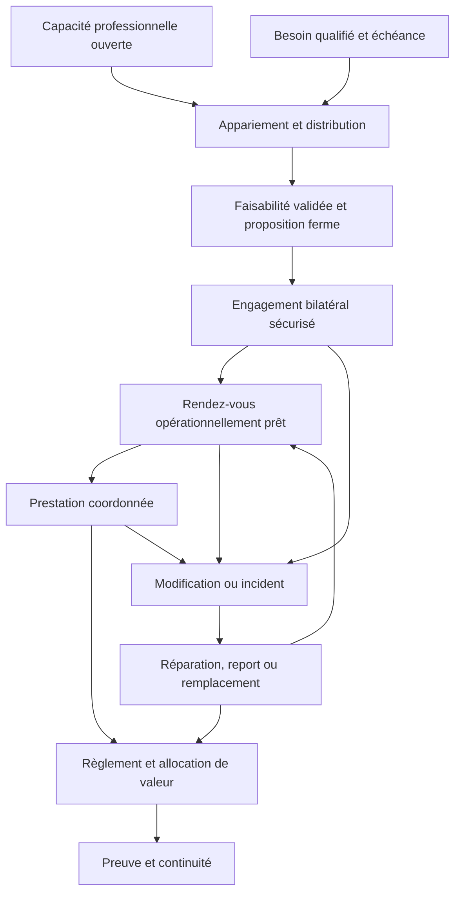
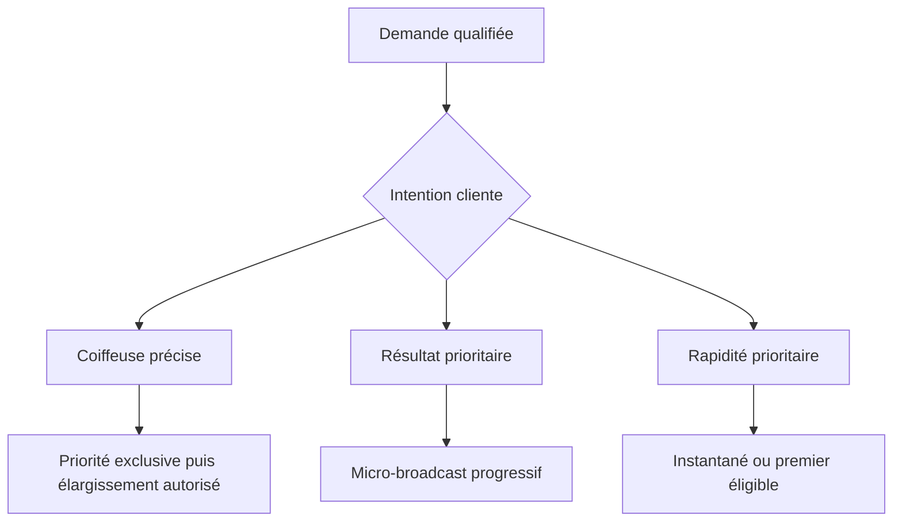

# Refonte du processus métier fondée sur les retours terrain

**Date :** 28 juillet 2026  
**Périmètre de preuve :** 10 publications, leurs contenus accessibles et les commentaires conservés dans `Base-retours-terrain-coiffeuses.md`  
**Registre dérivé :** 92 unités de preuve exploitables  
**Statut probatoire :** plusieurs signaux transversaux, aucun problème encore déclaré réellement validé  
**Statut du mécanisme de matching :** hypothèse de conception recommandée pour le pilote, à comparer expérimentalement aux alternatives

## Décision

Les onze anciennes étapes ne sont plus la structure directrice du métier.

La plateforme ne doit plus être conçue d’abord comme un catalogue qui conduit une cliente vers une réservation. Elle doit être conçue comme :

> une infrastructure qui distribue une demande qualifiée, forme un engagement bilatéral, protège les ressources engagées et organise la réparation lorsqu’un engagement ne peut pas être tenu.

La promesse n’est donc pas seulement de trouver une bonne coiffeuse ou d’apporter des clientes. Elle est de rendre le temps, l’argent, le travail, le périmètre de service et les responsabilités de chacun explicites, traçables et protégés.

Cette protection doit être :

- **réciproque** : chaque partie dispose d’un recours lorsqu’elle subit une défaillance ;
- **proportionnée** : la réparation dépend du préjudice réel, pas d’une symétrie arithmétique aveugle ;
- **prévisible** : les règles applicables sont connues avant l’engagement ;
- **traçable** : l’état de la demande, les validations, paiements et modifications ont une référence commune ;
- **réparable** : remboursement, crédit, report, remplacement ou compensation ne sont pas improvisés dans les DM ;
- **distributive** : entre plusieurs professionnelles réellement capables de satisfaire la demande, la plateforme répartit activement les opportunités afin d’éviter une concentration qu’elle aurait elle-même créée.

## Méthode exécutée

### Conservation de la matière brute

La base terrain n’a pas été réécrite. Les anciennes mentions d’étapes restent des traces historiques, mais elles n’ont pas servi à imposer le nouveau découpage.

### Unité d’analyse

L’unité n’est ni la publication, ni le commentaire pris comme un vote. C’est une observation exploitable :

- expérience directe ;
- récit rapporté ;
- pratique professionnelle ;
- changement de comportement ;
- solution artisanale ;
- explication alternative ;
- contre-signal.

Le registre contient 92 lignes. Certaines lignes agrègent plusieurs personnes lorsque la base d’origine ne permettait plus de les séparer ou lorsqu’elles formulaient le même retour succinct. Le champ `independent_units` conserve cette limite. Le nombre de lignes ne doit donc jamais être présenté comme un nombre de personnes touchées.

### Double passe par source

1. **Passe factuelle**
   - acteur et segment réellement vérifiables ;
   - chronologie ;
   - comportement observé ;
   - conséquence effectivement décrite ;
   - nature et indépendance de la preuve.
2. **Passe analytique**
   - engagement attendu ;
   - ressource exposée ;
   - mécanisme métier possible ;
   - solution artisanale ;
   - contre-signal et explication alternative ;
   - hypothèse à mesurer.

Les idées produit ne modifient jamais le niveau de preuve.

## Taxonomie des mécanismes

| Code | Mécanisme |
|---|---|
| M01 | Distribution de la demande |
| M02 | Allocation du prix et de la valeur |
| M03 | Légitimité des règles professionnelles |
| M04 | État de l’engagement |
| M05 | Acompte et partage du risque |
| M06 | Périmètre du service et co-production |
| M07 | Fiabilité du planning et de la capacité |
| M08 | Préparation opérationnelle |
| M09 | Modification, incident et continuité |
| M10 | Réciprocité et réparation |
| M11 | Confiance, réputation et continuité de relation |
| M12 | Charge d’acquisition et de contenu |
| M13 | Sécurité, confort et consentement |
| M14 | Segmentation de l’offre |
| M15 | Traçabilité et preuve commune |

## Analyse source par source

### Source 001 — Jeunes prestataires et respect du cadre

**Passe factuelle**

- La version conservée agrège les témoignages et ne permet pas de restituer un nombre strict de personnes.
- L’âge connu est associé à davantage de négociation, de familiarité instrumentale et de contestation du prix.
- Les annulations tardives et absences immobilisent des créneaux.
- L’acompte, l’adresse après paiement, le blocage et une posture ferme sont utilisés comme protections.
- Certaines prestataires cachent leur âge ou doutent de leur travail.
- Contre-signal : certaines clientes préfèrent les jeunes coiffeuses.

**Passe analytique**

- Engagement menacé : respecter le prix, le créneau et le statut professionnel indépendamment de l’âge.
- Ressources exposées : revenu, capacité, temps, légitimité et confiance professionnelle.
- Mécanismes : M03, M05, M07, M11 et M15.
- Lecture : le besoin n’est pas seulement d’ajouter un acompte, mais d’externaliser un cadre crédible qui évite à la coiffeuse de négocier sa propre légitimité à chaque demande.
- Limite : l’effet propre de l’âge n’est pas isolé de l’expérience, du domicile, du prix ou de la visibilité.

### Source 002 — Partage de la valeur entre salon, intermédiaires et coiffeuse

**Passe factuelle**

- Un prix passe de 70 à 50 euros après négociation.
- La coiffeuse déclare recevoir environ 20 euros après les parts du salon et de l’apporteur.
- D’autres coiffeuses rapportent des prélèvements de 50 ou 60 pour cent.
- Des récits portent sur revenu très faible, paiement tardif et pourboires non transmis.
- Les solutions artisanales sont le domicile, la relation directe, le paiement du transport, le pourboire caché, la location collective et la prospection dans les commentaires.
- Une interaction montre un mauvais appariement géographique.
- Contre-signaux : le salon finance parfois local, matériel, produits, charges, acquisition, administration et risque de sous-activité.

**Passe analytique**

- Engagement menacé : savoir ce que chaque part finance et qui possède la relation cliente.
- Ressources exposées : travail, revenu net, pourboire, infrastructure, acquisition et autonomie.
- Mécanismes : M01, M02, M11, M14 et M15.
- Lecture : le problème n’est pas démontré comme étant un taux de commission universellement excessif. C’est d’abord l’opacité du paquet de services et du revenu final.
- Conséquence métier : le prix payé par la cliente, le revenu de la coiffeuse et le coût de l’infrastructure doivent être trois objets distincts.
- Limite : statuts, charges, volumes et marges réelles ne sont pas vérifiés.

### Source 003 — Conditions unilatérales, acompte et retards

**Passe factuelle**

- La cliente verse 31 euros, mais doit encore confirmer manuellement.
- La prestataire pénalise dix minutes de retard cliente et fait attendre la cliente à deux reprises.
- La qualité technique est jugée bonne, mais l’intention de revenir diminue.
- Plusieurs clientes décrivent des attentes allant de vingt minutes à deux heures.
- Une cliente déduit elle-même une pénalité du solde.
- Les pratiques professionnelles divergent : acompte-confirmation, tolérance, refus après seuil, aucun acompte ou compensation par du temps.
- Le retard hérité de la cliente précédente est proposé comme explication.

**Passe analytique**

- Engagement menacé : un créneau confirmé, ponctuel et soumis à des règles applicables aux deux parties.
- Ressources exposées : temps, argent, déplacement, capacité suivante, confiance et fidélité.
- Mécanismes : M04, M05, M07, M09, M10, M11 et M15.
- Lecture : l’acompte ne protège pas si sa fonction est ambiguë. La règle de retard ne protège pas durablement si aucune réparation n’existe lorsque la prestataire est en retard.
- Limite : l’origine des retards, le taux de reprise et le comportement de réachat ne sont pas mesurés.

### Source 004 — Prix en hausse et expérience des coiffeuses découvertes sur Instagram

**Passe factuelle**

- La créatrice associe hausse des prix et attente d’une meilleure expérience.
- Les retards et confirmations contestées convergent avec d’autres sources.
- Deux témoignages portent sur des interruptions personnelles.
- Protection thermique, hygiène, matériel et nourriture produisent des signaux de forces différentes.
- Plusieurs professionnelles décrivent des réponses déjà utilisées : reconfirmation, site autonome et offre full service.
- Contre-signaux : les conditions protègent parfois des no-shows réels; nourriture et shampoing peuvent relever du premium; la protection thermique est techniquement disputée.

**Passe analytique**

- Engagement menacé : obtenir ce qui est inclus, à l’heure et au niveau de service promis.
- Ressources exposées : temps, argent, cheveux, confort et confiance.
- Mécanismes : M03 à M08, M10, M13 et M14.
- Lecture : le terrain mélange des obligations de base — clarté, ponctualité, hygiène — et des attributs segmentants — snacks, shampoing ou expérience haut de gamme. Le processus doit les séparer.
- Limite : aucun élément ne permet d’attribuer le problème à Instagram, au domicile, aux débutantes ou aux jeunes coiffeuses.

### Source 005 — Participation de la cliente à la préparation des mèches

**Passe factuelle**

- La créatrice rapporte la même demande de participation dans deux salons et une réaction hostile après son refus.
- D’autres clientes décrivent le rôle d’assistante, le fait de donner ou finir les mèches et des remarques sur leur lenteur.
- Des clientes relient la contribution au prix et certaines quittent le marché pour l’auto-coiffure.
- Contre-signaux : la pratique est décrite comme normale en Guadeloupe et certaines clientes préfèrent aider pour gagner du temps.
- Une coiffeuse probable dit manquer de clientes malgré des prix abordables.

**Passe analytique**

- Engagement menacé : connaître précisément qui fait quoi pendant la prestation.
- Ressources exposées : travail, temps, argent, confort, dignité et cheveux.
- Mécanismes : M02, M06, M10, M11, M13 et M14.
- Lecture : la participation n’est ni bonne ni mauvaise par nature. Elle devient un problème lorsqu’elle est découverte tardivement, imposée ou sans effet explicite sur prix et durée.
- Implication à instruire : l’offre doit rendre visible la répartition des tâches et ses effets éventuels sur le prix, la durée, le résultat et la responsabilité. La forme exacte — service entièrement réalisé par la coiffeuse, variante assistée ou choix tâche par tâche — reste à tester. La seule règle déjà soutenue est qu’une cliente ne devient jamais assistante par surprise le jour J.
- Limite : temps gagné, variation culturelle, structure de prix et prévalence ne sont pas mesurés.

### Source 006 — Réponses tardives et rendez-vous sans heure

**Passe factuelle**

- La cliente trouve les prestataires sur TikTok puis Instagram.
- Une première prestataire répond tard mais refuse clairement faute de disponibilité; ce refus est accepté.
- Avec la prestataire choisie, date et adresse sont échangées, mais pas l’heure.
- La conversation s’arrête; la cliente achète néanmoins des fournitures puis annule.
- Une cliente dit choisir désormais le salon; une autre recommande une coiffeuse très réactive.
- Une prestataire défend le week-end non travaillé et annonce répondre sous 24 heures.

**Passe analytique**

- Engagement menacé : savoir si une proposition, une conversation ou un rendez-vous est réellement confirmé.
- Ressources exposées : temps, échéance, achat de fournitures, conversion et confiance.
- Mécanismes : M01, M04, M08, M11 et M12.
- Lecture : le problème central n’est pas le délai de première réponse. C’est l’absence d’état complet, de prochain acteur attendu et de date d’expiration.
- Décision : aucun achat irréversible ne devrait être déclenché avant une proposition ferme puis un état READY.
- Limite : la prestataire pouvait considérer qu’aucun rendez-vous n’était conclu.

### Source 007 — Report, acompte conservé et rigidité relationnelle

**Passe factuelle**

- La cliente demande un report la veille, relance sur Instagram et reste sans réponse.
- L’acompte de 20 euros est conservé; la prestataire propose ensuite d’autres créneaux.
- La cliente refuse de revenir.
- Les professionnelles décrivent trois familles de pratiques : acompte non transférable, acompte transférable sous conditions et absence d’acompte.
- Un cas inverse rapporte qu’une prestataire déplace elle-même le rendez-vous puis conserve l’acompte.
- Des instituts et salons sont cités comme plus flexibles, sans comparaison équivalente.

**Passe analytique**

- Engagement menacé : modifier le rendez-vous dans un cadre qui protège le créneau et la relation.
- Ressources exposées : acompte, capacité, valeur vie cliente, recommandation et charge administrative.
- Mécanismes : M05, M09, M10, M11 et M15.
- Lecture : annulation et report ont parfois le même coût immédiat, mais pas la même intention relationnelle. La réparation doit tenir compte du préavis, de la remplaçabilité et de l’historique.
- Décision : l’incident doit proposer plusieurs sorties — accepter, autre fenêtre, crédit, frais justifiés ou refus — et tracer si le créneau a été remplacé.
- Limite : politique de la plateforme, canal attendu et perte économique réelle inconnus.

### Source 008 — Annulation par la prestataire avant un anniversaire

**Passe factuelle**

- Un seul récit rapporté est exploitable; aucun commentaire n’était accessible.
- Une prestataire aurait annulé une réservation avec 10 euros d’acompte pour accepter un mariage plus avantageux.
- L’acompte n’aurait pas été remboursé.
- La cliente décolore elle-même sa perruque à quelques heures de son anniversaire.
- Aucune solution de remplacement n’est mentionnée.

**Passe analytique**

- Engagement menacé : honorer ou réparer une réservation, surtout avant une échéance non reportable.
- Ressources exposées : argent, temps, événement, perruque, sécurité technique et confiance.
- Mécanismes : M05, M08, M09, M10 et M13.
- Lecture : cette source ne prouve pas la fréquence, mais expose le risque maximal d’une règle asymétrique : la cliente porte seule le coût d’une défaillance de la prestataire.
- Implication : une annulation par la prestataire doit déclencher au minimum le remboursement et l’instruction d’une alternative ; l’intensité et la rapidité du secours dépendent du temps restant, de la possibilité de restaurer le résultat et des garanties préalablement acceptées.
- Limite : récit unilatéral, motif, prestation exacte, délai et remboursement final non vérifiés.

### Source 009 — Devoir faire l’influenceuse pour obtenir des clientes

**Passe factuelle**

- Une coiffeuse affirme devoir faire l’influenceuse pour avoir des clientes.
- Deux professionnelles probables expriment une convergence émotionnelle faible.
- Un annuaire est proposé comme réponse.
- Aucune donnée ne mesure capacité libre, temps de création ou conversion.

**Passe analytique**

- Engagement menacé : accéder à une demande pertinente sans maîtriser un second métier de divertissement.
- Ressources exposées : temps, énergie, identité professionnelle, revenu et dépendance algorithmique.
- Mécanismes : M01 et M12.
- Lecture : cette source établit la contrainte perçue, pas une sous-distribution objectivement mesurée.
- Décision : tester une distribution active de demandes qualifiées avant de construire des outils de contenu.
- Limite : l’attention obtenue par la publication peut elle-même servir l’acquisition.

### Source 010 — Création de contenu et conflit avec le temps de prestation

**Passe factuelle**

- Une prothésiste ongulaire décrit le décalage entre son métier et le rôle d’influenceuse attendu.
- Une coiffeuse avec trois ans d’activité décrit longues journées, fatigue, manque de régularité, formats créatifs et portée autour de 300 vues.
- Cinq autres personnes expriment personnellement fatigue, manque d’endurance ou gêne; d’autres soutiennent sans vécu détaillé.
- Aucun contre-signal n’apparaît dans les dix commentaires accessibles.

**Passe analytique**

- Engagement menacé : acquérir la demande sans sacrifier production, repos ou identité.
- Ressources exposées : temps, énergie, acquisition, revenu et capacité de service.
- Mécanismes : M01, M07 et M12.
- Lecture : la chaîne causale est crédible mais documentée en détail par une seule coiffeuse. Ses longues journées peuvent aussi indiquer que sa capacité est déjà occupée.
- Décision : la plateforme doit demander le volume de demande souhaité, pas pousser mécaniquement plus de visibilité.
- Limite : vues, demandes, réservations, chiffre d’affaires et capacité disponible ne sont pas reliés.

## Synthèse transversale

### Ce que le terrain soutient le plus fortement

1. **Le rendez-vous est un engagement risqué pour les deux parties.**  
   Les annulations, absences, retards, reports, achats préparatoires et créneaux immobilisés exposent des ressources différentes.

2. **Le cadre actuel est souvent défensif, dispersé et difficile à prouver.**  
   Les règles vivent dans des bios, stories, sites, DM ou habitudes non dites. Elles protègent parfois un risque réel, mais deviennent difficiles à comprendre ou à appliquer réciproquement.

3. **La résolution est au moins aussi importante que la prévention.**  
   Aucune règle n’empêchera tous les imprévus. Le vrai différenciateur est la vitesse et la qualité avec lesquelles une solution est trouvée.

4. **Le périmètre acheté doit devenir une référence commune.**  
   Shampoing, mèches, préparation, participation de la cliente, déplacement, matériel, durée et niveau de service ne peuvent plus être implicites.

5. **La distribution ne doit pas récompenser d’abord la capacité à produire du contenu.**  
   Le signal est encore insuffisamment quantifié, mais il est transversal : acquisition et réservation sont déjà confiées à des infrastructures sociales fragmentées.

### Ce que le terrain ne permet pas encore d’affirmer

- que toutes les coiffeuses à domicile, jeunes ou présentes sur Instagram présentent les mêmes problèmes ;
- qu’un salon est structurellement plus fiable ;
- qu’un taux de commission de 50 pour cent est nécessairement injuste ;
- qu’un acompte précis réduit causalement les absences sans réduire excessivement la réservation ;
- que la majorité des coiffeuses disposent d’une capacité invendue ;
- que les algorithmes sont la cause principale d’un manque de clientes ;
- que snacks, shampoing ou protection thermique doivent former un standard universel ;
- qu’une politique de report souple est toujours économiquement préférable.

### Statut des règles proposées

Les exemples formulés pendant la réflexion — participation acceptable, facturée ou refusée, fenêtres d’annulation à 72, 48 ou 24 heures, délai de grâce ou niveaux de criticité — ne sont pas des règles métier validées. Ce sont des **variables à étudier**.

La conception doit distinguer quatre niveaux :

1. **Principes stables** : information avant engagement, consentement, obligations bilatérales, proportionnalité, limitation du préjudice et voie de contestation.
2. **Paramètres du cas** : durée et valeur de la prestation, travail préparatoire, coûts irréversibles, délai habituel nécessaire pour remplacer un créneau, échéance réelle de la cliente, impact concret d’un retard et responsabilités de chaque partie.
3. **Politiques comparables** : un petit nombre de cadres cohérents appliqués de la même manière aux situations réellement similaires.
4. **Barèmes chiffrés** : seuils, pourcentages, plafonds et exceptions, définis seulement après observation du pilote et validation juridique.

Le cas par cas ne doit donc pas signifier une négociation improvisée après l’incident. Les paramètres et la méthode de décision sont connus avant la réservation ; l’issue dépend ensuite des faits observables du cas.

## Nouveau processus métier

Le processus n’est plus une seule ligne cliente. Il commence par deux flux parallèles : une **capacité professionnelle ouverte** et un **besoin client qualifié**. Ils convergent dans une proposition, puis dans un engagement commun.

### Étape 0 — Ouvrir une capacité professionnelle

**Décision métier :** qu’est-ce que la coiffeuse souhaite réellement vendre, où, quand et dans quel volume ?

La capacité ouverte décrit :

- prestation et variante ;
- niveau de service : essentiel, complet, assisté ou premium ;
- tâches nécessairement réalisées par la coiffeuse, tâches éventuellement transférables à la cliente et configurations de service proposées ;
- pour chaque configuration : effort demandé, effet estimé sur la durée, le prix et le résultat, sans supposer qu’un transfert produit toujours simultanément un rabais et un gain de temps ;
- durée, marge de planning et nombre maximal de rendez-vous ;
- zone, lieu, mobilité et confidentialité de l’adresse ;
- matériel, produits, mèches et préparation ;
- prix, revenu net cible et coûts additionnels ;
- créneaux et fraîcheur de disponibilité ;
- types d’échéances et niveau d’engagement renforcé qu’elle peut réellement honorer ;
- délai de réponse et volume de demandes souhaité ;
- conditions de modification et limites de service.

**Sortie :** une capacité vendable, pas seulement un profil visible.

**Protection coiffeuse :** elle ne reçoit pas de demandes incompatibles ou au-delà de sa capacité.  
**Protection cliente :** l’offre affichée correspond à une capacité réellement ouverte.

### Étape 1 — Qualifier le besoin et son échéance

**Décision métier :** dispose-t-on d’assez d’informations pour rechercher une solution sans transformer la cliente en experte ?

La demande contient :

- résultat souhaité et inspirations ;
- cheveux ou perruque actuels, contraintes et inconforts ;
- date souhaitée, heure de fin souhaitée, dernière échéance acceptable et conséquences concrètes d’un échec ou d’un retard ;
- budget et flexibilité ;
- zone, mobilité et lieu préféré ;
- durée acceptable ;
- niveau de service souhaité ;
- tâches que la cliente refuse, accepte éventuellement ou préfère confier à la professionnelle, ainsi que l’effort maximal qu’elle souhaite fournir ;
- éléments déjà possédés et achats envisagés ;
- préférences et contraintes de sécurité ;
- intention d’allocation : obtenir une coiffeuse précise, obtenir le meilleur résultat compatible ou obtenir rapidement une solution ;
- autorisation, ou non, d’élargir automatiquement la recherche si le premier choix refuse ou ne répond pas.

**Sortie :** une demande distribuable avec contraintes obligatoires, préférences, marges de flexibilité et mode de recherche explicitement choisis.

**Protection coiffeuse :** moins de questions répétées et de demandes vagues.  
**Protection cliente :** aucune dépense ni réservation n’est encore présentée comme acquise.

### Étape 2 — Apparier et distribuer la demande

**Décision métier :** quelles capacités sont compatibles et souhaitent recevoir cette demande ?

Le premier travail de la plateforme est de constituer un **vivier éligible**. Le mécanisme :

- élimine les incompatibilités certaines ;
- respecte prestation, zone, période, budget, niveau de service et répartition acceptable des tâches ;
- tient compte de la capacité et du volume souhaité par la coiffeuse ;
- explique les écarts ;
- distingue pertinence, qualité vérifiée et visibilité payante ;
- évite que l’audience sociale devienne un proxy silencieux de qualité ;
- limite le nombre de destinataires pour éviter le spam et la compétition inutile.

L’éligibilité précède le classement. Elle répond à la question « qui peut raisonnablement satisfaire cette demande ? ». L’allocation répond ensuite à la question « parmi ces professionnelles, qui solliciter, dans quel ordre et en quel nombre ? ».

Lorsqu’une liste est présentée à la cliente, son ordre ne doit donc pas reproduire mécaniquement le score de matching maximal. Toutes les professionnelles affichées franchissent d’abord le seuil nécessaire pour satisfaire la demande ; l’ordre d’exposition peut ensuite favoriser les capacités compatibles les moins remplies et les moins exposées récemment.

#### Pourquoi un mécanisme unique serait insuffisant

Une prestation de coiffure peut se rapprocher de deux économies différentes :

- **capacité préconfigurée** : prestation standard, durée, prix et créneau suffisamment fiables pour permettre une réservation immédiate ;
- **service à diagnostiquer** : faisabilité, état initial, variante, durée, fournitures ou prix doivent encore être validés par une professionnelle.

Le bon mécanisme dépend donc du niveau d’incertitude restant avant l’engagement et de l’intention de la cliente. Une disponibilité affichée n’est pas toujours une proposition réalisable.

La frontière reste explicite : l’étape 2 sélectionne et sollicite les capacités ; l’étape 3 transforme une réponse professionnelle en proposition ferme. Le protocole de micro-broadcast décrit ci-dessous orchestre ces deux étapes, sans confondre invitation, réponse positive et réservation.

#### Repères de marché

Ces exemples ne prouvent pas le bon modèle pour la coiffure afro. Ils montrent qu’une même plateforme peut adapter le mécanisme de réservation à la standardisation et au risque du service.

| Plateforme | Mécanisme observé | Enseignement transférable |
|---|---|---|
| [Airbnb](https://www.airbnb.com/help/article/85) | Réservation instantanée ou demande soumise à l’hôte selon l’annonce | L’approbation peut dépendre du niveau de préconfiguration de l’offre |
| [BlaBlaCar](https://legal.blablacar.com/fr-fr/terms-and-conditions/) | Acceptation automatique ou manuelle choisie par le conducteur | Le fournisseur peut contrôler son niveau d’automatisation |
| [Booksy](https://support.booksy.com/hc/en-us/articles/21028092250258-How-do-I-customize-my-service-settings) | Réservation autonome configurable par service ; confirmation manuelle imposée aux services mobiles | Le mécanisme peut varier par prestation et contexte d’exécution |
| [Rover](https://support.rover.com/hc/en-us/articles/203062280-How-do-I-find-a-sitter-or-dog-walker-for-my-pet) | Contact direct ; recommandation de solliciter deux à trois prestataires ; réservation après accord des deux parties | Plusieurs prises de contact peuvent précéder un engagement unique |
| [Bark](https://help.bark.com/hc/en-au/articles/17034945954716-Can-I-reach-out-to-professionals-directly) | Besoin transmis pour recevoir jusqu’à cinq devis, avec aussi un parcours de contact direct | Broadcast et choix direct peuvent coexister |

Le point commun n’est pas un modèle universel. C’est l’existence de plusieurs régimes d’engagement selon l’incertitude restante, le contrôle souhaité par le fournisseur et l’urgence du client.

#### Possibilités de distribution

| Mécanisme | Bénéfice principal | Risque principal | Domaine d’usage envisagé |
|---|---|---|---|
| Réservation instantanée | Supprime l’attente | Mauvaise qualification, durée ou prix erronés | Prestations standardisées, calendrier fiable, éventuellement clientes déjà connues |
| Demande exclusive à une coiffeuse | Respecte une préférence forte | Attente et perte d’alternatives en cas de refus | Cliente attachée à une professionnelle précise |
| Cascade strictement séquentielle | Limite les sollicitations inutiles | Additionne les délais pendant que les capacités disparaissent | Cas particuliers ou premier choix exclusif |
| Broadcast simultané à cinq | Accélère l’obtention de réponses | Sollicitations et travail non retenu pour plusieurs coiffeuses | Demandes urgentes, si la réponse professionnelle est quasi instantanée |
| Première coiffeuse qui accepte | Maximise la vitesse | Sélectionne la plus connectée plutôt que la plus compatible | Mode express explicitement choisi |
| Plusieurs devis concurrentiels | Offre un choix étendu | Course au prix et charge commerciale gratuite | Prestations rares, complexes ou à forte valeur |
| Matching manuel par la plateforme | Produit de l’apprentissage et traite les cas ambigus | Coût opérationnel élevé | Premier pilote et cas non couverts par les règles |
| Micro-broadcast progressif | Équilibre délai, choix et charge | Exige une orchestration plus élaborée | Hypothèse recommandée comme mécanisme général |

La cascade candidat par candidat ne doit pas être le fonctionnement général : elle protège le nombre de professionnelles sollicitées, mais expose la cliente à un délai cumulatif et à la disparition progressive des créneaux. À l’inverse, un broadcast large réduit l’attente, mais peut imposer du travail gratuit et une compétition permanente.

#### Trois parcours selon l’intention de la cliente

1. **« Je veux cette coiffeuse »**
   - la demande lui est adressée exclusivement pendant un délai annoncé ;
   - la cliente peut autoriser à l’avance un élargissement automatique ;
   - en cas de refus ou d’expiration, la demande existante est réutilisée sans recommencer la recherche.

2. **« Je veux ce résultat »**
   - la plateforme recherche plusieurs capacités compatibles ;
   - un petit nombre de professionnelles valide la faisabilité ;
   - la cliente choisit entre des propositions réelles, et non entre des profils supposés disponibles.

3. **« Je veux une solution rapidement »**
   - une réservation instantanée ou la première capacité répondant à un seuil explicite peut être utilisée ;
   - ce mode est choisi par la cliente ;
   - la rapidité ne remplace pas silencieusement une préférence de qualité, de prix ou de professionnelle.

#### Hypothèse recommandée — micro-broadcast progressif

Pour le parcours « résultat prioritaire », le pilote doit tester le protocole suivant :

1. **Construire le vivier éligible**
   - filtrer les incompatibilités techniques, temporelles, géographiques, budgétaires et de niveau de service ;
   - ne conserver que des capacités ouvertes et suffisamment fraîches.

2. **Former une première vague de trois professionnelles**
   - combiner compatibilité, fiabilité opérationnelle, capacité souhaitée, fraîcheur du planning et rotation équitable ;
   - limiter les demandes déjà reçues par chaque professionnelle ;
   - réserver une exposition contrôlée aux nouvelles professionnelles qualifiées.

3. **Rendre la réponse professionnelle très légère**
   - `ACCEPT_EXACT` : demande réalisable telle quelle ;
   - `ACCEPT_WITH_CHANGE` : variante nécessaire ;
   - `NEED_INFORMATION` : précision ciblée indispensable ;
   - `UNAVAILABLE` : demande non réalisable ou créneau indisponible.

   La plateforme doit préremplir prestation, périmètre, prix calculable et données utiles depuis le catalogue de la coiffeuse. Un broadcast n’est acceptable que si la validation ne devient pas la rédaction répétée d’un devis gratuit.

   À ce stade, la réponse est provisoire. Elle ne devient `FIRM_PROPOSAL` qu’après la validation complète de l’étape 3.

4. **Viser au maximum deux propositions fermes**
   - arrêter ou suspendre la vague lorsque deux propositions exploitables sont obtenues ;
   - si zéro ou une seule proposition arrive avant l’expiration, ouvrir une deuxième vague de trois ;
   - permettre à la cliente d’attendre, d’élargir ses critères ou de considérer l’unique proposition.

5. **Protéger brièvement les propositions présentées**
   - appliquer un `SOFT_HOLD` court au créneau d’une proposition ferme ;
   - libérer immédiatement les autres créneaux après le choix ou l’expiration ;
   - transformer une seule proposition en engagement `COMMITTED` ;
   - clôturer proprement toutes les invitations et propositions non retenues.

La durée de réponse, la durée du `SOFT_HOLD`, le nombre de professionnelles par vague et le nombre maximal de propositions sont des paramètres d’expérience, pas encore des règles définitives.

#### Principes d’allocation

La plateforme ne doit pas sélectionner en permanence « les cinq meilleures ». Elle doit devenir un **moteur d’allocation de la demande** :

> parmi les professionnelles suffisamment compatibles pour satisfaire la cliente, déterminer à qui distribuer l’opportunité afin de maximiser sa réalisation tout en limitant la concentration de la demande.

La décision est donc séquencée :

1. **Éligibilité** : exclure toute capacité qui ne peut pas satisfaire correctement les contraintes obligatoires.
2. **Garantie de réalisation** : conserver un niveau minimal de disponibilité fraîche et de fiabilité opérationnelle.
3. **Allocation** : départager les capacités admissibles selon leur charge, leur exposition récente et le volume de travail qu’elles souhaitent recevoir.
4. **Repli** : préserver des capacités de secours si les professionnelles prioritaires refusent, ne répondent pas ou ne peuvent pas produire une proposition ferme.

La qualité est d’abord un **seuil d’admission**, pas un classement universel. Une professionnelle ne doit jamais être présentée pour remplir un objectif d’équité si elle ne peut pas garantir le niveau de service attendu.

##### Ce qui doit être lissé

L’objectif n’est pas d’obtenir le même nombre brut de réservations pour toutes. Ce nombre dépend de la durée des prestations, du nombre d’heures ouvertes, de la spécialisation, de la zone, du prix et du volume de travail souhaité.

La référence principale est le **taux de remplissage de la capacité volontairement ouverte** :

\[
Taux\ de\ remplissage =
\frac{heures\ confirmées + heures\ temporairement\ immobilisées}
{heures\ ouvertes}
\]

Une coiffeuse ouvrant trente heures et une autre en ouvrant huit ne doivent donc pas recevoir le même nombre de clientes. À compatibilité et fiabilité comparables, elles devraient progressivement tendre vers un taux de remplissage comparable.

Le calcul doit être réalisé dans des **groupes réellement comparables**, par exemple selon :

- zone et mobilité ;
- catégorie et complexité de prestation ;
- tranche budgétaire ;
- périodes et horaires ouverts ;
- niveau de service ;
- durée moyenne ;
- seuil de fiabilité requis ;
- demande explicite ou non d’une coiffeuse précise.

La règle métier devient :

> À capacité, zone, budget, prestation et niveau de fiabilité comparables, la plateforme minimise les écarts de taux de remplissage qu’elle provoque elle-même.

##### Variables d’allocation

Après le filtre d’éligibilité, la priorité d’invitation tient notamment compte de :

- taux de remplissage actuel ;
- capacité restante et volume encore souhaité ;
- nombre d’opportunités pour lesquelles la coiffeuse était éligible ;
- sollicitations, propositions et engagements reçus récemment ;
- fraîcheur de la disponibilité ;
- fiabilité de réponse et de réalisation ;
- exposition récente dans les résultats ;
- intégration contrôlée des nouvelles professionnelles qualifiées ;
- délai restant, heure limite et difficulté à restaurer le résultat de la cliente.

Il ne s’agit pas encore d’une formule de production. Les poids doivent être appris pendant le pilote, sans masquer les raisons d’éligibilité, de priorité ou de non-sélection.

##### Exemple d’une première vague

Pour une même demande, supposons que cinq professionnelles franchissent toutes le seuil de compatibilité :

| Coiffeuse | Capacité ouverte | Heures confirmées | Taux de remplissage | Sollicitations récentes |
|---|---:|---:|---:|---:|
| A | 20 h | 16 h | 80 % | 10 |
| B | 20 h | 4 h | 20 % | 3 |
| C | 12 h | 0 h | 0 % | 1 |
| D | 10 h | 5 h | 50 % | 5 |
| E | 8 h | 0 h | 0 % | 2 |

Si les cinq sont également capables de réaliser la prestation dans les conditions demandées, la première vague peut prioriser C, E et B. D puis A restent des capacités de repli si cette vague n’aboutit pas.

Ce mécanisme :

- donne d’abord accès à la demande aux professionnelles sous-remplies ;
- ne retire pas du marché les professionnelles déjà demandées ;
- évite de sacrifier la demande cliente au nom de l’équité ;
- empêche l’ordre historique des résultats de devenir un avantage cumulatif permanent.

##### Pas de plafond brut entre coiffeuses

Une règle telle que « aucune coiffeuse ne doit avoir 50 % de réservations de plus qu’une autre » serait trompeuse. Un écart peut être légitime si l’une ouvre davantage de capacité, réalise une prestation rare, est explicitement demandée, accepte plus souvent ou transforme mieux ses propositions.

La plateforme doit contrôler la concentration qu’elle produit, pas garantir une égalité artificielle des résultats. Elle suit donc séparément :

| Niveau | Question de diagnostic |
|---|---|
| Éligibilité | Pour combien de demandes cette coiffeuse pouvait-elle réellement convenir ? |
| Exposition | Combien de fois est-elle apparue dans une sélection pertinente ? |
| Invitation | Combien d’opportunités compatibles lui ont été distribuées ? |
| Réponse | Combien a-t-elle acceptées, refusées ou ignorées ? |
| Proposition | Combien de réponses ont produit une offre ferme ? |
| Sélection | Combien de ses propositions ont été choisies par les clientes ? |
| Réalisation | Combien de prestations ont effectivement eu lieu ? |

Cette décomposition empêche de traiter toutes les sous-activités comme un problème d’algorithme :

- éligible mais rarement invitée : défaut probable d’allocation ;
- souvent invitée mais sans réponse : problème possible de disponibilité, de notification ou de paramétrage ;
- propositions fréquentes mais peu choisies : problème possible de prix, d’offre ou de présentation ;
- sélection fréquente mais faible réalisation : problème de fiabilité, de qualification ou d’engagement.

##### Intensité de la redistribution selon l’intention cliente

| Parcours | Force de l’équilibrage | Règle |
|---|---|---|
| « Je veux cette coiffeuse » | Faible ou nulle | La préférence explicite est respectée ; aucun détournement silencieux de la demande |
| « Je veux ce résultat » | Forte | Parmi les professionnelles suffisamment compatibles, priorité aux capacités les moins remplies |
| « Je veux une solution rapidement » | Intermédiaire | Vitesse et probabilité de réalisation pèsent davantage, tout en évitant la concentration inutile |

La première professionnelle qui répond ne gagne pas automatiquement. Sinon, la plateforme recréerait un algorithme de vigilance : notifications permanentes, pression à rester connectée et avantage structurel aux personnes les plus rapides plutôt qu’aux plus compatibles.

Les nouvelles professionnelles qualifiées doivent recevoir une part contrôlée d’invitations afin de produire leurs premières preuves de fiabilité. Ce mécanisme d’exploration ne doit toutefois jamais abaisser le seuil de compatibilité requis par la demande.

##### Garde-fous

L’algorithme ne doit jamais :

- proposer une professionnelle insuffisamment qualifiée pour corriger un écart de remplissage ;
- masquer ou contourner une préférence explicitement formulée par la cliente ;
- pénaliser définitivement une coiffeuse parce qu’elle connaît du succès ;
- solliciter une professionnelle au-delà de la capacité ou du volume qu’elle souhaite vendre ;
- confondre égalité d’exposition et égalité de résultat ;
- immobiliser plusieurs agendas pendant une durée disproportionnée ;
- transformer la vitesse de réponse en critère dominant implicite.

Chaque décision d’allocation doit conserver une justification auditable : groupe comparable utilisé, critères d’éligibilité franchis, taux de remplissage au moment de la décision, exposition récente et motif de priorité ou de repli.

#### Objets métier nécessaires

Le matching distingue :

> `Demande → Campagne de matching → Invitations → Propositions → Engagement unique`

- une **demande** décrit le besoin stable de la cliente ;
- une **campagne de matching** porte le mode choisi, les vagues et les critères d’allocation ;
- une **invitation** représente la sollicitation d’une coiffeuse ;
- une **proposition** engage temporairement une professionnelle sur un périmètre, un prix, une durée et un créneau ;
- un seul **engagement** est formé à partir de la proposition sélectionnée.

Une réponse positive n’est donc pas encore une réservation. Plusieurs invitations et propositions peuvent exister, mais une seule proposition peut devenir `COMMITTED`.

**Sortie de l’étape 2 :** une campagne clôturée sans capacité, une courte sélection consultable ou des invitations accompagnées de réponses provisoires à instruire à l’étape 3.

**Protection coiffeuse :** acquisition plus qualifiée et contrôlable.  
**Protection cliente :** son besoin n’est exprimé qu’une fois, les alternatives sont recherchées sans perte d’information et le choix repose sur des propositions réalisables plutôt que sur la performance éditoriale.

### Étape 3 — Valider la faisabilité et émettre une proposition ferme

**Décision métier :** une professionnelle accepte-t-elle de s’engager sur cette demande exacte ?

La coiffeuse confirme ou ajuste :

- technique et résultat réaliste ;
- état initial compatible ;
- prestation, options et périmètre ;
- répartition proposée des tâches et tâches indispensables à la faisabilité ;
- effet estimé de cette répartition sur le prix, la durée, le résultat et la responsabilité ;
- produits, mèches et préparation ;
- prix total et revenu estimé ;
- durée et marge ;
- date, heure, lieu ;
- conditions et limites ;
- durée de validité de la proposition.

Elle peut :

- accepter ;
- demander une précision ciblée ;
- proposer une variante ;
- refuser avec un motif structuré.

La participation ne doit pas être un statut abstrait. Elle se décrit tâche par tâche :

| Question | Pourquoi elle compte |
|---|---|
| Quelle tâche est concernée ? | Éviter une demande générale d’« aider » impossible à mesurer |
| Qui possède la compétence et la responsabilité du résultat ? | Ne pas transférer à la cliente une tâche technique, risquée ou déterminante pour la qualité |
| La tâche est-elle indispensable, facultative ou simplement possible ? | Distinguer une condition de faisabilité d’une préférence de la coiffeuse |
| Quel effort est demandé à la cliente ? | Tenir compte de la durée, de la fatigue, de l’accessibilité et de son consentement réel |
| Quel effet mesurable est attendu ? | Afficher séparément l’effet possible sur le prix, la durée et l’heure de fin |
| Que se passe-t-il si elle n’est finalement pas réalisée ? | Éviter une renégociation unilatérale le jour du rendez-vous |

Une coiffeuse peut proposer plusieurs configurations pour une même prestation, par exemple une version entièrement prise en charge et une version assistée. Elle peut aussi n’en proposer qu’une si la technique, son organisation ou la qualité recherchée l’exigent. La cliente choisit une configuration avant l’engagement ; aucune option assistée ne doit être imposée après son arrivée.

Le bénéfice n’est pas présumé. Certaines tâches réduiront le prix, d’autres la durée, certaines les deux et d’autres n’auront qu’un effet de confort organisationnel. Ces effets devront être observés par type de prestation avant d’être automatisés.

**Sortie :** une proposition ferme et temporaire.

**Règle fondamentale :** aucun acompte définitif et aucune réservation confirmée avant cette sortie.

### Étape 4 — Former l’engagement bilatéral et sécuriser les finances

**Décision métier :** les deux parties acceptent-elles le même objet, les mêmes responsabilités et la même logique de réparation ?

L’engagement fige :

- prestation et répartition des tâches ;
- configuration retenue, prix, durée et conséquence prévue si une tâche convenue ne peut pas être réalisée ;
- prix, acompte, solde et bénéficiaires ;
- créneau et durée ;
- éléments inclus ;
- méthode de traitement d’un retard et critères d’impact ;
- annulation cliente ;
- annulation coiffeuse ;
- demande de report ;
- modification initiée par la coiffeuse ;
- absence ;
- coûts de préparation déjà engagés ;
- remboursement, crédit, compensation et remplacement ;
- canal officiel d’incident ;
- preuve de l’accord.

#### Politique d’annulation

La politique d’annulation est un objet versionné, accepté avant paiement et consultable depuis le rendez-vous. Elle contient :

- l’auteur de l’annulation : cliente ou coiffeuse ;
- l’heure de référence et le fuseau du rendez-vous ;
- la méthode par laquelle le préavis influence la décision, sans intervalle non couvert ;
- les coûts susceptibles d’être retenus, leurs justificatifs, leurs plafonds et le délai de remboursement ;
- le traitement séparé des achats ou travaux préparatoires expressément autorisés ;
- les exceptions admises et la voie de contestation ;
- les conséquences d’une annulation lorsque des mesures de sécurisation supplémentaires ont été expressément acceptées.

Les valeurs `72 h`, `48 h`, `24 h` et `50 %` ne sont pas retenues à ce stade, même comme barème recommandé. Une longue prestation mobilisant une journée, un achat spécifique et un déplacement n’expose pas les mêmes ressources qu’une prestation courte facilement remplaçable. Un délai juste doit être relié au **temps raisonnablement nécessaire pour réallouer la capacité**, et non à un nombre universel.

Le cadre de décision doit au minimum considérer :

| Avant l’engagement | Au moment de l’annulation |
|---|---|
| durée et valeur de la prestation | auteur et préavis réel |
| travail ou achats préparatoires autorisés | coûts déjà engagés et prouvables |
| délai habituel de remplacement du créneau | capacité effectivement remplacée, totalement ou partiellement |
| déplacement ou ressource réservée | efforts raisonnables de limitation du préjudice |
| flexibilité de la date et heure limite de résultat | caractère évitable, exceptionnel ou répété |
| mesures de sécurisation supplémentaires acceptées | dommage net restant après remboursement fournisseur, revente ou réallocation |

Pour une annulation cliente, la somme conservable ne devrait pas excéder les coûts irréversibles préalablement autorisés et la perte nette de capacité qui n’a pas pu être raisonnablement réallouée, dans les limites annoncées avant paiement. Si le créneau est revendu, la même perte ne peut pas être facturée deux fois.

Pour une annulation coiffeuse, le remboursement est le point de départ, pas la réparation complète. La résolution peut ajouter recherche d’une solution équivalente, prise en charge d’un surcoût raisonnable ou compensation, selon le préavis, le caractère évitable, les mesures de protection promises et la possibilité réelle de restaurer le résultat attendu.

L’inspiration utile de plateformes comme Airbnb s’arrête donc à la **lisibilité ex ante** : politiques compréhensibles, acceptées avant l’engagement et appliquées de façon cohérente. Le projet ne doit copier ni leurs durées ni leurs pourcentages, car les coûts, la capacité et les conséquences d’une prestation de coiffure sont différents.

#### Échéance critique et niveau de garantie

Un mariage ou un anniversaire n’est pas, à lui seul, une catégorie tarifaire ou punitive. La demande doit plutôt préciser :

- l’heure limite à laquelle le résultat doit être obtenu ;
- la possibilité ou non de déplacer le rendez-vous ;
- la conséquence concrète d’un échec ;
- le temps disponible pour trouver une alternative ;
- les mesures de sécurisation souhaitées et réellement disponibles.

À partir de ces éléments, la plateforme peut proposer un niveau d’engagement renforcé : reconfirmation anticipée, marge supplémentaire, capacité de secours, remplacement prioritaire ou autre dispositif effectivement finançable et exécutable. La professionnelle choisit d’accepter ou non cet engagement avant la proposition ferme.

L’échéance critique n’aggrave donc pas automatiquement les conditions imposées à la cliente. Elle renforce les mesures opérationnelles promises. Si ces mesures ont généré des coûts spécifiques acceptés, leur traitement en cas d’annulation doit être prévu. Si la professionnelle rompt un engagement renforcé, la résolution tient compte des protections promises et du temps restant pour sauver le besoin. Le niveau exact de garantie et son éventuel coût restent à concevoir et à tester.

#### Qualification juridique du versement

Le produit ne doit pas employer indifféremment « acompte », « arrhes » ou « frais de réservation ». En France, la qualification change les droits des parties et, à défaut de précision, une somme versée d’avance est en principe considérée comme des arrhes. Le contrat et la preuve de paiement doivent donc nommer la fonction de chaque somme avant l’activation des remboursements automatiques. Sources : [DGCCRF — Acompte, arrhes, avoir](https://www.economie.gouv.fr/dgccrf/les-fiches-pratiques/acompte-arrhes-avoir) et [article L214-1 du Code de la consommation](https://www.legifrance.gouv.fr/codes/article_lc/LEGIARTI000032226990).

Le paiement distingue au minimum :

- somme imputée au prix final ;
- frais de préparation réellement engagés ;
- éventuels frais de réservation ;
- pourboire ;
- parts versées au salon, à l’espace ou à un apporteur.

**Sortie :** rendez-vous `COMMITTED`.

**Protection coiffeuse :** créneau et travail préparatoire sécurisés.  
**Protection cliente :** pas de paiement sans faisabilité ni recours explicite.

### Étape 5 — Rendre le rendez-vous opérationnellement prêt

**Décision métier :** chacune des conditions nécessaires au rendez-vous est-elle satisfaite ?

Le jalon `READY` exige :

- date, heure exacte, lieu et accès ;
- prestation et prix inchangés ou revalidés ;
- fournitures et responsable de chaque achat ;
- préparation cliente comprise ;
- préparation coiffeuse terminée ;
- répartition des tâches confirmée ;
- prix, durée attendue et conséquences d’une tâche non réalisée inchangés ou revalidés ;
- rappels ou reconfirmation exécutés selon la politique acceptée ;
- mesures de sécurisation promises effectivement vérifiées ;
- moyen de signaler un retard ou un incident ;
- solution de secours déclenchable lorsqu’elle fait partie du niveau de garantie accepté.

**Règle :** la cliente ne doit pas être invitée à engager un achat non remboursable avant que le système n’indique clairement ce qui reste conditionnel.

**Sortie :** rendez-vous `READY`, ou branche `AT_RISK`.

### Étape 6 — Réaliser et coordonner la prestation

**Décision métier :** la prestation se déroule-t-elle dans le périmètre et les conditions convenus ?

Les événements utiles sont :

- arrivée de chaque partie et écart à l’heure convenue ;
- début réel ;
- retard, heure d’arrivée estimée, partie affectée et estimation d’impact ;
- franchissement d’un seuil d’impact prévu et décision correspondante ;
- tâches prévues côté cliente réellement effectuées ;
- modification de technique, périmètre, durée ou prix ;
- consentement explicite à la modification ;
- interruption significative ;
- problème de préparation ;
- incident de sécurité ou de relation ;
- correction ou reprise ;
- fin réelle.

Le système doit permettre une adaptation sans créer une surveillance permanente. Seuls les événements qui changent l’engagement, le prix, la sécurité ou la résolution ont besoin d’une trace.

L’heure convenue est une obligation bilatérale. Dès qu’un retard est prévisible, la partie concernée doit le signaler et communiquer une estimation d’arrivée. Le nombre de minutes ne suffit toutefois pas à déterminer la conséquence. Il faut considérer la durée totale de la prestation, la marge disponible, le rendez-vous suivant, le déplacement, l’heure limite de la cliente, la faisabilité technique restante et la possibilité de limiter l’impact.

| Impact observé | Réponse de principe |
|---|---|
| Aucun impact matériel sur la prestation ou la suite du programme | Information et poursuite, sans conséquence financière automatique |
| Impact absorbable avec accord des deux parties | Nouvelle heure estimée ou adaptation mineure |
| Résultat, créneau suivant ou contrainte importante menacés | Choix proposé à la partie lésée : adaptation, réduction de périmètre, report ou autre réparation prévue |
| Prestation devenue impossible, dangereuse ou inutile au regard de l’échéance | Annulation ou remplacement avec traitement financier selon la responsabilité et le préjudice net |

Des seuils temporels pourront être proposés pour rendre la décision opérable, mais ils devront varier par famille de prestation et organisation réelle. Une règle qui pénalise les retards de la cliente tout en laissant sans réparation les retards de la coiffeuse reste interdite. La répétition influence ultérieurement le niveau de fiabilité ; elle ne doit pas inventer rétroactivement une pénalité non acceptée pour l’incident présent.

Lorsque l’attente menace une échéance non déplaçable, le secours se déclenche dès que le risque devient matériel, conformément au niveau de garantie accepté, et non après un délai de grâce universel.

**Sortie :** `COMPLETED`, `PARTIALLY_COMPLETED` ou `RESOLUTION_PENDING`.

### Étape 7 — Régler et allouer la valeur

**Décision métier :** quel montant final est dû et à qui ?

Le règlement :

- impute l’acompte ;
- applique le prix de la configuration retenue et toute adaptation convenue à la répartition réellement exécutée ;
- valide les modifications de prix ;
- attribue le pourboire à la coiffeuse ;
- ventile espace, produits, déplacement, acquisition ou autres services ;
- affiche le revenu net de la coiffeuse ;
- applique remboursement, crédit ou compensation ;
- produit une preuve pour chaque partie.

**Sortie :** transaction `SETTLED`.

Cette étape répond directement au problème de la source 002 : le prix global ne suffit pas à comprendre la valeur.

### Étape 8 — Produire la preuve et prolonger la relation

**Décision métier :** que doit-on apprendre de la transaction et comment réduire le coût du prochain engagement ?

La preuve distingue :

- qualité du résultat ;
- respect du périmètre ;
- ponctualité et communication ;
- confort et relation ;
- fiabilité de réservation ;
- qualité de résolution ;
- exactitude du prix ;
- prestation réalisée, partielle ou non réalisée.

Un rendez-vous annulé ne produit pas une note technique, mais peut produire un retour vérifié sur la réservation et la résolution.

La continuité permet :

- reprendre rendez-vous ;
- mémoriser préférences et éléments utiles avec consentement ;
- recommander ;
- favoriser une coiffeuse déjà éprouvée ;
- mettre à jour la capacité et la disponibilité ;
- diminuer la dépendance à la création continue de contenu.

**Sortie :** relation continuée, close ou réorientée.

## Branche transversale — Modification, incident et réparation

La réparation est accessible dès l’engagement et jusqu’au règlement.

| Événement | Première question | Sorties possibles |
|---|---|---|
| Demande de report cliente | Quel est le préavis et le créneau peut-il être remplacé ? | Report, crédit, frais justifiés, refus selon règle acceptée |
| Modification par la coiffeuse | La proposition alternative respecte-t-elle l’échéance et le besoin ? | Acceptation, autre coiffeuse, crédit ou remboursement |
| Annulation cliente | Quels coûts autorisés restent irréversibles et quelle capacité n’a pas pu être réallouée malgré le préavis ? | Remboursement, crédit ou retenue plafonnée par le préjudice net prévu |
| Annulation coiffeuse | Les protections promises permettent-elles encore d’atteindre le résultat à temps ? | Remboursement immédiat, remplacement, nouvelle date, prise en charge de surcoût ou compensation |
| Retard cliente | Quel est l’impact sur cette prestation et la capacité suivante ? | Nouvelle heure, périmètre ou durée adaptés, frais prévus, report ou annulation |
| Retard coiffeuse | Quel est l’impact sur la cliente, son événement et la suite du programme ? | Nouvelle heure, réduction, remplacement, report, annulation ou compensation |
| Absence | Qui est absent et quelles preuves minimales existent ? | Perte du créneau, remboursement, crédit ou sanction progressive |
| Préparation non conforme | La prestation reste-t-elle sûre et faisable ? | Adaptation consentie, supplément validé, réduction de périmètre ou report |
| Répartition des tâches différente de l’accord | La modification était-elle consentie et quels effets réels a-t-elle produits ? | Maintien du prix, adaptation convenue, durée révisée ou résolution |
| Résultat à corriger | Quelle correction est réaliste et dans quel délai ? | Reprise, remboursement partiel, autre professionnelle ou clôture contestée |
| Incident relationnel ou de sécurité | Peut-on poursuivre sans risque ni pression ? | Pause, arrêt, remboursement, signalement et accompagnement |

### Modèle de décision équitable

La réciprocité ne signifie pas appliquer mécaniquement la même somme des deux côtés. Une décision juste doit :

1. appliquer la politique connue lors de l’engagement, jamais une règle inventée après l’incident ;
2. traiter de la même manière les cas dont les paramètres pertinents sont comparables ;
3. reconnaître les ressources réellement exposées de chaque côté ;
4. déduire ce qui a été récupéré par remplacement, revente, remboursement fournisseur ou adaptation ;
5. distinguer coût irréversible, perte de capacité, désagrément et dommage sur une échéance ;
6. tenir compte de l’auteur, du préavis, du caractère évitable et des efforts de limitation ;
7. empêcher la double indemnisation et plafonner les retenues ou compensations annoncées ;
8. prévoir des exceptions limitées, une preuve raisonnable et une voie de contestation ;
9. préserver la continuité quand elle reste souhaitée ;
10. mesurer les décisions du pilote afin de simplifier progressivement les politiques sans effacer les différences importantes.

## États métier minimaux

Ces états appartiennent à des objets différents. Ils ne doivent pas être implémentés comme une unique chaîne de statuts portée par la réservation.

| Objet | État | Signification |
|---|---|---|
| Capacité | `CAPACITY_OPEN` | La coiffeuse souhaite vendre une capacité précise |
| Demande | `DEMAND_QUALIFIED` | Le besoin contient les informations minimales |
| Campagne | `MATCHING` | Des capacités compatibles sont recherchées |
| Invitation | `INVITATION_SENT` | Une coiffeuse éligible a reçu la demande dans une vague donnée |
| Invitation | `PROVISIONAL_RESPONSE` | La coiffeuse a indiqué une faisabilité potentielle ou demandé une précision |
| Proposition | `PROPOSAL_PENDING` | Les éléments d’une proposition ferme restent à confirmer |
| Proposition | `FIRM_PROPOSAL` | Faisabilité, prix, durée, créneau et périmètre sont validés |
| Proposition et capacité | `SOFT_HOLD` | Le créneau proposé est protégé pour une durée courte et explicite |
| Engagement | `AGREEMENT_PENDING` | La cliente doit accepter ou payer |
| Engagement | `COMMITTED` | L’engagement commun est formé |
| Rendez-vous | `READINESS_PENDING` | Des actions préparatoires restent ouvertes |
| Rendez-vous | `READY` | Le rendez-vous peut réellement avoir lieu |
| Rendez-vous | `IN_PROGRESS` | La prestation a commencé |
| Résolution | `RESOLUTION_PENDING` | Une modification ou un incident nécessite une décision |
| Rendez-vous | `COMPLETED` | La prestation convenue est terminée |
| Règlement | `SETTLEMENT_PENDING` | Prix final ou réparation à calculer |
| Règlement | `SETTLED` | Les flux financiers sont clos |
| Relation | `CLOSED` | Preuve et continuité ont été traitées |

Les états `CANCELLED_BY_CLIENT`, `CANCELLED_BY_PRO`, `NO_SHOW_CLIENT`, `NO_SHOW_PRO`, `REBOOKED` et `REPLACED` sont des résultats qualifiés de la branche de résolution, pas un unique état `ANNULÉ` qui efface la responsabilité et la solution.

Les états `INVITATION_EXPIRED`, `OFFER_EXPIRED` et `NOT_SELECTED` clôturent respectivement une invitation sans réponse, une proposition arrivée à échéance et une proposition non retenue. Ils ne dégradent pas automatiquement la fiabilité : seule une obligation explicitement acceptée peut être considérée comme rompue.

## Règles métier structurantes

1. La faisabilité professionnelle précède tout engagement financier définitif.
2. Une proposition n’est ferme que si prestation, prix, durée, créneau, lieu et périmètre sont explicites.
3. Un acompte a une fonction nommée et un sort défini pour chaque événement.
4. Les obligations sont bilatérales; les réparations sont proportionnées au préjudice.
5. La réservation et l’état READY sont deux jalons différents.
6. Toute répartition de tâches avec la cliente est annoncée, consentie et rattachée à des effets explicites ; aucun rabais ni gain de durée n’est présumé.
7. La popularité sociale n’est ni une preuve de qualité ni un critère silencieux de classement.
8. La coiffeuse contrôle le volume de demande qu’elle souhaite recevoir.
9. La qualité technique, la fiabilité, la relation et la résolution ne sont jamais fusionnées dans une seule note.
10. Un incident non résolu est une défaillance; un incident bien résolu peut devenir une preuve de confiance.
11. Le pourboire, le revenu net et les prélèvements sont traçables séparément.
12. Les données collectées doivent servir une décision, une protection ou une preuve; le processus ne doit pas devenir une surveillance du rendez-vous.
13. Une campagne peut produire plusieurs invitations et propositions, mais un seul engagement.
14. L’élargissement automatique après un premier choix exclusif exige l’accord préalable de la cliente.
15. La vitesse de réponse n’est pas un critère de sélection silencieux et ne doit pas créer une obligation de connexion permanente.
16. Toute invitation expire ; toute proposition a une durée de validité ; tout créneau non retenu est libéré explicitement.
17. La professionnelle non sélectionnée ne doit pas supporter un travail de devis substantiel non rémunéré.
18. L’heure exacte est une obligation bilatérale ; tout retard prévisible est signalé avec une estimation d’arrivée.
19. Une pénalité de retard unilatérale est interdite ; la réponse dépend de l’auteur, de l’impact net et de la capacité à le limiter, pas seulement du nombre de minutes.
20. Plus l’échéance acceptée est difficile à restaurer, plus les mesures de sécurisation et le déclenchement du secours doivent être explicites avant l’engagement.
21. Une politique d’annulation ne peut être activée que si sa méthode, ses coûts éligibles, ses plafonds, ses exceptions et ses voies de recours sont définis.
22. La fonction juridique de chaque versement est nommée et validée avant toute conservation ou restitution automatique.
23. Les chiffres issus d’exemples de réflexion ne deviennent pas des seuils produit sans données de terrain et validation explicite.

## Contrôle de couverture avec l’ancien parcours

| Ancienne étape | Élément utile conservé | Nouveau placement |
|---|---|---|
| 1–2 | Demande qualifiée, inspirations, contraintes, budget, zone | Étape 1 |
| 3 | Recherche par prestation, compatibilité et explication | Étapes 0 à 2 |
| 4 | Comparaison du prix, du périmètre, des avis et du portfolio | Étapes 2 et 3 |
| 5 | Vérification finale | Étape 3, devenue validation professionnelle |
| 6 | Créneau, paiement, preuve | Étape 4, après faisabilité |
| 7 | Acceptation, ajustement ou refus par la coiffeuse | Étape 3, déplacée avant l’engagement |
| 8 | Consignes, rappels et préparation | Étape 5 |
| 9 | Présence, déroulement et incidents | Étape 6 et branche de résolution |
| 10 | Avis vérifié et multidimensionnel | Étape 8, y compris réservation non réalisée |
| 11 | Réachat, favoris et recommandation | Étape 8, comme boucle de réduction du risque |

### Capacités absentes ou trop faibles dans l’ancien modèle

- capacité ouverte et volume de demande souhaité ;
- acquisition et distribution côté coiffeuse ;
- revenu net, pourboire et ventilation de la valeur ;
- proposition ferme avant paiement ;
- jalon READY ;
- échéance, conséquences d’un échec et possibilité de restaurer le résultat ;
- distinction report, annulation, absence et modification par la prestataire ;
- remplacement ou rediffusion de la demande ;
- qualité de résolution ;
- réciprocité proportionnée ;
- preuve de fiabilité sur une prestation non réalisée.

## Périmètre recommandé pour un premier pilote

Le premier pilote ne doit pas tenter de résoudre les quinze mécanismes simultanément.

### À tester dans le flux principal

- capacité ouverte et volume souhaité ;
- demande qualifiée avec date limite ;
- choix explicite entre coiffeuse précise, résultat prioritaire et rapidité prioritaire ;
- demande exclusive avec élargissement autorisé pour une coiffeuse précise ;
- micro-broadcast progressif par vagues de trois pour le résultat prioritaire ;
- objectif maximal de deux propositions fermes avant choix ;
- deuxième vague conditionnelle si la première ne produit pas assez de propositions ;
- allocation des premières vagues selon le taux de remplissage dans des groupes comparables ;
- capacités de repli fiables pour préserver la réalisation de la demande ;
- justification traçable de l’éligibilité, de l’invitation et de la non-invitation ;
- exposition contrôlée des nouvelles professionnelles qualifiées ;
- matching manuel en arrière-plan pour apprendre des cas ambigus ;
- acceptation, refus ou proposition alternative ;
- expiration des invitations, durée de validité des propositions et `SOFT_HOLD` court ;
- clôture et libération immédiate des propositions non retenues ;
- proposition ferme avant acompte ;
- conditions bilatérales structurées ;
- répartition des tâches décrite dans chaque configuration de service, avec effets attendus explicites ;
- politique d’annulation affichée et calculable à partir de quelques paramètres observables, d’abord instruite manuellement ;
- heure limite de résultat et mesures de sécurisation explicitement acceptées ;
- heure exacte et traitement bilatéral des retards selon leur impact ;
- état READY ;
- demande de report ou annulation par chaque partie ;
- remboursement, crédit ou remplacement ;
- règlement et retour multidimensionnel.

### À mesurer avant d’industrialiser

- nombre de professionnelles par vague ;
- nombre de propositions fermes à présenter ;
- durée des invitations et des `SOFT_HOLD` ;
- seuil d’éligibilité à la réservation instantanée ;
- impact respectif de la cascade, du broadcast simultané et du micro-broadcast progressif ;
- montant et politique d’acompte ;
- qualification juridique des versements et conformité des clauses d’annulation ;
- temps nécessaire pour remplacer un créneau selon la prestation, coûts irréversibles, plafonds et assiette d’une éventuelle retenue ;
- écart entre gain de durée annoncé et réel selon la configuration de service ;
- réduction de prix associée aux tâches transférées à la cliente ;
- seuils d’impact temporel et remèdes proportionnés par famille de prestation ;
- mesures de sécurisation réellement exécutables, coût éventuel et résolution lorsqu’elles échouent ;
- marge entre prestations ;
- score de fiabilité ;
- définition des groupes de coiffeuses réellement comparables ;
- écart acceptable de taux de remplissage entre capacités comparables ;
- arbitrage entre équilibrage, rapidité et probabilité de réalisation ;
- influence respective de l’exposition, des invitations, des réponses et du choix cliente sur la concentration finale ;
- modèles service complet ou assisté ;
- espace, matériel ou administration facturés à la carte.

### À ne pas prioriser sur la seule base actuelle

- générateur de posts, hashtags ou calendrier éditorial ;
- promesse abstraite de visibilité ;
- label automatique de sécurité capillaire ;
- classement universel des coiffeuses ;
- commission unique supposée équitable ;
- snacks ou expérience premium comme standard obligatoire.

## Plan de validation terrain

### Échantillon à équilibrer

- clientes et coiffeuses ;
- indépendantes à domicile, salon, location de fauteuil et mobile ;
- débutantes, expérimentées, sous-capacité et saturées ;
- prestations ordinaires et échéances critiques ;
- clientes aidant volontiers et clientes souhaitant un service complet.

### Mesures par transition

| Transition | Mesures |
|---|---|
| Capacité → demande reçue | capacité libre, volume souhaité, demandes compatibles, coût d’acquisition |
| Demande → exposition | présence dans les sélections, part d’exposition parmi les coiffeuses éligibles, répétition d’apparition |
| Exposition → invitation | taille du vivier, taux d’éligibilité, répartition des sollicitations, nombre de vagues |
| Invitation → réponse | délai, taux de réponse, motifs de refus, informations manquantes, temps professionnel consacré |
| Réponses → proposition | propositions fermes par vague, délai jusqu’à la première puis la deuxième proposition |
| Proposition → engagement | conversion, effet de l’acompte, choix de la configuration de service, abandons liés aux règles |
| Engagement → READY | actions manquantes, achats engagés, reconfirmations, risques détectés |
| READY → prestation | retards par acteur, annulations, no-shows, échéance, durée prévue et réelle |
| Incident → solution | préavis, possibilité de restaurer le résultat, délai de réponse, remplacement, remboursement, crédit, satisfaction de résolution |
| Prestation → règlement | prix final, effet de la configuration de service, revenu net, pourboire, écarts au devis |
| Règlement → continuité | réachat, recommandation, non-retour après incident |
| Canal → revenu | temps passé, demandes qualifiées, réservations réalisées, revenu net par canal |

### Expérience comparative du mécanisme de matching

Le pilote doit comparer les mécanismes sur les mêmes catégories de demandes, sans déclarer le micro-broadcast gagnant à l’avance.

| Dimension | Indicateur |
|---|---|
| Vitesse cliente | délai jusqu’à la première proposition ferme et jusqu’à `COMMITTED` |
| Charge coiffeuse | nombre de sollicitations et minutes consacrées par engagement obtenu |
| Déchet du marché | propositions produites mais non retenues, créneaux immobilisés puis libérés |
| Qualité d’appariement | compatibilité finale, modifications après proposition, incidents après engagement |
| Accès à la demande | part d’exposition et d’invitation rapportée au nombre de demandes réellement compatibles |
| Équité de distribution | écart de taux de remplissage entre groupes comparables, concentration des invitations, propositions et engagements |
| Diagnostic de conversion | différences entre éligibilité, invitation, réponse, proposition, sélection et réalisation |
| Autonomie cliente | taux de choix, d’élargissement des critères et d’abandon |
| Soutenabilité | notifications reçues, taux de désactivation et volume souhaité dépassé |

La métrique directrice n’est ni le nombre de réponses reçues, ni l’égalité brute des réservations. C’est l’obtention rapide d’un engagement compatible, avec le moins de travail non retenu et de capacité inutilement immobilisée, tout en réduisant les écarts de remplissage que la plateforme crée entre professionnelles comparables.

### Conditions pour déclarer un problème validé

Il faudra établir simultanément :

- la population et le segment touchés ;
- la fréquence sur un échantillon non sélectionné par une publication virale ;
- la gravité et le coût ;
- le comportement de résolution actuel ;
- l’insuffisance des solutions existantes ;
- l’amélioration produite par une intervention mesurée.

## Conclusion

L’intuition de départ est confirmée et précisée :

> Le cœur du produit n’est pas la visibilité. C’est la qualité de l’engagement.

La visibilité reste une entrée importante, mais elle ne crée de valeur durable que si elle conduit à une demande compatible, une proposition faisable, un accord clair, un rendez-vous prêt, une exécution coordonnée et une réparation crédible.

La plateforme gagnera la confiance des coiffeuses si elle protège leur capacité, leur prix, leur travail et leur revenu. Elle gagnera celle des clientes si elle protège leur argent, leur temps, leur échéance, leurs cheveux et leur possibilité d’obtenir une solution.
