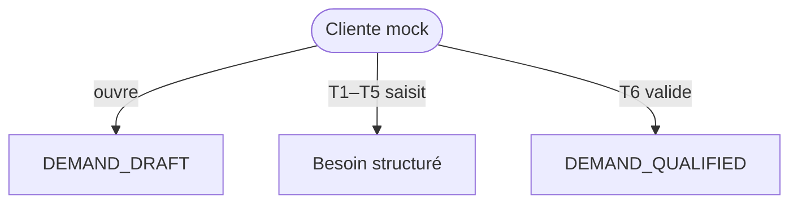

# Domain Storytelling MVP — Étape 1 : Qualifier le besoin cliente

> **Document compagnon** du Domain Storytelling complet  
> Source complète : `domain-storytelling-etape-1.md`  
> Objectif : version démontrable (happy path), sans backend, sans auth, sans paiement.

---

## 0. Intention produit

Une **cliente** transforme un besoin flou en **demande structurée** qu’elle valide : `DEMAND_QUALIFIED`.

Valeur à montrer :

* elle choisit un résultat (inspiration / prestation) ;
* elle précise temps, budget, zone, protection, niveau de service ;
* elle voit un résumé clair et valide.

Pas de matching, pas de réservation, pas de diagnostic médical.

---

## 1. Principes MVP

| Principe | Application |
| -------- | ----------- |
| Happy path only | Jusqu’à `DEMAND_QUALIFIED` |
| Pas de règles d’autorisation | Cliente mockée |
| Pas de backend | Mock + `localStorage` |
| Pas d’auth / paiement | Profil préchargé |
| Cycles de vie respectés | Statuts utiles seulement |
| Moins de règles, max de valeur | Formulaire guidé court |
| Écrans Stitch MVP | S01–S08 générés (`prompts-stitch-mvp.md`) |

---

## 2. Précondition mockée

Cliente déjà « connectée » (profil mock : prénom, zone indicative).  
Catalogue d’inspirations préchargé (knotless, vanilles, twists…).

Pas de coiffeuse dans cette étape.  
Pas d’opérateur.

---

## 3. Périmètre du récit MVP

### Déclencheur

La cliente veut trouver une prestation / coiffeuse adaptée à son besoin.

### Début

`DEMAND_DRAFT`

### Fin nominale

`DEMAND_QUALIFIED`

### Acteur

**Cliente** uniquement.

---

## 4. Objets métier conservés (light)

| Objet | MVP |
| ----- | --- |
| Demande | Objet central |
| Inspiration / résultat | Choix catalogue + variante simple |
| Contexte occasion | Ex. mariage, quotidien (optionnel) |
| Cadre temporel | Date préférée + dernière échéance |
| Budget | Cible + max + inclusion mèches |
| Zone / mobilité | Rayon + lieux acceptés |
| Protection | Liste courte (cuir chevelu sensible…) |
| Niveau de service | Complet / assisté + tâches |
| Priorité de recherche | 1 choix (résultat / prix / proximité / dispo) |

### Exclus

Questionnaire ultra-adaptatif, rapport de cohérence riche, `DEMAND_WITHDRAWN`, qualification assistée opérateur, diagnostic médical.

---

## 5. Cycle de vie MVP

```text
DEMAND_DRAFT
      ↓
QUALIFICATION_IN_PROGRESS
      ↓
DEMAND_QUALIFIED
```

États non implémentés : `QUALIFICATION_TO_CLARIFY`, `DEMAND_WITHDRAWN`.  
`QUALIFICATION_READY_FOR_REVIEW` fusionné dans le récap avant validation.

---

## 6. Happy path — récit nominal (7 temps)

### T0 — Accueil / point d’entrée

Prestation connue **ou** catalogue d’inspirations.

### T1 — Résultat + variante + contexte

### T2 — Temps (préférence + échéance)

### T3 — Budget (cible, max, périmètre)

### T4 — Zone / mobilité / lieux acceptés

### T5 — Protection + niveau de service + tâches + priorité

### T6 — Résumé → validation → `DEMAND_QUALIFIED`

---

## 7. Vue d’ensemble MVP



---

## 8. Conditions minimales de `DEMAND_QUALIFIED`

* résultat / prestation choisi ;
* échéance ou date préférée ;
* budget max > 0 ;
* zone ou mobilité renseignée ;
* niveau de service choisi ;
* priorité de recherche choisie ;
* confirmation explicite.

---

## 9. Données mock / localStorage

| Clé | Contenu |
| --- | ------- |
| `as.mvp.catalog.inspirations` | Familles + images |
| `as.mvp.demands` | Draft → Qualified |
| `as.mvp.currentDemandId` | Brouillon en cours |

Préremplir un happy path type : knotless medium, samedi, budget 100/120, 15 km, service assisté, priorité = résultat.

---

## 10. Écrans — mapping Stitch MVP

Source prompts : `prompts-stitch-mvp.md` (S01–S08).

| # | Dossier | Prompt | Rôle MVP |
| - | ------- | ------ | -------- |
| E0 | `accueil_explicatif_qualifier_mon_besoin/` | S01 | Accueil / orientation (`DEMAND_DRAFT`) |
| E1 | `point_d_entr_e_qualifier_mon_besoin/` | S02 | Point d’entrée (prestation connue OU catalogue) |
| E2 | `votre_r_sultat_inspirations_et_variantes/` | S03 | Inspirations + variante + contexte |
| E3 | `temps_budget_qualifier_mon_besoin/` | S04 | Temps + budget |
| E4 | `zone_mobilit_qualifier_mon_besoin/` | S05 | Zone / mobilité / lieux acceptés |
| E5 | `protection_service_qualifier_mon_besoin/` | S06 | Protection + niveau de service + tâches + priorité |
| E6 | `r_sum_de_ma_demande_qualifier_mon_besoin/` | S07 | Résumé de ma demande |
| E7 | `succ_s_demande_qualifi_e/` | S08 | Succès — `DEMAND_QUALIFIED` |

Design system : `atelier_synergy/DESIGN.md`. Assets photo Stitch conservés à côté des écrans.

---

## 11. Ce qu’on coupe

| Zone complète | MVP |
| ------------- | --- |
| Boucles de clarification | Validation champs simples |
| Opérateur | Absent |
| Re-qualification / retrait | Reporté |
| Distinction inspiration vs galerie pro | Garder en copy seulement |

---

## 12. Critère de succès démo

La cliente peut dire :

> « J’ai décrit ce que je veux, mon budget et ma zone — ma demande est prête. »

---

## 13. Frontières

| Étape | Lien |
| ----- | ---- |
| Aval étape 2 | Consomme `DEMAND_QUALIFIED` |
| Étape 0 | Non consommée ici (capacités = matching) |

---

## 14. Résultat fonctionnel MVP

> **Une demande MVP est un besoin cliente structuré, validé explicitement, persisté localement, prêt pour le matching — sans réservation ni diagnostic.**
