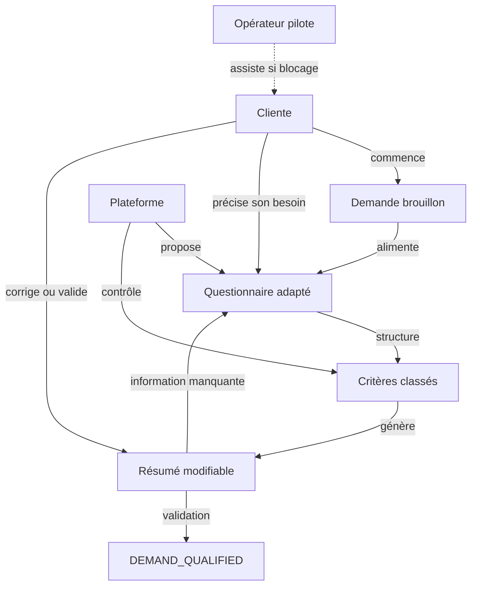
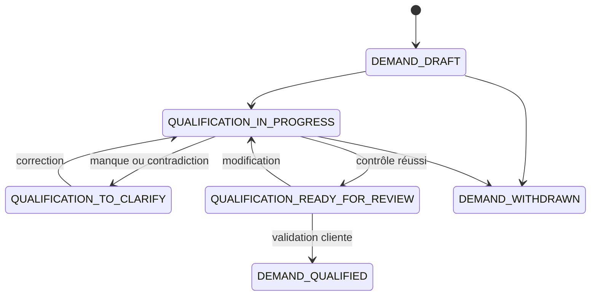

# Domain Storytelling — Étape 1 : Qualifier le besoin de la cliente

L’étape transforme un besoin parfois imprécis en une demande suffisamment structurée pour rechercher des capacités compatibles.

> `DEMAND_QUALIFIED` signifie « exploitable pour la recherche ».
> Cela ne signifie ni « techniquement validée », ni « disponible », ni « réservable ».

---

## 1. Périmètre du récit

### Déclencheur

La cliente décide de rechercher une solution pour un besoin de coiffure.

Son besoin initial peut être :

* précis : « Je veux des knotless braids mi-longues » ;
* visuel : « Je veux quelque chose qui ressemble à cette coiffure » ;
* fonctionnel : « Je cherche une coiffure protectrice qui ne serre pas » ;
* contextuel : « Je dois être coiffée avant un mariage samedi » ;
* orienté vers une professionnelle : « Je veux cette coiffeuse précisément ».

### Décision métier

> Dispose-t-on d’assez d’informations pour rechercher une solution compatible sans transformer la cliente en experte de la coiffure ?

### Point de départ

Un besoin non structuré :

> « Je dois me coiffer pour samedi. »

### Point d’arrivée

Une demande qualifiée :

> « Je recherche des knotless braids moyennes, longueur mi-dos, pour un mariage samedi. Je dois avoir terminé avant 12 h. Mon budget cible est de 100 €, avec un maximum de 120 €, mèches comprises. Je peux me déplacer jusqu’à 15 km autour de Créteil. Je refuse les coiffures trop serrées et préfère que la coiffeuse fournisse les mèches. Ma priorité est le résultat. »

### Hors périmètre de cette étape

Cette étape ne réalise pas :

* la recherche des coiffeuses ;
* la vérification des disponibilités ;
* la validation technique par une coiffeuse ;
* l’établissement d’un prix ferme ;
* la réservation ;
* le paiement ;
* le diagnostic capillaire approfondi.

---

## 2. Acteurs et objets métier

### Acteurs

| Acteur               | Responsabilité                                                                                  |
| -------------------- | ----------------------------------------------------------------------------------------------- |
| **Cliente**          | Exprime son besoin, classe ses critères, définit ses limites et valide le résumé                |
| **Plateforme**       | Guide la qualification, adapte les questions, structure les réponses et contrôle leur cohérence |
| **Opérateur pilote** | Aide la cliente en cas de blocage sans décider à sa place                                       |
| **Coiffeuse**        | Absente de cette étape ; elle interviendra lors de la validation professionnelle                |

### Objets de travail

| Objet métier                         | Rôle                                                                    |
| ------------------------------------ | ----------------------------------------------------------------------- |
| **Besoin initial**                   | Expression libre ou encore imprécise de la cliente                      |
| **Demande brouillon**                | Conteneur modifiable utilisé pendant la qualification                   |
| **Inspiration**                      | Référence issue du catalogue visuel                                     |
| **Questionnaire adapté**             | Questions déterminées selon la prestation, l’inspiration et le contexte |
| **Résultat souhaité**                | Description du résultat que la cliente cherche à obtenir                |
| **Contexte**                         | Occasion, usage, urgence ou objectif associé à la demande               |
| **Cadre temporel**                   | Date préférée, heure limite et dernière échéance acceptable             |
| **Cadre financier**                  | Budget cible, budget maximal, éléments inclus et flexibilité            |
| **Cadre géographique**               | Zone, mobilité, temps de trajet et lieu accepté                         |
| **Contraintes de protection**        | Limites capillaires, de confort ou de sécurité                          |
| **Niveau de service**                | Degré d’accompagnement attendu                                          |
| **Répartition souhaitée des tâches** | Tâches acceptées, refusées ou préférées par la cliente                  |
| **Critère qualifié**                 | Contrainte, préférence ou marge de flexibilité                          |
| **Priorité de recherche**            | Coiffeuse précise, résultat prioritaire ou rapidité prioritaire         |
| **Rapport de cohérence**             | Informations manquantes ou contradictoires                              |
| **Résumé de demande**                | Reformulation complète présentée à la cliente                           |
| **Demande qualifiée**                | Version validée pouvant être transmise à l’étape d’appariement          |

La distinction centrale est la suivante :

| Type            | Signification                                           | Exemple                                     |
| --------------- | ------------------------------------------------------- | ------------------------------------------- |
| **Contrainte**  | Une solution qui ne la respecte pas est incompatible    | « Je dois avoir terminé avant samedi 12 h » |
| **Préférence**  | Elle améliore la satisfaction, mais peut être sacrifiée | « Je préférerais une coiffeuse à Créteil »  |
| **Flexibilité** | Écart explicitement autorisé autour d’un critère        | « Je peux me déplacer jusqu’à 15 km »       |

---

## 3. Vue d’ensemble du Domain Story

---

## 4. Récit nominal détaillé

### Activité 1 — La cliente commence une demande

**Cliente → crée → Demande brouillon**

La cliente indique qu’elle souhaite rechercher une prestation. La plateforme conserve immédiatement un brouillon pour lui permettre de reprendre ou d’abandonner la qualification.

---

### Activité 2 — La plateforme propose un point de départ

**Plateforme → présente → Points d’entrée**

La cliente peut commencer par :

* une prestation qu’elle connaît ;
* le catalogue visuel d’inspirations ;
* un objectif pratique ou protecteur ;
* une occasion ou une échéance ;
* une coiffeuse précise.

Ce choix détermine l’ordre des questions, mais pas les informations nécessaires à la qualification finale.

---

### Activité 3 — La cliente choisit une direction

**Cliente → sélectionne → Inspiration ou famille de prestation**

Si elle connaît la prestation, elle la sélectionne directement.

Si elle ne connaît pas le vocabulaire exact, elle choisit une ou plusieurs inspirations. La plateforme peut alors les rattacher à une famille connue : braids, twists, cornrows, locks, tissage, perruque, etc.

L’inspiration sert à clarifier l’intention. Elle ne garantit pas qu’un résultat identique soit techniquement réalisable.

Cette inspiration appartient au **catalogue visuel de la plateforme**. Elle ne doit pas être confondue avec la **galerie de prestation** (`SERVICE_GALLERY`), qui présente les réalisations et exemples propres à une prestation précise d’une coiffeuse (voir étape 0).

À l’étape 1, la cliente travaille encore sur le catalogue plateforme. Les types de preuve de la galerie (`VERIFIED_REALIZATION`, `DECLARED_REALIZATION`, `REFERENCE_INSPIRATION`) n’apparaissent que lorsqu’elle consulte une prestation ou une capacité (étapes 2–3).

---

### Activité 4 — La plateforme construit un questionnaire adapté

**Plateforme → génère → Questionnaire de qualification**

Les questions dépendent :

* de la prestation ou de l’inspiration ;
* du contexte ;
* du niveau de précision déjà atteint ;
* des réponses précédentes.

La cliente ne doit pas remplir un formulaire exhaustif identique pour toutes les prestations.

---

### Activité 5 — La cliente décrit le résultat et son contexte

**Cliente → renseigne → Résultat souhaité**

Selon la prestation, elle peut préciser :

* le style ou la famille de coiffure ;
* la longueur ;
* la taille ;
* la couleur ;
* le niveau de simplicité ou de finition ;
* la présence éventuelle de mèches ;
* l’inspiration retenue.

**Cliente → explique → Contexte**

Elle indique si la coiffure répond notamment à :

* un usage quotidien ;
* un événement ;
* un départ en vacances ;
* une urgence ;
* un besoin protecteur ;
* un besoin pratique ;
* la correction d’une mauvaise expérience.

Seuls les éléments qui influencent la compréhension, l’éligibilité ou la protection sont collectés.

---

### Activité 6 — La cliente fixe le cadre temporel

**Cliente → déclare → Date préférée**

Elle indique le moment qui lui conviendrait idéalement.

**Cliente → déclare → Heure limite**

Elle précise, lorsque cela compte, l’heure à laquelle la prestation doit impérativement être terminée.

**Cliente → fixe → Dernière échéance acceptable**

Elle indique le dernier moment au-delà duquel la solution n’a plus de valeur.

Exemple :

> « Je préfère vendredi soir, mais je dois impérativement être coiffée avant samedi 12 h. »

La date préférée peut être une préférence. La dernière échéance acceptable est une contrainte.

---

### Activité 7 — La cliente fixe le cadre financier

**Cliente → indique → Budget cible**

Le montant qu’elle souhaite idéalement consacrer à la prestation.

**Cliente → fixe → Budget maximal**

La limite qu’une proposition ne devra pas dépasser.

**Cliente → précise → Périmètre du budget**

La demande indique si le budget comprend notamment :

* les mèches ;
* les fournitures ;
* le déplacement ;
* les éventuels suppléments identifiables à ce stade.

**Cliente → autorise → Flexibilité financière**

Une marge éventuelle peut être enregistrée, mais elle doit être explicite et bornée.

---

### Activité 8 — La cliente définit la zone et le lieu

**Cliente → indique → Zone préférée**

Par exemple : Créteil ou une zone déterminée d’Île-de-France.

**Cliente → fixe → Mobilité maximale**

Elle peut exprimer :

* une distance ;
* un temps de trajet ;
* un ensemble de villes ;
* une absence de mobilité.

**Cliente → sélectionne → Lieux acceptés**

Selon ses possibilités :

* chez la coiffeuse ;
* en salon ;
* à son domicile ;
* plusieurs de ces options.

La plateforme ne doit pas confondre le lieu préféré avec les lieux réellement acceptables.

---

### Activité 9 — La cliente déclare ses contraintes de protection

**Cliente → renseigne → Contraintes capillaires, de confort et de sécurité**

Exemples :

* cuir chevelu sensible ;
* refus d’une coiffure trop serrée ;
* cheveux fragilisés ;
* allergie ou produit à éviter ;
* impossibilité de rester assise au-delà d’une certaine durée ;
* besoin d’accessibilité ou de conditions particulières.

La plateforme collecte l’effet opérationnel de la contrainte, sans chercher à réaliser un diagnostic médical ou capillaire approfondi.

---

### Activité 10 — La cliente définit le niveau de service et les tâches

**Cliente → choisit → Niveau de service souhaité**

Elle peut rechercher :

* un service complet ;
* un service assisté ;
* une solution indifférente entre les deux.

**Cliente → classe → Tâches**

Pour chaque tâche pertinente issue du catalogue métier, elle indique si elle :

* la refuse ;
* l’accepte éventuellement ;
* préfère la réaliser ;
* souhaite impérativement la confier à la coiffeuse.

Cela peut concerner, selon la prestation :

* la fourniture des mèches ;
* le lavage ;
* le démêlage ;
* le brushing ;
* une préparation préalable.

---

### Activité 11 — La cliente choisit sa priorité de recherche

**Cliente → sélectionne → Priorité de recherche**

Trois modes principaux sont distingués.

#### Coiffeuse précise

La cliente souhaite adresser sa demande à une professionnelle déterminée.

La demande doit tout de même être qualifiée. Le choix d’une coiffeuse ne prouve ni sa disponibilité ni la faisabilité de la prestation.

#### Résultat prioritaire

La plateforme devra privilégier les capacités les plus compatibles avec le résultat, les contraintes et les préférences exprimées.

#### Rapidité prioritaire

La plateforme devra privilégier les solutions capables de respecter l’échéance, sans contourner les contraintes obligatoires.

La priorité sert à ordonner les solutions éligibles. Elle ne permet jamais d’ignorer une contrainte.

---

### Activité 12 — La plateforme classe les critères

**Plateforme → propose → Classification des critères**

Chaque information est transformée en :

* contrainte obligatoire ;
* préférence ;
* marge de flexibilité.

**Cliente → confirme → Classification**

La plateforme peut suggérer une classification, mais elle ne peut pas décider silencieusement qu’une limite exprimée est négociable.

---

### Activité 13 — La plateforme contrôle la cohérence

**Plateforme → vérifie → Demande brouillon**

Elle recherche notamment :

* une information obligatoire manquante ;
* une date préférée postérieure à l’échéance ;
* un budget maximal non défini ;
* un budget dont les inclusions sont ambiguës ;
* un lieu demandé incompatible avec la mobilité déclarée ;
* une tâche simultanément refusée et exigée ;
* une priorité de recherche non définie ;
* une contrainte non classée.

Si une incohérence est détectée :

**Plateforme → produit → Rapport de cohérence**

La demande reste en qualification. Elle n’est pas distribuée.

---

### Activité 14 — La plateforme produit un résumé modifiable

**Plateforme → génère → Résumé de demande**

Le résumé présente :

* le résultat recherché ;
* le contexte ;
* l’échéance ;
* le budget ;
* la zone et le lieu ;
* les contraintes ;
* les préférences ;
* les flexibilités ;
* la répartition des tâches ;
* la priorité de recherche.

Il doit être compréhensible sans reprendre toutes les réponses du questionnaire.

---

### Activité 15 — La cliente corrige ou valide

Si le résumé ne représente pas correctement son besoin :

**Cliente → modifie → Demande brouillon**

Les critères concernés sont recalculés et un nouveau résumé est produit.

Si le résumé est correct :

**Cliente → valide → Résumé de demande**

---

### Activité 16 — La plateforme qualifie la demande

**Plateforme → enregistre → Version qualifiée**

**Plateforme → attribue → `DEMAND_QUALIFIED`**

Cette version devient l’entrée officielle de l’étape 2 — Apparier et distribuer la demande.

---

### Variantes principales

#### Besoin déjà précis

La cliente peut éviter le catalogue d’inspirations, mais elle doit tout de même renseigner les contraintes, l’échéance, le budget, la zone et la priorité.

#### Besoin essentiellement visuel

L’inspiration est rattachée à une famille de prestations. Elle reste une référence de clarification, pas une promesse de reproduction exacte.

#### Demande urgente

La qualification commence par l’échéance, puis recueille le minimum nécessaire à l’éligibilité et à la protection. L’urgence ne supprime aucune contrainte de sécurité.

#### Coiffeuse précise

La demande devient distribuable vers cette coiffeuse. La plateforme ne l’élargit pas à d’autres professionnelles sans autorisation explicite.

#### Cliente bloquée

L’opérateur peut expliquer les notions, saisir les réponses données et reformuler le résumé. Il ne choisit ni le budget, ni les contraintes, ni la priorité à la place de la cliente.

---

## 5. Cycle de vie de la demande

| État                             | Signification                                                             | Transition possible             |
| -------------------------------- | ------------------------------------------------------------------------- | ------------------------------- |
| `DEMAND_DRAFT`                   | La demande existe, mais aucune qualification significative n’est terminée | La cliente commence à répondre  |
| `QUALIFICATION_IN_PROGRESS`      | Le besoin est en cours de structuration                                   | Continuer ou lancer le contrôle |
| `QUALIFICATION_TO_CLARIFY`       | Une information obligatoire manque ou une contradiction bloque            | La cliente corrige              |
| `QUALIFICATION_READY_FOR_REVIEW` | Les informations minimales sont présentes                                 | La plateforme génère le résumé  |
| `DEMAND_QUALIFIED`               | Le résumé est validé et la demande peut être recherchée                   | Créer une campagne de matching  |
| `DEMAND_WITHDRAWN`               | La cliente abandonne ou retire sa demande                                 | Clôture sans distribution       |

Une modification importante après qualification — échéance, budget maximal, résultat, zone, contrainte de sécurité ou priorité — crée une nouvelle version et replace la demande en qualification.

---

## 6. Conditions exactes de `DEMAND_QUALIFIED`

| Dimension      | Condition nécessaire                                                                                    |
| -------------- | ------------------------------------------------------------------------------------------------------- |
| Résultat       | Une prestation, une famille de prestations ou une direction visuelle exploitable est identifiée         |
| Contexte       | Le contexte influençant la recherche ou la protection est renseigné                                     |
| Temps          | La date préférée, l’heure limite lorsqu’elle existe et la dernière échéance acceptable sont distinguées |
| Budget         | Le budget maximal et son périmètre sont compréhensibles                                                 |
| Géographie     | Une zone recherchable et une mobilité maximale sont connues                                             |
| Lieu           | Les lieux acceptés sont distingués du lieu préféré                                                      |
| Protection     | Les contraintes capillaires, de confort et de sécurité pertinentes sont déclarées                       |
| Service        | Le niveau de service attendu est indiqué                                                                |
| Tâches         | Les tâches refusées ou obligatoirement confiées sont explicites                                         |
| Classification | Chaque critère important est classé comme contrainte, préférence ou flexibilité                         |
| Recherche      | La priorité entre coiffeuse précise, résultat et rapidité est choisie                                   |
| Cohérence      | Aucune contradiction bloquante n’est détectée                                                           |
| Consentement   | La cliente a consulté et validé le résumé                                                               |
| Traçabilité    | La version qualifiée et l’heure de validation sont enregistrées                                         |

`DEMAND_QUALIFIED` ne garantit pas :

* qu’une capacité compatible existe ;
* qu’une coiffeuse acceptera ;
* que le budget est techniquement réaliste ;
* que l’inspiration peut être reproduite exactement ;
* que le rendez-vous est confirmé.

---

## 7. Règles métier

### RQ-01 — La cliente reste propriétaire de son besoin

La plateforme guide et reformule. Elle ne modifie pas silencieusement une limite exprimée.

### RQ-02 — Une préférence n’est pas une contrainte

La distinction doit être visible et compréhensible par la cliente.

### RQ-03 — Toute flexibilité est explicite et bornée

« Je suis flexible » ne suffit pas. Il faut identifier sur quoi et jusqu’où.

### RQ-04 — La dernière échéance acceptable prévaut sur la date préférée

Une solution peut s’écarter de la préférence, mais jamais dépasser l’échéance sans nouvel accord.

### RQ-05 — Le budget cible et le budget maximal sont différents

Le budget cible sert au classement. Le budget maximal constitue une limite d’éligibilité.

### RQ-06 — Le périmètre du budget doit être explicite

La demande doit préciser, lorsque cela compte, si les mèches, fournitures ou déplacements sont compris.

### RQ-07 — Une inspiration n’est pas une garantie de résultat

Elle facilite la compréhension, mais ne remplace pas la validation professionnelle.

Une inspiration du catalogue plateforme (`REFERENCE_INSPIRATION`), une réalisation déclarée (`DECLARED_REALIZATION`) et une réalisation vérifiée (`VERIFIED_REALIZATION`) de la **galerie de la prestation concernée** ne constituent pas le même niveau de preuve. La plateforme doit afficher clairement la nature de chaque contenu lorsqu’il est présenté.

### RQ-08 — Les contraintes de sécurité sont éliminatoires

Une priorité de rapidité ou de prix ne peut pas les contourner.

### RQ-09 — La priorité classe uniquement les capacités éligibles

Elle ne transforme pas une capacité incompatible en solution acceptable.

### RQ-10 — Les tâches doivent avoir une position explicite

Une tâche importante ne peut pas rester simultanément à la charge potentielle de la cliente et de la coiffeuse sans clarification.

### RQ-11 — Le questionnaire est progressif

Une cliente ne voit que les questions utiles à son besoin et à ses réponses précédentes.

### RQ-12 — La collecte est minimale

Seules les informations nécessaires à :

* la compréhension du besoin ;
* l’éligibilité ;
* la protection des parties

sont demandées à ce stade.

### RQ-13 — La faisabilité professionnelle vient plus tard

Les questions nécessitant l’expertise d’une coiffeuse sont reportées à l’étape 3.

### RQ-14 — Une demande incomplète n’est pas distribuable

Elle reste dans `QUALIFICATION_TO_CLARIFY`.

### RQ-15 — Toute modification structurante crée une nouvelle version

L’historique doit permettre de savoir quelle version a été utilisée pour la recherche et, plus tard, pour la proposition.

### RQ-16 — L’opérateur assiste sans décider

Toute réponse saisie par l’opérateur doit provenir de la cliente et rester modifiable par celle-ci.

---

## 8. Décisions à arbitrer avant les spécifications

### Catalogue d’inspirations

* quelles familles de coiffures couvrir pendant le pilote ;
* quelles variantes montrer ;
* quelles informations associer à chaque inspiration ;
* qui valide et maintient le catalogue.

Ces inspirations appartiennent au catalogue plateforme. Lors du matching et de la consultation d’une coiffeuse, la cliente devra ensuite consulter la **galerie propre à la prestation** concernée (`SERVICE_GALLERY`), éventuellement filtrée selon les variantes ouvertes, et non une galerie générale mélangeant toutes les compétences.

### Questionnaires

* quelles questions sont communes ;
* quelles questions dépendent de la prestation ;
* quelles réponses rendent une question suivante nécessaire ;
* quels champs sont obligatoires ou conditionnels.

### Temporalité

* la date préférée doit-elle être un créneau ou une période ;
* comment représenter plusieurs disponibilités ;
* quand l’heure de fin devient-elle obligatoire ;
* combien de temps une demande qualifiée reste-t-elle fraîche.

### Budget

* le budget cible est-il obligatoire ;
* le budget maximal est-il toujours obligatoire ;
* comment présenter les mèches, fournitures et déplacements ;
* quelles flexibilités financières sont autorisées.

### Géographie

* ville et rayon, temps de trajet ou zones prédéfinies ;
* gestion des prestations à domicile ;
* représentation d’une cliente sans mobilité ;
* possibilité de sélectionner plusieurs zones.

### Contraintes et données sensibles

* quelles contraintes opérationnelles collecter ;
* comment éviter un diagnostic médical ;
* qui peut consulter ces informations ;
* combien de temps les conserver.

### Priorité de recherche

* une seule priorité ou un classement de plusieurs priorités ;
* comportement en cas d’indisponibilité d’une coiffeuse précise ;
* conditions d’un élargissement géographique, financier ou temporel ;
* nécessité d’obtenir l’accord avant chaque élargissement.

### Qualification assistée

* conditions déclenchant l’aide d’un opérateur ;
* canal d’assistance ;
* preuve de validation par la cliente ;
* traitement des demandes commencées hors plateforme.

---

## Conclusion du Domain Story

Le domaine de l’étape 1 n’est pas un simple formulaire.

Il remplit quatre fonctions métier :

1. **faire émerger le résultat réellement recherché ;**
2. **transformer les limites de la cliente en critères exploitables ;**
3. **séparer contraintes, préférences et flexibilités ;**
4. **produire une version claire que la cliente reconnaît comme fidèle à son besoin.**

La sortie exacte est :

> Une demande compréhensible, versionnée, validée par la cliente et suffisamment structurée pour rechercher des capacités compatibles.

La transition suivante devient alors :

> `DEMAND_QUALIFIED` → création d’une campagne d’appariement et de distribution.
