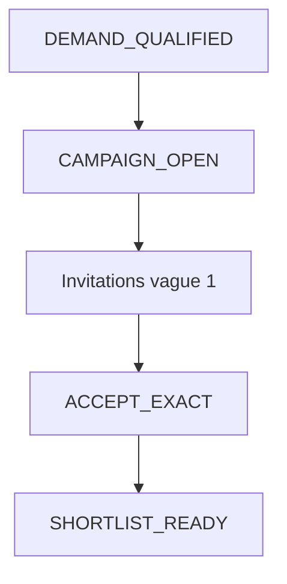

# Domain Storytelling MVP — Étape 2 : Apparier et distribuer

> **Document compagnon** du Domain Storytelling complet  
> Source complète : `domain-storytelling-etape-2.md`  
> Objectif : version démontrable (happy path), sans backend, sans auth, sans paiement.

---

## 0. Intention produit

À partir d’une demande qualifiée, montrer qu’on **invite** des capacités ouvertes et qu’on obtient des **réponses provisoires** (acceptation exacte) jusqu’à une shortlist prête pour l’offre ferme.

Valeur à montrer :

* la demande figée lance une campagne ;
* 2–3 coiffeuses reçoivent une invitation ;
* elles acceptent → shortlist / `RESPONSES_TO_CONVERT`.

Pas de proposition ferme, pas de réservation, pas de paiement.

---

## 1. Principes MVP

| Principe | Application |
| -------- | ----------- |
| Happy path only | Vague 1 + accept exact → shortlist |
| Pas de règles d’autorisation | Toggle de rôle mock |
| Pas de backend | Mock + `localStorage` |
| Pas d’auth / paiement | Profils préchargés |
| Cycles de vie respectés | Campagne + invitations simplifiées |
| Moins de règles, max de valeur | Auto-sélection du vivier |
| Écrans Stitch MVP | S01–S06 générés (`prompts-stitch-mvp.md`) |

---

## 2. Précondition mockée

* `DEMAND_QUALIFIED` (seed étape 1 ou mock) ;
* 3–6 `CAPACITY_OPEN` (seed étape 0 ou mock) ;
* cadre pro soft-mocké si besoin d’affichage.

Pas d’opérateur décisionnaire : le vivier et la vague 1 sont **précalculés / auto**.

---

## 3. Périmètre du récit MVP

### Déclencheur

Une demande qualifiée est prête à être distribuée.

### Début

Campagne créée sur demande figée.

### Fin nominale

`SHORTLIST_READY` / `RESPONSES_TO_CONVERT` (seuil atteint, ex. 2 acceptations).

### Acteurs

* **Cliente** (voit lancement / shortlist) ;
* **Coiffeuse** (voit invitation, accepte) ;
* plateforme = automatismes locaux (pas d’opérateur humain).

---

## 4. Objets métier conservés (light)

| Objet | MVP |
| ----- | --- |
| Demande version figée | Lecture |
| Campagne | Mode « résultat », seuil 1–2, délai mock |
| Vivier éligible | Liste préfiltrée simple |
| Vague 1 | 2–3 invitations |
| Invitation | Liée capacité + demande |
| Réponse provisoire | **Acceptation exacte** seulement |
| Shortlist | Sortie pour étape 3 |

### Exclus

Élargissement, multi-vagues, accept+mod, info nécessaire, indisponible (sauf stub optionnel), scoring IA, `NO_ELIGIBLE`, `NO_RESPONSE`.

---

## 5. Cycle de vie MVP

```text
DEMAND_QUALIFIED
      ↓
CAMPAIGN_OPEN  (+ vivier mock)
      ↓
WAVE_1 invitations
      ↓
ACCEPT_EXACT (×N)
      ↓
SHORTLIST_READY / RESPONSES_TO_CONVERT
```

Invitation (light) : créée → envoyée → répondue.

---

## 6. Happy path — récit nominal (6 temps)

### T0 — Entrée sur demande `DEMAND_QUALIFIED`

### T1 — Campagne créée (seuil = 2 réponses)

### T2 — Vivier éligible affiché (prérempli)

### T3 — Vague 1 : invitations vers 2–3 capacités

### T4 — Coiffeuse : voir invitation → **Accepter**

### T5 — Seuil atteint → shortlist → handoff étape 3

---

## 7. Vue d’ensemble MVP



---

## 8. Conditions minimales de fin

* demande qualifiée figée ;
* ≥ 1 invitation envoyée ;
* seuil d’acceptations exactes atteint (ex. ≥ 2, ou ≥ 1 en démo courte) ;
* campagne clôturée côté matching.

---

## 9. Données mock / localStorage

| Clé | Contenu |
| --- | ------- |
| `as.mvp.demands` | Demande qualified |
| `as.mvp.capacities` | Capacités OPEN |
| `as.mvp.campaigns` | Campagne + vague + invitations + réponses |
| `as.mvp.currentCampaignId` | Active |

Préremplir : 6 éligibles → invite 3 → 2 accept exact → stop.

Toggle rôle démo : Cliente | Coiffeuse (opérateur optionnel lecture seule, non décisionnaire).

---

## 10. Écrans — mapping Stitch MVP

Source prompts : `prompts-stitch-mvp.md` (S01–S06).

| # | Dossier | Prompt | Rôle MVP |
| - | ------- | ------ | -------- |
| E0 | `s01_accueil_explicatif_appariement/` | S01 | Accueil / orientation appariement |
| E1 | `matching_lanc/` | S02 | Matching lancé (vue cliente) |
| E2 | `campagne_vivier_s03/` | S03 | Campagne / vivier (auto-prerempli) |
| E3 | `s04_invitation_une_prestation_coiffeuse/` | S04 | Invitation à une prestation (coiffeuse) |
| E4 | `suivi_des_invitations/` | S05 | Suivi des réponses — vague 1 |
| E5 | `shortlist_pr_te/` | S06 | Shortlist READY + handoff étape 3 |

Design system : `atelier_synergy/DESIGN.md`. Assets photo Stitch conservés à côté des écrans.

Hors parcours (non générés) : élargissement, vague 2+, accept+mod, info nécessaire, décisions opérateur.

---

## 11. Ce qu’on coupe

| Zone complète | MVP |
| ------------- | --- |
| Opérateur pilote | Auto |
| Vague 2+, expiration réelle | Reporté |
| Élargissement | Hors parcours |
| Accept+mod / info needed | Reporté |

---

## 12. Critère de succès démo

On peut montrer :

> « Ta demande a été envoyée à 3 coiffeuses ; 2 ont accepté — on peut passer aux offres fermes. »

---

## 13. Frontières

| Étape | Lien |
| ----- | ---- |
| Amont 1 | `DEMAND_QUALIFIED` |
| Amont 0 | `CAPACITY_OPEN` dans le vivier |
| Aval 3 | Consomme les acceptations provisoires |
| Galerie | Affichage seulement, pas filtre d’éligibilité |

---

## 14. Résultat fonctionnel MVP

> **Une campagne MVP invite des capacités ouvertes, collecte des acceptations exactes, et produit une shortlist locale — sans offre ferme ni réservation.**
