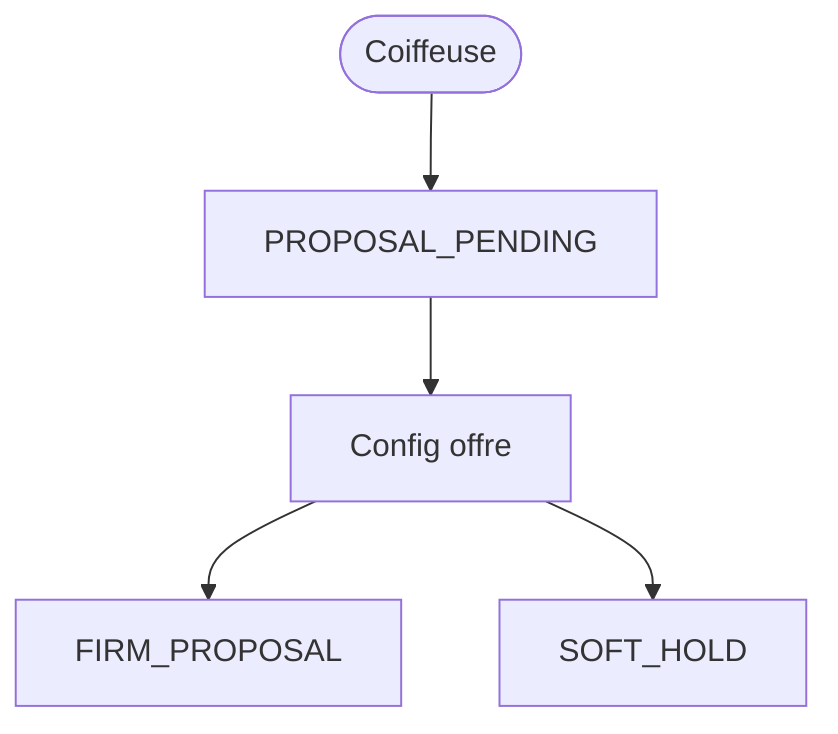

# Domain Storytelling MVP — Étape 3 : Valider la faisabilité → proposition ferme

> **Document compagnon** du Domain Storytelling complet  
> Source complète : `domain-storytelling-etape-3.md`  
> Objectif : version démontrable (happy path), sans backend, sans auth, sans paiement.

---

## 0. Intention produit

La **coiffeuse** transforme une réponse provisoire en **offre ferme** (`FIRM_PROPOSAL`) avec créneau en `SOFT_HOLD`, que la cliente pourra accepter plus tard.

Valeur à montrer :

* elle voit le besoin figé ;
* elle confirme « faisable exactement » ;
* elle fixe prix, créneau, lieu, tâches ;
* elle publie une offre datée.

Pas de précision multi-tours, pas de refus, pas de paiement.

---

## 1. Principes MVP

| Principe | Application |
| -------- | ----------- |
| Happy path only | `PROPOSAL_PENDING` → `FIRM_PROPOSAL` |
| Pas de règles d’autorisation | Coiffeuse mockée |
| Pas de backend | Mock + `localStorage` |
| Pas d’auth / paiement | Identités préchargées |
| Cycles de vie respectés | + `SOFT_HOLD` |
| Moins de règles, max de valeur | Une seule proposition |
| Écrans Stitch MVP | S01–S07 générés (`prompts-stitch-mvp.md`) |

---

## 2. Précondition mockée

* demande versionnée (étape 1) ;
* acceptation provisoire (étape 2) ;
* `CAPACITY_OPEN` héritée (étape 0) ;
* dossier `PROPOSAL_PENDING` seedé.

Une seule proposition concurrente en démo.

---

## 3. Périmètre du récit MVP

### Déclencheur

La coiffeuse a accepté une invitation et doit formaliser son offre.

### Début

`PROPOSAL_PENDING`

### Fin nominale

`FIRM_PROPOSAL` + `SOFT_HOLD` actif.

### Acteur décisionnaire

**Coiffeuse**.

Cliente = lecture de l’offre publiée (écran manquant à produire).

---

## 4. Objets métier conservés (light)

| Objet | MVP |
| ----- | --- |
| Demande versionnée | Lecture |
| Dossier proposition | Pending → Firm |
| Décision faisabilité | Exacte (variante light optionnelle) |
| Offre ferme | Prix, durée, créneau, lieu, tâches, conditions |
| `SOFT_HOLD` | Créneau réservé temporairement |
| Galerie | Lecture pour illustrer |

### Exclus

Demande de précision, refus, expiration, `NOT_SELECTED`, multi-SOFT_HOLD, opérateur, IA diagnostic.

---

## 5. Cycle de vie MVP

```text
PROPOSAL_PENDING
      ↓
FIRM_PROPOSAL  (+ SOFT_HOLD)
```

Créneau : Disponible → `SOFT_HOLD`.

---

## 6. Happy path — récit nominal (6 temps)

### T0 — Entrée dossier `PROPOSAL_PENDING`

### T1 — Synthèse décisionnelle (besoin, budget, contraintes)

### T2 — Décision : faisable exactement

### T3 — Configurer l’offre (prix, durée, créneau, lieu, tâches)

### T4 — Récap + confirmation + création `SOFT_HOLD`

### T5 — Publier `FIRM_PROPOSAL` + succès

---

## 7. Vue d’ensemble MVP



---

## 8. Conditions minimales de `FIRM_PROPOSAL`

* décision faisable ;
* prix total > 0 ;
* durée + créneau ;
* lieu ;
* tâches / fournitures renseignées (préremplies OK) ;
* confirmation explicite ;
* `SOFT_HOLD` créé.

---

## 9. Données mock / localStorage

| Clé | Contenu |
| --- | ------- |
| `as.mvp.demands` | Demande figée |
| `as.mvp.capacities` | Capacité source |
| `as.mvp.campaigns` | Accept provisoire |
| `as.mvp.proposals` | Pending → Firm |
| `as.mvp.softHolds` | Hold + échéance mock |

---

## 10. Écrans — mapping Stitch MVP

Source prompts : `prompts-stitch-mvp.md` (S01–S07).

| # | Dossier | Prompt | Rôle MVP |
| - | ------- | ------ | -------- |
| E0 | `accueil_explicatif_proposition_ferme/` | S01 | Accueil / orientation `PROPOSAL_PENDING` |
| E1 | `synth_se_d_cisionnelle/` | S02 | Synthèse décisionnelle (demande figée) |
| E2 | `d_cision_de_faisabilit/` | S03 | Décision faisabilité explicite |
| E3 | `configuration_de_l_offre_ferme/` | S04 | Configuration de l’offre ferme |
| E4 | `r_capitulatif_publier_proposition_ferme/` | S05 | Récapitulatif + Publier (`SOFT_HOLD`) |
| E5 | `offre_ferme_publi_e_succ_s/` | S06 | Succès `FIRM_PROPOSAL` + `SOFT_HOLD` |
| E6 | `offre_re_ue_vue_cliente/` | S07 | Vue cliente « Offre reçue » (lecture) |

Design system : `atelier_synergy/DESIGN.md`.

Hors parcours (non générés) : demander une précision, refus / non faisable, expiration.

---

## 11. Ce qu’on coupe

Précisions, refus, expiration, non-sélection, contrôles lourds, messagerie libre.

---

## 12. Critère de succès démo

La coiffeuse peut dire :

> « J’ai publié une offre ferme avec prix et créneau réservé. »

---

## 13. Frontières

| Étape | Lien |
| ----- | ---- |
| Amont 2 | Acceptation provisoire |
| Aval 4 | Consomme `FIRM_PROPOSAL` + `SOFT_HOLD` |

---

## 14. Résultat fonctionnel MVP

> **Une proposition MVP est une offre ferme locale, complète et datée, avec soft-hold, sans négociation ni paiement.**
