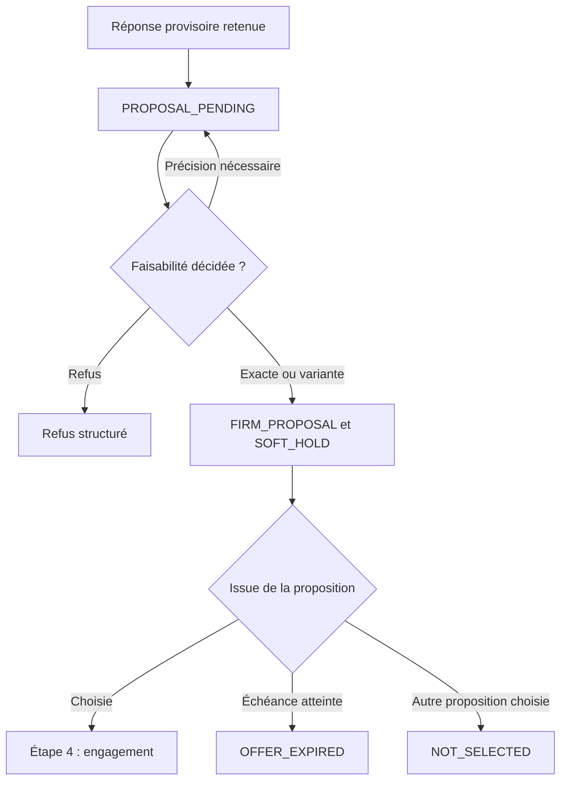

# Domain Storytelling — Étape 3 : Valider la faisabilité et produire une proposition ferme

## 1. Périmètre du récit

### Décision métier

> **Une coiffeuse accepte-t-elle de s’engager sur cette demande exacte, dans des conditions suffisamment précises pour que la cliente puisse ensuite décider et payer sans nouvelle négociation ?**

Cette étape transforme :

> une réponse provisoire issue du matching

en :

> une proposition professionnelle ferme, complète, versionnée et valable jusqu’à une échéance déterminée.

### Point de départ

L’étape commence lorsqu’une coiffeuse a répondu provisoirement à une invitation de l’étape 2 :

* acceptation exacte ;
* acceptation sous réserve d’une vérification ;
* acceptation avec modification ;
* information supplémentaire nécessaire.

Cette réponse indique un intérêt, mais ne garantit encore ni :

* la faisabilité technique ;
* le prix final ;
* la durée ;
* le créneau ;
* le lieu ;
* les fournitures ;
* la répartition des tâches.

### Point d’arrivée

L’étape se termine par l’un des résultats suivants :

* une `FIRM_PROPOSAL` associée à un `SOFT_HOLD` ;
* un refus de faisabilité motivé ;
* une proposition expirée : `OFFER_EXPIRED` ;
* une proposition clôturée parce qu’une autre a été retenue : `NOT_SELECTED`.

### Hors du périmètre

Cette étape ne comprend pas encore :

* la sélection définitive par la cliente ;
* l’acceptation contractuelle ;
* le paiement ;
* la réservation définitive ;
* l’envoi des consignes opérationnelles finales ;
* la confirmation `COMMITTED`.

Ces actions appartiennent à l’étape 4.

---

## 2. Acteurs et objets de travail

### Acteurs

| Acteur                  | Responsabilité                                                                               |
| ----------------------- | -------------------------------------------------------------------------------------------- |
| **Coiffeuse**           | Vérifie la faisabilité et assume les conditions de la proposition                            |
| **Cliente**             | Fournit uniquement les précisions indispensables à la décision                               |
| **Plateforme**          | Présente la demande, structure la proposition, contrôle sa complétude et gère son expiration |
| **Opérateur**           | Accompagne manuellement la qualification et la formalisation pendant le pilote               |
| **Gestion de capacité** | Vérifie et immobilise temporairement le créneau proposé                                      |

L’opérateur peut assister la coiffeuse, mais il ne peut pas valider la faisabilité technique à sa place.

### Objets métier

| Objet                         | Rôle                                                                     |
| ----------------------------- | ------------------------------------------------------------------------ |
| **Demande qualifiée**         | Besoin exprimé et validé par la cliente                                  |
| **Version de la demande**     | Photographie exacte de la demande examinée par la coiffeuse              |
| **Réponse provisoire**        | Intention produite à l’étape 2                                           |
| **Dossier de proposition**    | Espace de travail en `PROPOSAL_PENDING`                                  |
| **Demande de précision**      | Question ciblée nécessaire à la décision                                 |
| **Réponse de précision**      | Information complémentaire fournie par la cliente                        |
| **Validation de faisabilité** | Décision technique et opérationnelle de la coiffeuse                     |
| **Variante proposée**         | Configuration différente de la demande initiale                          |
| **Motif de refus**            | Explication structurée d’une impossibilité                               |
| **Proposition ferme**         | Offre complète que la cliente peut sélectionner                          |
| **Version de proposition**    | Version immuable des conditions proposées                                |
| **Immobilisation temporaire** | `SOFT_HOLD` protégeant le créneau pendant la validité de l’offre         |
| **Échéance de validité**      | Date et heure après lesquelles la proposition ne peut plus être acceptée |
| **Journal de décision**       | Historique des précisions, validations, modifications et clôtures        |
| **Galerie de prestation**     | Support visuel (`SERVICE_GALLERY`) pour expliquer un résultat, une variante ou une adaptation ; distincte d’une galerie générale |

---

## 3. Vue d’ensemble du Domain Story



La proposition et le créneau ont deux cycles de vie distincts :

* `FIRM_PROPOSAL` est l’offre commerciale et opérationnelle ;
* `SOFT_HOLD` est l’immobilisation temporaire de la capacité correspondante.

`SOFT_HOLD` n’est donc pas un état de la proposition, mais un objet qui lui est associé.

---

# 4. Récit métier nominal détaillé

## Phase A — Ouvrir le dossier de proposition

### 1. La plateforme retient une réponse provisoire

La plateforme reçoit de l’étape 2 :

* la demande qualifiée ;
* la campagne de matching ;
* l’invitation adressée à la coiffeuse ;
* la capacité professionnelle concernée ;
* la réponse provisoire de la coiffeuse.

Une simple invitation sans réponse positive ne permet pas d’ouvrir une proposition.

### 2. La plateforme crée un dossier `PROPOSAL_PENDING`

Le dossier est associé à :

* une seule coiffeuse ;
* une seule capacité professionnelle ;
* une seule demande ;
* une version précise de cette demande.

Plusieurs coiffeuses peuvent avoir simultanément leur propre dossier `PROPOSAL_PENDING` pour la même demande.

### 3. La plateforme fige une version de la demande

La coiffeuse ne doit pas valider une demande susceptible d’être modifiée silencieusement.

La version examinée contient notamment :

* le résultat recherché ;
* les inspirations ;
* les contraintes obligatoires ;
* les préférences ;
* les flexibilités autorisées ;
* les informations capillaires utiles ;
* la date, l’heure limite et l’échéance ;
* le lieu et la mobilité ;
* le budget ;
* le niveau de service ;
* les tâches acceptées par la cliente ;
* les fournitures déjà disponibles.

Toute modification significative ultérieure devra produire une nouvelle version.

---

## Phase B — Vérifier si la coiffeuse peut décider

### 4. La plateforme présente une synthèse décisionnelle

La coiffeuse reçoit une fiche courte lui permettant d’identifier immédiatement :

* ce que la cliente souhaite ;
* ce qui est impératif ;
* ce qui reste flexible ;
* les points potentiellement incompatibles ;
* les informations encore incertaines ;
* le créneau et le lieu envisagés ;
* le budget maximal autorisé.

Elle peut consulter les détails et les pièces utiles sans relire l’ensemble du questionnaire.

### 5. La coiffeuse vérifie la faisabilité technique

Elle vérifie notamment :

* sa maîtrise de la prestation ;
* la compatibilité avec la situation capillaire déclarée ;
* la possibilité d’obtenir le résultat demandé ;
* les limites de confort ou de sécurité ;
* les fournitures et le matériel nécessaires ;
* les tâches de préparation requises.

Elle peut s’appuyer sur la **galerie de la prestation** (`SERVICE_GALLERY`), éventuellement filtrée selon les variantes de la capacité concernée, pour :

* confirmer qu’elle maîtrise un résultat proche ;
* proposer une variante déjà réalisée ;
* expliquer une adaptation ;
* montrer un résultat réaliste ;
* réduire l’écart entre l’inspiration cliente et la prestation proposée.

Lorsqu’elle cite un contenu de galerie dans sa proposition, la plateforme doit afficher le type du contenu (`VERIFIED_REALIZATION`, `DECLARED_REALIZATION` ou `REFERENCE_INSPIRATION`). Une inspiration (`REFERENCE_INSPIRATION`) ne peut jamais être formulée comme « j’ai réalisé ». Si une variante est proposée, la coiffeuse privilégie, lorsqu’il existe, un contenu déjà associé à cette variante.

La galerie ne constitue pas une garantie de reproduction exacte. Le résultat dépend notamment de l’état initial, de la longueur, de la densité, des matériaux, de la technique retenue, de la répartition des tâches et des adaptations acceptées.

Cette validation reste professionnelle. La plateforme ne réalise pas de diagnostic médical ou dermatologique.

### 6. La coiffeuse vérifie la faisabilité opérationnelle

Elle contrôle :

* sa disponibilité réelle ;
* la durée nécessaire ;
* la marge disponible autour du rendez-vous ;
* le lieu ;
* le déplacement éventuel ;
* la disponibilité du matériel ;
* la compatibilité avec son volume de travail ;
* ses conditions et limites de service.

### 7. La coiffeuse détermine si les informations sont suffisantes

Trois situations sont possibles :

1. la demande peut être acceptée exactement ;
2. la demande est réalisable avec une variante ;
3. la coiffeuse ne peut pas encore décider faute d’une information indispensable.

---

## Phase C — Obtenir une précision ciblée si nécessaire

### 8. La coiffeuse formule une demande de précision

La question doit préciser :

* l’information manquante ;
* la raison pour laquelle elle est nécessaire ;
* ce qu’elle peut modifier : faisabilité, résultat, prix, durée, fournitures ou préparation ;
* le délai laissé à la cliente pour répondre.

Exemples :

* demander une photo plus récente ;
* confirmer la longueur actuelle des cheveux ;
* préciser si les cheveux sont déjà défrisés ou colorés ;
* choisir entre deux types de mèches ;
* confirmer la possibilité de se déplacer ;
* préciser l’état de préparation attendu.

La précision ne doit pas devenir une messagerie libre ni recommencer la qualification complète.

### 9. La plateforme transmet la question à la cliente

La plateforme :

* informe la cliente que la proposition ne peut pas encore être finalisée ;
* affiche la question et son motif ;
* indique l’échéance ;
* conserve le dossier en `PROPOSAL_PENDING`.

Aucun créneau ne doit être immobilisé durablement pendant une discussion indéterminée.

### 10. La cliente fournit la précision

La réponse est :

* ajoutée au dossier ;
* horodatée ;
* attribuée à la cliente ;
* transmise à la coiffeuse ;
* intégrée à une nouvelle version de la demande si elle modifie une condition importante.

La coiffeuse reprend ensuite la validation.

---

## Phase D — Produire la décision de faisabilité

### 11. La coiffeuse enregistre sa décision

Elle choisit parmi trois décisions.

#### Faisable exactement

La coiffeuse peut respecter la demande telle qu’elle a été exprimée.

#### Faisable avec une variante

La coiffeuse peut répondre au besoin, mais en modifiant un ou plusieurs éléments :

* technique ;
* longueur ;
* taille ;
* résultat ;
* horaire ;
* lieu ;
* durée ;
* prix ;
* fournitures ;
* tâches de préparation.

#### Non faisable

La coiffeuse ne peut pas produire de proposition compatible.

### 12. La coiffeuse motive un éventuel refus

Les motifs doivent être structurés :

* incompatibilité technique ;
* situation capillaire non prise en charge ;
* risque de confort ou de sécurité ;
* résultat non réalisable ;
* information insuffisante malgré la précision ;
* créneau indisponible ;
* durée incompatible ;
* lieu ou zone non couverte ;
* matériel ou fournitures indisponibles ;
* budget incompatible ;
* service hors des limites de la capacité ouverte ;
* autre motif expliqué.

Le refus :

* clôt le dossier sans produire de proposition ferme ;
* n’immobilise aucun créneau ;
* est transmis à la campagne de matching ;
* peut déclencher la sollicitation d’une autre coiffeuse ;
* alimente l’amélioration des capacités et questionnaires.

Un refus justifié ne doit pas automatiquement pénaliser la coiffeuse.

---

## Phase E — Construire la proposition

### 13. La coiffeuse confirme le résultat proposé

Pour une acceptation exacte, elle confirme la configuration demandée.

Pour une variante, elle définit explicitement :

* ce qui est conservé ;
* ce qui change ;
* la raison du changement ;
* l’incidence sur le résultat ;
* l’incidence sur le prix ;
* l’incidence sur la durée ;
* l’incidence sur la préparation.

La variante ne modifie jamais silencieusement la demande d’origine.

Elle devient une proposition alternative que la cliente pourra accepter ou refuser à l’étape 4.

### 14. La coiffeuse confirme le prix

La proposition précise :

* le prix de la prestation ;
* les options ;
* les suppléments ;
* les frais de déplacement ;
* les fournitures incluses ;
* les fournitures non incluses ;
* le prix total ;
* les éventuelles règles de calcul restantes.

Une simple mention « à partir de » ne suffit pas pour produire une proposition ferme.

Si un supplément reste possible, son déclencheur et son montant doivent être définis à l’avance. Si le prix dépend encore d’une information inconnue, la proposition reste `PROPOSAL_PENDING`.

### 15. La coiffeuse confirme la durée et le créneau

Elle indique :

* la date ;
* l’heure de début ;
* la durée prévue ;
* l’heure de fin estimée ;
* la marge ou tolérance éventuelle.

Le créneau doit disposer d’une durée suffisante au regard de la prestation proposée.

### 16. La coiffeuse confirme le lieu

La proposition précise :

* le mode de réalisation : salon, chez la coiffeuse ou chez la cliente ;
* la commune ou la zone ;
* les frais de déplacement ;
* les contraintes d’accès connues.

L’adresse complète peut rester masquée jusqu’à l’engagement, mais le lieu opérationnel doit déjà être déterminé.

### 17. La coiffeuse confirme les fournitures et les tâches

Chaque élément doit avoir un responsable visible.

| Élément             | Responsable possible |
| ------------------- | -------------------- |
| Mèches              | Cliente ou coiffeuse |
| Produits            | Cliente ou coiffeuse |
| Lavage              | Cliente ou coiffeuse |
| Démêlage            | Cliente ou coiffeuse |
| Étirement           | Cliente ou coiffeuse |
| Accessoires         | Cliente ou coiffeuse |
| Préparation du lieu | Cliente ou coiffeuse |

Une tâche ne peut pas être laissée sans responsable.

### 18. La coiffeuse ajoute les conditions spécifiques

Ces conditions peuvent concerner :

* l’état de préparation requis ;
* les accompagnants ;
* les modalités d’accès ;
* les limites liées aux cheveux ;
* une fourniture précise ;
* une contrainte horaire ;
* une condition nécessaire au maintien du prix.

Elles ne peuvent pas contredire les politiques générales de la plateforme.

---

## Phase F — Contrôler et publier la proposition

### 19. La plateforme contrôle la proposition

Avant publication, elle vérifie :

* la présence de tous les champs obligatoires ;
* la cohérence entre la prestation, le prix et la durée ;
* la compatibilité avec la capacité ouverte ;
* la compatibilité avec le budget et les flexibilités autorisées ;
* l’absence de supplément indéterminé ;
* la disponibilité du créneau ;
* la visibilité des différences en cas de variante ;
* la présence d’une échéance.

Une proposition incohérente est renvoyée à la coiffeuse et reste `PROPOSAL_PENDING`.

### 20. La coiffeuse confirme la version finale

La coiffeuse valide explicitement :

> « Je peux réaliser cette proposition dans les conditions affichées jusqu’à l’échéance indiquée. »

Cette confirmation :

* engage la responsabilité professionnelle de la coiffeuse sur l’exactitude de la proposition ;
* interdit les modifications silencieuses ;
* ne constitue pas encore l’engagement bilatéral de l’étape 4.

### 21. La plateforme immobilise temporairement le créneau

La gestion de capacité crée un `SOFT_HOLD` lié à :

* la coiffeuse ;
* la proposition ;
* la date et l’heure ;
* la durée ;
* l’échéance.

Le créneau n’est pas définitivement réservé, mais il ne doit pas être promis simultanément au-delà de la capacité disponible.

### 22. La plateforme publie la `FIRM_PROPOSAL`

La proposition devient :

* complète ;
* versionnée ;
* non modifiable ;
* consultable par la cliente ;
* valable jusqu’à une date et une heure précises ;
* associée à un `SOFT_HOLD`.

Toute modification ultérieure nécessite une nouvelle version, une nouvelle confirmation professionnelle et, si nécessaire, un nouveau `SOFT_HOLD`.

---

## Phase G — Gérer l’issue de la proposition

### 23. La cliente reçoit la proposition ferme

Elle peut comprendre :

* ce qui lui est proposé ;
* les éventuels écarts par rapport à sa demande ;
* le prix total ;
* la durée ;
* le créneau ;
* le lieu ;
* les fournitures ;
* ses responsabilités ;
* les conditions spécifiques ;
* l’échéance.

Elle ne paie et ne s’engage pas encore dans cette étape.

### 24. La proposition est transmise à l’étape 4 si elle est sélectionnée

Si la cliente choisit cette proposition avant son expiration :

* la version exacte est transmise à l’étape 4 ;
* le `SOFT_HOLD` est conservé pendant la formation de l’engagement ;
* les autres propositions deviennent `NOT_SELECTED` ;
* leurs immobilisations sont libérées.

### 25. La plateforme expire une proposition non sélectionnée à temps

À l’échéance :

* la proposition devient `OFFER_EXPIRED` ;
* elle ne peut plus être acceptée ;
* le `SOFT_HOLD` est libéré ;
* la capacité redevient disponible.

Une proposition expirée doit être réémise et revérifiée pour redevenir sélectionnable.

---

# 5. Cycle de vie des objets

## Cycle de vie de la proposition

```text
PROPOSAL_PENDING
    → FIRM_PROPOSAL
        → transmise à l’étape 4 si sélectionnée
        → OFFER_EXPIRED
        → NOT_SELECTED
```

Le refus de faisabilité clôt un dossier `PROPOSAL_PENDING` sans produire de `FIRM_PROPOSAL`.

Il reste à décider si cette clôture doit recevoir un état technique propre, par exemple `FEASIBILITY_REFUSED`, ou seulement être représentée par un événement et un motif.

## Cycle de vie du créneau

```text
Disponible
    → SOFT_HOLD
        → transféré vers l’engagement
        → libéré après expiration
        → libéré si non sélectionné
```

Le `SOFT_HOLD` doit expirer au même moment que la proposition, ou après elle. Une proposition ne peut pas rester ferme alors que son créneau n’est plus protégé.

---

# 6. Conditions exactes de `FIRM_PROPOSAL`

Une proposition ne peut devenir ferme que si toutes les conditions suivantes sont satisfaites :

* la coiffeuse est identifiée ;
* la capacité professionnelle utilisée est encore ouverte ;
* la version exacte de la demande est conservée ;
* la faisabilité technique est explicitement validée ;
* la prestation ou variante est déterminée ;
* les écarts avec la demande sont visibles ;
* le prix total est déterminé ou calculable sans négociation ;
* les suppléments et leurs déclencheurs sont connus ;
* la durée est confirmée ;
* le créneau est précis et disponible ;
* le lieu ou le mode de réalisation est confirmé ;
* les fournitures sont réparties ;
* chaque tâche a un responsable ;
* les conditions spécifiques sont affichées ;
* la date d’expiration est définie ;
* la coiffeuse a validé cette version ;
* un `SOFT_HOLD` protège le créneau ;
* aucun paiement n’a encore été encaissé au titre de l’engagement.

La sortie fonctionnelle peut ainsi être résumée par :

> **Une coiffeuse + une demande versionnée + une prestation ou variante + un prix + une durée + un créneau + un lieu + une répartition des tâches + des conditions + une échéance + un créneau temporairement protégé.**

---

# 7. Règles métier structurantes

1. **Une réponse provisoire n’est pas une proposition ferme.**

2. **Seule la coiffeuse peut valider la faisabilité technique.**

3. **La validation porte toujours sur une version exacte de la demande.**

4. **Une modification importante de la demande invalide la proposition en préparation.**

5. **Une précision doit être nécessaire à une décision métier identifiable.**

6. **Une variante crée une alternative ; elle ne remplace pas silencieusement la demande initiale.**

7. **La cliente n’est pas considérée comme ayant accepté une variante avant l’étape 4.**

8. **Une proposition ferme ne peut pas contenir de prix volontairement indéterminé.**

9. **Tout supplément doit avoir un déclencheur, un mode de calcul et un responsable.**

10. **Chaque fourniture et chaque tâche doivent avoir un responsable visible.**

11. **Une proposition ferme doit être associée à un créneau réellement disponible.**

12. **Un `SOFT_HOLD` ne constitue pas une réservation définitive.**

13. **Une proposition ne peut pas rester active après la libération de son `SOFT_HOLD`.**

14. **La publication rend la version de la proposition immuable.**

15. **Une modification crée une nouvelle version et exige une nouvelle validation.**

16. **Une proposition expirée ou non retenue ne peut plus être acceptée.**

17. **La clôture d’une proposition libère immédiatement la capacité immobilisée.**

18. **Le refus doit être motivé, mais les notes internes sensibles ne sont pas nécessairement communiquées intégralement à la cliente.**

19. **La publication signifie que la coiffeuse est prête à respecter les conditions si la cliente sélectionne la proposition dans le délai et accomplit l’étape 4.**

20. **Aucun paiement ni engagement bilatéral ne doit précéder la `FIRM_PROPOSAL`.**

21. **La galerie peut illustrer une variante ou une adaptation ; elle ne remplace jamais la validation de faisabilité.**

22. **Une inspiration cliente, une `REFERENCE_INSPIRATION`, une `DECLARED_REALIZATION` et une `VERIFIED_REALIZATION` ne constituent pas le même niveau de preuve, ni une promesse de reproduction exacte. La galerie n’établit ni l’éligibilité ni la faisabilité à elle seule.**

---

# 8. Pilotage manuel recommandé

Pendant le pilote, l’opérateur peut :

* vérifier la synthèse de la demande ;
* transmettre manuellement les demandes de précision ;
* aider la coiffeuse à formaliser le prix et la durée ;
* enregistrer les fournitures et la répartition des tâches ;
* contrôler la complétude de la proposition ;
* inscrire manuellement le `SOFT_HOLD` dans un calendrier simplifié ;
* envoyer la proposition à la cliente ;
* libérer les propositions expirées ou non retenues.

Même si l’opération est manuelle, le système doit enregistrer :

* la version de la demande examinée ;
* les questions posées ;
* les réponses obtenues ;
* la décision de faisabilité ;
* les conditions proposées ;
* la confirmation de la coiffeuse ;
* l’échéance ;
* l’état du créneau ;
* le motif de clôture.

### À reporter

* diagnostic capillaire automatisé ;
* analyse automatique des photos ;
* négociation conversationnelle par IA ;
* synchronisation avancée des agendas ;
* génération automatique des prix ;
* gestion automatisée des stocks ;
* optimisation algorithmique des `SOFT_HOLD` ;
* messagerie libre complète.

---

# 9. Décisions à arbitrer avant le backlog

| Décision                                  | Recommandation initiale                                                          |
| ----------------------------------------- | -------------------------------------------------------------------------------- |
| Nombre de demandes de précision           | Une séquence ciblée, puis intervention opérateur si la demande reste indécidable |
| Forme du prix ferme                       | Total exact ou formule objective connue ; pas de simple fourchette               |
| Durée de validité                         | Politique définie selon l’urgence et la proximité du rendez-vous                 |
| Durée du `SOFT_HOLD`                      | Alignée sur la validité de la proposition                                        |
| Nombre de propositions simultanées        | Limité pour ne pas immobiliser inutilement les capacités                         |
| Modification d’une proposition publiée    | Nouvelle version obligatoire                                                     |
| Retrait par la coiffeuse avant expiration | Exceptionnel, motivé et tracé comme événement de fiabilité                       |
| Adresse exacte                            | Peut rester masquée, mais le lieu opérationnel doit être ferme                   |
| Refus communiqué à la cliente             | Explication utile et respectueuse, distincte des notes internes                  |
| État d’un dossier refusé                  | Décider s’il faut ajouter un état explicite à la machine de proposition          |

---

# 10. Critères de réussite

L’étape fonctionne correctement si :

* la coiffeuse peut décider sans redemander tout le besoin ;
* les précisions restent limitées et ciblées ;
* une réponse provisoire ne peut pas être confondue avec une offre ;
* la cliente comprend immédiatement ce qui est proposé ;
* aucune variante n’est masquée ;
* le prix ne fait pas l’objet d’une renégociation après sélection ;
* aucun créneau n’est promis au-delà de la capacité disponible ;
* aucune proposition ne reste active indéfiniment ;
* les créneaux expirés ou non retenus sont libérés ;
* aucun paiement n’intervient avant la proposition ferme.

## Conclusion du Domain Story

> **La coiffeuse reçoit la version exacte d’une demande issue du matching. Elle vérifie sa faisabilité, demande si nécessaire une précision ciblée, puis confirme ou adapte la prestation, le prix, la durée, le créneau, le lieu, les fournitures, les tâches et les conditions. La plateforme contrôle l’ensemble, protège temporairement le créneau et publie une proposition ferme valable jusqu’à une échéance précise. La cliente peut alors passer à l’engagement sans devoir renégocier ce qui lui a été proposé.**
