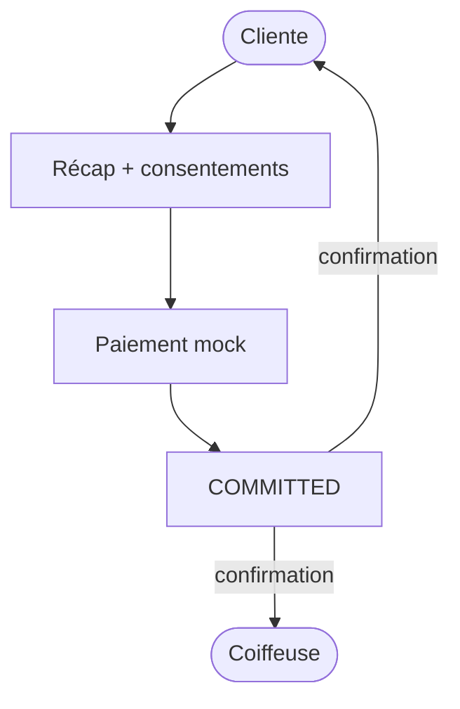

# Domain Storytelling MVP — Étape 4 : Former l’engagement

> **Document compagnon** du Domain Storytelling complet  
> Source complète : `domain-storytelling-etape-4.md`  
> Objectif : version démontrable (happy path), sans backend, sans auth, **paiement mock uniquement**.

---

## 0. Intention produit

La **cliente** accepte la même version de l’offre et des politiques, « paie » un acompte mock, et obtient un engagement `COMMITTED` avec créneau `BOOKED`.

Valeur à montrer :

* récap contractuel unique ;
* consentements versionnés ;
* paiement simulé ;
* confirmations cliente **et** coiffeuse.

Pas de PSP réel, pas de remboursement, pas de dispute.

---

## 1. Principes MVP

| Principe | Application |
| -------- | ----------- |
| Happy path only | Accept → pay mock → `COMMITTED` |
| Modèle A | Engagement conditionné au paiement mock |
| Pas de backend | Mock + `localStorage` |
| Pas d’auth | Profils préchargés |
| Paiement | Bouton « Simuler succès » |
| Écrans Stitch MVP | S01–S06 générés (`prompts-stitch-mvp.md`) |

---

## 2. Précondition mockée

* `FIRM_PROPOSAL` active ;
* `SOFT_HOLD` valide ;
* politiques annulation/retard versionnées (statique).

---

## 3. Périmètre du récit MVP

### Déclencheur

La cliente a reçu une offre ferme et veut s’engager.

### Début

`AWAITING_CLIENT_ACCEPTANCE` (engagement draft implicite OK).

### Fin nominale

`COMMITTED` + créneau `BOOKED` + paiement initial `SUCCEEDED` (mock).

### Acteurs

**Cliente** (décide) ; **Coiffeuse** (reçoit confirmation, sans re-validation).

---

## 4. Objets métier conservés (light)

| Objet | MVP |
| ----- | --- |
| Proposition ferme | Lecture versionnée |
| Engagement | Draft → Committed |
| Politiques acceptées | 1–2 versions mock |
| Consentements | Cases + horodatage local |
| Paiement initial | Montant + statut mock |
| Preuve contractuelle | JSON local |
| Créneau | `SOFT_HOLD` → `BOOKED` |

### Exclus

PSP, remboursements, disputes, wallet, split payment, échecs paiement, expirations.

---

## 5. Cycle de vie MVP

```text
AWAITING_CLIENT_ACCEPTANCE
      ↓
AWAITING_PAYMENT
      ↓
COMMITTED  (+ BOOKED, PAYMENT_SUCCEEDED)
```

Paiement mock : `CREATED` → `SUCCEEDED` en un clic.

---

## 6. Happy path — récit nominal (6 temps)

### T0 — Entrée sur `FIRM_PROPOSAL` + `SOFT_HOLD`

### T1 — Récapitulatif contractuel

### T2 — Consentements (offre + politiques)

### T3 — Paiement mock → succès

### T4 — Formation `COMMITTED` + `BOOKED`

### T5 — Confirmations cliente + coiffeuse

---

## 7. Vue d’ensemble MVP



---

## 8. Conditions minimales de `COMMITTED`

* offre ferme toujours affichée (même version) ;
* consentements cochés ;
* paiement mock réussi ;
* `SOFT_HOLD` transformé en `BOOKED` ;
* preuves locales écrites.

---

## 9. Données mock / localStorage

| Clé | Contenu |
| --- | ------- |
| `as.mvp.proposals` | Firme active |
| `as.mvp.policies` | Politiques versionnées |
| `as.mvp.engagements` | → `COMMITTED` |
| `as.mvp.payments` | Tentative `SUCCEEDED` |
| `as.mvp.softHolds` | → `BOOKED` |

---

## 10. Écrans — mapping Stitch MVP

Source prompts : `prompts-stitch-mvp.md` (S01–S06).

| # | Dossier | Prompt | Rôle MVP |
| - | ------- | ------ | -------- |
| E0 | `accepter_l_offre/` | S01 | Accueil / orientation `AWAITING_CLIENT_ACCEPTANCE` |
| E1 | `s02_r_capitulatif_contractuel/` | S02 | Récapitulatif contractuel |
| E2 | `consentements_politiques_versionn_s/` | S03 | Consentements politiques versionnés |
| E3 | `paiement_mock_atelier_synergy/` | S04 | Paiement mock isolé (`AWAITING_PAYMENT`) |
| E4 | `s05_confirmation_cliente_committed/` | S05 | Confirmation cliente `COMMITTED` |
| E5 | `s06_confirmation_coiffeuse_committed/` | S06 | Confirmation coiffeuse `COMMITTED` |

Design system : `atelier_synergy/DESIGN.md`. Assets photo Stitch conservés à côté des écrans.

---

## 11. Ce qu’on coupe

Branches 4A–4F (non-paiement, échec, expire, refund…), finance réelle, console opérateur.

---

## 12. Critère de succès démo

La cliente peut dire :

> « J’ai accepté l’offre, payé l’acompte (simulé), mon RDV est engagé. »

---

## 13. Frontières

| Étape | Lien |
| ----- | ---- |
| Amont 3 | `FIRM_PROPOSAL` + `SOFT_HOLD` |
| Aval 5 | Démarre sur `COMMITTED` |

---

## 14. Résultat fonctionnel MVP

> **Un engagement MVP est un accord bilatéral local, après acceptation et paiement simulé, avec créneau réservé définitivement.**
