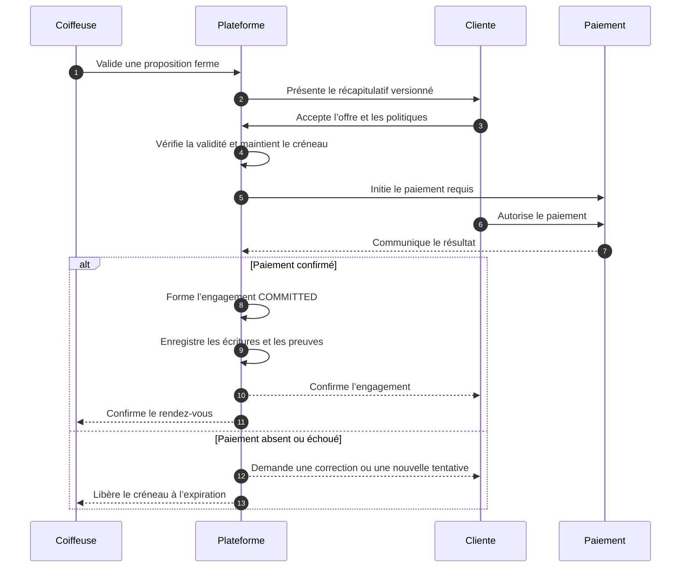

# Domain Storytelling — Étape 4

## Former l’engagement et sécuriser les finances

L’étape 4 transforme une **proposition ferme mais temporaire** en un **engagement bilatéral, traçable et financièrement sécurisé**.

Le principe central est le suivant :

> La cliente et la coiffeuse doivent être engagées sur la même version de la prestation, du prix, du créneau, des obligations et des politiques applicables.

Un paiement seul ne suffit pas à prouver l’accord. Inversement, un accord ne doit pas être considéré comme sécurisé si le paiement requis n’a pas abouti.

---

## 1. Périmètre du récit métier

### Point de départ

L’étape commence lorsqu’une coiffeuse a produit une proposition :

* complète ;
* validée professionnellement ;
* associée à un créneau temporairement immobilisé ;
* valable jusqu’à une échéance déterminée ;
* dans l’état `FIRM_PROPOSAL`.

La proposition contient notamment :

* la prestation exacte ;
* les éventuelles variantes ;
* le créneau ;
* le lieu ;
* la durée ;
* le prix ;
* les fournitures ;
* la répartition des tâches ;
* les conditions spécifiques ;
* les obligations de chaque partie.

### Point d’arrivée

L’étape se termine lorsque :

* les deux parties sont liées au même contenu ;
* les politiques applicables sont identifiées et acceptées ;
* le paiement initial requis est confirmé ;
* le créneau est définitivement réservé ;
* les preuves contractuelles et financières sont produites.

La sortie est :

`COMMITTED`

L’engagement peut alors entrer dans l’étape 5 : préparation opérationnelle du rendez-vous.

---

# 2. Acteurs du domaine

| Acteur                    | Responsabilité dans l’étape                                                                               |
| ------------------------- | --------------------------------------------------------------------------------------------------------- |
| Cliente                   | Choisit une proposition, vérifie son contenu, accepte les conditions et réalise le paiement requis        |
| Coiffeuse                 | S’est engagée sur le contenu de la proposition ferme et attend l’acceptation de la cliente                |
| Plateforme                | Présente, versionne et fige l’accord ; organise le paiement ; conserve les preuves ; gère les expirations |
| Prestataire de paiement   | Autorise, refuse, traite ou confirme la transaction                                                       |
| Opérateur support/finance | Traite les anomalies, remboursements, contestations et incohérences non automatisées                      |

### Hypothèse fonctionnelle importante

La validation de la proposition ferme à l’étape 3 représente l’accord de la coiffeuse sur son contenu.

La coiffeuse ne devrait donc pas avoir à confirmer une seconde fois après le paiement de la cliente. Sinon, le système recréerait précisément le problème que la refonte cherche à supprimer : une cliente paie, puis attend encore de savoir si la coiffeuse accepte.

Si une proposition est produite par un opérateur ou automatiquement, elle doit être explicitement validée par la coiffeuse avant d’être présentée comme `FIRM_PROPOSAL`.

---

# 3. Objets métier manipulés

## Proposition ferme

Contient ce que la coiffeuse accepte de réaliser.

Une fois présentée à la cliente, sa version ne peut plus être modifiée silencieusement.

## Engagement

Représente l’accord entre la cliente et la coiffeuse.

Il référence exactement :

* une version de proposition ;
* les deux parties ;
* les politiques applicables ;
* les consentements recueillis ;
* le paiement initial ;
* les preuves produites.

## Politique acceptée

Objet versionné contenant notamment :

* les règles de retard ;
* les règles d’annulation ;
* les règles de report ;
* les conséquences d’une absence ;
* les règles de remboursement ;
* les conditions relatives aux coûts préparatoires.

Une nouvelle version de politique ne modifie pas les engagements déjà formés.

## Paiement

Représente la tentative réelle de transfert de fonds :

* montant ;
* devise ;
* payeur ;
* bénéficiaire économique ;
* fonction du versement ;
* prestataire de paiement ;
* statut ;
* référence externe.

## Écriture financière

Représente l’inscription comptable interne liée à une opération financière.

Elle est distincte du paiement :

* le paiement indique ce qui s’est produit chez le prestataire ;
* l’écriture financière indique comment cette opération est enregistrée et affectée dans le système.

Une opération ne doit pas être supprimée en cas de remboursement. Une nouvelle écriture inverse ou corrige la précédente.

## Preuve contractuelle

Conserve la preuve de ce qui a été accepté :

* version exacte de l’offre ;
* version des politiques ;
* identité des parties ;
* date et heure des actions ;
* consentements ;
* référence du paiement ;
* événements ayant conduit à `COMMITTED`.

---

# 4. Récit nominal



## Déroulement détaillé

| Nº | Acteur      | Activité                                                               | Objet créé ou modifié  |
| -: | ----------- | ---------------------------------------------------------------------- | ---------------------- |
|  1 | Coiffeuse   | Valide la proposition exacte                                           | `FIRM_PROPOSAL`        |
|  2 | Plateforme  | Fige et versionne son contenu                                          | Version de proposition |
|  3 | Plateforme  | Maintient temporairement le créneau                                    | `SOFT_HOLD`            |
|  4 | Cliente     | Sélectionne la proposition qu’elle souhaite accepter                   | Sélection              |
|  5 | Plateforme  | Vérifie que la proposition et le créneau sont toujours valides         | Contrôle de validité   |
|  6 | Plateforme  | Présente le récapitulatif contractuel complet                          | Projet d’engagement    |
|  7 | Cliente     | Vérifie la prestation, le prix, le lieu, le créneau et ses obligations | Consultation tracée    |
|  8 | Cliente     | Accepte la version de l’offre et les politiques applicables            | Consentements          |
|  9 | Plateforme  | Enregistre les consentements et ouvre une fenêtre de paiement          | `AWAITING_PAYMENT`     |
| 10 | Plateforme  | Transmet l’ordre de paiement au prestataire                            | Ordre de paiement      |
| 11 | Cliente     | Autorise le versement initial                                          | Tentative de paiement  |
| 12 | Prestataire | Confirme, refuse ou maintient la transaction en traitement             | Statut du paiement     |
| 13 | Plateforme  | Vérifie la cohérence du montant et de la transaction                   | Paiement rapproché     |
| 14 | Plateforme  | Forme l’engagement                                                     | `COMMITTED`            |
| 15 | Plateforme  | Convertit l’immobilisation temporaire en réservation ferme             | Créneau réservé        |
| 16 | Plateforme  | Crée les écritures financières                                         | Écritures financières  |
| 17 | Plateforme  | Produit les preuves contractuelle et financière                        | Preuves                |
| 18 | Plateforme  | Transmet la même confirmation aux deux parties                         | Confirmation commune   |
| 19 | Plateforme  | Clôture les propositions concurrentes                                  | `NOT_SELECTED`         |
| 20 | Plateforme  | Déclenche la préparation du rendez-vous                                | `READINESS_PENDING`    |

---

# 5. Récapitulatif contractuel présenté à la cliente

Avant toute acceptation, la cliente doit voir un résumé unique et non ambigu.

## Identité de l’engagement

* identité de la coiffeuse ;
* identité de la cliente ;
* référence de la proposition ;
* date d’émission ;
* échéance d’acceptation.

## Prestation

* prestation exacte ;
* variantes retenues ;
* résultat attendu ;
* éléments inclus ;
* éléments exclus ;
* fournitures nécessaires ;
* personne responsable de chaque fourniture ;
* tâches attribuées à la cliente ;
* tâches attribuées à la coiffeuse.

## Rendez-vous

* date ;
* heure ;
* durée prévue ;
* marge éventuelle ;
* lieu ;
* modalités d’accès ;
* frais de déplacement.

## Prix

* prix total convenu ;
* suppléments déjà inclus ;
* coûts préparatoires autorisés ;
* versement initial ;
* solde prévisionnel ;
* moment et moyen de paiement du solde ;
* frais éventuels de la plateforme.

## Politiques

* retard de la cliente ;
* retard de la coiffeuse ;
* annulation par la cliente ;
* annulation par la coiffeuse ;
* report ;
* absence ;
* prestation rendue partiellement impossible ;
* remboursement et contestation.

## Niveau de protection

Si plusieurs niveaux de sécurisation existent, le récapitulatif doit préciser :

* la protection sélectionnée ;
* ce qu’elle couvre réellement ;
* ses exclusions ;
* son coût ;
* qui finance un éventuel remplacement ou remboursement.

Un simple badge « réservation protégée » sans définition contractuelle ne doit pas être utilisé.

---

# 6. Consentement aux conditions

L’acceptation doit porter sur des éléments précis et versionnés.

La plateforme doit pouvoir prouver que la cliente a accepté :

* la proposition `P-104`, version 3 ;
* la politique d’annulation, version 2 ;
* la politique de retard, version 1 ;
* les coûts préparatoires autorisés ;
* la fonction annoncée du paiement initial ;
* l’éventuel niveau de protection renforcée.

La coiffeuse doit également être rattachée aux mêmes versions, soit :

* lors de la validation de sa proposition ferme ;
* lors de l’ouverture de sa capacité pour les politiques standard ;
* ou par une acceptation spécifique lorsqu’une condition particulière s’applique.

### Règle

> Un consentement générique à des « conditions en vigueur » ne suffit pas si ces conditions peuvent changer sans que la version applicable à l’engagement soit conservée.

---

# 7. Formation de l’engagement

Le système doit distinguer trois événements :

1. la coiffeuse produit une proposition ferme ;
2. la cliente accepte cette proposition ;
3. le paiement initial requis aboutit.

Le moment exact où l’engagement juridique est formé reste une décision à valider.

## Modèle A — Engagement conditionné au paiement

* la cliente accepte la proposition ;
* son consentement est enregistré ;
* l’engagement reste `AWAITING_PAYMENT` ;
* il devient `COMMITTED` lorsque le paiement requis est confirmé ;
* en l’absence de paiement, la tentative expire.

## Modèle B — Engagement formé avant paiement

* le clic d’acceptation forme immédiatement l’engagement ;
* le paiement devient une obligation résultant de cet engagement ;
* un paiement non réalisé doit alors être traité comme une inexécution ou donner lieu à une résiliation.

Pour le fonctionnement du produit, le modèle A est généralement plus simple à orchestrer. Il ne doit cependant être retenu qu’après validation juridique du modèle contractuel.

---

# 8. Cycle de vie des objets

## Engagement

```text
ENGAGEMENT_DRAFT
→ AWAITING_CLIENT_ACCEPTANCE
→ AWAITING_PAYMENT
→ COMMITTED
```

Sorties alternatives :

* `ACCEPTANCE_EXPIRED`
* `PAYMENT_EXPIRED`
* `COMMITMENT_ABORTED`

## Paiement

```text
PAYMENT_CREATED
→ PAYMENT_REQUIRES_ACTION
→ PAYMENT_PROCESSING
→ PAYMENT_SUCCEEDED
```

Sorties alternatives :

* `PAYMENT_FAILED`
* `PAYMENT_CANCELLED`
* `PAYMENT_EXPIRED`
* `PAYMENT_REFUNDED`
* `PAYMENT_PARTIALLY_REFUNDED`
* `PAYMENT_DISPUTED`

## Créneau

```text
SOFT_HOLD
→ BOOKED
```

Sorties alternatives :

* `HOLD_RELEASED`
* `HOLD_EXPIRED`

Les machines d’état doivent rester séparées. Un paiement réussi, un créneau réservé et un engagement formé sont trois faits liés, mais différents.

---

# 9. Récits alternatifs

## Scénario 4A — La cliente ne paie pas avant l’échéance

1. La cliente accepte la proposition.
2. La plateforme ouvre une fenêtre de paiement.
3. Aucun paiement confirmé n’est reçu avant l’échéance.
4. L’acceptation financière expire.
5. Le créneau est libéré.
6. La coiffeuse est informée.
7. La cliente peut être invitée à rechercher une nouvelle proposition.
8. L’événement n’est pas assimilé automatiquement à une annulation d’un engagement si celui-ci n’était pas encore formé.

**Sortie :** `PAYMENT_EXPIRED`, pas de `COMMITTED`.

---

## Scénario 4B — Le paiement échoue

1. Le prestataire refuse la transaction.
2. La plateforme conserve temporairement le créneau jusqu’à l’échéance.
3. La cliente reçoit le motif exploitable : moyen refusé, authentification nécessaire ou erreur technique.
4. Elle peut recommencer avec un autre moyen de paiement.
5. Si aucun paiement n’aboutit, le créneau est libéré.

**Règle :** une tentative échouée ne doit produire ni preuve de paiement ni écriture indiquant que les fonds ont été encaissés.

---

## Scénario 4C — Le paiement reste incertain

1. Le prestataire indique `PROCESSING` ou ne répond pas.
2. La plateforme ne confirme pas prématurément l’engagement.
3. Elle maintient temporairement le créneau.
4. Elle interroge la source de paiement ou attend la notification définitive.
5. En cas d’incohérence persistante, un opérateur intervient.

**Règle :** la cliente ne doit pas être invitée à payer une seconde fois tant que la première tentative n’est pas réconciliée.

---

## Scénario 4D — La proposition expire pendant le paiement

1. La cliente commence son paiement avant l’échéance.
2. L’échéance de la proposition survient pendant l’authentification.
3. Une courte fenêtre de paiement peut maintenir le `SOFT_HOLD`.
4. Si le paiement arrive après la limite autorisée, la plateforme vérifie que le créneau est toujours disponible.
5. Si l’engagement ne peut plus être formé, le paiement est remboursé ou annulé selon le mécanisme disponible.

**Règle :** un paiement tardif ne doit jamais provoquer une double réservation.

---

## Scénario 4E — Une condition doit être modifiée

Après présentation du récapitulatif, la cliente ou la coiffeuse souhaite modifier :

* le créneau ;
* le prix ;
* le lieu ;
* la prestation ;
* une fourniture ;
* une obligation.

La version existante ne doit pas être éditée.

1. La proposition actuelle est clôturée ou remplacée.
2. Une nouvelle version est produite.
3. Les consentements précédents deviennent inapplicables à la nouvelle version.
4. La cliente accepte la nouvelle version.
5. Le paiement est recalculé si nécessaire.

**Sortie :** nouvelle `FIRM_PROPOSAL`, puis reprise du récit nominal.

---

## Scénario 4F — Remboursement ou contestation

1. La cliente ou la coiffeuse signale un problème financier.
2. La plateforme identifie le paiement et l’engagement concernés.
3. Elle collecte les faits et les preuves.
4. L’opérateur applique la politique acceptée.
5. Le remboursement, crédit ou rejet est enregistré.
6. Une nouvelle écriture financière est créée.
7. La transaction initiale reste conservée dans l’historique.

Selon sa cause, le dossier est envoyé vers la branche transversale de résolution.

---

# 10. Règles métier incontournables

1. Seule une proposition `FIRM_PROPOSAL` encore valide peut être acceptée.

2. Une proposition acceptée ne peut plus être modifiée silencieusement.

3. Les deux parties doivent être rattachées à la même version de proposition.

4. Chaque politique acceptée doit être versionnée.

5. Un paiement seul ne constitue pas la preuve complète du consentement.

6. `COMMITTED` ne peut être produit que lorsque toutes les conditions obligatoires sont satisfaites.

7. Un même créneau ne peut porter deux engagements actifs incompatibles.

8. Le `SOFT_HOLD` doit avoir une durée et une règle d’expiration explicites.

9. Un échec de paiement n’est pas automatiquement une annulation de la cliente.

10. La confirmation envoyée à la cliente et à la coiffeuse doit provenir du même engagement.

11. Une proposition non retenue doit être clôturée sans effacer son historique.

12. Les transactions et écritures financières ne doivent pas être supprimées : les corrections sont réalisées par de nouvelles écritures.

13. Les coûts préparatoires ne peuvent être opposés à la cliente que s’ils ont été explicitement présentés et acceptés.

14. Une protection renforcée ne peut être commercialisée que si son financement, ses conditions et ses limites sont définis.

15. Les traitements de paiement doivent être idempotents afin qu’une même confirmation ne débite pas deux fois la cliente.

---

# 11. Fonctionnalités par acteur

## Cliente

* consulter le récapitulatif contractuel ;
* identifier ce qui est inclus ou non ;
* consulter les obligations de chaque partie ;
* consulter les politiques applicables ;
* accepter la version exacte de la proposition ;
* accepter les politiques ;
* sélectionner un niveau de protection défini ;
* réaliser ou recommencer le paiement ;
* suivre son statut ;
* recevoir les preuves ;
* demander un remboursement ou contester une opération.

## Coiffeuse

* consulter la proposition en attente d’acceptation ;
* voir la durée restante du `SOFT_HOLD` ;
* recevoir la confirmation de l’engagement ;
* consulter le paiement initial et le solde attendu ;
* consulter les coûts préparatoires autorisés ;
* recevoir l’information de libération du créneau ;
* accéder à la preuve de l’accord ;
* signaler une anomalie.

## Opérateur

* retrouver un engagement à partir d’un paiement ;
* vérifier la version contractuelle acceptée ;
* rapprocher une transaction incertaine ;
* constater un double paiement ;
* déclencher ou enregistrer un remboursement ;
* traiter une contestation ;
* libérer exceptionnellement un créneau ;
* consulter l’historique complet ;
* documenter la décision prise.

---

# 12. Preuves à conserver

## Preuve de l’accord

* identifiants des parties ;
* proposition et version acceptées ;
* politiques et versions acceptées ;
* consentements recueillis ;
* date et heure ;
* canal utilisé ;
* référence de l’engagement.

## Preuve du paiement

* montant ;
* devise ;
* fonction annoncée du versement ;
* date ;
* statut ;
* référence du prestataire ;
* payeur ;
* bénéficiaire économique ;
* engagement concerné.

## Preuve des événements

* création de la proposition ;
* début et fin du `SOFT_HOLD` ;
* acceptation ;
* initiation du paiement ;
* résultat de la transaction ;
* formation de l’engagement ;
* envoi des confirmations ;
* remboursement ou contestation éventuels.

---

# 13. Critères de sortie vers `COMMITTED`

L’engagement peut entrer dans l’état `COMMITTED` uniquement si :

* la proposition est ferme et encore valide ;
* la version acceptée est connue ;
* le créneau est toujours disponible ;
* la coiffeuse est liée à cette version ;
* la cliente a accepté cette même version ;
* les politiques obligatoires sont acceptées ;
* les obligations des deux parties sont définies ;
* le paiement requis est confirmé ou déclaré non requis ;
* l’écriture financière correspondante est enregistrée ;
* la preuve contractuelle est produite ;
* le créneau est définitivement réservé ;
* les deux parties reçoivent une confirmation cohérente.

---

# 14. Décisions bloquantes avant développement

| Décision                                          | Pourquoi elle est bloquante                                                |
| ------------------------------------------------- | -------------------------------------------------------------------------- |
| Qui encaisse les fonds ?                          | Détermine le parcours de paiement, les responsabilités et le rapprochement |
| À qui les fonds sont-ils versés ?                 | Détermine les remboursements, commissions et risques de recouvrement       |
| Quelle est la fonction juridique du versement ?   | Modifie les effets d’une annulation ou d’une inexécution                   |
| Quand l’engagement est-il formé ?                 | Détermine la transition exacte vers `COMMITTED`                            |
| Quel montant est payé initialement ?              | Influence le risque supporté par chaque partie                             |
| Quand la coiffeuse reçoit-elle les fonds ?        | Influence la protection de la cliente et la trésorerie de la coiffeuse     |
| Quelle protection financière est promise ?        | Détermine ce que la plateforme doit effectivement pouvoir financer         |
| Qui finance un remplacement ou une compensation ? | Évite de promettre une protection sans mécanisme économique                |
| Qui supporte les contestations de paiement ?      | Détermine les responsabilités opérationnelles et financières               |
| Quels coûts préparatoires sont protégés ?         | Détermine les règles de preuve et de remboursement                         |

Ces décisions doivent être inscrites dans un registre formel avec :

* décision retenue ;
* hypothèse associée ;
* responsable de validation ;
* avis juridique ;
* avis financier ou comptable ;
* conséquences fonctionnelles.

---

# 15. Périmètre recommandé pour le pilote

## À construire

* proposition ferme versionnée ;
* récapitulatif contractuel ;
* politiques statiques versionnées ;
* consentement explicite ;
* `SOFT_HOLD` avec expiration ;
* un seul mécanisme de versement initial ;
* suivi du statut de paiement ;
* preuve du paiement ;
* preuve de l’accord ;
* transformation en `COMMITTED` ;
* confirmation commune ;
* clôture des propositions concurrentes ;
* console opérateur minimale ;
* journal des événements.

## À traiter manuellement

* remboursement exceptionnel ;
* contestation ;
* anomalie de paiement ;
* compensation ;
* décision sur les coûts préparatoires ;
* rapprochement financier complexe ;
* remplacement financé par la plateforme.

## À reporter

* portefeuille interne ;
* paiement fractionné ;
* partage automatique entre plusieurs bénéficiaires ;
* tarification dynamique du niveau de protection ;
* remboursement entièrement automatisé ;
* moteur complexe de compensation ;
* garantie financière avancée ;
* gestion automatisée des rétrofacturations.

---

# 16. Indicateurs à suivre

* taux de transformation `FIRM_PROPOSAL → COMMITTED` ;
* délai moyen entre proposition et engagement ;
* abandon sur le récapitulatif ;
* taux de paiement réussi ;
* taux de nouvelle tentative ;
* nombre d’expirations ;
* nombre de paiements incertains ;
* nombre de doubles paiements ;
* taux de remboursement ;
* taux de contestation ;
* nombre d’incidents provoqués par une condition mal comprise ;
* charge opérateur par engagement ;
* écart entre le montant engagé et le montant finalement réglé.

---

## Synthèse du domaine

L’étape 4 ne doit pas être réduite à un bouton « Payer ».

Elle doit produire cinq faits distincts et cohérents :

> **une proposition figée + des politiques acceptées + un consentement bilatéral + un paiement rattaché + une preuve durable.**

La frontière avec les étapes suivantes doit rester nette :

* l’étape 4 forme et sécurise l’engagement ;
* l’étape 5 vérifie que le rendez-vous est prêt ;
* l’étape 6 encadre son exécution ;
* la branche de résolution traite les modifications et défaillances ;
* l’étape 7 calcule et alloue le règlement final.

---

# Frontière avec la galerie de prestation

L’engagement fige les conditions acceptées pour le rendez-vous. Il ne modifie pas la galerie de la prestation (`SERVICE_GALLERY`).

En revanche, l’engagement peut préparer les consentements distincts (`PublicationConsent`) relatifs :

* à la prise de photo du résultat ;
* à la publication éventuelle dans la galerie de la **prestation concernée**, en vue d’un futur `GALLERY_ITEM` de type `VERIFIED_REALIZATION` (étape 8).

Ces consentements sont rattachés à la galerie de cette prestation, et non à une galerie générale de la coiffeuse. Ils peuvent aussi être recueillis plus tard, à l’étape 8, s’ils n’ont pas été collectés ici.

Le consentement à l’engagement ne vaut pas consentement à la publication.
