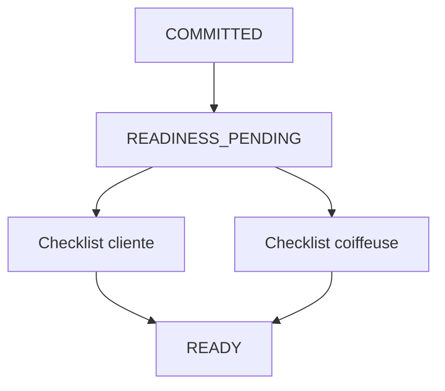

# Domain Storytelling MVP — Étape 5 : Rendez-vous opérationnellement prêt

> **Document compagnon** du Domain Storytelling complet  
> Source complète : `domain-storytelling-etape-5.md`  
> Objectif : version démontrable (happy path), sans backend, sans auth, sans paiement.

---

## 0. Intention produit

À partir de `COMMITTED`, générer un **plan de préparation** ; quand les actions **bloquantes** sont confirmées, le RDV passe à `READY`.

Valeur à montrer :

* checklist cliente ;
* checklist coiffeuse ;
* statut partagé `READY` — « on peut réaliser », pas seulement « confirmé par mail ».

Pas d’AT_RISK, pas d’opérateur, pas de notifications réelles.

---

## 1. Principes MVP

| Principe | Application |
| -------- | ----------- |
| Happy path only | `READINESS_PENDING` → `READY` |
| Pas de backend | Mock + `localStorage` |
| Pas d’auth | Profils préchargés |
| Confirmations | Manuelles (toggle) |
| Rappels | Badges UI seulement |
| Écrans Stitch MVP | S01–S05 générés (`prompts-stitch-mvp.md`) |

---

## 2. Précondition mockée

Engagement `COMMITTED` (étape 4) avec tâches, fournitures, lieu.  
Template de préparation préchargé pour la prestation (ex. knotless).

---

## 3. Périmètre du récit MVP

### Déclencheur

Un engagement est formé ; il faut préparer le jour J.

### Début

RDV `READINESS_PENDING` + plan généré.

### Fin nominale

`READY`

### Acteurs

**Cliente** + **Coiffeuse**.

---

## 4. Objets métier conservés (light)

| Objet | MVP |
| ----- | --- |
| Engagement source | Lecture |
| Rendez-vous opérationnel | Statut préparation |
| Plan de préparation | 4–8 actions |
| Action | Desc, owner, due, criticité, statut |
| Criticité | Bloquante / Informative |
| Instantané READY | Snapshot local |

### Exclus

`AT_RISK`, résolutions, `WAIVED`, preuves photo, `VERIFIED`, adresse protégée audité, IA risque.

---

## 5. Cycle de vie MVP

```text
READINESS_PENDING
      ↓  (toutes actions bloquantes CONFIRMED)
READY
```

Action : `TO_DO` → `CONFIRMED`.

États coupés : `AT_RISK`, `RESOLUTION_PENDING`, `OVERDUE`, `BLOCKED`.

---

## 6. Happy path — récit nominal (6 temps)

### T0 — Création RDV + plan depuis template

### T1 — Vue progression (% bloquantes)

### T2 — Checklist cliente → confirmer bloquantes

### T3 — Checklist coiffeuse → confirmer bloquantes

### T4 — Recalcul automatique

### T5 — `READY` + écran « RDV prêt »

---

## 7. Vue d’ensemble MVP



---

## 8. Conditions minimales de `READY`

* plan généré ;
* toutes actions **bloquantes** en `CONFIRMED` ;
* pas d’action bloquante restante en `TO_DO`.

---

## 9. Données mock / localStorage

| Clé | Contenu |
| --- | ------- |
| `as.mvp.engagements` | `COMMITTED` |
| `as.mvp.appointments` | RDV + statut |
| `as.mvp.prepPlans` | Actions |
| `as.mvp.prepTemplates` | Modèles prestation |

---

## 10. Écrans — mapping Stitch MVP

Source prompts : `prompts-stitch-mvp.md` (S01–S05).

| # | Dossier | Prompt | Rôle MVP |
| - | ------- | ------ | -------- |
| E0 | `s01_accueil_pr_paration_rdv/` | S01 | Accueil / orientation `READINESS_PENDING` |
| E1 | `plan_de_pr_paration_s02/` | S02 | Plan commun / progression (% actions bloquantes) |
| E2 | `checklist_cliente/` | S03 | Checklist cliente |
| E3 | `checklist_coiffeuse_s04/` | S04 | Checklist coiffeuse |
| E4 | `rdv_ready_s05/` | S05 | RDV `READY` |

Design system : `atelier_synergy/DESIGN.md`. Assets photo Stitch conservés à côté des écrans.

Hors parcours (non générés) : AT_RISK, résolutions, WAIVED, OVERDUE, BLOCKED.

---

## 11. Ce qu’on coupe

AT_RISK, résolutions A–F, reconfirmations obligatoires, rappels delivery, opérateur.

---

## 12. Critère de succès démo

Les deux parties voient :

> « Toutes les actions bloquantes sont OK — le rendez-vous est READY. »

---

## 13. Frontières

| Étape | Lien |
| ----- | ---- |
| Amont 4 | `COMMITTED` |
| Aval 6 | Consomme l’instantané `READY` |
| Galerie / avis | Hors scope (étape 8) |

---

## 14. Résultat fonctionnel MVP

> **Un RDV MVP devient READY quand le plan de préparation local a toutes ses actions bloquantes confirmées — sans gestion de risque.**
