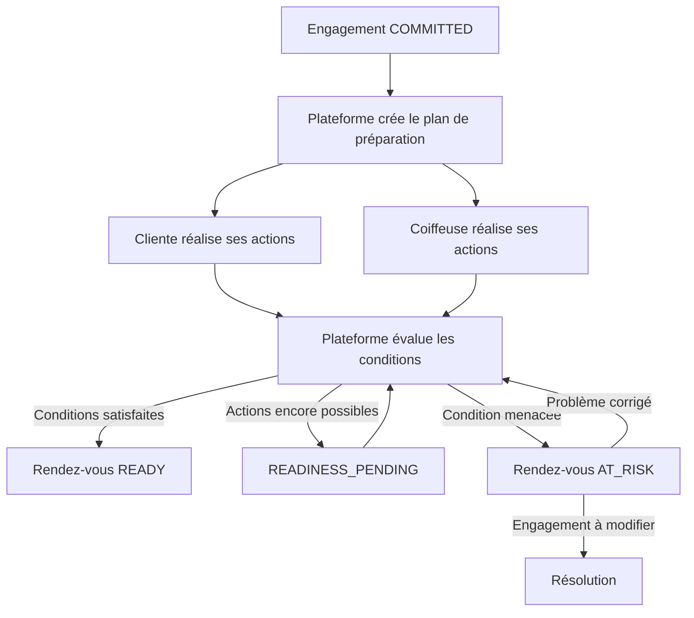
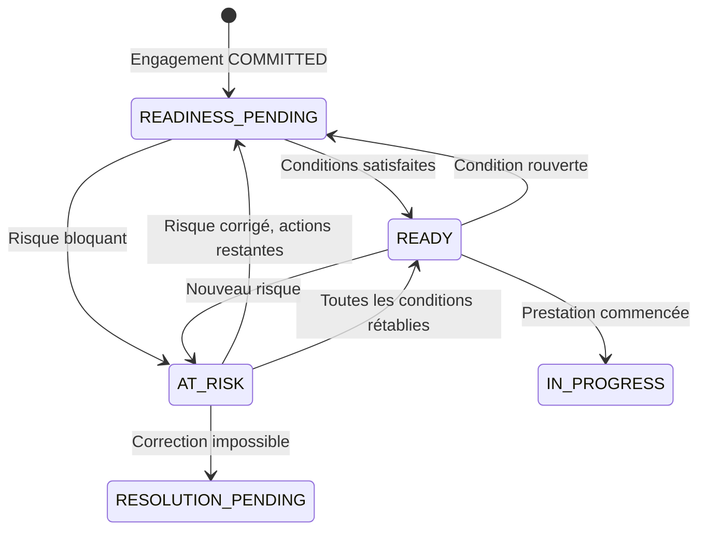

# Domain Storytelling — Étape 5

## Rendre le rendez-vous opérationnellement prêt

L’étape 4 a produit un engagement bilatéral `COMMITTED` : la prestation, le prix, le créneau, le lieu, les responsabilités et les règles applicables sont acceptés.

L’étape 5 transforme cet engagement contractuel en **rendez-vous réellement réalisable**.

> Un rendez-vous n’est pas `READY` parce qu’une confirmation a été envoyée. Il devient `READY` lorsque toutes les conditions indispensables à sa réalisation ont été satisfaites ou explicitement validées.

---

## 1. Périmètre du récit métier

### Début du récit

Le récit commence lorsqu’un engagement valide passe à :

`COMMITTED`

La plateforme dispose alors de :

* la proposition ferme acceptée ;
* la prestation et sa configuration exacte ;
* la date, l’heure, la durée et le lieu ;
* la répartition des tâches ;
* les fournitures incluses ou à apporter ;
* les consignes acceptées ;
* les mesures de sécurisation applicables ;
* la preuve de l’accord ;
* le statut du paiement initial.

### Fin du récit

Le récit produit l’une des sorties suivantes :

* `READY` : toutes les conditions bloquantes sont satisfaites ;
* `READINESS_PENDING` : certaines actions restent à réaliser, sans danger immédiat ;
* `AT_RISK` : une condition menace la réalisation du rendez-vous ;
* ouverture d’une résolution si le problème ne peut pas être corrigé dans le cadre de l’engagement existant.

### Hors périmètre

Cette étape ne doit pas :

* reformer l’engagement ;
* renégocier silencieusement le prix ;
* changer unilatéralement la prestation ;
* gérer le déroulement du jour J ;
* calculer le règlement final ;
* considérer qu’un rappel envoyé constitue une préparation réalisée.

---

## 2. Acteurs du domaine

| Acteur                      | Responsabilité principale                                                                         |
| --------------------------- | ------------------------------------------------------------------------------------------------- |
| **Cliente**                 | Réaliser les actions de préparation qui lui sont attribuées                                       |
| **Coiffeuse**               | Préparer les fournitures, le matériel, le lieu et les conditions professionnelles                 |
| **Plateforme**              | Construire le plan de préparation, suivre les conditions et déterminer l’état de préparation      |
| **Opérateur**               | Intervenir lorsqu’un rendez-vous devient `AT_RISK` ou qu’une vérification manuelle est nécessaire |
| **Service de notification** | Transmettre les rappels et enregistrer leur statut de livraison                                   |

La plateforme ne doit pas se substituer aux parties pour déclarer une action réalisée. Elle orchestre, vérifie la complétude et détecte les incohérences.

---

## 3. Objets métier manipulés

| Objet métier                    | Rôle                                                                       |
| ------------------------------- | -------------------------------------------------------------------------- |
| **Engagement**                  | Source de vérité contractuelle issue de l’étape 4                          |
| **Rendez-vous**                 | Instance opérationnelle de l’engagement                                    |
| **Plan de préparation**         | Ensemble versionné des conditions nécessaires au rendez-vous               |
| **Action de préparation**       | Action précise attribuée à une personne                                    |
| **Exigence de fourniture**      | Produit, matériel ou accessoire devant être disponible                     |
| **Consigne personnalisée**      | Instruction liée à la prestation exacte                                    |
| **Modalités d’accès**           | Adresse, transport, étage, interphone et contraintes du lieu               |
| **Confirmation de préparation** | Déclaration ou preuve qu’une action a été réalisée                         |
| **Reconfirmation**              | Confirmation temporelle que la partie peut toujours honorer le rendez-vous |
| **Signal de risque**            | Fait susceptible d’empêcher ou de dégrader la prestation                   |
| **Évaluation de préparation**   | Résultat expliquant pourquoi le rendez-vous est prêt ou à risque           |
| **Dossier de résolution**       | Objet ouvert lorsque le problème dépasse la simple préparation             |

### Distinction structurante

Les checklists cliente et coiffeuse ne sont pas les objets métier centraux. Elles sont deux vues du même `Plan de préparation`.

Une action de préparation contient au minimum :

* une description ;
* un responsable ;
* une échéance ;
* un niveau de criticité ;
* une méthode de validation ;
* un statut ;
* la conséquence prévue si elle n’est pas réalisée.

---

## 4. Vue d’ensemble du Domain Story

---

# 5. Récit métier nominal détaillé

## Séquence A — Construire le plan de préparation

### 1. La plateforme reçoit l’engagement

La plateforme constate que :

* l’engagement est `COMMITTED` ;
* la proposition acceptée est encore valide ;
* le paiement initial requis a été enregistré ;
* aucune résolution bloquante n’est ouverte.

### 2. La plateforme crée le rendez-vous opérationnel

Elle rattache au rendez-vous :

* la cliente ;
* la coiffeuse ;
* la prestation exacte ;
* le créneau ;
* la durée ;
* le lieu ;
* la répartition des tâches ;
* les conditions acceptées.

Le rendez-vous entre dans l’état :

`READINESS_PENDING`

### 3. La plateforme extrait les exigences de préparation

Les exigences proviennent :

* de la configuration de prestation créée par la coiffeuse ;
* de la proposition ferme ;
* des contraintes déclarées par la cliente ;
* du lieu de réalisation ;
* des conditions spécifiques acceptées ;
* des mesures de sécurisation applicables.

La plateforme ne doit pas inventer de nouvelle obligation après l’engagement.

### 4. La plateforme génère le plan de préparation

Elle transforme chaque exigence en action explicite.

Exemples :

| Action                                         | Responsable | Échéance | Criticité   |
| ---------------------------------------------- | ----------- | -------: | ----------- |
| Acheter les mèches selon la référence convenue | Cliente     |      J-3 | Bloquante   |
| Confirmer la couleur et la quantité            | Cliente     |      J-3 | Bloquante   |
| Laver et démêler les cheveux                   | Cliente     |      J-1 | Bloquante   |
| Préparer le matériel de coiffage               | Coiffeuse   |      J-1 | Bloquante   |
| Confirmer la disponibilité des produits        | Coiffeuse   |      J-2 | Bloquante   |
| Renseigner l’interphone                        | Cliente     |      J-1 | Importante  |
| Lire les modalités d’accès                     | Coiffeuse   |   Jour J | Informative |

---

## Séquence B — Attribuer les responsabilités

### 5. La plateforme présente à chaque partie sa propre checklist

La cliente voit :

* ce qu’elle doit acheter ;
* ce qu’elle doit préparer ;
* ce qu’elle doit apporter ;
* les informations qu’elle doit transmettre ;
* les échéances ;
* les conséquences éventuelles d’une préparation incorrecte.

La coiffeuse voit :

* les produits et fournitures dont elle est responsable ;
* le matériel à préparer ;
* les contraintes de la cliente ;
* le lieu et les modalités d’accès ;
* les tâches réalisées ou encore attendues côté cliente.

### 6. Chaque action possède un responsable unique

Une action ne doit pas être attribuée vaguement « aux deux parties ».

La plateforme doit savoir :

* qui doit agir ;
* avant quand ;
* comment l’action sera validée ;
* qui peut signaler un problème ;
* si son absence empêche la prestation.

Une action commune doit être décomposée.

Exemple :

* la cliente fournit l’adresse exacte ;
* la coiffeuse confirme avoir consulté les modalités d’accès.

### 7. Les parties consultent les consignes personnalisées

Les consignes dépendent de la prestation exacte.

Elles peuvent préciser :

* l’état attendu des cheveux ;
* les produits à éviter ;
* la marque, la couleur et la quantité de mèches ;
* les accessoires nécessaires ;
* les contraintes de santé ou de confort ;
* les règles concernant les accompagnants ;
* les conditions matérielles pour une prestation à domicile.

Une consigne ajoutée après `COMMITTED` ne peut créer une nouvelle obligation importante sans accord de la cliente.

---

## Séquence C — Réaliser et confirmer les actions

### 8. La cliente réalise les actions qui lui sont attribuées

Elle peut :

* marquer une action comme réalisée ;
* renseigner une information ;
* fournir une confirmation ;
* joindre une preuve lorsque cela est nécessaire ;
* signaler qu’elle ne pourra pas réaliser l’action ;
* demander une précision ciblée.

### 9. La coiffeuse réalise ses propres actions

Elle peut notamment :

* confirmer la disponibilité du matériel ;
* préparer les produits inclus ;
* vérifier une référence communiquée par la cliente ;
* confirmer le lieu ou son déplacement ;
* préparer son espace de travail ;
* signaler une impossibilité ou une incompatibilité.

### 10. La plateforme enregistre chaque confirmation

Elle conserve :

* l’auteur ;
* l’action concernée ;
* la date et l’heure ;
* le mode de validation ;
* la déclaration ou la preuve fournie ;
* la version de la consigne applicable.

Une case cochée ne constitue une preuve que selon le niveau de validation prévu pour cette action.

### 11. La plateforme recalcule continuellement l’état de préparation

Après chaque action, elle détermine :

* les conditions satisfaites ;
* les conditions encore attendues ;
* les actions en retard ;
* les contradictions ;
* les risques éventuels ;
* la prochaine échéance importante.

---

## Séquence D — Rappeler et reconfirmer

### 12. La plateforme programme les rappels utiles

Les rappels sont liés aux actions et à leurs échéances.

Exemples :

* J-3 : acheter les fournitures ;
* J-2 : vérifier leur référence ;
* J-1 : préparer les cheveux et le matériel ;
* jour J : consulter l’adresse, l’heure et les modalités d’accès.

Le rappel doit dire quoi faire. Un message générique « votre rendez-vous approche » ne suffit pas.

### 13. La plateforme vérifie la réception des rappels critiques

Elle conserve notamment :

* le canal utilisé ;
* l’heure d’envoi ;
* le statut de livraison ;
* l’action attendue après le rappel.

Un rappel non livré peut devenir un signal de risque, mais il ne prouve pas que l’action n’a pas été réalisée.

### 14. La plateforme demande éventuellement une reconfirmation

La reconfirmation peut être demandée lorsque :

* le rendez-vous a été pris longtemps à l’avance ;
* la prestation est longue ou critique ;
* un déplacement important est prévu ;
* certaines conditions peuvent avoir changé ;
* un signal de risque existe ;
* une politique particulière l’exige.

La reconfirmation ne reforme pas l’engagement. Elle indique simplement que la partie peut toujours l’exécuter.

### 15. La cliente et la coiffeuse reconfirment leur disponibilité

La plateforme enregistre :

* l’identité de la partie ;
* l’heure de reconfirmation ;
* les éventuelles réserves ;
* les changements signalés.

Une reconfirmation accompagnée d’une réserve ne doit pas être interprétée comme une confirmation sans condition.

---

## Séquence E — Évaluer la préparation

### 16. La plateforme vérifie les conditions bloquantes

Elle contrôle que :

* toutes les actions obligatoires sont validées ;
* les fournitures nécessaires sont disponibles ;
* la répartition des tâches est respectée ;
* l’adresse et les modalités d’accès sont exploitables ;
* les mesures de sécurisation sont toujours valides ;
* les confirmations temporelles ne sont pas périmées ;
* aucun signal de risque bloquant n’est ouvert.

### 17. La plateforme produit une évaluation explicable

L’évaluation doit indiquer pourquoi le rendez-vous est :

* encore en préparation ;
* prêt ;
* ou à risque.

Exemple :

> Rendez-vous encore en préparation : la cliente doit confirmer l’achat des mèches avant jeudi 18 h.

Ou :

> Rendez-vous à risque : la coiffeuse a signalé que le matériel indispensable n’est plus disponible.

### 18. La plateforme marque le rendez-vous `READY`

Le rendez-vous devient `READY` lorsque toutes les conditions obligatoires sont satisfaites.

La plateforme produit alors un instantané de préparation contenant :

* les actions réalisées ;
* les confirmations ;
* les fournitures prévues ;
* les modalités d’accès ;
* les consignes applicables ;
* la date de validation ;
* les éventuels éléments non bloquants restant à surveiller.

Cet instantané devient l’entrée de l’étape 6.

---

# 6. Niveaux de criticité des actions

Toutes les actions ne doivent pas avoir la même conséquence.

| Niveau          | Signification                                                             | Conséquence                                |
| --------------- | ------------------------------------------------------------------------- | ------------------------------------------ |
| **Bloquante**   | La prestation ne peut pas être réalisée correctement sans cette condition | Empêche le passage à `READY`               |
| **Importante**  | Son absence crée un risque de retard ou de dégradation                    | Peut déclencher `AT_RISK` selon l’échéance |
| **Informative** | Information utile sans effet direct sur la faisabilité                    | N’empêche pas `READY`                      |

Exemples d’actions bloquantes :

* fournitures indispensables absentes ;
* cheveux devant obligatoirement être préparés ;
* adresse de prestation à domicile inconnue ;
* matériel professionnel essentiel indisponible ;
* mesure de sécurisation obligatoire non validée.

La criticité doit être définie par configuration de prestation, puis ajustable seulement selon une règle contrôlée.

---

# 7. Conditions exactes de `READY`

Un rendez-vous peut passer à `READY` uniquement si :

1. l’engagement est toujours actif ;
2. le paiement nécessaire à l’engagement reste valide ;
3. le créneau, la prestation, le prix et le lieu n’ont pas été modifiés sans accord ;
4. toutes les actions bloquantes sont réalisées ;
5. les fournitures indispensables sont disponibles et compatibles ;
6. la cliente a satisfait ses obligations de préparation ;
7. la coiffeuse a satisfait ses obligations professionnelles ;
8. les modalités d’accès sont suffisamment précises ;
9. les mesures de sécurisation sont validées ;
10. les reconfirmations obligatoires sont présentes et encore valides ;
11. aucun signal de risque bloquant n’est ouvert ;
12. aucun dossier de résolution n’empêche la réalisation.

`READY` signifie :

> Les conditions nécessaires sont actuellement réunies pour exécuter l’engagement.

Il ne signifie pas :

* que la prestation a commencé ;
* que le résultat est garanti ;
* qu’aucun incident ne peut encore survenir ;
* que les parties perdent leur droit de signaler un problème.

---

# 8. Cycle de vie du rendez-vous

### États internes d’une action de préparation

Une action peut être :

* `TO_DO` ;
* `CONFIRMED`;
* `VERIFIED`;
* `BLOCKED`;
* `OVERDUE`;
* `WAIVED`;
* `NOT_APPLICABLE`.

Une action `WAIVED` doit toujours conserver :

* l’auteur de la dispense ;
* le motif ;
* la règle autorisant cette dispense ;
* son éventuel impact sur l’engagement.

---

# 9. Récits alternatifs

## A. Une fourniture est manquante

1. La cliente signale qu’elle n’a pas trouvé les mèches prévues.
2. La plateforme crée un `Signal de risque`.
3. Le rendez-vous passe à `AT_RISK` si la fourniture est indispensable.
4. La coiffeuse peut proposer une référence équivalente.
5. Si l’alternative ne change ni le prix ni le résultat attendu, elle est validée dans le plan de préparation.
6. Si elle modifie le prix, la durée ou le résultat, la plateforme ouvre une modification ou une résolution.
7. Le rendez-vous revient à `READY` uniquement après validation de la nouvelle condition.

## B. L’adresse est incomplète

1. La coiffeuse signale qu’elle ne peut pas organiser son déplacement.
2. La plateforme demande à la cliente de compléter les modalités d’accès.
3. Tant que l’échéance permet encore la correction, le rendez-vous reste `READINESS_PENDING`.
4. Lorsque l’absence d’adresse menace le déplacement, il passe à `AT_RISK`.
5. Une absence persistante peut conduire à la résolution.

## C. La cliente ne peut pas respecter une consigne

Exemple : elle ne peut pas réaliser la préparation capillaire prévue.

La coiffeuse peut :

* accepter de réaliser la tâche si cette option existe déjà ;
* proposer une adaptation sans conséquence contractuelle ;
* signaler une augmentation de durée ou de prix ;
* déclarer la prestation non réalisable dans ces conditions.

Toute augmentation de prix ou de durée doit être acceptée avant le rendez-vous.

## D. La coiffeuse rencontre un problème matériel

1. La coiffeuse déclare le matériel indisponible.
2. La plateforme identifie les prestations affectées.
3. Le rendez-vous passe à `AT_RISK`.
4. Une solution peut être recherchée :

   * remplacement du matériel ;
   * changement compatible de lieu ;
   * adaptation acceptée ;
   * report ;
   * remplacement de la coiffeuse.
5. Si l’engagement doit changer, le dossier bascule vers la résolution.

## E. Une partie ne reconfirme pas

L’absence de reconfirmation ne doit pas entraîner automatiquement une annulation.

La plateforme :

1. relance la partie ;
2. vérifie la livraison du rappel ;
3. classe le risque selon l’échéance et la criticité ;
4. peut demander une intervention opérateur ;
5. passe le rendez-vous à `AT_RISK` lorsque l’incertitude menace réellement sa réalisation.

## F. Un problème apparaît après `READY`

L’état `READY` est réversible.

Si une partie signale :

* une indisponibilité ;
* un problème de transport ;
* une fourniture endommagée ;
* une difficulté de santé ou de sécurité ;
* un changement de lieu ;

la plateforme rouvre l’évaluation et passe le rendez-vous à :

* `READINESS_PENDING` si la correction est encore normale ;
* `AT_RISK` si la réalisation est menacée.

---

# 10. Détection d’un rendez-vous à risque

Un rendez-vous peut être déclaré `AT_RISK` lorsqu’au moins une condition suivante est satisfaite :

* une action bloquante est impossible à réaliser ;
* une action bloquante est en retard et l’échéance devient critique ;
* une fourniture indispensable est absente ou incompatible ;
* l’adresse ou le lieu ne permet pas la réalisation ;
* la coiffeuse n’a plus le matériel nécessaire ;
* une partie annonce qu’elle ne pourra probablement pas être présente ;
* une mesure de sécurisation n’est plus valide ;
* des informations contradictoires sont détectées ;
* une modification non acceptée affecte le prix, la durée ou la prestation ;
* une partie ne répond plus alors qu’une validation indispensable est attendue.

`AT_RISK` doit toujours contenir :

* un motif structuré ;
* l’action ou la condition affectée ;
* la partie responsable de l’action, sans présumer de sa faute ;
* l’échéance de correction ;
* les solutions encore possibles ;
* le niveau d’intervention requis.

---

# 11. Règles métier incontournables

### Règle 1 — La préparation dérive de l’engagement

Chaque action obligatoire doit pouvoir être reliée à :

* la prestation ;
* la proposition acceptée ;
* une politique acceptée ;
* ou une mesure de protection connue.

### Règle 2 — Aucune nouvelle obligation importante ne peut être ajoutée silencieusement

Une consigne ajoutée après paiement qui modifie substantiellement :

* le prix ;
* la durée ;
* les fournitures ;
* la répartition des tâches ;
* le niveau de service ;

nécessite un nouvel accord.

### Règle 3 — Chaque action possède un responsable

Le système doit pouvoir identifier qui doit agir, même si la non-réalisation n’implique pas automatiquement une faute.

### Règle 4 — Une notification n’est pas une confirmation

Le système distingue :

* rappel programmé ;
* rappel envoyé ;
* rappel livré ;
* rappel consulté ;
* action confirmée ;
* action vérifiée.

### Règle 5 — Toutes les actions manquantes ne bloquent pas le rendez-vous

Seules les conditions classées comme bloquantes empêchent `READY`.

### Règle 6 — `READY` reste réversible

Un nouvel événement peut remettre en cause la préparation jusqu’au commencement de la prestation.

### Règle 7 — Une correction opérationnelle ne doit pas masquer une modification contractuelle

Si la solution modifie l’engagement, elle doit passer par la branche de modification ou de résolution.

### Règle 8 — L’adresse exacte est une donnée protégée

Elle ne doit être communiquée :

* qu’aux acteurs concernés ;
* qu’après la formation de l’engagement ;
* au moment nécessaire ;
* avec un historique d’accès adapté.

### Règle 9 — Les preuves doivent être proportionnées

Une déclaration suffit pour une action simple. Une preuve supplémentaire ne doit être demandée que lorsque la criticité le justifie.

### Règle 10 — La détection de risque ne décide pas automatiquement de la responsabilité

`AT_RISK` décrit une menace opérationnelle. La responsabilité éventuelle appartient à la résolution.

---

# 12. Fonctionnalités par acteur

## Cliente

* consulter sa checklist personnalisée ;
* voir les échéances et les conséquences ;
* confirmer une action ;
* communiquer une information ;
* fournir une preuve lorsque nécessaire ;
* renseigner l’adresse et les accès ;
* signaler un élément manquant ;
* demander une précision liée au rendez-vous ;
* reconfirmer sa disponibilité ;
* consulter l’état `READY` ou `AT_RISK`.

## Coiffeuse

* consulter le plan complet de préparation ;
* voir les actions attribuées à la cliente ;
* confirmer ses fournitures et son matériel ;
* valider une référence fournie par la cliente ;
* signaler une incompatibilité ;
* ajouter une précision non contractuelle ;
* proposer une correction ;
* reconfirmer sa disponibilité ;
* déclencher un signal de risque.

## Plateforme

* générer le plan depuis l’engagement ;
* attribuer les actions ;
* calculer les échéances ;
* personnaliser les checklists ;
* envoyer les rappels ;
* enregistrer les confirmations ;
* détecter les actions en retard ;
* évaluer la préparation ;
* expliquer le statut ;
* passer le rendez-vous à `READY` ou `AT_RISK` ;
* ouvrir une résolution lorsque nécessaire.

## Opérateur

* consulter les rendez-vous `AT_RISK` ;
* comprendre la condition manquante ;
* contacter les parties ;
* vérifier une preuve ;
* appliquer une politique ;
* enregistrer une dispense autorisée ;
* proposer une solution ;
* transférer le dossier vers la résolution.

---

# 13. Preuves et données à conserver

Pour chaque rendez-vous :

* version de l’engagement source ;
* version du plan de préparation ;
* actions générées ;
* responsable de chaque action ;
* criticité et échéance ;
* confirmations et preuves ;
* consignes présentées ;
* rappels envoyés et statuts de livraison ;
* reconfirmations ;
* éléments signalés comme manquants ;
* motifs de `AT_RISK` ;
* décisions opérateur ;
* date et justification du passage à `READY` ;
* réouvertures éventuelles du plan.

Cette traçabilité doit permettre de répondre à trois questions :

1. Qu’est-ce qui devait être préparé ?
2. Qui devait s’en charger ?
3. Que savait la plateforme avant le rendez-vous ?

---

# 14. Périmètre recommandé pour le pilote

## À construire

* modèles de checklist pour un nombre limité de prestations ;
* génération d’un plan par rendez-vous ;
* actions attribuées à la cliente ou à la coiffeuse ;
* criticité bloquante, importante ou informative ;
* échéances simples ;
* confirmations manuelles ;
* rappels programmés ;
* adresse et modalités d’accès ;
* signalement d’un élément manquant ;
* passage manuel ou assisté à `AT_RISK` ;
* console opérateur ;
* validation de `READY` ;
* historique des changements.

## À piloter manuellement

* vérification des fournitures ;
* appréciation des preuves ;
* arbitrage des cas ambigus ;
* adaptation des checklists ;
* qualification du niveau de risque ;
* transfert vers la résolution.

## À reporter

* reconnaissance automatique des fournitures par image ;
* prédiction avancée des no-shows ;
* achat ou livraison de produits intégrés ;
* recommandations automatiques de boutiques ;
* orchestration logistique complexe ;
* détection de risque par IA ;
* adaptation entièrement automatique des checklists.

---

# 15. Indicateurs à suivre

* taux de rendez-vous `COMMITTED → READY` ;
* délai moyen entre `COMMITTED` et `READY` ;
* part des rendez-vous encore incomplets à J-1 ;
* taux de `AT_RISK` ;
* motifs de risque les plus fréquents ;
* actions le plus souvent non réalisées ;
* taux de correction avant le rendez-vous ;
* incidents causés par une préparation manquante ;
* efficacité des rappels ;
* charge opérateur par rendez-vous ;
* corrélation entre `READY` et réalisation effective ;
* taux de modifications contractuelles déclenchées pendant la préparation.

Ces indicateurs doivent servir à améliorer les prestations et les checklists, pas à produire immédiatement un score punitif.

---

# 16. Décisions à arbitrer avant le backlog

1. Quelles actions sont bloquantes pour chaque prestation ?
2. Qui peut modifier les modèles de préparation ?
3. Qui peut dispenser une action ?
4. Quelles actions nécessitent une preuve ?
5. À quel moment l’adresse exacte est-elle communiquée ?
6. Dans quels cas une reconfirmation est-elle obligatoire ?
7. Quand une action en retard déclenche-t-elle `AT_RISK` ?
8. Quel délai laisse-t-on pour corriger un risque ?
9. Quels risques nécessitent une intervention humaine ?
10. Une absence de réponse peut-elle entraîner une annulation ?
11. Quels changements peuvent être acceptés dans la préparation sans reformer l’engagement ?
12. Quelles conséquences s’appliquent lorsqu’une tâche convenue n’est pas réalisée ?
13. Quel niveau de sécurisation la plateforme vérifie-t-elle réellement ?
14. Qui décide qu’un rendez-vous peut revenir de `AT_RISK` à `READY` ?

---

# Synthèse du domaine

Le cœur de l’étape 5 n’est ni la notification ni la checklist visuelle.

Le véritable objet métier est le `Plan de préparation`, dérivé de l’engagement et composé d’actions :

* explicites ;
* attribuées ;
* datées ;
* classées par criticité ;
* confirmables ;
* traçables.

La transformation métier est la suivante :

> `COMMITTED` signifie que les parties se sont engagées.
> `READY` signifie qu’elles disposent effectivement des conditions nécessaires pour exécuter cet engagement.

La sortie attendue est donc un rendez-vous dont la faisabilité opérationnelle est connue, explicable et encore surveillée jusqu’au début de la prestation.

---

# Frontière avec la galerie de prestation

L’étape 5 prépare la réalisation opérationnelle du rendez-vous. Elle ne publie aucun contenu dans la galerie (`SERVICE_GALLERY`).

Si une photo du résultat est envisagée, les consentements de prise de vue et de publication restent distincts et seront traités après la prestation, à l’étape 8, pour enrichir uniquement la galerie de la prestation réalisée — en tant que `VERIFIED_REALIZATION`, jamais comme galerie générale de la coiffeuse.
