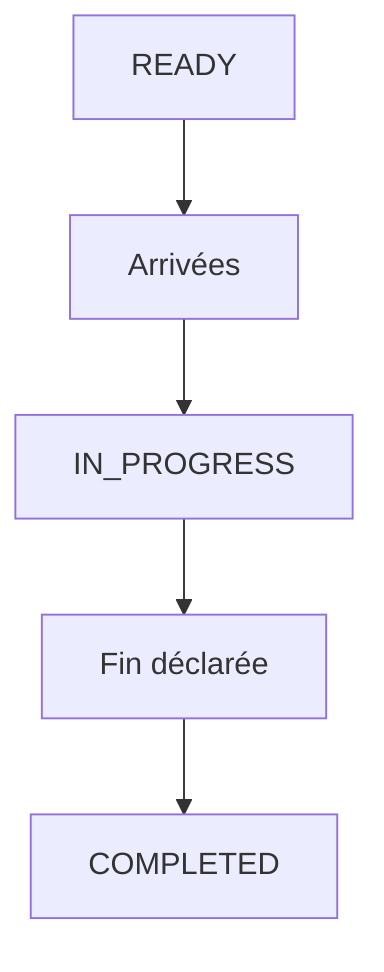

# Domain Storytelling MVP — Étape 6 : Réaliser la prestation

> **Document compagnon** du Domain Storytelling complet  
> Source complète : `domain-storytelling-etape-6.md`  
> Objectif : version démontrable (happy path), sans backend, sans auth, sans paiement.

---

## 0. Intention produit

Montrer qu’un RDV `READY` devient un **fait d’exécution** : arrivées → début → fin → confirmation cliente → `COMPLETED`, avec un dossier prêt pour le règlement.

Valeur à montrer :

* suivi jour J partagé ;
* déclarations d’événements qui comptent ;
* fin complète confirmée des deux côtés.

Pas de retard, avenant, incident, résolution, contestation.

---

## 1. Principes MVP

| Principe | Application |
| -------- | ----------- |
| Happy path only | `READY` → `IN_PROGRESS` → `COMPLETED` |
| Pas de backend | Mock + `localStorage` |
| Pas d’auth | Profils préchargés |
| Événements | Arrivée / début / fin / confirm |
| Écrans Stitch MVP | S01–S06 générés (`prompts-stitch-mvp.md`) |

---

## 2. Précondition mockée

RDV `READY` (étape 5) + engagement figé + checklist préparation satisfaite.

---

## 3. Périmètre du récit MVP

### Déclencheur

Le jour J arrive ; la prestation peut démarrer.

### Début

Dossier opérationnel ouvert sur RDV `READY`.

### Fin nominale

`COMPLETED` + dossier d’exécution final.

### Acteurs

**Cliente** + **Coiffeuse**.

---

## 4. Objets métier conservés (light)

| Objet | MVP |
| ----- | --- |
| Dossier opérationnel | Vue jour J |
| Engagement applicable | Lecture figée |
| Déclarations d’arrivée | Cliente + coiffeuse |
| Événements début / fin | Horodatés |
| Déclaration de fin | Complète uniquement |
| Confirmation cliente | Obligatoire pour `COMPLETED` |
| Dossier d’exécution final | Handoff étape 7 |

### Exclus

Retard, avenant, incident, `PARTIALLY_COMPLETED`, `RESOLUTION_PENDING`, remplacement, contestation.

---

## 5. Cycle de vie MVP

```text
READY
  ↓
IN_PROGRESS
  ↓
COMPLETED
```

---

## 6. Happy path — récit nominal (6 temps)

### T0 — Ouvrir le dossier jour J

### T1 — Cliente déclare son arrivée

### T2 — Coiffeuse déclare son arrivée (+ prep OK mock)

### T3 — Coiffeuse démarre → `IN_PROGRESS`

### T4 — Coiffeuse déclare la fin complète

### T5 — Cliente confirme la réalisation → `COMPLETED` → handoff 7

---

## 7. Vue d’ensemble MVP



---

## 8. Conditions minimales de `COMPLETED`

* arrivées déclarées (ou allègement démo : au moins démarrage + fin) ;
* début déclaré ;
* fin **complète** déclarée par la coiffeuse ;
* confirmation cliente ;
* aucun avenant / incident.

---

## 9. Données mock / localStorage

| Clé | Contenu |
| --- | ------- |
| `as.mvp.appointments` | Statut exécution |
| `as.mvp.executionEvents` | Arrivée / début / fin |
| `as.mvp.executionDossier` | Dossier final `COMPLETED` |

---

## 10. Écrans — mapping Stitch MVP

Source prompts : `prompts-stitch-mvp.md` (S01–S06).

| # | Dossier | Prompt | Rôle MVP |
| - | ------- | ------ | -------- |
| E0 | `jour_j_accueil_explicatif/` | S01 | Accueil / orientation Jour J (`READY`) |
| E1 | `suivi_op_rationnel_arriv_es/` | S02 | Suivi opérationnel + déclarations d’arrivée |
| E2 | `d_marrer_la_prestation/` | S03 | CTA explicite Démarrer → `IN_PROGRESS` |
| E3 | `synth_se_de_fin_fin_compl_te/` | S04 | Synthèse de fin (complète only) |
| E4 | `confirmation_cliente/` | S05 | Cliente confirme la réalisation |
| E5 | `succ_s_completed_pont_r_glement/` | S06 | Succès `COMPLETED` + pont règlement |

Design system : `atelier_synergy/DESIGN.md`. Assets photo Stitch conservés à côté des écrans.

Hors parcours (non générés) : retard, avenant / modification en cours, incident, `PARTIALLY_COMPLETED`.

---

## 11. Ce qu’on coupe

Retards, modifications, partiel/interrompu, incidents, opérateur résolution.

---

## 12. Critère de succès démo

> « La prestation a démarré et s’est terminée ; la cliente a confirmé — statut COMPLETED. »

---

## 13. Frontières

| Étape | Lien |
| ----- | ---- |
| Amont 5 | `READY` |
| Aval 7 | Dossier d’exécution `COMPLETED` |
| Aval 8 | Pas encore (après `SETTLED`) |

---

## 14. Résultat fonctionnel MVP

> **Une exécution MVP enregistre les événements heureux du jour J jusqu’à COMPLETED, sans résolution ni avenant.**
