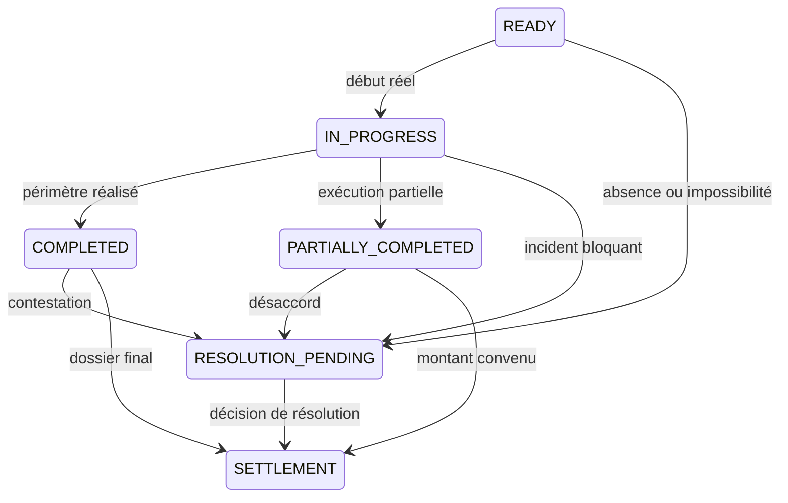

# Domain Storytelling — Étape 6

## Réaliser et coordonner la prestation

L’étape 6 transforme un rendez-vous `READY` en un **fait d’exécution qualifié** :

* prestation réalisée conformément à l’engagement ;
* prestation réalisée après modification acceptée ;
* prestation partiellement réalisée ;
* prestation interrompue ou contestée ;
* événement nécessitant une résolution.

La plateforme ne doit pas observer toute la prestation. Elle doit uniquement conserver les événements qui changent les droits, les obligations, le prix, la sécurité ou la suite du traitement.

---

## 1. Décision métier

> **Ce qui se déroule réellement correspond-il à l’engagement accepté par la cliente et la coiffeuse ?**

Les questions secondaires sont :

* les deux parties sont-elles présentes ?
* la prestation a-t-elle commencé ?
* les conditions de préparation sont-elles respectées ?
* le périmètre doit-il être modifié ?
* cette modification a-t-elle été acceptée ?
* la prestation a-t-elle été entièrement réalisée ?
* un incident empêche-t-il sa poursuite ?
* faut-il déclencher une résolution avant le règlement ?

---

## 2. Périmètre de l’étape

### Déclencheur

L’étape commence lorsque :

* le rendez-vous est `READY` ;
* le créneau approche ou vient de commencer ;
* le dossier opérationnel devient accessible aux deux parties.

Un rendez-vous `AT_RISK` peut également entrer directement dans la branche de résolution sans démarrer la prestation.

### Fin de l’étape

L’étape se termine lorsque la prestation est qualifiée comme :

* `COMPLETED` ;
* `PARTIALLY_COMPLETED` ;
* ou lorsqu’une résolution doit intervenir avant le règlement.

### Hors de cette étape

Cette étape ne doit pas :

* calculer définitivement la somme à verser à la coiffeuse ;
* produire l’avis final ;
* juger automatiquement la qualité technique du résultat ;
* attribuer automatiquement la responsabilité d’un incident ;
* surveiller en permanence la position ou les échanges des parties.

Le montant final relève de l’étape 7. L’évaluation relève de l’étape 8.

---

# 3. Acteurs

| Acteur                        | Responsabilité                                                                                                                                                               |
| ----------------------------- | ---------------------------------------------------------------------------------------------------------------------------------------------------------------------------- |
| **Cliente**                   | Signaler son arrivée ou son retard, constater les conditions réelles, accepter ou refuser une modification, déclarer un incident, confirmer ou contester la réalisation      |
| **Coiffeuse**                 | Accéder au dossier, constater la préparation, signaler son arrivée ou son retard, commencer la prestation, proposer une adaptation, déclarer la fin ou l’interruption        |
| **Plateforme**                | Présenter l’engagement applicable, horodater les événements, recueillir les consentements, conserver les différentes versions et orienter vers le règlement ou la résolution |
| **Opérateur de résolution**   | Examiner les faits, appliquer la politique acceptée, rechercher une limitation du dommage, proposer et tracer une solution                                                   |
| **Coiffeuse de remplacement** | Acteur facultatif sollicité lorsqu’un remplacement fait partie de la solution                                                                                                |

L’opérateur n’intervient pas dans le parcours nominal.

---

# 4. Objets métier

| Objet                                   | Fonction                                                                       |
| --------------------------------------- | ------------------------------------------------------------------------------ |
| **Dossier opérationnel du rendez-vous** | Vue synthétique utilisée le jour J                                             |
| **Engagement applicable**               | Version contractuelle acceptée avant le rendez-vous                            |
| **Événement d’exécution**               | Arrivée, retard, début, modification, interruption ou fin                      |
| **Déclaration d’arrivée**               | Présence ou retard déclaré par une partie                                      |
| **Heure estimée d’arrivée**             | Estimation communiquée en cas de retard                                        |
| **Constat de préparation**              | État des tâches, fournitures et conditions nécessaires                         |
| **Proposition de modification**         | Changement demandé sur la prestation, le prix, la durée, le lieu ou les tâches |
| **Consentement à la modification**      | Acceptation ou refus explicite de l’autre partie                               |
| **Avenant d’exécution**                 | Nouvelle version de l’engagement résultant d’une modification acceptée         |
| **Déclaration d’incident**              | Événement de sécurité, relationnel ou opérationnel                             |
| **Élément de preuve**                   | Photo, message, document ou déclaration utile et proportionnée                 |
| **Déclaration de fin**                  | Qualification proposée de la prestation : complète, partielle ou interrompue   |
| **Dossier de résolution**               | Ensemble des faits, réponses, politiques et solutions                          |
| **Décision de résolution**              | Solution acceptée ou décision administrative applicable                        |
| **Dossier d’exécution final**           | Engagement applicable + événements + résultat réel + éventuelle résolution     |

---

# 5. Story principale — Prestation réalisée conformément à l’engagement

## Situation initiale

* le rendez-vous est `READY` ;
* la cliente et la coiffeuse disposent du même engagement ;
* les tâches préparatoires sont considérées comme satisfaites ;
* aucune résolution n’est ouverte.

## Séquence métier

| N° | Domain Story                                                                              |
| -: | ----------------------------------------------------------------------------------------- |
|  1 | **Plateforme → rend accessible → Dossier opérationnel → à Cliente et Coiffeuse**          |
|  2 | **Cliente et Coiffeuse → consultent → Engagement applicable → dans Dossier opérationnel** |
|  3 | **Cliente → déclare → Arrivée → à Plateforme**                                            |
|  4 | **Coiffeuse → déclare → Arrivée → à Plateforme**                                          |
|  5 | **Plateforme → horodate → Déclarations d’arrivée → dans Historique du rendez-vous**       |
|  6 | **Coiffeuse → vérifie → Tâches cliente et fournitures → à partir de Checklist acceptée**  |
|  7 | **Coiffeuse → déclare → Début réel → à Plateforme**                                       |
|  8 | **Plateforme → enregistre → Début réel → et passe le rendez-vous à `IN_PROGRESS`**        |
|  9 | **Coiffeuse → réalise → Prestation convenue → pour Cliente**                              |
| 10 | **Coiffeuse → déclare → Fin réelle et réalisation complète → à Plateforme**               |
| 11 | **Plateforme → enregistre → Déclaration de fin → dans Dossier d’exécution**               |
| 12 | **Cliente → confirme ou conteste → Réalisation déclarée → auprès de Plateforme**          |
| 13 | **Plateforme → qualifie → Prestation → `COMPLETED`**                                      |
| 14 | **Plateforme → transmet → Dossier d’exécution final → au règlement**                      |

### Résultat

Le système sait :

* quelle version de l’engagement a été exécutée ;
* quand la prestation a commencé et terminé ;
* qu’aucune modification significative n’est intervenue ;
* qu’aucune résolution n’est nécessaire.

`COMPLETED` signifie que le périmètre convenu a été réalisé. Cela ne signifie pas automatiquement que la cliente est satisfaite de la qualité du résultat.

---

# 6. Story alternative A — Une partie est en retard

| N° | Domain Story                                                                                |
| -: | ------------------------------------------------------------------------------------------- |
| A1 | **Cliente ou Coiffeuse → déclare → Retard → à Plateforme**                                  |
| A2 | **Partie en retard → communique → Heure estimée d’arrivée → à autre partie**                |
| A3 | **Plateforme → horodate → Déclaration de retard → dans Historique**                         |
| A4 | **Plateforme → présente → Politique de retard acceptée → aux deux parties**                 |
| A5 | **Autre partie → choisit → Attendre, adapter ou demander une résolution → dans Plateforme** |
| A6 | **Plateforme → enregistre → Choix et conséquences → dans Dossier du rendez-vous**           |

### Variantes

* la partie arrive et la prestation reste réalisable ;
* la durée doit être réduite ;
* l’horaire de fin est décalé ;
* un supplément prévu par la politique devient applicable ;
* le retard rend la prestation impossible ;
* l’autre partie quitte les lieux ;
* une résolution est ouverte.

### Règle importante

L’heure estimée d’arrivée est une **estimation déclarée**, pas une preuve d’arrivée.

La plateforme doit distinguer :

* heure prévue ;
* heure de déclaration du retard ;
* heure estimée annoncée ;
* heure d’arrivée déclarée ou constatée ;
* conséquence réelle sur la prestation.

---

# 7. Story alternative B — Une modification est demandée sur place

Exemple : la cliente souhaite passer de knotless braids mi-dos à une longueur bas du dos.

| N° | Domain Story                                                                        |
| -: | ----------------------------------------------------------------------------------- |
| B1 | **Cliente → demande → Modification du périmètre → à Coiffeuse**                     |
| B2 | **Coiffeuse → évalue → Modification demandée → selon faisabilité réelle**           |
| B3 | **Coiffeuse → propose → Nouveau périmètre, prix et durée → à Cliente**              |
| B4 | **Plateforme → compare → Proposition de modification → avec Engagement applicable** |
| B5 | **Cliente → accepte ou refuse → Proposition de modification → dans Plateforme**     |
| B6 | **Plateforme → horodate → Consentement ou refus → dans Historique**                 |
| B7 | **Plateforme → produit → Avenant d’exécution → si la modification est acceptée**    |
| B8 | **Coiffeuse → réalise → Prestation modifiée → selon Avenant d’exécution**           |

### Si la cliente refuse

* l’engagement initial reste applicable ;
* aucun supplément ne peut être ajouté ;
* la coiffeuse réalise la prestation initiale si elle reste faisable ;
* si elle ne peut plus la réaliser, un dossier de résolution est ouvert.

### Invariant

> Une discussion orale ne suffit pas pour modifier le prix, la durée ou le périmètre.

Le consentement doit être explicite et rattaché à une proposition précise.

---

# 8. Story alternative C — Une tâche cliente n’a pas été réalisée

Exemples :

* cheveux non lavés ou non démêlés ;
* mèches manquantes ;
* quantité ou référence incorrecte ;
* préparation incompatible avec la prestation.

| N° | Domain Story                                                                                      |
| -: | ------------------------------------------------------------------------------------------------- |
| C1 | **Coiffeuse → constate → Tâche cliente non réalisée → dans Checklist**                            |
| C2 | **Coiffeuse → déclare → Élément manquant → à Plateforme**                                         |
| C3 | **Plateforme → rapproche → Constat → de l’Engagement et de la Checklist acceptée**                |
| C4 | **Coiffeuse → propose → Adaptation, supplément, délai ou report → à Cliente**                     |
| C5 | **Cliente → accepte ou refuse → Solution proposée → dans Plateforme**                             |
| C6 | **Plateforme → crée → Avenant d’exécution → si la solution est acceptée**                         |
| C7 | **Plateforme → ouvre → Dossier de résolution → si aucune solution opérationnelle n’est acceptée** |

La coiffeuse ne doit pas pouvoir imposer automatiquement un supplément. La cliente ne doit pas pouvoir exiger la prestation initiale si les conditions indispensables qu’elle avait acceptées ne sont pas réunies.

---

# 9. Story alternative D — Prestation interrompue ou partiellement réalisée

| N° | Domain Story                                                                                       |
| -: | -------------------------------------------------------------------------------------------------- |
| D1 | **Cliente ou Coiffeuse → signale → Interruption → à Plateforme**                                   |
| D2 | **Déclarant → qualifie → Motif et moment de l’interruption → dans Déclaration d’incident**         |
| D3 | **Plateforme → demande → Périmètre déjà réalisé → aux deux parties**                               |
| D4 | **Coiffeuse → déclare → Partie réalisée → dans Déclaration de fin**                                |
| D5 | **Cliente → confirme ou conteste → Partie réalisée → auprès de Plateforme**                        |
| D6 | **Plateforme → qualifie → Prestation → `PARTIALLY_COMPLETED`**                                     |
| D7 | **Plateforme → ouvre → Dossier de résolution → si le règlement ou la responsabilité est contesté** |

### Distinction indispensable

* Si les parties ont accepté avant la fin un avenant réduisant le périmètre, l’exécution de ce nouveau périmètre peut être `COMPLETED`.
* Si une partie de l’engagement applicable n’a pas été réalisée, le résultat est `PARTIALLY_COMPLETED`.
* Une prestation interrompue ne doit jamais être enregistrée comme totalement terminée uniquement pour fermer le rendez-vous.

---

# 10. Story alternative E — Incident de sécurité ou relationnel

Exemples :

* comportement menaçant ou irrespectueux ;
* conditions d’hygiène jugées dangereuses ;
* geste ou produit provoquant une réaction ;
* environnement incompatible avec la sécurité ;
* refus de respecter une limite préalablement acceptée.

| N° | Domain Story                                                                                       |
| -: | -------------------------------------------------------------------------------------------------- |
| E1 | **Cliente ou Coiffeuse → interrompt si nécessaire → Prestation → pour protéger sa sécurité**       |
| E2 | **Partie concernée → déclare → Incident → à Plateforme**                                           |
| E3 | **Plateforme → enregistre → Auteur, heure, catégorie et faits déclarés → dans Dossier d’incident** |
| E4 | **Plateforme → demande → Preuves minimales et proportionnées → aux parties**                       |
| E5 | **Plateforme → informe → Autre partie → de l’ouverture du dossier**                                |
| E6 | **Autre partie → répond ou conteste → Déclaration d’incident → auprès de Plateforme**              |
| E7 | **Plateforme → passe → Rendez-vous → à `RESOLUTION_PENDING`**                                      |
| E8 | **Opérateur → examine → Dossier de résolution → selon Politique acceptée**                         |

Une personne doit toujours pouvoir arrêter une prestation lorsqu’elle estime sa sécurité menacée. La responsabilité financière est déterminée ensuite.

---

# 11. Branche transversale — Modification, incident et résolution

Cette branche peut être déclenchée entre `COMMITTED` et `SETTLED`. Elle ne concerne donc pas uniquement le jour du rendez-vous.

## Domain Story de la résolution

|  N° | Domain Story                                                                                                    |
| --: | --------------------------------------------------------------------------------------------------------------- |
|  R1 | **Cliente ou Coiffeuse → déclare → Événement → à Plateforme**                                                   |
|  R2 | **Plateforme → crée → Dossier de résolution → rattaché au Rendez-vous**                                         |
|  R3 | **Plateforme → conserve → Auteur, date, préavis et faits déclarés → dans Dossier**                              |
|  R4 | **Déclarant → fournit → Preuves minimales → à Plateforme**                                                      |
|  R5 | **Plateforme → récupère → Engagement et Politique applicables → pour Opérateur**                                |
|  R6 | **Autre partie → répond → à Déclaration → dans Dossier de résolution**                                          |
|  R7 | **Opérateur → identifie → Ressources et engagements affectés → dans Dossier**                                   |
|  R8 | **Opérateur → recherche → Limitation du dommage → avec les parties**                                            |
|  R9 | **Opérateur → tente si pertinent → Remplacement → auprès d’une capacité disponible**                            |
| R10 | **Opérateur → propose → Report, remplacement, adaptation, remboursement, crédit ou compensation → aux parties** |
| R11 | **Cliente et Coiffeuse → acceptent ou contestent → Solution proposée → dans Plateforme**                        |
| R12 | **Opérateur → trace → Décision administrative et justification → dans Dossier**                                 |
| R13 | **Plateforme → transmet → Instruction financière → au règlement**                                               |
| R14 | **Plateforme → clôture → Résolution qualifiée → dans Historique auditable**                                     |

## États recommandés du dossier de résolution

* `REPORTED`
* `UNDER_REVIEW`
* `SOLUTION_PROPOSED`
* `ACCEPTED`
* `CONTESTED`
* `CLOSED`

---

# 12. Séparer l’exécution et la résolution

`RESOLUTION_PENDING` ne devrait pas être stocké dans le même champ que `IN_PROGRESS` ou `PARTIALLY_COMPLETED`.

Une prestation peut être à la fois :

* partiellement réalisée ;
* et en attente de résolution.

Il faut donc deux cycles distincts.

| Objet                        | États principaux                                                               |
| ---------------------------- | ------------------------------------------------------------------------------ |
| **Exécution du rendez-vous** | `READY`, `IN_PROGRESS`, `COMPLETED`, `PARTIALLY_COMPLETED`                     |
| **Résolution**               | aucune, `REPORTED`, `UNDER_REVIEW`, `SOLUTION_PROPOSED`, `CONTESTED`, `CLOSED` |
| **Statut global affiché**    | Peut afficher `RESOLUTION_PENDING` lorsqu’un dossier non clôturé existe        |

---

# 13. Règles métier incontournables

## Règle 1 — L’engagement initial reste immuable

Une modification ne remplace pas silencieusement l’engagement. Elle crée un avenant versionné.

Le dossier doit conserver :

* la version initiale ;
* la proposition de modification ;
* son auteur ;
* ses impacts ;
* la réponse de l’autre partie ;
* la nouvelle version applicable.

## Règle 2 — Le silence ne vaut pas consentement

Une augmentation de prix, un changement de prestation ou un allongement significatif ne peut pas être considéré comme accepté parce que l’autre partie n’a pas répondu.

## Règle 3 — Une déclaration n’est pas automatiquement un fait établi

Le système doit distinguer :

* ce qu’une partie déclare ;
* ce que l’autre partie reconnaît ;
* ce qui est contesté ;
* ce que l’opérateur retient pour appliquer la politique.

## Règle 4 — Le déclarant ne décide pas de la responsabilité

Une coiffeuse peut déclarer que les cheveux n’étaient pas préparés. Une cliente peut déclarer que la coiffeuse était en retard. Ces déclarations ouvrent un examen ; elles ne déterminent pas seules la conséquence financière.

## Règle 5 — Seuls les événements significatifs sont tracés

Doivent être conservés les événements affectant :

* le périmètre ;
* le prix ;
* la durée ;
* la sécurité ;
* la responsabilité ;
* la qualification finale ;
* le règlement.

Les échanges ordinaires pendant la prestation n’ont pas à être enregistrés.

## Règle 6 — Les preuves doivent rester proportionnées

La plateforme ne doit pas exiger systématiquement :

* une géolocalisation permanente ;
* des photos de la cliente ;
* un enregistrement audio ou vidéo ;
* une surveillance du lieu de prestation.

Les preuves sont demandées uniquement lorsqu’elles sont utiles à un événement précis.

## Règle 7 — La sécurité autorise une interruption immédiate

L’arrêt d’une prestation pour une raison de sécurité ne nécessite pas l’accord de l’autre partie. Ses conséquences contractuelles et financières sont traitées ensuite.

## Règle 8 — Le règlement utilise le dossier d’exécution final

L’étape 7 doit recevoir :

* l’engagement applicable ;
* les avenants acceptés ;
* le périmètre réellement réalisé ;
* les frais ou suppléments acceptés ;
* les remboursements, crédits ou compensations décidés ;
* les contestations encore ouvertes.

---

# 14. Interface minimale du pilote

## Côté cliente

Actions principales :

* consulter le dossier du rendez-vous ;
* signaler « Je suis arrivée » ;
* signaler un retard et indiquer une heure estimée ;
* accepter ou refuser une modification ;
* signaler un incident ;
* confirmer ou contester la réalisation ;
* suivre un dossier de résolution.

## Côté coiffeuse

Actions principales :

* consulter l’engagement applicable ;
* signaler son arrivée ou son retard ;
* déclarer une préparation manquante ;
* démarrer la prestation ;
* proposer une modification avec ses impacts ;
* signaler une interruption ou un incident ;
* déclarer la fin complète ou partielle.

## Côté opérateur

La console doit permettre :

* de voir la chronologie complète ;
* de distinguer faits, déclarations et contestations ;
* de consulter la politique acceptée ;
* de demander une preuve complémentaire ;
* d’enregistrer une tentative de limitation du dommage ;
* de proposer une solution ;
* de tracer une décision ;
* de produire une instruction pour le règlement ;
* de clôturer le dossier avec un motif structuré.

---

# 15. Ce qui doit rester manuel pendant le pilote

* appréciation de la responsabilité ;
* calcul d’une compensation exceptionnelle ;
* validation d’un remboursement contesté ;
* recherche d’une coiffeuse de remplacement ;
* arbitrage entre déclarations contradictoires ;
* appréciation de la suffisance des preuves ;
* clôture des cas complexes.

La plateforme automatise l’orchestration et la traçabilité, pas le jugement.

---

# 16. Critères d’acceptation fonctionnels

L’étape 6 est correctement couverte si :

1. les deux parties accèdent à la même version de l’engagement ;
2. un retard peut être déclaré avec une heure estimée d’arrivée ;
3. le début et la fin réels peuvent être horodatés ;
4. une modification de périmètre peut être proposée ;
5. ses impacts sur le prix et la durée sont visibles ;
6. elle ne devient applicable qu’après consentement explicite ;
7. l’ancienne version reste consultable ;
8. une tâche cliente non réalisée peut être déclarée ;
9. un incident peut être signalé par chaque partie ;
10. réalisation complète et partielle sont distinguées ;
11. une contestation ouvre un dossier de résolution ;
12. l’opérateur peut appliquer manuellement la politique acceptée ;
13. la décision de résolution est justifiée et historisée ;
14. le règlement reçoit un dossier d’exécution exploitable ;
15. aucune géolocalisation ou surveillance permanente n’est nécessaire.

---

# 17. Sortie fonctionnelle

L’étape produit un **dossier d’exécution qualifié** contenant :

* l’engagement réellement applicable ;
* les heures significatives ;
* les modifications proposées, refusées ou acceptées ;
* les tâches ou fournitures manquantes ;
* le périmètre effectivement réalisé ;
* les incidents et contestations ;
* l’éventuelle décision de résolution.

La sortie est alors :

* `COMPLETED` → règlement normal ;
* `PARTIALLY_COMPLETED` → règlement adapté ou résolution ;
* `RESOLUTION_PENDING` → traitement avant clôture financière.

La distinction centrale est la suivante :

> **L’étape 6 n’a pas pour rôle de surveiller la prestation. Elle doit rendre explicite et prouvable tout écart qui modifie l’engagement ou ses conséquences.**

---

# Frontière avec la galerie de prestation

Pendant la réalisation, une photo peut être prise uniquement si le consentement de prise de vue a été obtenu.

Cette photo n’entre pas automatiquement dans la galerie (`SERVICE_GALLERY`). Elle n’est ni une `DECLARED_REALIZATION` ni une `REFERENCE_INSPIRATION`. Son éventuelle publication comme `VERIFIED_REALIZATION` relève de l’étape 8, après confirmation du résultat et consentement de publication distinct, dans la galerie de la **prestation réalisée**.
