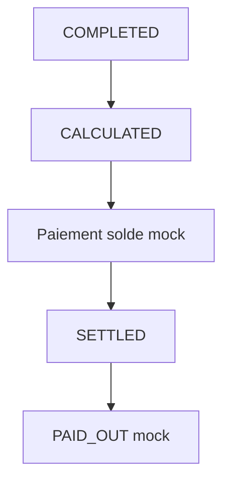

# Domain Storytelling MVP — Étape 7 : Régler et allouer la valeur

> **Document compagnon** du Domain Storytelling complet  
> Source complète : `domain-storytelling-etape-7.md`  
> Objectif : version démontrable (happy path), sans backend, sans auth, **paiement mock uniquement**.

---

## 0. Intention produit

À partir d’un `COMPLETED`, produire un **décompte explicable** : la cliente paie le solde (mock), la coiffeuse voit son net, le statut passe à `SETTLED`.

Valeur à montrer :

* mêmes lignes pour les deux parties (lentilles différentes) ;
* acompte imputé ;
* tip optionnel simple ;
* commission plateforme à 1 taux ;
* reçu + relevé.

Pas de PSP réel, pas de remboursement, pas de dispute.

---

## 1. Principes MVP

| Principe | Application |
| -------- | ----------- |
| Happy path only | Depuis `COMPLETED` uniquement |
| Formule | `final = prix engagé (+ tip)` ; `solde = final − acompte` |
| Commission | 1 taux fixe mock |
| Paiement | Bouton « Payer le solde » → succès mock |
| Payout | Instantané mock `PAID_OUT` |
| Écrans Stitch MVP | S01–S04 générés (`prompts-stitch-mvp.md`) |

---

## 2. Précondition mockée

* dossier exécution `COMPLETED` (étape 6) ;
* engagement prix figé (étape 4) ;
* acompte déjà `SUCCEEDED` ;
* taux commission plateforme (constante).

---

## 3. Périmètre du récit MVP

### Déclencheur

La prestation est terminée ; il faut solder.

### Début

`SETTLEMENT_PENDING`

### Fin nominale

`SETTLED` (+ payout styliste `PAID_OUT` mock).

### Acteurs

**Cliente** (paie solde) ; **Coiffeuse** (voit revenu / reversement).

---

## 4. Objets métier conservés (light)

| Objet | MVP |
| ----- | --- |
| Décompte / lignes | Prix, acompte, tip, solde |
| Règlement final | Calculé puis payé |
| Transaction mock | Confirmation locale |
| Allocation | Net styliste + commission |
| Reversement | Statut mock |
| Preuve financière | Reçu cliente + relevé styliste |
| Pourboire | Optionnel light |

### Exclus

Remboursements, crédits, échecs paiement, multi-bénéficiaires, multi-devises, résolution finance, espèces externes.

---

## 5. Cycle de vie MVP

```text
SETTLEMENT_PENDING
      ↓
CALCULATED
      ↓
PAYMENT_PENDING
      ↓
ALLOCATION_PENDING
      ↓
SETTLED  (+ PAYOUT → PAID_OUT mock)
```

UX peut fusionner en : décompte → payer → settled.

---

## 6. Happy path — récit nominal (6 temps)

### T0 — Recevoir `COMPLETED` + engagement + acompte

### T1 — Calculer le décompte (imputer acompte)

### T2 — Afficher le décompte (cliente + coiffeuse)

### T3 — Tip optionnel

### T4 — Cliente paie le solde (mock)

### T5 — Allouer + reçu / relevé → `SETTLED`

---

## 7. Vue d’ensemble MVP



---

## 8. Conditions minimales de `SETTLED`

* décompte calculé et visible ;
* solde payé (mock) ou solde = 0 ;
* allocation écrite (net + commission) ;
* preuves locales émises.

---

## 9. Données mock / localStorage

| Clé | Contenu |
| --- | ------- |
| `as.mvp.executionDossier` | `COMPLETED` |
| `as.mvp.engagements` | Prix + acompte |
| `as.mvp.settlement` | Lignes + statut |
| `as.mvp.ledgerLines` | Journal light |
| `as.mvp.payout` | `PAID_OUT` |

---

## 10. Écrans — mapping Stitch MVP

Source prompts : `prompts-stitch-mvp.md` (S01–S04).

| # | Dossier | Prompt | Rôle MVP |
| - | ------- | ------ | -------- |
| E0 | `accueil_explicatif_d_compte_r_glement/` | S01 | Accueil / orientation `SETTLEMENT_PENDING` |
| E1 | `r_glement_final_atelier_synergy/` | S02 | Règlement solde cliente (décompte, tip, paiement mock) |
| E2 | `mon_revenu_reversement/` | S03 | Revenu & reversement styliste |
| E3 | `re_u_succ_s_atelier_synergy/` | S04 | Reçu cliente + succès `SETTLED` |

Design system : `atelier_synergy/DESIGN.md`. Assets photo Stitch conservés à côté des écrans.

---

## 11. Ce qu’on coupe

Refunds, `PAYMENT_FAILED`, `REFUND_PENDING`, résolution, fiscal avancé, fraude.

---

## 12. Critère de succès démo

> « Le solde est payé (simulé), la coiffeuse voit son net, le dossier est SETTLED. »

---

## 13. Frontières

| Étape | Lien |
| ----- | ---- |
| Amont 4 | Acompte + règles |
| Amont 6 | `COMPLETED` |
| Aval 8 | `SETTLED` débloque la preuve d’expérience |

---

## 14. Résultat fonctionnel MVP

> **Un règlement MVP calcule un décompte simple, simule le solde et l’allocation, et clôture en SETTLED sans finance réelle.**
