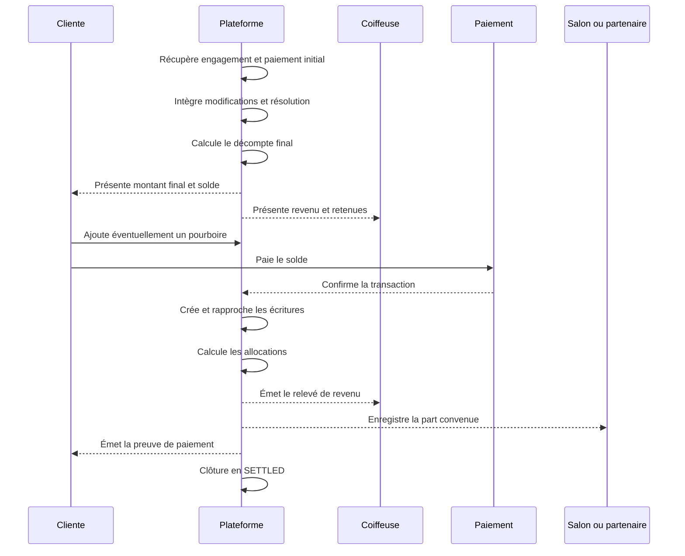
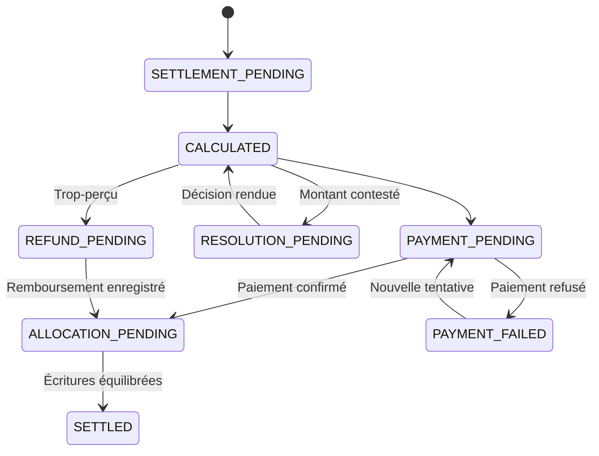

# Domain Storytelling — Étape 7 : Régler et allouer la valeur

L’étape 7 ne doit pas être réduite à un bouton « Payer le solde ».

Elle doit transformer tout ce qui s’est réellement passé — engagement initial, versement déjà effectué, modifications acceptées, prestation complète ou partielle, remboursement éventuel — en une **situation financière finale, compréhensible, traçable et correctement répartie**.

> La cliente paie exactement ce qu’elle doit.
> La coiffeuse comprend exactement ce qu’elle gagne.
> Chaque autre acteur reçoit la part convenue.
> La plateforme peut expliquer chaque montant.

---

## 1. Décision métier

> **Quel montant final est dû, par qui, à qui, et selon quelle justification ?**

Cette décision contient quatre sous-questions :

1. Quelle valeur a finalement été délivrée ?
2. Quel montant a déjà été payé ?
3. Quel solde reste à payer, rembourser ou créditer ?
4. Comment les sommes doivent-elles être réparties ?

---

## 2. Déclencheur et sortie

### Déclencheurs possibles

L’étape commence lorsque :

* la prestation est déclarée `COMPLETED` ;
* la prestation est déclarée `PARTIALLY_COMPLETED` et son traitement financier est déterminé ;
* une résolution fixe les conséquences financières d’un incident ;
* un rendez-vous non réalisé produit malgré tout une décision financière :

  * remboursement ;
  * conservation autorisée d’une somme ;
  * crédit ;
  * compensation.

### Condition préalable

Les faits ayant une incidence financière doivent être stabilisés.

Une prestation en état `RESOLUTION_PENDING` ne peut pas être clôturée financièrement tant que la part contestée n’a pas été arbitrée.

### Sortie

`SETTLED`

Cet état signifie au minimum :

* montant final déterminé ;
* versement initial correctement imputé ;
* solde payé, remboursé ou transformé en crédit ;
* allocations calculées et enregistrées ;
* preuves produites ;
* aucune obligation financière non traitée.

Le versement effectif à la coiffeuse peut avoir son propre état :

* `PAYOUT_PENDING`
* `PAYOUT_PROCESSING`
* `PAID_OUT`
* `PAYOUT_FAILED`

Cela évite de confondre la clôture du règlement avec les délais bancaires de reversement.

---

## 3. Acteurs du domaine

| Acteur                  | Responsabilité                                                                                  |
| ----------------------- | ----------------------------------------------------------------------------------------------- |
| Cliente                 | Consulte le décompte, paie le solde, ajoute éventuellement un pourboire et signale une anomalie |
| Coiffeuse               | Consulte la valeur reconnue, les retenues, son revenu net et le statut de son versement         |
| Plateforme              | Consolide les faits, calcule le règlement, crée les écritures, produit les preuves et clôture   |
| Prestataire de paiement | Encaisse, rembourse, reverse et confirme les mouvements financiers                              |
| Opérateur de résolution | Détermine les conséquences financières lorsqu’un incident ou une contestation existe            |
| Salon ou partenaire     | Reçoit une part lorsque cette répartition était prévue avant la prestation                      |

---

## 4. Objets métier à distinguer

| Objet                    | Fonction                                                                            |
| ------------------------ | ----------------------------------------------------------------------------------- |
| `Engagement`             | Contient le prix, le périmètre et les conditions acceptés à l’étape 4               |
| `Paiement initial`       | Mouvement financier destiné à sécuriser l’engagement                                |
| `Modification consentie` | Changement de prestation, prix ou durée accepté pendant l’étape 6                   |
| `Décision de résolution` | Fixe un remboursement, un crédit, une compensation ou une retenue                   |
| `Règlement final`        | Consolide toutes les composantes pour déterminer le montant net dû                  |
| `Transaction`            | Représente un encaissement ou un remboursement réel                                 |
| `Écriture financière`    | Enregistre la conséquence comptable d’un événement                                  |
| `Allocation`             | Répartit la valeur entre les bénéficiaires                                          |
| `Reversement`            | Représente l’envoi effectif de fonds à la coiffeuse ou à un partenaire              |
| `Preuve financière`      | Reçu cliente, relevé de revenu coiffeuse, preuve de remboursement ou de reversement |
| `Crédit`                 | Droit utilisable ultérieurement, distinct d’un remboursement monétaire              |

Il ne faut donc pas utiliser un seul objet `Paiement` pour représenter simultanément :

* l’acompte ;
* le solde ;
* la commission ;
* le remboursement ;
* le revenu de la coiffeuse ;
* le reversement bancaire.

---

# 5. Histoire métier principale

## Domaine Storytelling nominal

## Récit détaillé

### 1. La plateforme reçoit le résultat opérationnel

L’étape 6 transmet :

* le statut final de la prestation ;
* le début et la fin réels ;
* les modifications acceptées ;
* les suppléments autorisés ;
* les événements ayant affecté la prestation ;
* une éventuelle décision de résolution.

La durée réelle ne modifie pas automatiquement le prix. Elle ne le fait que si une règle préalablement acceptée ou une modification consentie le prévoit.

### 2. La plateforme récupère la référence contractuelle

Elle consulte :

* la version exacte de la proposition acceptée ;
* le prix engagé ;
* les éléments inclus ;
* les frais déjà prévus ;
* les obligations acceptées ;
* la fonction du versement initial ;
* la politique financière applicable au moment de l’engagement.

Les règles ne doivent pas être recalculées à partir de leur version actuelle : la version acceptée au moment de l’engagement reste la référence.

### 3. La plateforme impute le versement initial

Le versement de l’étape 4 est rattaché au règlement final.

Il peut, selon sa fonction juridique et les événements survenus :

* réduire le solde ;
* être partiellement remboursé ;
* être totalement remboursé ;
* être conservé selon une règle acceptée ;
* être transformé en crédit.

Un même versement ne peut être imputé qu’une seule fois.

### 4. La plateforme construit le décompte final

Le règlement est constitué de lignes explicites :

* prix de la prestation engagée ;
* adaptation du prix consentie ;
* frais de déplacement ;
* produits ou fournitures ;
* remise éventuelle ;
* compensation ;
* remboursement ;
* crédit appliqué ;
* pourboire ;
* versement initial déjà reçu ;
* solde restant.

Chaque ligne doit indiquer :

* son montant ;
* son origine ;
* son bénéficiaire ;
* la règle ou l’accord qui la justifie ;
* son impact sur le solde et sur l’allocation.

### 5. Les parties consultent le même décompte

La cliente voit :

* le prix initial ;
* ce qui a été ajouté ou retiré ;
* le paiement déjà effectué ;
* le montant restant à payer ou à recevoir ;
* les raisons de chaque variation.

La coiffeuse voit :

* la valeur totale reconnue ;
* les éléments composant sa rémunération ;
* les commissions et parts déduites ;
* son revenu net ;
* le statut du reversement.

La consultation du décompte n’est pas une nouvelle négociation. Les modifications de prix doivent avoir été consenties au moment où elles sont intervenues.

### 6. La cliente ajoute éventuellement un pourboire

Le pourboire est :

* facultatif ;
* distinct du prix de la prestation ;
* ajouté volontairement après ou à la fin de la prestation ;
* affiché séparément ;
* rattaché à un bénéficiaire déterminé.

La règle précisant si une commission ou des frais s’appliquent au pourboire doit être définie explicitement.

### 7. La plateforme détermine le solde

Formule fonctionnelle :

[
\text{Montant final}
====================

\text{prix engagé}
+
\text{modifications consenties}
+
\text{frais autorisés}
+
\text{pourboire}
----------------

## \text{remises}

\text{ajustements de résolution}
]

[
\text{Solde net}
================

## \text{montant final}

## \text{paiements déjà imputés}

\text{crédits utilisés}
]

* Solde positif : la cliente doit payer.
* Solde nul : aucun nouveau mouvement n’est nécessaire.
* Solde négatif : un remboursement ou un crédit est dû à la cliente.

### 8. Le solde est payé ou remboursé

Selon le résultat :

* la cliente paie le solde ;
* la plateforme déclenche un remboursement ;
* un crédit est créé ;
* un paiement externe est déclaré et rapproché ;
* une anomalie de paiement est signalée.

Le règlement ne doit pas être marqué `SETTLED` sur la seule base d’une tentative de paiement.

### 9. La plateforme alloue la valeur

Après confirmation des mouvements, elle répartit les montants entre :

* la coiffeuse ;
* la plateforme ;
* le salon ;
* un éventuel assistant ou partenaire ;
* le prestataire de paiement, selon le modèle retenu.

Le revenu net de la coiffeuse doit rester explicable ligne par ligne.

### 10. Les preuves sont produites

La cliente reçoit :

* le décompte final ;
* la preuve du paiement ;
* la preuve d’un remboursement ou d’un crédit ;
* le statut de clôture.

La coiffeuse reçoit :

* le montant brut reconnu ;
* les frais et commissions ;
* les autres parts ;
* son revenu net ;
* le statut et la preuve du reversement.

### 11. La plateforme clôture le règlement

Le règlement passe à `SETTLED` lorsque :

* les écritures sont équilibrées ;
* le solde de la cliente est nul ;
* les remboursements et crédits sont enregistrés ;
* les allocations sont déterminées ;
* aucun litige financier bloquant ne subsiste ;
* les preuves sont disponibles.

---

# 6. Variantes métier

| Situation                             | Traitement attendu                                                                   |
| ------------------------------------- | ------------------------------------------------------------------------------------ |
| Prestation réalisée sans modification | Prix engagé moins versement initial                                                  |
| Modification acceptée                 | Nouveau montant ajouté au décompte avec preuve du consentement                       |
| Prestation partielle                  | Application d’un accord ou d’une décision de résolution, pas d’un prorata arbitraire |
| Prix revu à la baisse                 | Réduction du solde ou remboursement du trop-perçu                                    |
| Annulation ou non-réalisation         | Application de la politique acceptée et de la responsabilité déterminée              |
| Pourboire                             | Ligne facultative et séparée                                                         |
| Frais de déplacement                  | Imputables seulement s’ils étaient prévus ou acceptés                                |
| Produit acheté sur place              | Imputable seulement si son prix et son ajout ont été acceptés                        |
| Paiement en espèces ou externe        | Déclaration et preuve minimale, avec possibilité de contestation                     |
| Paiement échoué                       | Règlement conservé dans un état d’attente                                            |
| Montant contesté                      | Bascule de la partie contestée vers la résolution                                    |
| Remboursement partiel                 | Écriture inverse rattachée au paiement d’origine                                     |
| Crédit commercial                     | Création d’un objet `Crédit`, avec montant, motif et conditions d’utilisation        |
| Plusieurs bénéficiaires               | Allocation selon la convention applicable à l’engagement                             |

---

# 7. Règles métier incontournables

## Prix et consentement

* Le prix engagé constitue la base du règlement.
* Aucun supplément ne peut être ajouté unilatéralement après la prestation.
* Une modification ayant un impact financier doit référencer un consentement ou une décision de résolution.
* Le temps réellement passé ne suffit pas, à lui seul, à modifier le prix.
* Une prestation partielle ne produit pas automatiquement un paiement proportionnel à sa durée.

## Versement initial

* Le paiement initial doit être imputé exactement une fois.
* Sa fonction définie à l’étape 4 détermine son traitement.
* Il ne doit pas être confondu avec le revenu net déjà acquis par la coiffeuse.

## Remboursement et crédit

* Un remboursement restitue de l’argent.
* Un crédit crée un droit à utiliser ultérieurement.
* Une remise diminue le prix.
* Une compensation répare un préjudice selon une décision.
* Ces quatre opérations doivent rester distinctes.

## Allocation

* Toute allocation doit avoir un bénéficiaire et une base de calcul.
* Le taux de commission applicable doit être celui prévu lors de l’engagement.
* Il faut préciser si la commission porte sur :

  * la prestation ;
  * les frais de déplacement ;
  * les produits ;
  * le pourboire ;
  * les taxes éventuelles.
* La somme des allocations doit correspondre au montant distribuable.

## Traçabilité

* Une transaction confirmée ne doit pas être supprimée ou réécrite.
* Une correction produit une nouvelle écriture compensatrice.
* Chaque ligne financière doit pointer vers son événement source.
* Toute tentative de paiement doit être protégée contre les doubles débits.
* La plateforme doit conserver la référence du prestataire de paiement.

## Clôture

* Un paiement tenté mais non confirmé ne permet pas `SETTLED`.
* Une contestation financière ouverte bloque la clôture de la part concernée.
* Le solde de la cliente doit être nul après paiement, remboursement ou création du crédit convenu.
* La clôture financière n’empêche pas l’étape 8 de recueillir ensuite les avis et enseignements.

---

# 8. États du règlement

Les états du reversement à la coiffeuse doivent rester séparés de ceux du règlement.

---

# 9. Capacités fonctionnelles par interface

## Côté cliente

* consulter le décompte final ;
* comprendre les écarts par rapport au prix engagé ;
* voir le versement initial imputé ;
* ajouter un pourboire ;
* utiliser un crédit autorisé ;
* payer le solde ;
* choisir un moyen de paiement ;
* consulter la preuve ;
* signaler une anomalie ;
* consulter un remboursement ou un crédit.

## Côté coiffeuse

* consulter le prix final reconnu ;
* voir les modifications financières retenues ;
* consulter les frais, commissions et autres parts ;
* connaître son revenu net ;
* suivre le reversement ;
* télécharger ou consulter son relevé ;
* signaler une incohérence.

## Côté opérateur

* consulter toutes les sources du calcul ;
* appliquer une décision de résolution ;
* déclencher ou enregistrer un remboursement ;
* créer un crédit ;
* rapprocher un paiement externe ;
* corriger par une écriture inverse ;
* relancer un paiement ou un reversement ;
* clôturer manuellement un cas exceptionnel ;
* consulter l’historique auditable.

---

# 10. Périmètre recommandé pour le pilote

## À inclure

* un seul paiement initial par engagement ;
* un seul solde principal ;
* une devise unique ;
* prix engagé figé ;
* modifications consenties structurées ;
* frais de déplacement ;
* produits ou fournitures ;
* pourboire facultatif ;
* remboursement total ou partiel ;
* crédit simple ;
* commission plateforme simple ;
* revenu net coiffeuse ;
* saisie manuelle des décisions de résolution ;
* paiement ou preuve de paiement ;
* décompte cliente ;
* relevé coiffeuse ;
* clôture supervisée ;
* journal des écritures.

## À reporter

* calcul fiscal automatisé multi-régimes ;
* paiement fractionné complexe ;
* plusieurs devises ;
* commissions variables sophistiquées ;
* partage dynamique entre plusieurs intervenants ;
* reversements internationaux ;
* compensation automatique entre plusieurs rendez-vous ;
* détection avancée de fraude ;
* arbitrage financier automatique ;
* rapprochement comptable complet ;
* portefeuille financier interne complexe.

---

# 11. Critères d’acceptation

L’étape peut être considérée comme fonctionnellement cadrée si :

1. Le prix de départ provient de la version exacte de l’engagement.
2. Chaque modification financière possède une justification traçable.
3. Le versement initial est imputé une seule fois.
4. La cliente comprend le passage du prix engagé au montant final.
5. Le revenu net de la coiffeuse peut être recalculé et expliqué.
6. Un paiement échoué ne produit pas une clôture.
7. Un trop-perçu déclenche un remboursement ou un crédit identifiable.
8. Un montant contesté bascule vers la résolution.
9. Les allocations sont équilibrées.
10. La cliente et la coiffeuse disposent de preuves adaptées.
11. Aucune obligation financière ne subsiste lorsque le règlement devient `SETTLED`.

---

# 12. Décisions bloquantes avant développement

Les choix suivants doivent être figés avant d’automatiser cette étape :

* la plateforme encaisse-t-elle uniquement le versement initial ou également le solde ?
* les paiements en espèces ou externes sont-ils autorisés ?
* à quel moment la rémunération devient-elle disponible pour la coiffeuse ?
* qui supporte les frais du prestataire de paiement ?
* sur quelle base la commission est-elle calculée ?
* le pourboire est-il intégralement reversé à la coiffeuse ?
* comment est calculée la part d’un salon ou d’un autre intervenant ?
* qui émet la facture ou le justificatif commercial ?
* la plateforme peut-elle créer des crédits utilisables ultérieurement ?
* la partie non contestée peut-elle être reversée pendant qu’une autre partie reste en résolution ?
* `SETTLED` signifie-t-il « allocations finalisées » ou « tous les bénéficiaires ont effectivement reçu leurs fonds » ?

Ces décisions doivent être validées sur les plans opérationnel, juridique, fiscal et comptable.

---

## Synthèse du domaine

> À partir de l’engagement accepté, du paiement initial et du résultat réel de la prestation, la plateforme construit un décompte final. Elle applique uniquement les modifications consenties ou décidées par résolution, détermine le solde, traite le paiement ou le remboursement, répartit la valeur entre les bénéficiaires, produit les preuves et clôture le règlement en `SETTLED`.

La distinction fondamentale avec l’étape 4 est la suivante :

| Étape 4 — Engagement financier           | Étape 7 — Règlement final                           |
| ---------------------------------------- | --------------------------------------------------- |
| Sécurise la formation de l’engagement    | Clôture la valeur réellement due                    |
| Enregistre un versement initial          | Impute ce versement au montant final                |
| Fige les règles financières              | Applique les règles à ce qui s’est réellement passé |
| Réserve et protège la transaction future | Encaisse, rembourse, alloue et produit les preuves  |

---

# Frontière avec la galerie de prestation

Le règlement clôture la transaction financière. Il ne publie aucun contenu dans la galerie (`SERVICE_GALLERY`). La clôture financière ne vaut pas autorisation de publication.

Une réalisation vérifiée (`VERIFIED_REALIZATION`) ne peut être proposée à la galerie de la **prestation concernée** qu’après clôture pertinente du rendez-vous et des consentements requis, dans le cadre de l’étape 8.
