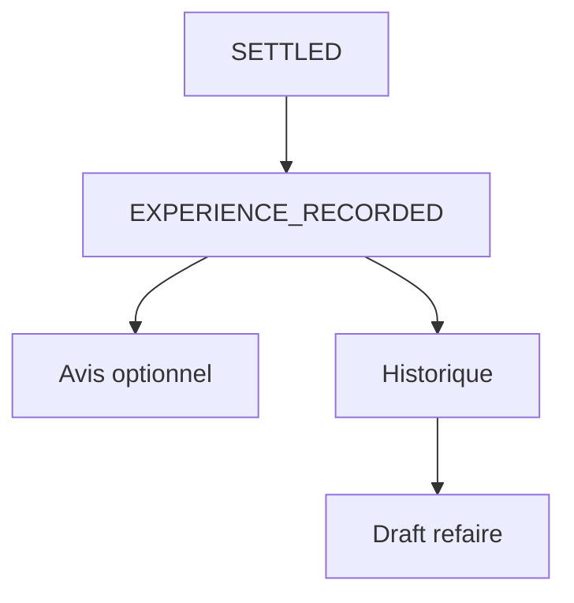

# Domain Storytelling MVP — Étape 8 : Produire la preuve et prolonger la relation

> **Document compagnon** du Domain Storytelling complet  
> Source complète : `domain-storytelling-etape-8.md`  
> Objectif : version démontrable (happy path), sans backend, sans auth, sans paiement.

---

## 0. Intention produit

Après `SETTLED`, produire une **preuve d’expérience factuelle**, collecter un avis multidimensionnel optionnel, laisser la coiffeuse répondre, et permettre de **refaire** la prestation depuis l’historique (avec reconfirmation prix / date / lieu).

Valeur à montrer :

* l’expérience existe même sans avis ;
* feedback multi-critères ;
* réponse styliste ;
* « Refaire cette prestation » → nouvelle demande préremplie.

Pas de modération, pas de moteur de reco, pas de publication galerie obligatoire.

---

## 1. Principes MVP

| Principe | Application |
| -------- | ----------- |
| Happy path only | Outcome OK + avis optionnel |
| Avis non obligatoire | Skip → historique quand même |
| Pas de backend | Mock + `localStorage` |
| Refaire | Prefill + reconfirm (jamais réemploi silencieux) |
| Galerie vérifiée | Hors cœur MVP (bonus) |
| Écrans Stitch MVP | S01–S06 générés (`prompts-stitch-mvp.md`) |

---

## 2. Précondition mockée

* `SETTLED` (étape 7) ;
* faits d’exécution `COMPLETED` ;
* engagement / prix final / styliste.

---

## 3. Périmètre du récit MVP

### Déclencheur

Le règlement est clos ; on capture l’expérience.

### Début

`PROOF_PENDING` → création auto `ExperienceRecord`.

### Fin nominale

`EXPERIENCE_RECORDED` (+ entrée historique ; avis publié optionnel ; draft « refaire » possible).

### Acteurs

**Cliente** + **Coiffeuse** (réponse avis).

---

## 4. Objets métier conservés (light)

| Objet | MVP |
| ----- | --- |
| `ExperienceRecord` | Auto depuis faits |
| Confirmation d’outcome | « Réalisée comme prévu » |
| Feedback multi-dim | Technique, réservation, comm., ponctualité, prix |
| Avis public | Optionnel |
| Réponse styliste | Optionnelle |
| Entrée historique | Toujours |
| `RepeatDemand` | Prefill + reconfirm |
| Favori / consentement | Optionnel light |

### Exclus

Modération (`FLAGGED`), `OUTCOME_DISPUTED`, scoring réputation, CRM/loyalty, publication galerie `VERIFIED_REALIZATION` (bonus seulement).

---

## 5. Cycle de vie MVP

```text
PROOF_PENDING
      ↓
EXPERIENCE_RECORDED
      ↓ (optionnel)
REVIEW_SUBMITTED → REVIEW_PUBLISHED
      ↓ (optionnel)
DRAFT_FROM_HISTORY → REPEAT_DEMAND (prérempli, à reconfirmer)
```

---

## 6. Happy path — récit nominal (7 temps)

### T0 — Création auto de la preuve d’expérience

### T1 — Cliente confirme l’outcome OK

### T2 — Feedback multi-dim (ou skip)

### T3 — Publication partie publique (si avis)

### T4 — Réponse styliste optionnelle

### T5 — Historique toujours visible

### T6 — « Refaire » → demande préremplie + champs à reconfirmer

---

## 7. Vue d’ensemble MVP



---

## 8. Conditions minimales de `EXPERIENCE_RECORDED`

* `SETTLED` amont ;
* enregistrement factuel créé ;
* outcome confirmé (happy) **ou** a minima record auto + entrée historique ;
* avis non requis.

Pour « Refaire » : nouvelle demande id ; ancien prix = référence, non auto-appliqué.

---

## 9. Données mock / localStorage

| Clé | Contenu |
| --- | ------- |
| `as.mvp.settlement` | `SETTLED` |
| `as.mvp.experiences` | Records |
| `as.mvp.feedbacks` | Notes multi-dim |
| `as.mvp.reviews` | Avis + réponses |
| `as.mvp.history` | Liste expériences |
| `as.mvp.repeatDraft` | Demande préremplie |

---

## 10. Écrans — mapping Stitch MVP

Source prompts : `prompts-stitch-mvp.md` (S01–S06).

| # | Dossier | Prompt | Rôle MVP |
| - | ------- | ------ | -------- |
| E0 | `preuve_d_exp_rience_introduction/` | S01 | Accueil post-`SETTLED` — Preuve d’expérience |
| E1 | `confirmation_de_fin_de_prestation/` | S02 | Confirmation preuve / outcome OK |
| E2 | `votre_retour_d_exp_rience/` | S03 | Évaluation multidimensionnelle (+ Skip avis) |
| E3 | `avis_t_moignage_public_review/` | S04 | Avis public + réponse styliste |
| E4 | `mes_exp_riences_historique_refaire/` | S05 | Historique + « Refaire cette prestation » |
| E5 | `succ_s_experience_recorded/` | S06 | Succès `EXPERIENCE_RECORDED` |

Design system : `atelier_synergy/DESIGN.md`.

---

## 11. Ce qu’on coupe

Modération opérateur, contestation outcome, moteur de recommandation, fidélité, anti-fraude, enrichissement galerie obligatoire.

---

## 12. Critère de succès démo

La cliente peut dire :

> « Mon expérience est enregistrée ; je peux laisser un avis ou refaire la même presta sans tout ressaisir — mais je reconfirme prix et date. »

---

## 13. Frontières

| Étape | Lien |
| ----- | ---- |
| Amont 7 | `SETTLED` (gate) |
| Aval | `RepeatDemand` réentre en étape 1 → 2 → … |
| Galerie étape 0 | Bonus seulement, hors cœur |

---

## 14. Résultat fonctionnel MVP

> **Une preuve MVP enregistre l’expérience après SETTLED, permet un avis optionnel et un « refaire » prérempli avec reconfirmation — sans modération ni CRM.**
