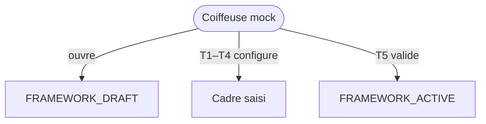

# Domain Storytelling MVP — Avant 0 : Définir le cadre professionnel

> **Document compagnon** du Domain Storytelling complet  
> Source complète : `domain-storytelling-etape-avant-0.md`  
> Objectif : version démontrable (happy path), sans backend, sans auth, sans paiement réel.

---

## 0. Intention produit

Une **coiffeuse** définit **une fois** comment elle exerce (accueil, communication, paiement, sécurité, photos), puis voit son cadre **actif** et réutilisable.

Valeur à montrer :

* elle ne redéfinit pas ses règles à chaque prestation ;
* elle choisit des options guidées (pas un roman juridique) ;
* elle active explicitement → `PROFESSIONAL_FRAMEWORK_ACTIVE`.

---

## 1. Principes MVP

| Principe | Application |
| -------- | ----------- |
| Happy path only | `DRAFT` → `ACTIVE` |
| Pas de règles d’autorisation | Coiffeuse mockée |
| Pas de backend | Mock + `localStorage` |
| Pas d’auth / paiement | Identité préchargée ; moyens de paiement = déclaration |
| Cycles de vie respectés | Statuts utiles seulement |
| Moins de règles, max de valeur | Choix catalogue + validation |
| Écrans manquants | Signalés pour Stitch |

---

## 2. Précondition mockée

Inscription professionnelle déjà faite (profil coiffeuse mock).  
Principes plateforme = texte lecture seule préchargé.

Pas de branche « règles incompatibles ».  
Pas d’opérateur, pas d’admin.

---

## 3. Périmètre du récit MVP

### Déclencheur

La coiffeuse veut exercer via la plateforme et formaliser son mode d’exercice.

### Début

`PROFESSIONAL_FRAMEWORK_DRAFT`

### Fin nominale

`PROFESSIONAL_FRAMEWORK_ACTIVE`

### Acteur

**Coiffeuse** uniquement.

### Acteurs absents

Cliente, opérateur, administrateur.

---

## 4. Objets métier conservés (light)

| Objet | MVP |
| ----- | --- |
| Cadre professionnel | Objet central versionné |
| Contextes d’exercice | Chez moi / salon / déplacement (multi-choix simple) |
| Confidentialité adresse | Oui / non |
| Accueil & accès | Accompagnants, mineurs (booléens + texte court) |
| Communication | Créneaux + délai de réponse indicatif |
| Moyens de paiement | Liste à cocher (espèces, carte, virement, plateforme) |
| Politiques plateforme | 2–3 politiques retard/annulation au catalogue |
| Sécurité / interruption | Motifs simples + règle d’arrêt |
| Consentement photos | Oui / conditions simples |

### Exclus

Rapport de vérification bloquant, exceptions avancées, multi-établissements, scoring conformité, suspension / reconfirmation / retired.

---

## 5. Cycle de vie MVP

```text
PROFESSIONAL_FRAMEWORK_DRAFT
        ↓  (validation explicite)
PROFESSIONAL_FRAMEWORK_ACTIVE
```

États non implémentés : `IN_REVIEW`, `UPDATE_REQUIRED`, `SUSPENDED`, `RETIRED`.

---

## 6. Happy path — récit nominal (6 temps)

### T0 — Accueil

> « Ce n’est pas ce que tu vends. C’est comment tu travailles, une fois pour toutes. »

### T1 — Contextes + confidentialité adresse

### T2 — Accueil & accès (accompagnants, mineurs)

### T3 — Communication + moyens de paiement

### T4 — Politiques catalogue + sécurité + consentement photos

### T5 — Récapitulatif → Activer → `PROFESSIONAL_FRAMEWORK_ACTIVE`

---

## 7. Vue d’ensemble MVP



---

## 8. Conditions minimales de `PROFESSIONAL_FRAMEWORK_ACTIVE`

* ≥ 1 contexte d’exercice ;
* règle confidentialité adresse renseignée ;
* modalités mineurs / accompagnants renseignées ;
* communication (créneau ou délai) ;
* ≥ 1 moyen de paiement ;
* ≥ 1 politique plateforme sélectionnée ;
* consentement photos renseigné ;
* confirmation explicite.

---

## 9. Données mock / localStorage

| Clé | Contenu |
| --- | ------- |
| `as.mvp.professionalFramework` | Draft → Active |
| `as.mvp.platform.policies` | 2–3 politiques catalogue |
| `as.mvp.platform.principles` | Texte fixe lecture seule |

Préremplir des défauts sensés (chez moi, adresse masquée, carte + plateforme, pas d’accompagnant).

---

## 10. Écrans — mapping (Stitch MVP)

Écrans générés depuis `prompts-stitch-mvp.md` (export Stitch).

| Prompt | Dossier | Rôle MVP |
| ------ | ------- | -------- |
| S01 | `cadre_professionnel_accueil/` | T0 accueil explicatif |
| S02 | `cadre_professionnel_contextes/` | T1 contextes + confidentialité |
| S03 | `cadre_professionnel_accueil_acc_s/` | T2 accueil & accès |
| S04 | `cadre_professionnel_communication_paiement/` | T3 comm. + paiement |
| S05 | `cadre_professionnel_politiques_s_curit/` | T4 politiques / sécurité / photos |
| S06 | `cadre_professionnel_r_capitulatif/` | T5 récap + Activer |
| S07 | `cadre_professionnel_succ_s_activation/` | Succès `PROFESSIONAL_FRAMEWORK_ACTIVE` |

Design system : `atelier_synergy/DESIGN.md`.

---

## 11. Ce qu’on coupe

| Zone complète | MVP |
| ------------- | --- |
| `IN_REVIEW` + opérateur | Skip |
| Exceptions prestation/cliente | Reporté |
| Branches déménagement / incompatibilité | Reporté |
| Générateur juridique / scoring | Reporté |

---

## 12. Critère de succès démo

La coiffeuse peut dire :

> « J’ai défini comment j’accueille, comment on me paie, et mon cadre est actif. »

---

## 13. Frontières

| Étape | Lien |
| ----- | ---- |
| Aval étape 0 | Prérequis `PROFESSIONAL_FRAMEWORK_ACTIVE` (ou mock si démo isolée de l’étape 0) |
| Aval 3 / 4 | Héritage lecture seule des règles |

---

## 14. Résultat fonctionnel MVP

> **Un cadre MVP est un mode d’exercice guidé, versionné et activé explicitement, persisté localement, sans contrôle juridique ni opérateur.**
