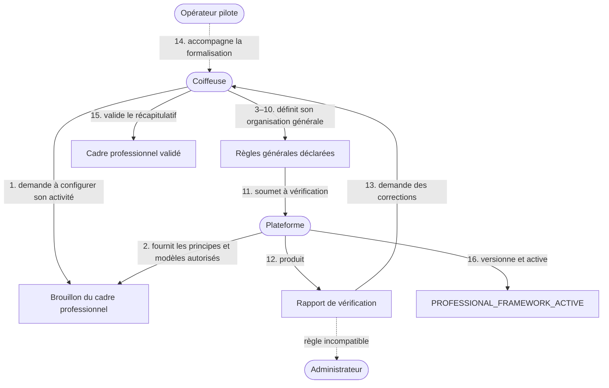
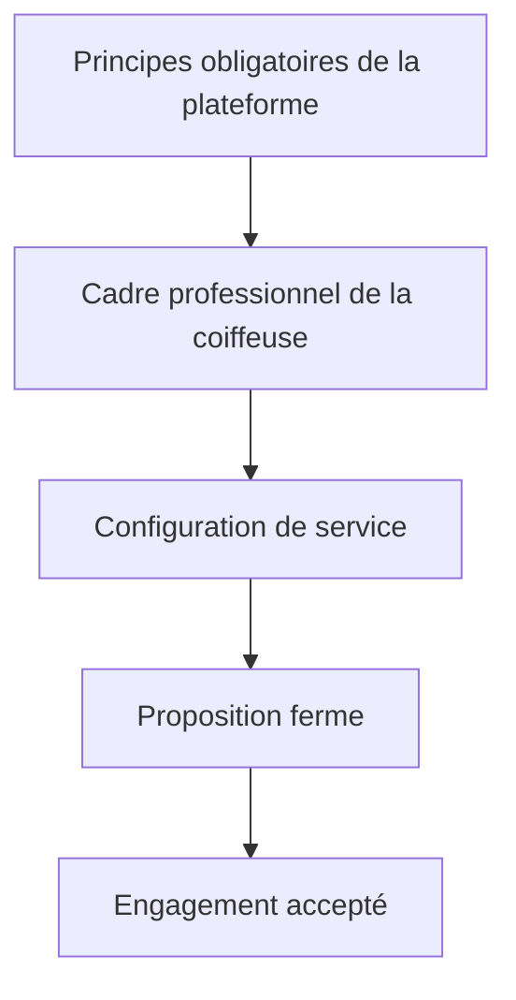

# Domain Storytelling — Définir le cadre professionnel

Le point central est le suivant :

> **La coiffeuse ne doit pas redéfinir ses règles générales pour chaque prestation ou chaque cliente. Elle définit une fois le cadre dans lequel elle accepte d’exercer, puis ce cadre est réutilisé, précisé ou exceptionnellement adapté dans les étapes suivantes.**

Le cadre professionnel ne décrit pas ce que la coiffeuse vend. Il décrit **comment elle exerce son activité de manière générale**.

Il faut donc distinguer cinq objets métier :

| Objet                          | Question traitée                                                          |
| ------------------------------ | ------------------------------------------------------------------------- |
| **Principes de la plateforme** | Quelles règles obligatoires protègent toutes les parties ?                |
| **Cadre professionnel**        | Dans quelles conditions générales la coiffeuse accepte-t-elle d’exercer ? |
| **Configuration de service**   | Sous quelles conditions une prestation particulière est-elle réalisée ?   |
| **Galerie de prestation**      | Comment une prestation précise est-elle présentée et prouvée visuellement ? |
| **Engagement**                 | Quelles règles exactes ont été acceptées pour un rendez-vous donné ?      |

Le document métier constate que les règles sont aujourd’hui dispersées entre bios, stories, sites, messages privés et habitudes non dites. Elles peuvent répondre à des risques réels, mais restent difficiles à comprendre, à prouver et à appliquer de manière réciproque.

---

# 1. Positionnement dans le processus métier

Cette activité intervient avant l’étape 0, mais ne constitue pas une étape transactionnelle du parcours cliente.

Elle appartient à un **flux de configuration professionnelle** :

```text
Inscription professionnelle
        ↓
Cadre professionnel actif
        ↓
Ouverture de capacités professionnelles
        ↓
Réception de demandes
        ↓
Propositions fermes
        ↓
Engagements
```

Le cadre professionnel doit être actif avant que la coiffeuse puisse ouvrir sa première capacité.

Une coiffeuse déjà active peut ensuite le modifier, mais les modifications ne s’appliquent qu’aux futurs engagements.

---

# 2. Périmètre du récit

## Déclencheur

La coiffeuse souhaite exercer ou distribuer ses prestations par l’intermédiaire de la plateforme.

Elle doit définir le cadre général dans lequel elle accepte :

* de recevoir des demandes ;
* d’accueillir ou de rejoindre des clientes ;
* de communiquer ;
* d’être payée ;
* de traiter les modifications et les incidents ;
* d’exercer en sécurité.

## Début

La plateforme crée un brouillon de cadre professionnel.

**Statut initial :**

`PROFESSIONAL_FRAMEWORK_DRAFT`

## Fin nominale

Le cadre est :

* complet ;
* compatible avec les principes obligatoires de la plateforme ;
* compréhensible par une cliente ;
* validé explicitement par la coiffeuse ;
* horodaté et versionné.

Il obtient alors le statut :

`PROFESSIONAL_FRAMEWORK_ACTIVE`

## Acteur décisionnaire

La **coiffeuse**.

Elle définit son organisation et valide le cadre final.

## Acteurs d’assistance

* la **plateforme**, qui structure, vérifie et versionne le cadre ;
* l’**opérateur pilote**, qui peut accompagner la coiffeuse dans sa formalisation ;
* éventuellement l’**administrateur de la plateforme**, lorsqu’une règle proposée entre en conflit avec les principes obligatoires.

## Acteur absent

La cliente n’intervient pas dans la définition initiale.

Elle consulte les règles qui la concernent lorsqu’elle examine une offre ou avant de former un engagement.

---

# 3. Acteurs et responsabilités

| Acteur               | Responsabilité                                                                                             |
| -------------------- | ---------------------------------------------------------------------------------------------------------- |
| **Coiffeuse**        | Décrit son organisation réelle, choisit les options autorisées et valide son cadre                         |
| **Plateforme**       | Fournit les principes obligatoires, structure les règles, contrôle leur cohérence et conserve les versions |
| **Opérateur pilote** | Aide à expliciter les pratiques, identifie les ambiguïtés et accompagne la correction                      |
| **Administrateur**   | Instruit les règles incompatibles, abusives ou insuffisamment définies                                     |
| **Cliente**          | Consulte ultérieurement la version applicable, sans participer à sa définition générale                    |

L’opérateur peut aider à remplir le cadre, mais ne peut pas l’activer sans validation explicite de la coiffeuse. Ce principe prolonge celui déjà retenu pour l’ouverture d’une capacité professionnelle.

---

# 4. Objets métier manipulés

Le récit manipule les objets suivants :

* identité professionnelle ;
* contexte d’exercice ;
* lieu de travail ;
* modalités d’accès ;
* horaires de communication ;
* délai indicatif de réponse ;
* règles relatives aux accompagnants ;
* règles relatives aux mineurs ;
* conditions générales d’accueil ;
* moyens de paiement acceptés ;
* cadre de sécurité ;
* motifs généraux d’interruption ;
* politique de confidentialité de l’adresse ;
* politiques proposées par la plateforme ;
* préférence de politique ;
* exception professionnelle ;
* rapport de vérification ;
* version du cadre professionnel ;
* preuve de validation.

## Objet métier central

`PROFESSIONAL_FRAMEWORK`

Il contient les règles générales que la coiffeuse souhaite appliquer à ses futures capacités, propositions et engagements.

---

# 5. Vue d’ensemble du Domain Story



---

# 6. Récit métier nominal détaillé

## 1 — Ouvrir un brouillon de cadre professionnel

La **coiffeuse** demande à configurer son activité professionnelle.

La **plateforme** crée :

`PROFESSIONAL_FRAMEWORK_DRAFT`

Le brouillon est rattaché à la coiffeuse, et non à une prestation précise.

La plateforme précise que :

* le cadre s’appliquera par défaut à ses futures prestations ;
* certaines règles pourront être précisées à l’étape 0 ;
* aucune modification future ne changera rétroactivement un engagement déjà formé.

---

## 2 — Présenter les principes obligatoires de la plateforme

La **plateforme** présente les principes que la coiffeuse ne peut pas contourner.

Ils comprennent notamment :

* information avant l’engagement ;
* consentement explicite ;
* obligations bilatérales ;
* proportionnalité des réparations ;
* limitation du préjudice ;
* traçabilité ;
* voie de contestation ;
* absence de sanction arbitraire ;
* protection des informations personnelles ;
* respect de la sécurité des deux parties.

Le document distingue précisément les principes stables, les paramètres du cas, les politiques comparables et les barèmes chiffrés. Une coiffeuse peut définir son cadre, mais elle ne peut pas transformer une préférence personnelle en règle absolue contraire à ces principes.

**Objet produit :**

`PLATFORM_MANDATORY_PRINCIPLES`

---

## 3 — Déclarer les contextes généraux d’exercice

La **coiffeuse** indique les cadres dans lesquels elle exerce généralement :

* à son domicile ;
* dans un salon ;
* dans un espace partagé ;
* au domicile de la cliente ;
* dans plusieurs contextes ;
* dans un lieu temporaire ou événementiel.

Elle précise pour chaque contexte :

* s’il est actuellement utilisé ;
* s’il peut accueillir toutes les prestations ou seulement certaines ;
* s’il comporte des contraintes générales ;
* si l’adresse doit rester confidentielle avant l’engagement.

Cette déclaration ne remplace pas les zones et lieux précis d’une capacité. Ceux-ci restent définis à l’étape 0.

---

## 4 — Définir les règles générales d’accès et d’accueil

La **coiffeuse** précise les règles liées à son environnement de travail.

Exemples :

* accompagnants généralement autorisés ou non ;
* enfants accompagnants autorisés ou non ;
* personnes mineures prises en charge ou non ;
* représentant légal obligatoire dans certains cas ;
* accessibilité du lieu ;
* présence éventuelle d’animaux ;
* contraintes d’entrée dans le bâtiment ;
* règles générales de confidentialité de l’adresse ;
* restrictions nécessaires au fonctionnement du lieu.

Une règle doit être formulée comme une condition opérationnelle compréhensible.

Exemple acceptable :

> Le lieu ne permet pas d’accueillir d’accompagnant en raison de l’espace disponible.

Exemple insuffisant :

> Aucun accompagnant, sans exception ni explication.

La plateforme peut demander une justification lorsqu’une règle limite fortement l’accès au service.

---

## 5 — Définir le cadre général de communication

La **coiffeuse** indique :

* les canaux officiels qu’elle accepte ;
* les plages pendant lesquelles elle traite les demandes ;
* son délai indicatif de réponse ;
* les jours pendant lesquels elle ne répond pas ;
* les informations qui doivent rester dans le dossier de rendez-vous ;
* les situations qui nécessitent une notification urgente ;
* les langues dans lesquelles elle peut échanger.

Le délai de réponse est une information de fonctionnement, pas une promesse universelle.

La plateforme ne doit pas transformer la coiffeuse en professionnelle obligée de rester connectée en permanence. Le document interdit d’utiliser silencieusement la vitesse de réponse comme critère dominant et rappelle qu’elle ne doit pas créer une obligation permanente de connexion.

---

## 6 — Définir les conditions générales d’admission

La **coiffeuse** déclare les situations générales dans lesquelles elle peut ou ne peut pas intervenir.

Exemples :

* clientèle adulte uniquement ;
* prestations possibles pour les enfants à partir d’un âge défini ;
* situations nécessitant obligatoirement un échange préalable ;
* refus de réaliser une prestation sur un état manifestement incompatible ;
* refus d’utiliser certains produits apportés par la cliente ;
* absence de prise en charge de situations relevant d’un professionnel de santé ;
* impossibilité d’exercer lorsque la sécurité ne peut pas être garantie.

Ces règles doivent rester générales.

Les contre-indications liées à une technique particulière seront précisées dans la configuration de service de l’étape 0.

---

## 7 — Définir les règles générales de comportement

La **coiffeuse** définit les comportements nécessaires à une relation de travail acceptable.

Cela peut couvrir :

* respect mutuel ;
* absence de violence ou de menace ;
* absence de harcèlement ;
* respect du lieu et du matériel ;
* interdiction de filmer ou publier sans consentement ;
* interdiction de modifier la prestation de manière unilatérale ;
* possibilité d’interrompre une interaction en cas de danger.

Ces règles doivent s’appliquer aux deux parties.

La coiffeuse ne peut pas exiger de la cliente un comportement qu’elle-même ou ses collaborateurs ne seraient pas tenus de respecter.

---

## 8 — Déclarer les moyens de paiement acceptés

La **coiffeuse** indique les moyens de paiement qu’elle peut techniquement recevoir :

* paiement par la plateforme ;
* carte ;
* virement ;
* espèces ;
* autre moyen autorisé.

Elle précise également :

* les moyens acceptés pour le solde ;
* si elle peut fournir un justificatif ;
* la manière dont les pourboires doivent lui être transmis ;
* les éventuelles contraintes pratiques liées au paiement.

Le moyen de paiement accepté est une règle générale.

En revanche, le montant, la fonction juridique du versement initial, le solde et la répartition financière appartiennent à l’engagement et au domaine financier. Le document impose que la fonction de chaque versement soit nommée avant toute conservation ou restitution automatique.

---

## 9 — Sélectionner les politiques opérationnelles proposées

Pour les sujets pouvant affecter les deux parties, la coiffeuse ne rédige pas nécessairement une politique libre.

La **plateforme** peut proposer plusieurs cadres comparables concernant :

* retard ;
* report ;
* annulation ;
* absence ;
* modification ;
* impossibilité de poursuivre ;
* communication d’un incident.

La **coiffeuse** sélectionne les politiques compatibles avec son activité et renseigne les paramètres nécessaires.

Exemple :

* délai habituellement nécessaire pour remplacer un créneau ;
* existence de coûts préparatoires ;
* possibilité générale de report ;
* conditions générales de replanification ;
* temps minimal nécessaire pour réévaluer une prestation après un retard.

Elle ne définit pas automatiquement :

* un pourcentage arbitraire conservé ;
* une sanction unilatérale ;
* une pénalité indépendante du préjudice ;
* une règle plus protectrice pour elle que pour la cliente sans justification.

Le terrain montre précisément que les règles de retard unilatérales et les conditions asymétriques affaiblissent la confiance, même lorsque la qualité technique est satisfaisante.

---

## 10 — Définir les règles générales de sécurité et d’interruption

La **coiffeuse** indique dans quelles circonstances elle doit pouvoir :

* refuser de commencer ;
* suspendre temporairement ;
* adapter ;
* interrompre définitivement une prestation.

Les motifs peuvent comprendre :

* danger pour la cliente ;
* danger pour la coiffeuse ;
* état incompatible non déclaré ;
* produit dangereux ou inconnu ;
* comportement violent ou menaçant ;
* impossibilité technique manifeste ;
* absence de consentement à une adaptation indispensable.

La plateforme exige que les conséquences possibles soient définies :

* information de la cliente ;
* constat structuré ;
* recherche d’une alternative ;
* report ;
* clôture partielle ;
* déclenchement d’une résolution.

L’interruption ne doit pas devenir une décision arbitraire sans trace.

---

## 11 — Définir les règles générales de confidentialité et de consentement

La **coiffeuse** précise :

* si son adresse reste masquée avant l’engagement ;
* si elle souhaite demander l’autorisation de photographier le résultat ;
* dans quelles conditions une photo peut être publiée ;
* si le visage peut apparaître ;
* si les échanges peuvent être utilisés comme preuve en cas d’incident ;
* quelles informations ne doivent jamais être rendues publiques.

Le consentement à la réalisation d’une prestation ne vaut pas consentement :

* à être photographiée ;
* à la publication d’une photo dans la galerie d’une prestation ;
* à être filmée ;
* à être publiée ;
* à recevoir de la prospection commerciale.

Chaque usage doit être distingué.

---

## 12 — Définir les possibilités d’exception

La **coiffeuse** indique quelles règles :

* ne connaissent aucune exception pour une raison objective ;
* peuvent être remplacées par une condition spécifique de prestation ;
* peuvent être adaptées dans une proposition ferme ;
* nécessitent une validation administrative.

Exemple :

| Règle générale                   | Exception possible                                                              |
| -------------------------------- | ------------------------------------------------------------------------------- |
| Aucun accompagnant               | Représentant légal requis pour une prestation enfant                            |
| Paiement du solde par carte      | Espèces exceptionnellement acceptées dans un engagement précis                  |
| Adresse masquée avant engagement | Adresse communiquée plus tôt si une vérification d’accessibilité est nécessaire |
| Pas de déplacement habituel      | Déplacement exceptionnel proposé dans une offre ferme                           |

Une exception ne modifie pas le cadre général.

Elle est attachée à :

* une prestation ;
* une proposition ;
* ou un engagement précis.

---

## 13 — Soumettre le cadre au contrôle

La **coiffeuse** soumet son cadre à la **plateforme**.

Le statut devient :

`PROFESSIONAL_FRAMEWORK_IN_REVIEW`

La plateforme vérifie :

* la complétude ;
* la lisibilité ;
* l’absence de contradiction ;
* la conformité aux principes obligatoires ;
* la réciprocité ;
* la présence d’une méthode de résolution ;
* la distinction entre règle générale et condition de prestation ;
* la distinction entre préférence personnelle et contrainte objective ;
* la présence de conséquences explicites lorsqu’une règle est enfreinte ;
* l’absence de sanction non encadrée.

**Objet produit :**

`PROFESSIONAL_FRAMEWORK_CHECK_REPORT`

---

## 14 — Corriger les incohérences

Lorsque la plateforme détecte une anomalie, elle maintient le cadre en révision.

Exemples d’incohérences :

* retard cliente sanctionné, mais retard coiffeuse non traité ;
* acompte annoncé comme non remboursable dans toutes les situations ;
* accompagnants interdits alors que la coiffeuse accepte les mineurs sans prévoir le représentant légal ;
* paiement uniquement en espèces alors que l’offre annonce un règlement intégral sur la plateforme ;
* adresse dite confidentielle mais affichée publiquement ;
* interruption possible sans motif ni processus de résolution ;
* politique d’annulation sans méthode, plafond ni voie de contestation ;
* règle propre à une prestation placée dans le cadre général.

La plateforme demande une correction ciblée plutôt qu’une réécriture complète.

---

## 15 — Accompagner la formalisation pendant le pilote

Pendant le pilote, l’**opérateur** peut organiser un échange avec la coiffeuse.

Il peut :

* demander comment elle travaille aujourd’hui ;
* identifier les règles actuellement transmises en DM ou en story ;
* séparer une habitude d’une règle réellement nécessaire ;
* distinguer le général du spécifique ;
* reformuler une règle pour qu’elle soit compréhensible ;
* vérifier que la conséquence est proportionnée ;
* renseigner le brouillon pour le compte de la coiffeuse.

L’opérateur ne doit pas :

* inventer une règle ;
* choisir une politique à la place de la coiffeuse ;
* valider une sanction non prévue par la plateforme ;
* activer le cadre sans son accord.

---

## 16 — Valider le récapitulatif du cadre professionnel

La **coiffeuse** reçoit une synthèse structurée.

Elle vérifie notamment :

* où elle exerce ;
* comment l’accès est organisé ;
* quand et comment elle communique ;
* qui elle peut recevoir ;
* quels moyens de paiement elle accepte ;
* quelles règles relationnelles s’appliquent ;
* comment les incidents généraux sont traités ;
* quelles règles peuvent connaître une exception ;
* quelles informations sont visibles par la cliente.

Elle confirme :

> Ce cadre représente les conditions générales dans lesquelles j’accepte d’exercer.

Cette validation produit une preuve horodatée.

---

## 17 — Activer le cadre professionnel

La **plateforme** :

* enregistre la version ;
* horodate la validation ;
* attribue un numéro de version ;
* conserve la preuve de l’accord ;
* attribue le statut `PROFESSIONAL_FRAMEWORK_ACTIVE` ;
* autorise l’ouverture de capacités professionnelles.

La plateforme distingue :

* les informations internes ;
* les informations publiquement visibles ;
* les règles affichées uniquement avant l’engagement ;
* les informations communiquées après confirmation.

---

# 7. Cycle de vie du cadre professionnel

```text
PROFESSIONAL_FRAMEWORK_DRAFT
                ↓
PROFESSIONAL_FRAMEWORK_IN_REVIEW
                ↓
PROFESSIONAL_FRAMEWORK_ACTIVE
          ↙             ↘
UPDATE_REQUIRED       SUSPENDED
          ↓             ↓
PROFESSIONAL_FRAMEWORK_ACTIVE
                ↓
PROFESSIONAL_FRAMEWORK_RETIRED
```

| Statut            | Signification                                                                             |
| ----------------- | ----------------------------------------------------------------------------------------- |
| `DRAFT`           | Le cadre est incomplet ou non soumis                                                      |
| `IN_REVIEW`       | La plateforme vérifie sa cohérence                                                        |
| `ACTIVE`          | Il peut être utilisé pour ouvrir des capacités                                            |
| `UPDATE_REQUIRED` | Une modification réglementaire, opérationnelle ou organisationnelle exige une mise à jour |
| `SUSPENDED`       | Aucune nouvelle capacité ne peut être ouverte sous ce cadre                               |
| `RETIRED`         | Le cadre n’est plus utilisé pour de nouvelles activités                                   |

## Effet d’une suspension

La suspension :

* empêche l’ouverture de nouvelles capacités ;
* peut retirer les capacités non engagées du matching ;
* ne supprime pas l’historique ;
* ne modifie pas les engagements déjà acceptés ;
* n’annule pas automatiquement les rendez-vous existants.

---

# 8. Modèle d’héritage des règles

Le cadre professionnel fonctionne comme un ensemble de valeurs par défaut.



## Ordre d’application

1. **Principes obligatoires de la plateforme**
2. **Cadre professionnel actif**
3. **Conditions propres à la prestation**
4. **Adaptations de la proposition ferme**
5. **Conditions figées dans l’engagement**

## Exemple d’héritage

### Cadre général

> Aucun accompagnant n’est accepté en raison de l’espace disponible.

### Configuration de service

> Pour une prestation destinée à une personne mineure, un représentant légal doit rester présent.

### Proposition ferme

> La cliente est mineure ; le représentant légal est identifié et accepté.

### Engagement

> La présence du représentant légal fait partie des conditions acceptées pour ce rendez-vous.

---

# 9. Règles métier structurantes

1. **Une coiffeuse ne possède qu’un cadre professionnel actif à un instant donné.**

2. **Toutes les versions antérieures restent conservées.**

3. **Le cadre professionnel ne remplace pas la configuration d’une prestation.**

4. **Une règle générale s’applique par défaut à toutes les capacités futures.**

5. **Une condition plus précise peut remplacer une règle générale si l’exception est explicite.**

6. **Une exception ne s’applique qu’à l’objet auquel elle est rattachée.**

7. **Une modification du cadre n’altère jamais un engagement existant.**

8. **La coiffeuse choisit son organisation, mais ne peut pas contourner les principes obligatoires.**

9. **Toute règle limitant fortement la cliente doit répondre à une contrainte identifiable.**

10. **Toute règle produisant une conséquence financière doit être encadrée par une politique autorisée.**

11. **Une sanction unilatérale et automatique est interdite.**

12. **Toute interruption doit produire une trace et une orientation de résolution.**

13. **Les règles visibles doivent être formulées dans un langage compréhensible par la cliente.**

14. **Une information ne doit être collectée que si elle sert une décision, une protection ou une preuve.**

15. **Le cadre actif doit être reconfirmé lorsque l’organisation professionnelle change significativement.**

---

# 10. Conditions exactes de `PROFESSIONAL_FRAMEWORK_ACTIVE`

Le cadre peut être activé uniquement si :

* au moins un contexte d’exercice est déclaré ;
* les modalités générales d’accès sont renseignées ;
* le cadre de communication est défini ;
* les situations générales acceptées ou refusées sont identifiables ;
* les moyens de paiement techniquement acceptés sont déclarés ;
* les règles relationnelles sont bilatérales ;
* les règles de sécurité et d’interruption sont définies ;
* les modalités de confidentialité de l’adresse sont connues ;
* les usages des photos et contenus sont soumis au consentement ;
* les politiques sensibles proviennent d’un cadre autorisé ;
* aucune règle n’entre en contradiction avec les principes obligatoires ;
* les exceptions possibles sont identifiables ;
* aucune incohérence bloquante ne subsiste ;
* la coiffeuse a validé explicitement le récapitulatif.

---

# 11. Branches alternatives

## Branche A — La coiffeuse n’a pas encore formalisé ses règles

La coiffeuse travaille principalement par habitudes ou messages privés.

L’opérateur :

1. recueille ses pratiques actuelles ;
2. identifie les problèmes qu’elles cherchent à prévenir ;
3. sépare les règles générales des conditions de prestation ;
4. convertit les pratiques en propositions structurées ;
5. soumet le résultat à la coiffeuse.

Le système ne doit pas copier automatiquement une liste de conditions depuis une story ou une bio sans validation.

---

## Branche B — Une règle proposée est incompatible

Exemple :

> Toute cliente en retard de dix minutes perd automatiquement la totalité de son versement, quelle que soit la situation.

La plateforme :

1. bloque l’activation ;
2. indique les principes concernés ;
3. propose une politique compatible ;
4. demande à la coiffeuse de renseigner ses contraintes réelles ;
5. transmet à l’administrateur en cas de désaccord.

---

## Branche C — Le cadre change après un déménagement

La coiffeuse modifie :

* son lieu d’exercice ;
* ses règles d’accès ;
* son rayon de déplacement ;
* la confidentialité de son adresse.

La plateforme :

1. crée une nouvelle version ;
2. identifie les capacités affectées ;
3. demande leur reconfirmation ;
4. conserve l’ancienne version pour les engagements existants ;
5. applique la nouvelle version aux nouvelles propositions.

---

## Branche D — Une exception est demandée pour une prestation

La coiffeuse n’a pas besoin de modifier son cadre général.

Elle crée une exception dans la configuration de service.

Exemple :

* cadre : pas d’accompagnant ;
* prestation enfant : représentant légal obligatoire.

---

## Branche E — Une exception concerne une seule cliente

La règle est adaptée dans la proposition ferme.

Exemple :

* nécessité d’un accompagnant pour une situation d’accessibilité ;
* accès anticipé à l’adresse ;
* moyen de paiement exceptionnel ;
* horaire de communication spécifique.

L’exception est ensuite figée dans l’engagement si les deux parties l’acceptent.

---

# 12. Frontière avec l’étape 0

La distinction doit rester stricte.

| Cadre professionnel                               | Étape 0 — Capacité professionnelle         |
| ------------------------------------------------- | ------------------------------------------ |
| Comment la coiffeuse exerce-t-elle généralement ? | Que souhaite-t-elle vendre maintenant ?    |
| Règles d’accueil générales                        | Conditions propres à la prestation         |
| Moyens de paiement acceptés                       | Prix et versement applicables              |
| Contextes habituels d’exercice                    | Lieu et zone de cette capacité             |
| Cadre relationnel                                 | Répartition des tâches de cette prestation |
| Règles générales de sécurité                      | Limites techniques spécifiques             |
| Conditions par défaut                             | Configuration réellement mobilisable       |
| Stable jusqu’à modification                       | Limitée dans le temps et en volume         |

L’étape 0 produit une capacité vendable à partir :

* d’une prestation ;
* de ses variantes ;
* de sa galerie de présentation et de réalisations ;
* d’une configuration de service ;
* d’un lieu ;
* d’une période ;
* d’un volume ;
* de conditions précises.

Le cadre professionnel constitue seulement son socle par défaut.

La galerie n’appartient pas au cadre professionnel. Elle appartient à la prestation (`SERVICE_GALLERY`) et reste normalement stable entre plusieurs capacités. Une capacité réutilise cette galerie, éventuellement filtrée selon les variantes réellement proposées ; elle ne crée pas de galerie générale au niveau de la coiffeuse.

Le cadre définit uniquement les règles générales de confidentialité, de prise de photo et de publication. L’étape 0 applique ces règles aux contenus de chaque galerie de prestation. Les types de contenus (`VERIFIED_REALIZATION`, `DECLARED_REALIZATION`, `REFERENCE_INSPIRATION`) et leur affichage sont définis à l’étape 0, pas dans le cadre.

---

# 13. Frontière avec les étapes 3 et 4

## Étape 3 — Proposition ferme

La coiffeuse vérifie que :

* son cadre professionnel est compatible avec la demande ;
* les conditions de la prestation suffisent ;
* une exception doit éventuellement être proposée ;
* le prix, la durée, le lieu et les responsabilités sont acceptables.

## Étape 4 — Engagement

La plateforme consolide :

```text
Principes obligatoires
+ cadre professionnel applicable
+ conditions de la prestation
+ adaptations de la proposition
= engagement exact
```

La cliente ne valide pas un ensemble de documents dispersés.

Elle reçoit une seule synthèse indiquant :

* ses obligations ;
* les obligations de la coiffeuse ;
* les règles opérationnelles ;
* les exceptions ;
* les règles de modification ;
* les mécanismes de résolution.

---

# 14. Périmètre recommandé pour le pilote

## À conserver

* contexte général d’exercice ;
* confidentialité de l’adresse ;
* règles d’accompagnement ;
* prise en charge ou non des mineurs ;
* horaires et délai indicatif de communication ;
* moyens de paiement acceptés ;
* règles générales de comportement ;
* consentement aux photos ;
* règles générales de sécurité et d’interruption ;
* sélection parmi quelques politiques de plateforme ;
* validation et versionnement ;
* héritage vers les capacités ;
* modifications non rétroactives.

## À traiter manuellement

* contrôle des règles ambiguës ;
* instruction des exceptions ;
* vérification de la proportionnalité ;
* accompagnement de la coiffeuse ;
* arbitrage des règles refusées par la plateforme.

## À reporter

* générateur juridique automatique de conditions ;
* personnalisation illimitée des politiques ;
* scoring automatique de conformité ;
* analyse automatique des règles publiées sur les réseaux ;
* moteur complexe de détection des clauses abusives ;
* gestion multi-établissements avancée ;
* règles différentes pour chaque segment de clientèle ;
* automatisation complète des exceptions.

---

# 15. Décisions à arbitrer avant le backlog

| Question                                                              | Recommandation pour le pilote                                                                      |
| --------------------------------------------------------------------- | -------------------------------------------------------------------------------------------------- |
| La coiffeuse peut-elle écrire librement toutes ses règles ?           | Non. Choix guidé, champs structurés et texte libre limité                                          |
| Combien de cadres actifs par coiffeuse ?                              | Un cadre actif, versionné                                                                          |
| Une règle générale peut-elle être remplacée par une prestation ?      | Oui, avec une exception explicite                                                                  |
| Qui peut bloquer une règle ?                                          | Plateforme ou administrateur selon des critères connus                                             |
| Les règles sont-elles toutes publiques ?                              | Non. Séparer règles publiques, précontractuelles et internes                                       |
| Une modification affecte-t-elle les rendez-vous existants ?           | Non                                                                                                |
| Le cadre doit-il expirer ?                                            | Pas nécessairement, mais reconfirmation après changement significatif ou période définie           |
| Les politiques d’annulation sont-elles entièrement personnalisables ? | Non pour le pilote ; proposer quelques politiques cohérentes                                       |
| La plateforme valide-t-elle juridiquement les règles ?                | Non. Elle contrôle leur cohérence fonctionnelle, sous réserve d’une validation juridique distincte |
| Une coiffeuse peut-elle ouvrir une capacité sans cadre actif ?        | Non                                                                                                |

---

# 16. Résultat fonctionnel

À la fin du récit, la plateforme possède un cadre qui permet de répondre clairement aux questions suivantes :

* Dans quel environnement la coiffeuse exerce-t-elle ?
* Comment peut-on accéder à son lieu de travail ?
* Quand et comment communique-t-elle ?
* Quelles situations générales accepte-t-elle ?
* Quels comportements sont incompatibles avec la prestation ?
* Quels moyens de paiement peut-elle recevoir ?
* Quelles règles de confidentialité applique-t-elle ?
* Comment la sécurité et les interruptions sont-elles traitées ?
* Quelles règles peuvent être précisées ou remplacées plus tard ?
* Quelle version du cadre s’applique à une transaction donnée ?

La principale conclusion du Domain Storytelling est donc :

> **L’objet métier central n’est pas une page de “conditions générales” destinée à protéger unilatéralement la coiffeuse. C’est un cadre professionnel structuré, versionné et compatible avec les principes de la plateforme, qui rend son mode d’exercice prévisible avant même l’ouverture d’une prestation.**

Ce cadre évite à la coiffeuse de négocier ou de défendre sa manière de travailler à chaque demande, tout en empêchant que ses règles deviennent opaques, asymétriques ou découvertes après l’engagement.
