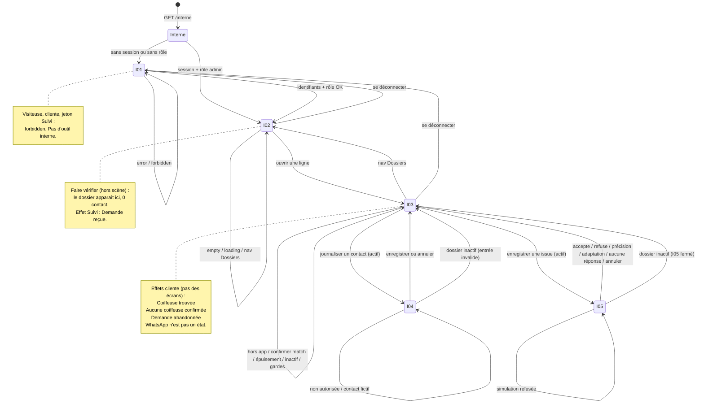

# Transitions admin / conciergerie de lancement

## Statut

**STEP 4 du cadrage admin (D19–D21).** Table de transitions entre I01–I05. Ce fichier n’est pas une spec d’écrans, ni un prompt Stitch.

Il ne remplace pas les transitions cliente. Les six états de **Suivi** sont des **effets** sur `/suivi/:jeton`, jamais des destinations admin.

Prochaine étape du protocole : **specs d’écrans admin**. Pas de Stitch avant ces specs.

## Sources verrouillées

- [D19–D21](../user-stories/decisions-produit.md)
- [US-ADM-01 à US-ADM-09](../user-stories/admin-conciergerie-lancement/user-stories.md)
- [storyboard-admin.md](./storyboard-admin.md) (moments A1–A10)
- [user-flow-admin.md](./user-flow-admin.md) (écrans I01–I05, URLs, sorties)

« Coiffeuse trouvée » au lancement n’est **pas** le dossier **READY** de l’étape 8 (D04). C’est un oui humain consigné **et** la reconfirmation du lieu, du budget et de la période (D20).

## Conventions

Colonnes : **De** · **Tu fais** · **Tu arrives** · **Ce qui se passe** · **Règle**.

**Tu** = opératrice Alex, sauf lignes dont **De** est la cliente (hors cet outil).

**Tu arrives** — ensemble fermé :

| Valeur | Signification |
|---|---|
| **I01** `/interne/connexion` | Connexion interne |
| **I02** `/interne/dossiers` | File |
| **I03** `/interne/dossiers/:id` | Fiche |
| **I04** `/interne/dossiers/:id/contact` | Journaliser un contact |
| **I05** `/interne/dossiers/:id/issue` | Enregistrer une issue |
| **on reste** | Même écran (éventuellement autre variante). Pas d’URL nouvelle. |
| **hors MVP** | Geste absent ou refusé (D21). Pas d’écran, pas de branche. |

Le **Suivi** cliente n’est **jamais** une destination de cette table. Il apparaît seulement dans **Ce qui se passe**, comme **effet**.

Pas de 6ᵉ écran métier. Contact téléphone / WhatsApp / mail = **hors app** : **on reste** sur I03 ; I04 **journalise**, n’ouvre pas WhatsApp.

---

## Redirections (`/interne` n’est pas un écran)

| De | Tu fais | Tu arrives | Ce qui se passe | Règle |
|---|---|---|---|---|
| `/interne` | Tu ouvres l’URL, session + rôle admin / conciergerie | **I02** `/interne/dossiers` | La file s’ouvre. Pas un 6ᵉ écran. | D19, US-ADM-08 |
| `/interne` | Tu ouvres l’URL, sans session ou sans rôle | **I01** `/interne/connexion` | La file n’est pas visible. | US-ADM-08 |
| **I01** | Tu es déjà authentifiée avec le rôle | **I02** `/interne/dossiers` | Redirection. Pas un 2ᵉ écran de login. | I01 Branche |
| I02–I05 (URL directe) | Tu colles l’URL sans session | **I01** `/interne/connexion` | I02–I05 ne s’ouvrent pas. | US-ADM-08 |
| I02–I05 (URL directe) | Tu colles l’URL, compte **sans** le rôle | **I01** (`forbidden`) | La file, la fiche, I04 et I05 restent fermés. | US-ADM-08 |

---

## Pont — Faire vérifier (cliente, hors scène)

La cliente ne navigue pas dans cet outil. Le dossier **apparaît dans I02**.

| De | Tu fais | Tu arrives | Ce qui se passe | Règle |
|---|---|---|---|---|
| Cliente fil A (hors cet outil) | Elle envoie **Faire vérifier** | **I02** (apparition ; pas une navigation admin) | Dossier unique, rattaché à la demande QUALIFIED et à **cette** candidate. **Personne n’est contacté.** Pas d’OTP. Effet Suivi : **Demande reçue**. | US-ADM-01, D12, D19, D20 |
| Cliente fil B (hors cet outil) | Elle envoie **Faire vérifier** | **I02** (apparition ; pas une navigation admin) | Dossier unique, rattaché à **cette offre seule**. Aucun QUALIFIED inventé. **Personne n’est contacté.** Effet Suivi : **Demande reçue**. | US-ADM-01, D19 |
| Même envoi déjà fait | Elle rejoue Faire vérifier | **on reste** (pas de 2ᵉ ligne I02) | Aucun second dossier. | US-ADM-01 |
| **I02**, juste après le pont | Tu consultes la file | **on reste** (I02) | La ligne est identifiable, **jamais** libellée match confirmé / **Coiffeuse trouvée** du seul matching. | US-ADM-01, US-ADM-06 |

---

## Chrome interne (I02–I05)

Pas un écran. Présent sur I02–I05.

| De | Tu fais | Tu arrives | Ce qui se passe | Règle |
|---|---|---|---|---|
| **I02** | Tu tapes **Dossiers** | **on reste** (I02) | Seul item métier. | Chrome |
| **I03** / **I04** / **I05** | Tu tapes **Dossiers** | **I02** `/interne/dossiers` | Formulaire I04/I05 non enregistré = dossier inchangé. | Chrome |
| I02–I05 | Tu te déconnectes | **I01** `/interne/connexion` | Session fermée. | I01 Branche |
| I02–I05 | Tu tapes Matching, Vagues, Messages ou Rendez-vous | **hors MVP** | Ces items n’existent pas. | D21 |
| I02–I05 | Tu affiches le chrome cliente Découvrir / Ma demande / Suivi | **hors MVP** | Chrome interne seulement. | D19 |

---

## I01 — Connexion interne `/interne/connexion`

Porte du rôle. Ce n’est pas `/admin/connexion`.

| De | Tu fais | Tu arrives | Ce qui se passe | Règle |
|---|---|---|---|---|
| **I01** | Tu saisis des identifiants valides **et** tu as le rôle admin / conciergerie | **I02** `/interne/dossiers` | Session ouverte. Pas de file avant succès. | US-ADM-08 |
| **I01** | Tu saisis des identifiants invalides | **on reste** (I01 `error`) | La file ne s’ouvre pas. | US-ADM-08 |
| **I01** | Tu t’authentifies avec un compte **sans** le rôle | **on reste** (I01 `forbidden`) | La file ne s’ouvre pas. | US-ADM-08 |
| **I01** | Une visiteuse ou une cliente présente un jeton de Suivi | **on reste** (I01 `forbidden`) | Aucun droit interne. Le Suivi de **ce** dossier reste côté cliente (**effet**, pas un écran admin). | US-ADM-08 |
| **I01** | Une coiffeuse cherche un compte, une file ou un écran de réponse | **hors MVP** | Ces objets n’existent pas au lancement. | US-ADM-08, US-ADM-09 |
| **I01** | Tu ouvres la file, une fiche ou `/admin` comme succédané de connexion | **hors MVP** | Pas de porte de secours. | I01 Interdit |
| **I01** | Tu crées un compte coiffeuse, un OTP cliente ou un magic link dossier | **hors MVP** | Absents au lancement. | D21, US-ADM-09 |

---

## I02 — File de dossiers `/interne/dossiers`

Moment **A1**. Liste opérable. Pas un dashboard de matching.

| De | Tu fais | Tu arrives | Ce qui se passe | Règle |
|---|---|---|---|---|
| **I02** `loading` | Tu attends le chargement | **on reste** (I02 `loading`) | Même URL. Pas de faux dossiers. | I02 variante |
| **I02** `empty` | Tu consultes une file vide | **on reste** (I02 `empty`) | Aucune ligne inventée. | I02 variante |
| **I02** `happy` | Tu ouvres une ligne (dossier **actif**) | **I03** `/interne/dossiers/:id` | Fiche de **ce** dossier. Inès ne mélange pas Léa. | US-ADM-02, US-ADM-08 |
| **I02** | Tu ouvres une ligne **inactif** / abandonné | **I03** (`inactif`) | Visible comme tel. Contact / issue / confirmation **fermés**. | US-ADM-07 |
| **I02** | Tu libelles une candidate algorithmique **Coiffeuse trouvée** | **hors MVP** | Interdit tant que US-ADM-06 n’est pas vrai. | US-ADM-06 |
| **I02** | Tu contactes toutes les coiffeuses ou tu « élargis » | **hors MVP** | Pas de bouton. Pas d’ajout silencieux. | D21, US-ADM-09 |
| **I02** | Tu ouvres KPI, cycles de matching, vagues, carte ou calendrier RDV | **hors MVP** | Pas un mega-admin. | D21 |
| **I02** | Tu fusionnes la file avec `/admin` (catalogue) | **hors MVP** | Créer une offre ≠ traiter un dossier. | D19, US-ADM-02 |

---

## I03 — Fiche dossier `/interne/dossiers/:id`

Moments **A2**, **A3** (qui joindre ; le contact est hors app), **A6**, effets **A7**, notes du fil 2.

| De | Tu fais | Tu arrives | Ce qui se passe | Règle |
|---|---|---|---|---|
| **I03** actif | Tu tapes **Journaliser un contact** | **I04** `/interne/dossiers/:id/contact` | Formulaire de consignation. Pas un messager. | US-ADM-04, A4 |
| **I03** actif | Tu tapes **Enregistrer une issue** | **I05** `/interne/dossiers/:id/issue` | Un écran, cinq valeurs D20. | US-ADM-05 |
| **I03** | Tu lis la synthèse fil A | **on reste** (I03 `fil_a`) | Besoin, **cette** candidate, raisons, à confirmer. Incertitudes = incertitudes. | US-ADM-02, A2 |
| **I03** | Tu lis la synthèse fil B | **on reste** (I03 `fil_b`) | Offre choisie et à confirmer. **Aucun** QUALIFIED inventé. | US-ADM-02 |
| **I03** | Tu identifies qui est joignable puis tu appelles / WhatsApp / mail **hors app** | **on reste** (I03) | Nolaya n’envoie rien. **Pas** d’écran WhatsApp. Suivi inchangé tant que non consigné. | US-ADM-03, A3, D20 geste 3 |
| **I03** déjà contactée (journal existant) | Tu relis la fiche | **on reste** (I03) | Journal interne visible. Tu peux encore I04 / I05 si le dossier est actif. | US-ADM-04 |
| **I03** déjà contactée | Tu « contactes dans l’app » | **on reste** (I03) | Le contact reste hors app ; seule I04 journalise. | US-ADM-03 |
| **I03** | Un rappel / WhatsApp arrive hors plateforme | **I04** (`entrant`) | **Même** dossier. Pas un second. | US-ADM-04 |
| **I03** | Issue **accepte** **et** lieu + budget + période reconfirmés : tu **confirmes le match** | **on reste** (I03) | **Effet** Suivi **Coiffeuse trouvée**. Pas READY, pas RDV, pas de 6ᵉ écran. | US-ADM-06, A6, A7, D20 |
| **I03** | Tu confirmes le match sans oui humain, ou sans lieu, ou sans budget, ou sans période | **on reste** (I03) | Refus. Suivi **≠** **Coiffeuse trouvée**. | US-ADM-06 |
| **I03** | Issue **accepte** seule (reconfirmations manquantes) | **on reste** (I03) | Pas encore **Coiffeuse trouvée**. | A5, US-ADM-05 |
| **I03** | Politique de contact des **autorisées** épuisée : tu **consignes l’épuisement** | **on reste** (I03) | **Effet** Suivi **Aucune coiffeuse confirmée**. Fait humain, pas un moteur de relances. | US-ADM-07, A8, A9 |
| **I03** | Tu marques le dossier inactif / retiré | **on reste** (I03 `inactif`) | **Effet** Suivi **Demande abandonnée**. Plus de nouveau contact. | US-ADM-07 |
| **I03** `inactif` | Tu tapes journaliser, issue ou confirmer | **on reste** (I03 `inactif`) | Sorties fermées. | US-ADM-07 |
| **I03** | Autre destinataire **déjà autorisée** : tu la joints hors app | **on reste** (I03) | Puis I04 pour consigner. Suivi **Recherche en cours** tant qu’il n’y a ni confirmation ni épuisement. Pas d’ajout silencieux. | US-ADM-03 |
| **I03** dossier Inès | Tu t’attends aux données de Léa | **on reste** (I03) | Isolation : les deux dossiers ne se mélangent pas. | US-ADM-08 |
| **I03** | **adaptation** consignée : tu l’acceptes **au nom** de la cliente | **hors MVP** | Refus. Le match n’est pas confirmé de ce fait. | US-ADM-05, US-ADM-09 |
| **I03** | Tu ajoutes ou contactes une coiffeuse **non autorisée** | **hors MVP** | Refus. Dossier inchangé. | US-ADM-03, US-ADM-09 |
| **I03** | Tu ouvres une messagerie / « envoyer le message » | **hors MVP** | Pas d’URL `/interne/dossiers/:id/message`. | D21 |
| **I03** | Tu ouvres accord, paiement, fiche RDV, préparation ou avis | **hors MVP** | **Coiffeuse trouvée** ne les déclenche pas. | D21, US-ADM-06 |
| **I03** | Tu exiges un OTP ou tu vérifies le canal cliente | **hors MVP** | Coordonnées **déclarées**. | D15, D21 |
| **I03** | Tu simules un contact ou une réponse depuis la fiche | **hors MVP** | Faits = I04 / I05 seulement. | US-ADM-04, US-ADM-09 |
| **I03** | Tu inventes un QUALIFIED pour le fil B | **hors MVP** | Offre seule. | US-ADM-02 |
| **I03** | Tu habilles les raisons de matching en confirmation professionnelle | **hors MVP** | Les incertitudes restent des incertitudes. | US-ADM-02 |
| **I03** | Tu ouvres `/admin` comme s’il s’agissait de ce dossier | **hors MVP** | Outils distincts. | D19 |

---

## I04 — Journaliser un contact `/interne/dossiers/:id/contact`

Moment **A4**. Consignation. **Pas** un écran WhatsApp.

| De | Tu fais | Tu arrives | Ce qui se passe | Règle |
|---|---|---|---|---|
| **I04** `sortant` | Tu consignes canal + horodatage + interlocutrice **autorisée** (contact **réel**) | **I03** `/interne/dossiers/:id` | Journal enrichi. **Effet** Suivi **Recherche en cours** si aucune issue D20 plus forte n’impose autre chose. | US-ADM-04, A4, D20 |
| **I04** `entrant` | Tu consignes un rappel reçu hors plateforme | **I03** `/interne/dossiers/:id` | Même dossier. Journal. Effet selon faits déjà consignés (souvent **Recherche en cours**). | US-ADM-04 |
| **I04** | Tu annules | **I03** `/interne/dossiers/:id` | Dossier inchangé. | I04 Sortie |
| **I04** | Tu choisis une destinataire **non autorisée** | **on reste** (I04 `refuse_non_autorisee`) | Dossier inchangé. | US-ADM-03, US-ADM-09 |
| **I04** | Tu consignes un contact **fictif** (aucun contact réel) | **on reste** (I04) | Refus. Le Suivi n’avance pas comme si le contact avait existé. | US-ADM-04, US-ADM-09 |
| **I03** `inactif` | Tu ouvres I04 | **I03** (`inactif`) | Entrée I04 invalide. | I04 Branche |
| **I04** | La coiffeuse n’a pas de compte Nolaya | **on reste** (I04) | L’absence de compte / file / écran de réponse **ne bloque pas** la consignation hors app. | US-ADM-03 |
| **I04** | Tu envoies SMS, WhatsApp ou e-mail **depuis Nolaya** | **hors MVP** | I04 journalise ; elle n’ouvre pas WhatsApp. | D21, US-ADM-03 |
| **I04** | Tu ouvres un fil de discussion, des pièces « chat » ou une relance automatique | **hors MVP** | Pas de messagerie. | D21 |
| **I04** | Tu crées un second dossier pour le rappel hors plateforme | **hors MVP** | Un dossier unique. | US-ADM-04 |
| **I04** | Tu exposes le journal à la cliente | **hors MVP** | Elle ne voit ni journal, ni canaux, ni motifs. | US-ADM-07, US-ADM-08 |

---

## I05 — Enregistrer une issue `/interne/dossiers/:id/issue`

Moments **A5, A8, A9, A10**. Cinq valeurs D20, **un** écran. La confirmation de match n’est **pas** ici.

| De | Tu fais | Tu arrives | Ce qui se passe | Règle |
|---|---|---|---|---|
| **I05** | Tu enregistres **accepte** (réponse réelle) | **I03** `/interne/dossiers/:id` | Issue, auteur, horodatage. Match **pas** confirmé. Suivi **≠** **Coiffeuse trouvée**. | US-ADM-05, A5 |
| **I05** | Tu enregistres **refuse** | **I03** `/interne/dossiers/:id` | Distinct d’**aucune réponse**. Pas une faute exposée. Suivi **Recherche en cours** tant qu’il n’y a ni confirmation, ni épuisement, ni abandon. | US-ADM-05, A8 |
| **I05** | Tu enregistres **aucune réponse** (tentatives utiles réelles) | **I03** `/interne/dossiers/:id` | Distinct d’un refus. Ne vaut **jamais** acceptation. Suivi **Recherche en cours** jusqu’à épuisement. | US-ADM-05, A9 |
| **I05** | Tu enregistres **précision** et tu rattaches **une** question ciblée | **I03** `/interne/dossiers/:id` | Pas de chat. **Effet** Suivi **Précision nécessaire**. | US-ADM-05, A10, US-ADM-07 |
| **I05** | Tu enregistres **adaptation** (changement proposé) | **I03** `/interne/dossiers/:id` | Pas d’acceptation au nom de la cliente. Pas de confirmation de match. | US-ADM-05 |
| **I05** | Tu annules | **I03** `/interne/dossiers/:id` | Dossier inchangé. | I05 Sortie |
| **I05** | Tu enregistres une issue **comme si** elle avait répondu, sans réponse réelle | **on reste** (I05) | Refus. Suivi inchangé. | US-ADM-05, US-ADM-09 |
| **I03** `inactif` | Tu ouvres I05 | **I03** (`inactif`) | I05 fermé. | I05 Branche |
| **I03**, après **refuse** ou **aucune réponse**, **une seule** autorisée | Tu consignes l’épuisement | **on reste** (I03) | **Effet** **Aucune coiffeuse confirmée**. Geste fiche, pas un 6ᵉ écran issue. | A8, A9, US-ADM-07 |
| **I03**, après **refuse**, une **autre déjà autorisée** | Tu journalises un contact vers elle | **I04** `/interne/dossiers/:id/contact` | Pas d’ajout silencieux. Suivi **Recherche en cours**. | Branches US-ADM |
| **I05** | Tu confirmes le match depuis I05 (même sur **accepte**) | **hors MVP** | Confirmation = geste **I03** seulement, après les trois reconfirmations. | I05 Interdit, US-ADM-06 |
| **I05** | Tu acceptes l’**adaptation** au nom de la cliente | **hors MVP** | Refus. | US-ADM-09 |
| **I05** | Tu ouvres une messagerie « pour préciser » | **hors MVP** | Question ciblée rattachée au dossier, pas un chat. | D21 |
| **I05** | Tu retiens une proposition, tu ouvres l’étape 8, le paiement ou un RDV | **hors MVP** | US-07 hors lancement. | D21 |
| **I05** | Tu traites **aucune réponse** comme une acceptation | **hors MVP** | Deux valeurs distinctes. | US-ADM-05 |
| **I05** | Tu exposes le motif interne à la cliente | **hors MVP** | Elle ne voit que l’état de Suivi autorisé. | US-ADM-07 |

---

## Effets cliente (pas des destinations)

`/suivi/:jeton` n’est pas un écran de cet outil. Projections D20 :

| Fait réel (geste admin) | Écran du geste | **Effet** Suivi |
|---|---|---|
| Dossier créé, aucun contact consigné | Pont → **I02** | **Demande reçue** |
| Traitement ou contact réel consigné | **I04** (retour **I03**) | **Recherche en cours** |
| Issue **précision** | **I05** (retour **I03**) | **Précision nécessaire** |
| **accepte** + lieu + budget + période reconfirmés, match confirmé | **I03** (**on reste**) | **Coiffeuse trouvée** |
| Épuisement de la politique de contact des **autorisées**, sans confirmation | **I03** (**on reste**) | **Aucune coiffeuse confirmée** |
| Dossier retiré / inactif | **I03** `inactif` (**on reste**) | **Demande abandonnée** |
| **accepte** seul | **I05** → **I03** | **≠** **Coiffeuse trouvée** (souvent **Recherche en cours**) |
| **refuse** / **aucune réponse** / **adaptation**, sans épuisement | **I05** → **I03** | **Recherche en cours** (sauf **précision**) |

La cliente ne voit ni journal, ni canaux, ni motifs internes. Pas d’onglet **Rendez-vous**.

---

## Diagramme d’états

États = écrans I01–I05. Les libellés Suivi sont des **effets**, pas des états de navigation.

---

## Couverture des sorties user-flow

Chaque **Sortie** de [user-flow-admin.md](./user-flow-admin.md) a une ligne. Destinations = I01–I05, **on reste**, **hors MVP**, ou Suivi comme **effet**.

| Sortie user-flow | Ligne |
|---|---|
| `/interne` → I02 si session admin, sinon I01 | Redirections |
| I01 session + rôle → I02 | I01 |
| I01 échec identifiants → rester (`error`) | I01 **on reste** |
| I01 compte sans rôle → rester (`forbidden`) | I01 **on reste** |
| I01 jeton Suivi : aucun droit | I01 **on reste** ; Suivi = **effet** cliente |
| I01 déjà authentifiée → I02 | Redirections |
| I02–I05 se déconnecter → I01 | Chrome |
| I02 ouvrir une ligne → I03 | I02 |
| I02 nav Dossiers : ici | Chrome **on reste** |
| I02 dossier inactif → I03 `inactif` | I02 |
| I02 sans rôle → I01 `forbidden` | Redirections |
| I03 journaliser → I04 | I03 |
| I03 enregistrer une issue → I05 | I03 |
| I03 confirmer le match → rester ; **effet** Coiffeuse trouvée | I03 **on reste** |
| I03 épuisement → rester ; **effet** Aucune coiffeuse confirmée | I03 **on reste** |
| I03 marquer inactif → I03 `inactif` ; **effet** Demande abandonnée | I03 **on reste** |
| I03 retour / nav Dossiers → I02 | Chrome |
| I03 joindre hors app (pas une sortie in-app) | I03 **on reste** |
| I03 confirmation refusée (garde) | I03 **on reste** |
| I03 `inactif` : sorties fermées | I03 **on reste** |
| I03 contact hors plateforme → I04 `entrant` | I03 |
| I04 enregistrement accepté → I03 ; **effet** Recherche en cours | I04 |
| I04 annuler → I03 | I04 |
| I04 destinataire non autorisée | I04 **on reste** (`refuse_non_autorisee`) |
| I04 dossier inactif | I04 → I03 `inactif` |
| I05 **accepte** → I03 ; pas Coiffeuse trouvée | I05 |
| I05 **refuse** → I03 | I05 |
| I05 **précision** → I03 ; **effet** Précision nécessaire | I05 |
| I05 **adaptation** → I03 | I05 |
| I05 **aucune réponse** → I03 | I05 |
| I05 annuler → I03 | I05 |
| I05 simulation | I05 **on reste** |
| I05 dossier inactif | I05 → I03 `inactif` |
| Interdits D21 (messagerie, OTP, RDV, non autorisée, simulation, mega-admin, US-07…) | **hors MVP** dans I01–I05 |

---

## Hors MVP — D21 (rappel)

Aucune ligne de ce fichier n’invente d’URL ni de sortie pour :

- espace coiffeuse self-service, compte professionnel, lien de réponse autonome ;
- plan de vague, stratégies de présélection, relances automatiques, messagerie libre ;
- OTP / vérification du canal cliente ;
- accord versionné, double validation, paiement, fiche et onglet Rendez-vous, préparation, avis ;
- contacter une coiffeuse non autorisée ;
- accepter une modification **au nom** de la cliente ;
- simuler un contact ou une réponse ;
- mega-admin « cycles de matching » / dashboard d’annonces à la place de cette file ;
- US-07.1 à US-07.5, workflow US-06 complet, US-PRO-* in-app ;
- `/admin` catalogue comme canon des dossiers.

## Ce que STEP 5 devra fixer (sans l’écrire ici)

Specs d’écrans admin pour I01–I05 (zones, copy, variantes `empty` / `error` / `forbidden` / `inactif` / cinq issues). Pas de 6ᵉ écran. Pas de Stitch.
