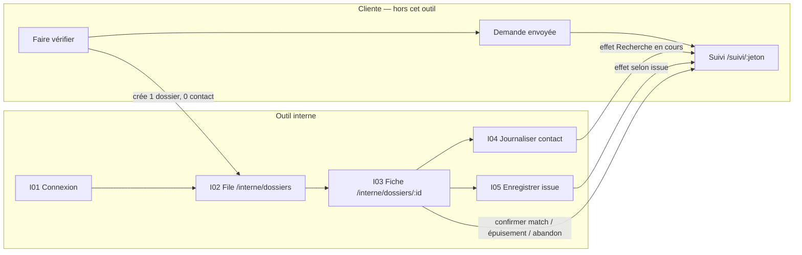
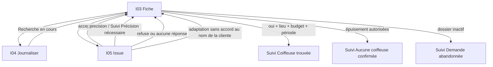

# User-flow admin / conciergerie de lancement

## Statut

**STEP 3 du cadrage admin (D19–D21).** Inventaire d’écrans et URLs de l’outil interne. Ce fichier n’est pas une table de transitions, ni une spec d’écrans, ni un prompt Stitch.

Il ne remplace pas le user-flow cliente. Le pont **Faire vérifier → dossier** est décrit ici uniquement comme **arrivée dans la file** ; les écrans cliente (coordonnées, confirmation, Suivi) restent dans [`user-flow.md`](./user-flow.md) s’il est présent.

Transitions admin (STEP 4) : [transitions-admin.md](./transitions-admin.md) — **à jour**. Prochaine étape du protocole : **specs d’écrans admin**. Pas de Stitch avant ces specs.

## Sources verrouillées

- [D19–D21](../user-stories/decisions-produit.md)
- [US-ADM-01 à US-ADM-09](../user-stories/admin-conciergerie-lancement/user-stories.md)
- [storyboard-admin.md](./storyboard-admin.md) (moments A1–A10)
- [README user stories](../user-stories/README.md)

« Coiffeuse trouvée » au lancement n’est **pas** le dossier **READY** de l’étape 8 (D04). C’est un oui humain consigné **et** la reconfirmation du lieu, du budget et de la période (D20).

Ce flux n’est **pas** un mega-admin : pas de tableau de bord de cycles de matching, pas de plan de vague, pas d’espace coiffeuse, pas de fusion avec le catalogue d’offres.

## Principes

1. **Outil interne distinct.** Les dossiers vivent sous `/interne/…`. Le catalogue d’offres `/admin` reste un autre outil (D19). On n’y cherche pas un dossier de conciergerie.
2. **Chrome interne.** Sidebar / nav simple. Jamais le chrome cliente **Découvrir / Ma demande / Suivi**. Jamais d’onglet **Rendez-vous**.
3. **Peu d’écrans.** File, fiche, journaliser un contact, enregistrer une issue — plus une porte d’authentification. Les six états de **Suivi** sont des **effets** sur l’écran cliente `/suivi/:jeton`, pas des écrans admin.
4. **Contact hors app.** Téléphone, WhatsApp ou messagerie habituelle. Nolaya n’envoie pas le message. Il n’existe pas d’écran messagerie.
5. **Un dossier, deux fils, mêmes URLs.** Fil A (QUALIFIED + candidate) et fil B (offre seule) sont des **variantes de contenu** de la fiche, pas deux applications.
6. **Faits consignés, jamais simulés.** Sans journal, le Suivi ne peut pas avancer comme si le contact avait eu lieu. Une issue sans réponse réelle est refusée.
7. **Match confirmé = oui + trois reconfirmations.** `accepte` seul ne suffit pas. La confirmation est un geste **sur la fiche**, pas un 6ᵉ écran, pas READY, pas un RDV.
8. **Minimisation.** La synthèse destinée à la coiffeuse ne contient ni coordonnées directes de la cliente, ni adresse exacte. La cliente ne voit ni journal, ni canaux, ni motifs internes.
9. **Rôle admin / conciergerie.** Une visiteuse, une cliente, un jeton de Suivi ou une coiffeuse n’ouvrent pas cet outil (US-ADM-08).
10. **Rien de D21** n’est un écran, une sortie ou une branche (voir [Hors MVP](#hors-mvp--d21)).

## Chrome interne

Pas un écran. Présent sur I02–I05.

| Élément | Rôle |
|---|---|
| Marque | « Nolaya interne » · conciergerie de lancement |
| Nav | **Dossiers** → `/interne/dossiers` (seul item métier) |
| Session | Identité opératrice · **Se déconnecter** → `/interne/connexion` |
| Hors chrome | Catalogue `/admin` (autre outil) · chrome cliente · inbox · cycles de matching · RDV |

Taper **Dossiers** n’ouvre que la file. Aucun 2ᵉ item « Matching », « Vagues », « Messages » ou « Rendez-vous ».

## Inventaire (5 écrans)

| ID | Écran | URL | Moments | Variantes (même URL) |
|---|---|---|---|---|
| **I01** | Connexion interne | `/interne/connexion` | US-ADM-08 | `form` · `error` · `forbidden` |
| **I02** | File de dossiers | `/interne/dossiers` | A1 | `loading` · `empty` · `happy` |
| **I03** | Fiche dossier | `/interne/dossiers/:id` | A2, A3, A6, A7 (effet), notes fil 2 | `fil_a` · `fil_b` · `actif` · `inactif` |
| **I04** | Journaliser un contact | `/interne/dossiers/:id/contact` | A4 | `sortant` · `entrant` · `refuse_non_autorisee` |
| **I05** | Enregistrer une issue | `/interne/dossiers/:id/issue` | A5, A8, A9, A10 | `accepte` · `refuse` · `precision` · `adaptation` · `aucune_reponse` |

Redirections, **pas des écrans** : `/interne` → I02 si session admin, sinon I01.

### Pas des écrans

| Adresse ou objet | Comportement |
|---|---|
| Téléphone / WhatsApp / mail | Hors Nolaya. L’app n’ouvre pas un fil de discussion. |
| `/suivi/:jeton` | Écran **cliente**. Effet des gestes I04 / I05 / I03. Pas dans ce chrome. |
| `/soumission`, `/soumission/confirmation` | Écrans **cliente** du pont. Créent le dossier ; n’ouvrent pas l’outil interne. |
| `/admin`, `/admin/connexion`, `/admin/professionnelles` | Catalogue d’offres. Distinct. Non canonique pour les dossiers. |
| `/interne/dossiers/:id/message` | N’existe pas (D21 : pas de messagerie libre). |
| `/interne/vagues`, `/interne/matching`, `/interne/rdv` | N’existent pas. |
| Espace coiffeuse, file coiffeuse, lien de réponse | N’existent pas au lancement. |
| Six états de Suivi comme six URLs admin | Interdit. Un seul Suivi cliente, six **variantes**. |

---

## Pont cliente ↔ admin

Côté cliente (inchangé). Inès (fil A) ou Léa (fil B) envoie **Faire vérifier**. À cet instant :

- un **dossier unique** est créé ;
- **personne n’est contacté** ;
- pas d’OTP ;
- Suivi cliente = **Demande reçue** ;
- le rejeu du même envoi ne crée pas un second dossier.

Côté admin : le dossier **apparaît dans I02**. Alex n’a rien à saisir pour le faire naître.

Si [`user-flow.md`](./user-flow.md) existe : le pont cliente s’arrête à S11–S13 ; l’outil interne commence ici. Ne pas dupliquer les écrans cliente dans ce fichier.

Les états D20 projetés sur **Suivi** (jamais comme écrans admin) :

| Fait réel | Suivi cliente |
|---|---|
| Dossier créé, aucun contact consigné | **Demande reçue** |
| Traitement ou contact réel consigné | **Recherche en cours** |
| Issue **précision** | **Précision nécessaire** |
| Oui humain **et** lieu + budget + période reconfirmés | **Coiffeuse trouvée** |
| Politique de contact des autorisées épuisée, sans confirmation | **Aucune coiffeuse confirmée** |
| Dossier retiré ou inactif | **Demande abandonnée** |

---

## I01 — Connexion interne `/interne/connexion`

Porte du rôle **admin / conciergerie**. Ce n’est pas le login catalogue `/admin/connexion`, même si la session Auth peut être partagée plus tard (transitions).

**Entrées**

- URL `/interne/connexion`.
- Redirection depuis `/interne` ou depuis I02–I05 sans session / sans rôle.
- Tentative d’une visiteuse, d’une cliente ou d’un jeton de Suivi présenté à `/interne/…`.

**Contenu**

- Identification opératrice (e-mail / mot de passe ou équivalent Auth déjà utilisé par Nolaya interne).
- Rappel court : outil de **dossiers**, pas le catalogue d’offres.
- Pas de chrome cliente. Pas de file visible avant succès.

**Sorties**

- Session + rôle admin / conciergerie → **I02** `/interne/dossiers`.
- Échec d’identifiants → rester sur I01 (`error`).
- Compte sans le rôle → rester sur I01 (`forbidden`) ; la file ne s’ouvre pas.
- Jeton de Suivi cliente : **aucun** droit ici ; le Suivi de **ce** dossier reste côté cliente.

**Branche**

- Déjà authentifiée avec le rôle → I01 redirige vers I02 (pas un 2ᵉ écran).
- Après déconnexion depuis I02–I05 → retour I01.

**Interdit**

- Ouvrir la file, une fiche, ou le catalogue comme succédané de connexion.
- Créer un compte coiffeuse, un OTP cliente, un « magic link » dossier.
- Chrome Découvrir / Ma demande / Suivi.

---

## I02 — File de dossiers `/interne/dossiers`

Moment **A1**. Liste opérable. Pas un dashboard de matching.

**Entrées**

- I01 réussie.
- Nav **Dossiers**.
- Retour depuis I03.
- Un dossier vient d’être créé par **Faire vérifier** (fil A ou B) : il est déjà dans la liste.

**Contenu**

- Liste des dossiers de conciergerie, identifiables : référence, prénom déclaré, fil A ou B, destinataire **autorisé**, état de Suivi projeté, recence.
- Un dossier n’est **jamais** libellé match confirmé / **Coiffeuse trouvée** du seul fait du matching.
- Variante `empty` : file vide, pas de faux dossiers.
- Variante `loading` : même URL.

**Sorties**

- Ouvrir une ligne → **I03** `/interne/dossiers/:id`.
- Se déconnecter → I01.
- Nav **Dossiers** : ici.

**Branche**

- Deux clientes : la ligne d’Inès ne mélange pas Léa (US-ADM-08).
- Dossier inactif / abandonné : reste visible comme tel ; l’ouvrir mène à I03 `inactif`.
- Sans rôle : pas cette URL — I01 `forbidden`.

**Interdit**

- KPI, cycles de matching, vagues, relances automatiques, carte, calendrier RDV.
- Bouton « contacter toutes les coiffeuses » ou « élargir ».
- Présenter une candidate algorithmique comme confirmée.
- Fusionner avec `/admin` (créer une offre ≠ traiter un dossier).
- Chrome cliente.

---

## I03 — Fiche dossier `/interne/dossiers/:id`

Moments **A2** (synthèse), **A3** (qui est joignable — le contact lui-même est hors app), **A6** (reconfirmation + confirmation), effets **A7** et notes du fil 2. Un seul écran pour les deux fils.

**Entrées**

- I02, ligne du dossier.
- Retour depuis I04 ou I05.
- URL directe `/interne/dossiers/:id` avec session + rôle (sinon I01).

**Contenu**

- Identité du dossier : référence, fil A ou B, état de Suivi **projeté** (ce que voit la cliente), auteur interne des derniers faits.
- **Fil A (`fil_a`)** : besoin versionné, **cette** candidate, raisons de matching, éléments à confirmer. Les incertitudes restent des incertitudes.
- **Fil B (`fil_b`)** : l’offre choisie et les éléments à confirmer. **Aucun** besoin QUALIFIED inventé.
- Destinataires **autorisés** par Faire vérifier — uniquement ceux-là. Coordonnées professionnelles utiles pour appeler **hors app**.
- Canal **déclaré** de la cliente (prénom + téléphone **ou** e-mail), clairement **non vérifié par OTP** — pour recontacter Inès / Léa si besoin, pas pour le coller dans la synthèse coiffeuse.
- Synthèse **destinable à la coiffeuse** : sans coordonnées directes de la cliente, sans adresse exacte.
- Journal interne en lecture (canal, horodatage, interlocutrice) — la cliente ne le voit pas.
- Issues déjà consignées (valeur, auteur, horodatage) dans **ce** dossier unique.
- Faits de reconfirmation **lieu**, **budget**, **période** (présents ou manquants).
- Variante `inactif` : dossier retiré ; plus de nouveau contact.

**Sorties**

- **Journaliser un contact** → **I04**.
- **Enregistrer une issue** → **I05**.
- **Confirmer le match** — seulement si issue **accepte** **et** lieu + budget + période reconfirmés → rester sur I03 ; effet cliente **Coiffeuse trouvée**. Ce n’est pas READY.
- **Consigner l’épuisement** de la politique de contact des autorisées (fait humain, pas un moteur) → rester sur I03 ; effet **Aucune coiffeuse confirmée**.
- **Marquer inactif / retiré** → I03 `inactif` ; effet **Demande abandonnée**.
- Retour / nav **Dossiers** → I02.
- Joindre Aïcha : **hors app** (pas une sortie in-app). L’écran peut afficher le moyen de contact ; il n’envoie rien.

**Branche**

- Confirmation refusée s’il manque le oui humain, le lieu, le budget ou la période — rester sur I03, Suivi inchangé vis-à-vis de **Coiffeuse trouvée**.
- `accepte` seul : pas encore **Coiffeuse trouvée** (A5).
- **adaptation** consignée : visible ici ; **ne pas** l’accepter au nom de la cliente ; le match n’est pas confirmé de ce seul fait.
- Une autre destinataire **déjà autorisée** : Alex peut la joindre (hors app) puis I04 ; Suivi reste **Recherche en cours** tant qu’il n’y a ni confirmation ni épuisement.
- Une seule autorisée, refus ou aucune réponse : I05 puis, à l’épuisement, geste d’épuisement ici — **pas** d’ajout silencieux.
- Contact reçu hors plateforme : même dossier → I04 `entrant`, pas un second dossier.
- Dossier `inactif` : sorties de contact / issue / confirmation **fermées**.

**Interdit**

- Messagerie libre, chat, « envoyer le message ».
- Accord versionné, paiement, fiche / onglet RDV, créneau bloqué, prix final, préparation, avis.
- OTP, vérification du canal cliente.
- Ajouter une coiffeuse non autorisée.
- Inventer un QUALIFIED pour le fil B.
- Habiller les raisons de matching en confirmation professionnelle.
- Simuler un contact ou une réponse depuis cette fiche sans I04 / I05.
- Ouvrir le catalogue `/admin` comme s’il s’agissait de ce dossier.

---

## I04 — Journaliser un contact `/interne/dossiers/:id/contact`

Moment **A4**. Formulaire de **consignation**. Pas un messager.

**Entrées**

- I03, geste **Journaliser un contact**, dossier **actif**, au moins une destinataire autorisée.
- Rappel / WhatsApp reçu hors plateforme : même URL, variante `entrant`.

**Contenu**

- Rappel du dossier et de l’interlocutrice **autorisée** (pré-sélectionnée ; liste = autorisées uniquement).
- Champs minimaux D20 : **canal**, **horodatage**, **interlocutrice**.
- Sens : `sortant` (Alex a joint) ou `entrant` (la coiffeuse a rappelé).
- Aucun corps de message obligatoire. Aucun éditeur de conversation.

**Sorties**

- Enregistrement accepté → **I03** ; journal enrichi ; si aucune issue D20 plus forte n’impose autre chose, Suivi cliente → **Recherche en cours**.
- Annuler → I03, dossier inchangé.
- Destinataire **non autorisée** → refus (`refuse_non_autorisee`) ; dossier inchangé.

**Branche**

- Sans contact réel : consigner un contact fictif est **refusé** ; le Suivi ne avance pas comme si le contact avait existé.
- Dossier `inactif` : I04 n’est pas une entrée valide (retour I03 `inactif`).
- Absence de compte coiffeuse : n’empêche pas de consigner un contact hors app.

**Interdit**

- Envoyer SMS, WhatsApp ou e-mail depuis Nolaya.
- Fil de discussion, pièces jointes « chat », relance automatique.
- Consigner un contact vers une non autorisée.
- Créer un second dossier pour un rappel hors plateforme.
- Exposer ce journal à la cliente.

---

## I05 — Enregistrer une issue `/interne/dossiers/:id/issue`

Moments **A5, A8, A9, A10**. Les cinq valeurs D20, **un** écran.

**Entrées**

- I03, geste **Enregistrer une issue**, dossier **actif**.
- Une réponse réelle — ou une absence de réponse réelle après tentatives utiles — existe déjà (sinon refus).

**Contenu**

- Choix unique : **accepte** · **refuse** · **précision** · **adaptation** · **aucune réponse**.
- **précision** : rattacher **une** question ciblée au dossier (pas un chat).
- **adaptation** : décrire le changement proposé (date, prix, lieu, prestation, fourniture…) **sans** l’accepter au nom de la cliente.
- **refuse** vs **aucune réponse** : deux valeurs distinctes ; ce n’est pas une faute exposée à la cliente.
- Auteur interne et horodatage portés par l’enregistrement.

**Sorties**

- Enregistrement accepté → **I03** (issue, auteur, horodatage visibles).
  - **accepte** : match **pas** encore confirmé ; Suivi **≠** **Coiffeuse trouvée** (A5). La confirmation se fait sur I03 après reconfirmation.
  - **précision** : effet Suivi **Précision nécessaire**.
  - **refuse** / **aucune réponse** / **adaptation** : I03 ; Suivi reste **Recherche en cours** tant qu’il n’y a ni confirmation, ni épuisement, ni abandon — sauf **précision** ci-dessus.
- Annuler → I03, inchangé.
- Simulation (issue comme si Aïcha avait répondu, alors qu’aucune réponse réelle n’existe) → **refusé**, rester I05 ou I03, Suivi inchangé.

**Branche**

- Une seule autorisée + **refuse** ou **aucune réponse** : après retour I03, Alex peut consigner l’**épuisement** (A8, A9) — geste fiche, pas un 6ᵉ écran issue.
- Plusieurs autorisées : après un refus, Alex peut journaliser un contact vers **l’autre déjà autorisée** (I04) ; pas d’ajout silencieux.
- **adaptation** : pas de sortie « accepter pour la cliente » ; pas de confirmation de match.
- Dossier `inactif` : I05 fermé.

**Interdit**

- Messagerie libre « pour préciser ».
- Retenir une proposition, ouvrir l’étape 8, paiement, RDV.
- Confirmer le match depuis I05 (même sur **accepte**).
- Traiter **aucune réponse** comme une acceptation.
- Exposer le motif interne à la cliente.

---

## Mapping moments → écrans

| Moment | Écran admin | Effet cliente |
|---|---|---|
| Pont Faire vérifier | — (création) puis **I02** | **Demande reçue** |
| **A1** Dossier dans la file | **I02** | **Demande reçue** |
| **A2** Synthèse | **I03** | inchangé |
| **A3** Contact hors app | Hors app ; qui joindre = **I03** | inchangé tant que non consigné |
| **A4** Journal | **I04** | **Recherche en cours** |
| **A5** Issue accepte | **I05** `accepte` | pas encore **Coiffeuse trouvée** |
| **A6** Reconfirmation + confirmation | **I03** (geste fiche) | autorise **Coiffeuse trouvée** |
| **A7** Lecture cliente | — (écran cliente Suivi) | **Coiffeuse trouvée** |
| **A8** Refus + épuisement | **I05** `refuse` puis geste épuisement **I03** | **Aucune coiffeuse confirmée** |
| **A9** Aucune réponse + épuisement | **I05** `aucune_reponse` puis geste épuisement **I03** | **Aucune coiffeuse confirmée** |
| **A10** Question ciblée | **I05** `precision` | **Précision nécessaire** |
| Adaptation (note fil 2) | **I05** `adaptation` | pas de confirmation |
| Dossier retiré | **I03** `inactif` | **Demande abandonnée** |
| Contact reçu hors plateforme | **I04** `entrant` | selon faits déjà consignés |
| Visiteuse / jeton / coiffeuse | **I01** `forbidden` ou absence d’objet | pas d’outil interne |

---

## Hors MVP — D21

STEP 4 (transitions) et les specs d’écrans **ne doivent pas** inventer d’URL ni de sortie pour :

- espace coiffeuse self-service, compte professionnel, lien de réponse autonome ;
- interface complète de conciergerie : plan de vague, stratégies de présélection, relances automatiques, messagerie libre ;
- OTP / vérification du canal cliente ;
- accord versionné, double validation, paiement, fiche et onglet Rendez-vous, préparation, avis ;
- contacter une coiffeuse non autorisée ;
- accepter une modification **au nom** de la cliente ;
- simuler un contact ou une réponse ;
- mega-admin type « cycles de matching » / dashboard d’annonces qui se ferait passer pour cette file.

Également hors vérité de lancement (ne pas importer comme écrans) :

- US-07.1 à US-07.5 telles quelles (`Prise en charge`, `Réponse disponible`, retenir une proposition vers l’étape 8) ;
- workflow US-06 complet (stratégie Toute la sélection / prioritaire / une seule, OTP, consentements successifs) ;
- parcours coiffeuse US-PRO-* comme acteur in-app ;
- URLs Vue actuelles `/admin` (catalogue) comme canon des dossiers.

## Ce que STEP 4 devra fixer (sans l’écrire ici)

Table de transitions entre I01–I05, gardes (rôle, dossier inactif, destinataire autorisée, trois reconfirmations), et effets exacts sur `/suivi/:jeton`. Pas de 6ᵉ écran métier. Pas de Stitch.
